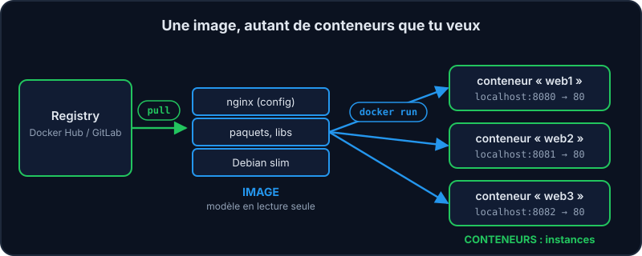
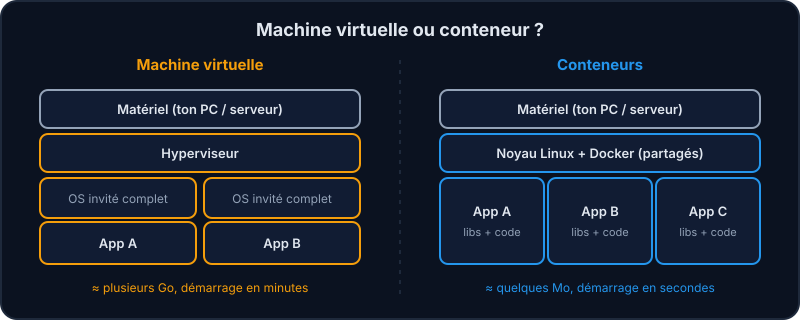
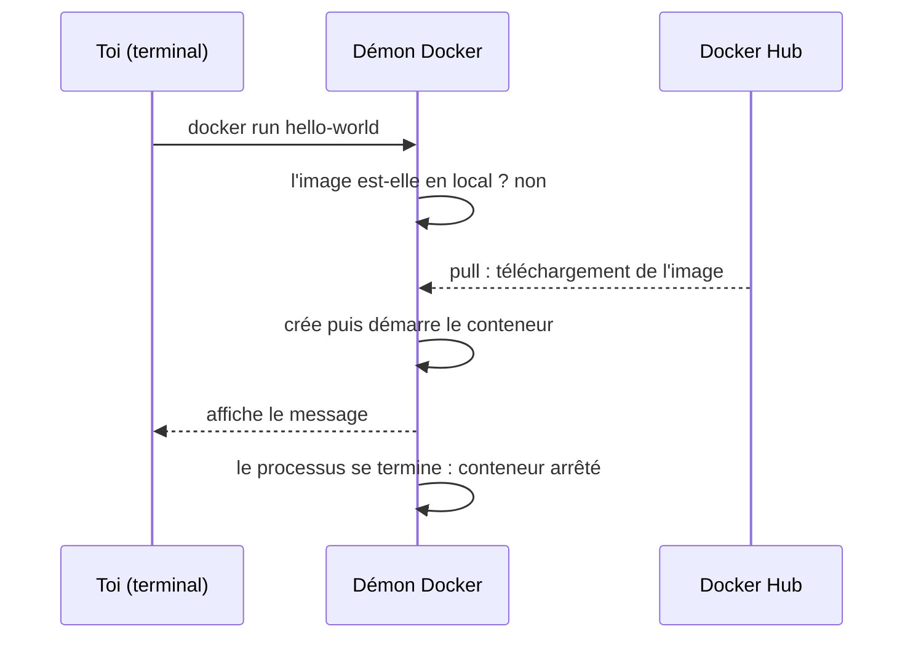

« Chez moi ça marche ! » Cette phrase a fait perdre des milliers d'heures aux développeur·se·s : Python pas dans la bonne version, une bibliothèque manquante, une base de données absente… **Docker** règle ça en empaquetant ton application *avec tout ce dont elle a besoin* dans une boîte standard : le **conteneur**.

Sur l'infra de l'équipe, c'est ainsi que tournent presque toutes les applications (Vitrine, l'API d'adhésion, le site vitrine…) : le même conteneur fonctionne sur ton PC, sur le serveur de test et en production.

## Le vocabulaire en 3 mots

:::cartes
### Image

Un modèle **en lecture seule** : le système de fichiers + la commande de démarrage. C'est la « recette figée » (ex. `nginx`, `postgres`).

### Conteneur

Une **instance en cours d'exécution** d'une image. Tu peux en lancer 10 à partir de la même image.

### Registry

Un serveur qui stocke des images : le **Docker Hub**, ou le registry GitLab de l'équipe (`registry.example.org/equipe/…`).
:::



## Conteneur ≠ machine virtuelle

Une machine virtuelle embarque un **système d'exploitation complet**. Un conteneur *partage le noyau* de ta machine et n'isole que les processus et les fichiers.



:::info Pourquoi c'est important
Comme il n'y a pas de système à démarrer, un conteneur **démarre en une seconde** et pèse quelques Mo. Tu peux donc en lancer des dizaines sur un simple portable.
:::

## Que se passe-t-il quand on lance un conteneur ?



## Vérifier l'installation

```shell run
docker --version
docker run hello-world
```

Docker n'avait pas l'image `hello-world` en local : il l'a **téléchargée** depuis le Docker Hub, a créé un conteneur, l'a exécuté, puis le conteneur s'est arrêté après avoir affiché son message. Voici le début de ce que tu dois voir :

```console
Unable to find image 'hello-world:latest' locally
latest: Pulling from library/hello-world
Status: Downloaded newer image for hello-world:latest

Hello from Docker!
This message shows that your installation appears to be working correctly.
```

Les images téléchargées restent sur ta machine :

```shell run
docker images
```

## À retenir

- Une **image** est un modèle figé ; un **conteneur** en est une instance qui s'exécute.
- Un conteneur partage le noyau de l'hôte : il est léger et rapide.
- Si l'image n'est pas en local, Docker la télécharge depuis un **registry**.

## Entraîne-toi

:::labo
intro: |
  Le démon Docker est démarré. Lance ton premier conteneur !
etapes:
  - texte: 'Affiche la version avec `docker --version`'
    indice: "Une commande avec un double tiret : demande à Docker son numéro de version."
    verif:
      - commande: '^docker (--version|version)'
    solution:
      - docker --version
  - texte: 'Lance `docker run hello-world`'
    indice: "`docker run` suivi du nom de l'image de test officielle (elle s'appelle comme le programme de tes débuts)."
    verif:
      - conteneur-image: hello-world
    solution:
      - docker run hello-world
  - texte: 'Liste les images téléchargées avec `docker images`'
    indice: "Une commande d'une seule ligne qui liste les images locales : `hello-world` doit y figurer, et elle est minuscule."
    verif:
      - commande: '^docker (images|image ls)'
      - image-presente: hello-world
    solution:
      - docker images
:::

## Vérifie tes acquis

:::quiz
Quelle est la différence entre une image et un conteneur ?

- [ ] Aucune, ce sont deux noms pour la même chose
- [x] L'image est un modèle en lecture seule ; le conteneur en est une instance en cours d'exécution
- [ ] Le conteneur est un modèle ; l'image est l'instance
- [ ] L'image sert à stocker les données des utilisateur·rice·s, le conteneur à stocker le code

> Comme une classe et ses objets : une image peut donner naissance à autant de conteneurs que tu veux.
:::

:::quiz
Qu'est-ce qui distingue un conteneur d'une machine virtuelle ?

- [ ] Le conteneur embarque son propre noyau Linux
- [x] Le conteneur partage le noyau de l'hôte : il est plus léger et démarre plus vite
- [ ] Le conteneur ne peut pas accéder au réseau
- [ ] Le conteneur virtualise le matériel, alors que la machine virtuelle ne le fait pas

> Pas de système complet à démarrer : juste des processus isolés.
:::

:::quiz
D'où vient l'image si elle n'est pas présente en local ?

- [ ] Docker la reconstruit à partir de zéro
- [x] Docker la télécharge depuis un registry (Docker Hub par défaut)
- [ ] Docker génère une image vide portant le nom demandé
- [ ] Elle est copiée depuis un autre conteneur

> C'est ce que tu as vu : « Unable to find image locally » puis « Pulling from library/hello-world ». Le registry par défaut est le Docker Hub ; on peut en indiquer un autre dans le nom de l'image (ex. `registry.gitlab.example.org/…`). Le registry par défaut est le Docker Hub ; on peut en indiquer un autre dans le nom de l'image (ex. `registry.gitlab.example.org/…`). Le registry par défaut est le Docker Hub ; on peut en indiquer un autre dans le nom de l'image (ex. `registry.gitlab.example.org/…`). Le registry par défaut est le Docker Hub ; on peut en indiquer un autre dans le nom de l'image (ex. `registry.gitlab.example.org/…`).
:::
