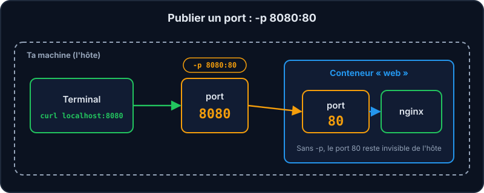

`docker run` est la commande reine : elle crée **et** démarre un conteneur. Sa forme générale :

```text
docker run [options] IMAGE [commande]
```

## Lancer une commande ponctuelle

```shell run
docker run alpine echo "Bonjour Mentor"
```

`alpine` est une toute petite distribution Linux (≈ 8 Mo). Docker crée un conteneur, exécute `echo`, et le conteneur s'arrête : un conteneur vit **tant que son processus principal tourne**.

## Lancer un service en arrière-plan

Un serveur web, lui, ne s'arrête jamais. On le lance en mode **détaché**, on lui donne un **nom** et on **publie un port** :

```shell run
docker run -d --name web -p 8080:80 nginx
```

| Option | Rôle |
| --- | --- |
| `-d` | **Détaché** : le conteneur tourne en arrière-plan, le terminal reste libre. |
| `--name web` | Un nom lisible, plutôt qu'un nom aléatoire comme `happy_turing`. |
| `-p 8080:80` | `port-de-ta-machine:port-du-conteneur`. Ici 8080 → 80. |



## Vérifier et observer

```shell run
docker ps
curl localhost:8080
docker logs web
```

1. `docker ps` liste les conteneurs **en cours** : tu dois voir `web` et sa redirection de port.
2. `curl localhost:8080` interroge le serveur comme le ferait un navigateur : tu reçois la page d'accueil de nginx.
3. `docker logs web` affiche ce que le conteneur a écrit sur sa sortie.

Voici ce que tu dois obtenir (colonnes de `docker ps` raccourcies) :

```console
$ docker ps
CONTAINER ID   IMAGE   COMMAND                  STATUS         PORTS                  NAMES
c3c6b0e9dce7   nginx   "docker-entrypoint.sh"   Up 5 seconds   0.0.0.0:8080->80/tcp   web
```

```console
$ curl localhost:8080
<!DOCTYPE html>
<html>
<head>
<title>Welcome to nginx!</title>
...
```

```console
$ docker logs web
/docker-entrypoint.sh: Configuration complete; ready for start up
2026/10/01 14:02:11 [notice] 1#1: nginx/1.27.2
2026/10/01 14:02:11 [notice] 1#1: start worker processes
```

:::tip Sans -p, personne ne peut entrer
Le port 80 existe *dans* le conteneur mais reste invisible depuis ta machine. Essaie : `docker run -d --name web2 nginx` puis `curl localhost:80` : ça échoue.
:::

:::info Un port déjà pris ?
Si le port 8080 de ta machine est déjà utilisé, Docker refuse de démarrer le conteneur (« port is already allocated »). Choisis simplement un autre port côté machine : `-p 8081:80`.
:::

## À retenir

- `docker run` = créer + démarrer. Un conteneur vit autant que son processus principal.
- `-d`, `--name` et `-p` sont les trois options du quotidien.
- Pour comprendre un conteneur : `docker ps`, `curl` et `docker logs`.

## Entraîne-toi

:::lab
intro: |
  Lance une commande ponctuelle, puis un vrai serveur web nginx accessible depuis ton « navigateur » (`curl`).
steps:
  - text: 'Affiche « Bonjour » depuis un conteneur `alpine` avec `echo`'
    hint: "Format `docker run IMAGE commande` : l'image est `alpine`, la commande est `echo` suivi du texte entre guillemets."
    checks:
      - command: '^docker run .*alpine echo'
      - container-image: alpine
    solution:
      - 'docker run alpine echo "Bonjour"'
  - text: 'Démarre nginx détaché, nommé `web`, port `8080` → `80`'
    hint: "Trois options à combiner avant le nom de l'image `nginx` : détaché, nom `web`, et la redirection `hôte:conteneur` 8080 → 80."
    checks:
      - container-running: web
      - container-port: [web, '8080:80']
    solution:
      - 'docker run -d --name web -p 8080:80 nginx'
  - text: "Vérifie qu'il tourne avec `docker ps`"
    hint: "Sans option : seuls les conteneurs en cours d'exécution sont listés."
    after: [2]
    checks:
      - command: ^docker ps
    solution:
      - docker ps
  - text: 'Visite-le avec `curl localhost:8080`'
    hint: "Interroge ta machine sur le port que tu as publié (celui de gauche dans `-p`)."
    after: [2]
    checks:
      - command: '^curl .*8080'
    solution:
      - 'curl localhost:8080'
  - text: 'Lis ses journaux avec `docker logs web`'
    hint: "La sous-commande `logs` attend le nom du conteneur."
    after: [2]
    checks:
      - command: ^docker logs web
    solution:
      - docker logs web
:::

## Vérifie tes acquis

:::quiz
Que signifie -p 8080:80 ?

- [ ] Le port 8080 du conteneur vers le port 80 de la machine
- [x] Le port 8080 de ta machine est redirigé vers le port 80 du conteneur
- [ ] Deux ports en écoute dans le conteneur
- [ ] Les ports 8080 à 80 sont ouverts à l'intérieur du conteneur

> Format `hôte:conteneur`. Tu tapes `localhost:8080` sur ta machine et Docker transmet au port 80 du conteneur. Les deux numéros peuvent être identiques (`-p 80:80`), mais seul le premier est vu de l'extérieur.
:::

:::quiz
Que fait l'option -d ?

- [ ] Elle supprime le conteneur à la fin
- [x] Elle lance le conteneur en arrière-plan (détaché)
- [ ] Elle active le mode debug
- [ ] Elle télécharge l'image

> Le terminal est rendu tout de suite, et tu récupères l'ID du conteneur.
:::

:::quiz
Pourquoi le conteneur « alpine echo » s'arrête-t-il immédiatement ?

- [ ] À cause d'une erreur
- [x] Parce que son processus principal (echo) est terminé
- [ ] Parce qu'on n'a pas utilisé -d
- [ ] Parce qu'alpine ne fonctionne pas sans réseau

> Un conteneur vit tant que son processus principal tourne. Un serveur web ne s'arrête pas, une commande oui.
:::
