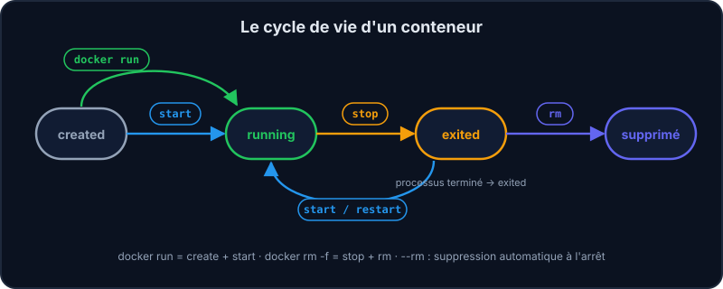
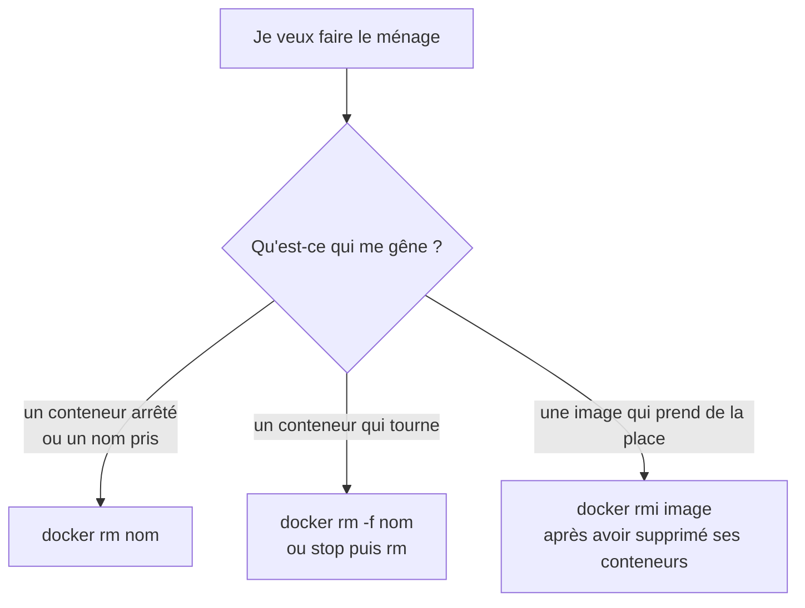

Un conteneur passe par plusieurs états. Comprendre ce cycle t'évite l'erreur la plus classique : le fameux « Conflict. The container name is already in use ».



Un conteneur arrêté **existe encore** (et garde son nom !) tant que tu ne l'as pas supprimé.

```shell run
docker ps
docker ps -a
```

`docker ps` ne montre que les conteneurs **en cours** ; ajoute `-a` (*all*) pour voir aussi les arrêtés.

## Les commandes du quotidien

| Commande | Effet |
| --- | --- |
| `docker stop web` | Arrête proprement le conteneur (SIGTERM, puis SIGKILL au bout de 10 s s'il n'a pas obéi). |
| `docker kill web` | Arrêt brutal immédiat (SIGKILL), sans laisser le temps de se terminer proprement. |
| `docker start web` | Redémarre un conteneur arrêté, avec sa configuration d'origine. |
| `docker restart web` | `stop` + `start`. |
| `docker rm web` | Supprime un conteneur *arrêté*. |
| `docker rm -f web` | Force : arrête et supprime en une fois. |
| `docker rmi nginx` | Supprime une *image* (si aucun conteneur ne l'utilise). |

## Conteneur ou image : que supprimer ?



:::tip Les conteneurs jetables
Pour une commande ponctuelle, ajoute `--rm` : le conteneur est supprimé automatiquement dès qu'il s'arrête. `docker run --rm alpine echo salut` ne laisse aucune trace.
:::

:::warning Les noms sont uniques
Si tu relances `docker run --name web …` alors qu'un conteneur `web` existe (même arrêté), Docker refuse :

```console
docker: Error response from daemon: Conflict. The container name "/web" is already in use by container "c3c6b0e9dce7".
```

Supprime l'ancien (`docker rm web`) ou choisis un autre nom.
:::

:::info Supprimer un conteneur qui tourne
`docker rm web` refuse tant que `web` tourne (« stop the container before removing or force remove »). Deux solutions : `docker stop web` puis `docker rm web`, ou directement `docker rm -f web`.
:::

## À retenir

- `ps -a` montre aussi les conteneurs arrêtés ; ils gardent leur nom.
- `rm` pour les conteneurs, `rmi` pour les images.
- `--rm` = zéro déchet pour les commandes ponctuelles.

## Entraîne-toi

:::lab
engine: real
intro: |
  Un nginx tourne déjà (`web`) et un vieux conteneur `vieux` traîne. Fais le ménage.
commands:
  - 'docker run -d --name web -p 8080:80 nginx'
  - docker run --name vieux alpine echo ancien
steps:
  - text: 'Liste *tous* les conteneurs avec `docker ps -a`, puis garde la liste : `docker ps -a > tous.txt`'
    hint: "Une seule lettre en plus de `docker ps` : `a` comme *all*."
    checks:
      - env-file-contains: [tous.txt, '\bvieux$']
    solution:
      - docker ps -a
      - docker ps -a > tous.txt
  - text: 'Arrête `web`'
    hint: "Le verbe est dans l'énoncé : « arrête »."
    checks:
      - output-contains: ['docker inspect -f "{{.State.Status}}" web', '^exited$']
    solution:
      - docker stop web
  - text: 'Redémarre `web`'
    hint: "Le conteneur existe encore, il suffit de le démarrer : pas de `run` ici (il recréerait un conteneur)."
    after: [2]
    checks:
      - output-contains: ['docker inspect -f "{{.State.Running}}" web', '^true$']
    solution:
      - docker start web
  - text: 'Supprime le conteneur `vieux`'
    hint: "`rm` pour *remove* : il est déjà arrêté, aucune option n'est nécessaire."
    checks:
      - command-succeeds: 'docker info > /dev/null && ! docker container inspect vieux > /dev/null 2>&1'
    solution:
      - docker rm vieux
  - text: 'Lance un conteneur jetable et garde sa réponse : `docker run --rm alpine echo ephemere > ephemere.txt`'
    hint: "Une option qui commence par deux tirets et se lit « remove » (en abrégé) s'ajoute à `docker run` : le conteneur est supprimé dès qu'il s'arrête."
    after: [4]
    checks:
      - env-file-contains: [ephemere.txt, '^ephemere$']
      - command-succeeds: 'docker info > /dev/null && test -z "$(docker ps -aq --filter ancestor=alpine)"'
    solution:
      - docker run --rm alpine echo ephemere > ephemere.txt
  - text: "Supprime `web` d'un coup avec `docker rm -f web`"
    hint: "`rm` avec l'option de force : elle arrête et supprime en une fois."
    after: [3]
    checks:
      - command-succeeds: 'docker info > /dev/null && ! docker container inspect web > /dev/null 2>&1'
    solution:
      - docker rm -f web
:::

## Vérifie tes acquis

:::quiz
Un conteneur arrêté a-t-il disparu ?

- [ ] Oui, il est supprimé automatiquement
- [x] Non : il existe toujours et se voit avec docker ps -a
- [ ] Oui, sauf s'il s'est arrêté avec le code de sortie 0
- [ ] Non, mais il ne garde plus son nom : il peut être réutilisé

> Il faut explicitement le supprimer (docker rm), ou avoir lancé le conteneur avec --rm.
:::

:::quiz
Quelle commande supprime une image ?

- [ ] docker rm
- [x] docker rmi
- [ ] docker delete
- [ ] docker container prune

> `rm` pour les conteneurs, `rmi` pour les images (`docker image rm` est équivalent). Une image utilisée par un conteneur ne peut pas être supprimée sans `-f`. `docker container prune` supprime, lui, tous les conteneurs arrêtés.
:::

:::quiz
À quoi sert --rm ?

- [ ] À forcer l'arrêt d'un conteneur
- [x] À supprimer automatiquement le conteneur quand il s'arrête
- [ ] À supprimer l'image après usage
- [ ] À redémarrer le conteneur en cas d'erreur

> Idéal pour les commandes ponctuelles : pas de conteneurs « zombies » à nettoyer.
:::
