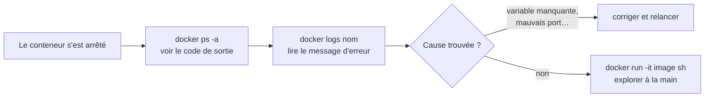

Un conteneur n'est pas une boîte noire : tu peux lire ses journaux, y exécuter des commandes, voire t'y « connecter » comme sur un serveur.

## Configurer avec des variables d'environnement

Beaucoup d'images se configurent via des variables passées avec `-e`. Par exemple, PostgreSQL **refuse de démarrer sans mot de passe** :

```shell run
docker run --name pg-rate postgres
docker logs pg-rate
```

```console
Error: Database is uninitialized and superuser password is not specified.
       You must specify POSTGRES_PASSWORD to a non-empty value for the superuser.
```

Le message d'erreur est limpide : il faut `POSTGRES_PASSWORD`. Corrigeons, en détaché cette fois :

```shell run
docker run -d --name db -e POSTGRES_PASSWORD=secret postgres
```

:::info Dans l'environnement de dev Mentor
Le `docker-compose.yml` de Vitrine configure lui aussi ses conteneurs par variables : l'application reçoit par exemple `DATABASE_URL`, construite à partir de `DB_USER`, `DB_PWD` et `DB_NAME`. Tu retrouveras ça dans le parcours *Docker advanced*.
:::

## Quand un conteneur s'arrête tout seul



:::tip Le réflexe
Quand un conteneur s'arrête, fais toujours `docker ps -a` (code de sortie ≠ 0 = erreur) puis `docker logs <nom>`. La réponse y est presque toujours.
:::

## Exécuter une commande dans un conteneur qui tourne

```shell run
docker logs db
docker exec db printenv
```

`docker logs` te montre ce que PostgreSQL a écrit (*database system is ready to accept connections*) et `docker exec` lance une commande **supplémentaire** dans un conteneur existant.

## Ouvrir un shell interactif

`-it` combine `-i` (garder l'entrée ouverte) et `-t` (un pseudo-terminal). Le terminal du labo passe alors en mode « conteneur » : tape `exit` pour en sortir.

```shell run
docker run -it --rm alpine sh
```

```console
/ # cat /etc/os-release
/ # ls
/ # exit
```

:::info Pour un conteneur déjà en cours
`docker exec -it db sh` ouvre un shell dedans : pratique pour déboguer une base de données ou inspecter des fichiers.
:::

## À retenir

- `-e NOM=valeur` configure un conteneur ; lis la doc de l'image pour connaître les variables.
- Conteneur arrêté ? `docker ps -a` puis `docker logs`.
- `docker exec` agit dans un conteneur existant ; `docker run -it … sh` en crée un pour explorer.

## Entraîne-toi

:::lab
intro: |
  Fais démarrer PostgreSQL (en échouant d'abord, comme tout le monde), puis explore un conteneur de l'intérieur.
steps:
  - text: "Lance `postgres` *sans* mot de passe et observe l'échec avec `docker logs`"
    hint: "Lance `postgres` sans aucune variable, avec le nom `pg-rate` ; puis relis ses logs avec ce nom."
    checks:
      - container-exit-code: [pg-rate, 1]
      - command: ^docker logs pg-rate
    solution:
      - docker run --name pg-rate postgres
      - docker logs pg-rate
  - text: 'Relance-le détaché sous le nom `db`, avec `-e POSTGRES_PASSWORD=…`'
    hint: "L'option `-e` prend `NOM=valeur` ; le nom attendu est affiché dans l'erreur de l'étape précédente."
    checks:
      - container-running: db
    solution:
      - docker run -d --name db -e POSTGRES_PASSWORD=secret postgres
  - text: 'Vérifie ses logs : « ready to accept connections »'
    hint: "Même commande qu'à l'étape 1, avec le nom du nouveau conteneur."
    after: [2]
    checks:
      - command: ^docker logs db
    solution:
      - docker logs db
  - text: 'Exécute `docker exec db printenv` pour voir ses variables'
    hint: "`docker exec NOM commande` : la commande qui affiche les variables d'environnement s'appelle `printenv`."
    after: [2]
    checks:
      - command: '^docker exec .*db'
    solution:
      - docker exec db printenv
  - text: 'Ouvre un shell : `docker run -it --rm alpine sh`, lance `cat /etc/os-release`, puis `exit`'
    hint: "Trois temps : lance un `alpine` avec `-it`, tape la commande de lecture du fichier indiqué (le prompt change), puis `exit`."
    checks:
      - command: '^docker run .*-it.* alpine'
      - command: ^cat /etc/os-release
      - session-closed: true
    solution:
      - docker run -it --rm alpine sh
      - cat /etc/os-release
      - exit
:::

## Vérifie tes acquis

:::quiz
Un conteneur postgres s'arrête aussitôt. Quel est le premier réflexe ?

- [ ] Réinstaller Docker
- [x] `docker logs <nom>` pour lire le message d'erreur
- [ ] Relancer en boucle jusqu'à ce que ça marche
- [ ] Supprimer l'image

> Les logs contiennent presque toujours la cause (ici : POSTGRES_PASSWORD manquant).
:::

:::quiz
Comment passer une variable d'environnement à un conteneur ?

- [x] Avec l'option -e NOM=valeur
- [ ] Avec l'option -p NOM=valeur
- [ ] En modifiant l'image Docker Hub
- [ ] C'est impossible

> -e (ou --env). On peut aussi utiliser --env-file avec un fichier.
:::

:::quiz
Que fait docker exec -it db sh ?

- [ ] Il crée un nouveau conteneur nommé db à partir de la même image
- [x] Il ouvre un shell interactif dans le conteneur db déjà en cours
- [ ] Il arrête db
- [ ] Il exporte db en fichier

> exec lance une commande supplémentaire dans un conteneur existant. -it donne un terminal interactif.
:::
