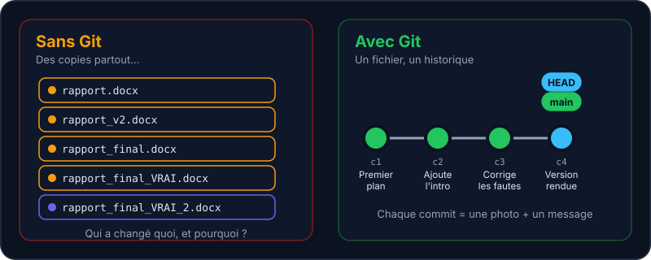

> « rapport_final_v2_VRAI_final_corrigé.docx » — tout le monde l'a déjà fait. Git règle ce problème proprement.

Git est un logiciel de **gestion de versions** : il garde la mémoire de chaque étape de ton projet, te permet de revenir en arrière, de comparer deux versions et de travailler à plusieurs sans t'écraser mutuellement. C'est l'outil de base de tous les projets de l'équipe.



## Les 3 idées à retenir

:::cards
### Un historique complet

Chaque **commit** est une photo de ton projet à un instant donné, avec un message qui explique *pourquoi* tu as changé quelque chose.

### Des branches

Tu peux tester une idée dans ton coin sans casser la version qui marche, puis la fusionner si elle te convient.

### Du travail à plusieurs

Chacun·e a sa copie complète du dépôt. On synchronise via un serveur comme **GitLab**.
:::

:::info Git ≠ GitLab
Git est l'outil installé sur ton ordinateur. GitLab (ou GitHub) est un service web qui héberge des dépôts Git et ajoute des fonctions de collaboration (tickets, merge requests, CI…). L'équipe utilise les deux : [gitlab.example.org/equipe](https://gitlab.example.org/equipe).
:::

## Le vocabulaire en un coup d'œil

| Mot | Ce que ça veut dire |
| --- | --- |
| **Dépôt** (*repository*) | Un projet suivi par Git : tes fichiers + tout l'historique (dans le dossier caché `.git`). |
| **Commit** | Une photo du projet à un instant donné, avec un message et un auteur. |
| **Branche** | Une ligne d'historique parallèle, pour travailler sans gêner les autres. |
| **Dépôt distant** (*remote*) | Une copie du dépôt hébergée ailleurs (GitLab). Il s'appelle `origin` par défaut. |

## Configurer Git (une seule fois)

Git signe chaque commit avec ton nom et ton adresse mail. Dis-lui qui tu es :

```shell run
git config --global user.name "Prénom Nom"
git config --global user.email "prenom.nom@example.org"
```

## Créer un dépôt

`git init` transforme le dossier courant en dépôt Git. Il crée un dossier caché `.git` qui contient tout l'historique. La branche principale s'appelle `main` (sur de très vieilles versions de Git, tu verras `master`).

```shell run
git init
```

:::warning
Ne supprime jamais le dossier `.git` : tu perdrais tout l'historique (tes fichiers actuels, eux, resteraient).
:::

Pas de panique si tu ne retiens pas tout : le labo à droite te guide pas à pas, et tu peux y retourner autant de fois que tu veux.

## Entraîne-toi

:::lab
engine: real
intro: |
  Ton terminal est ouvert dans `/workspace`, qui contient déjà un fichier `README.md`. Lance toi-même les commandes vues ci-dessus : c'est un vrai Git.
files:
  README.md: |
    # Mon projet Mentor
steps:
  - text: 'Configure ton nom avec `git config --global user.name "…"`'
    hint: 'Remplace … par ton prénom et nom, entre guillemets.'
    checks:
      - command-succeeds: 'test -n "$(git config --global user.name)"'
    solution:
      - 'git config --global user.name "Prénom Nom"'
  - text: 'Initialise un dépôt avec `git init`'
    hint: 'Tape simplement : git init'
    checks:
      - command-succeeds: 'git rev-parse --git-dir'
    solution:
      - git init
  - text: "Vérifie l'état avec `git status` : le README est « non suivi ». Garde une trace avec `git status --short > etat.txt`"
    hint: 'Lance git status pour lire le résultat, puis git status --short > etat.txt pour l''enregistrer.'
    after: [2]
    checks:
      - env-file-contains: [etat.txt, '\?\? README\.md']
    solution:
      - git status
      - git status --short > etat.txt
:::

## Vérifie tes acquis

:::quiz
Quelle est la différence entre Git et GitLab ?

- [ ] C'est la même chose
- [x] Git est l'outil de versionnage ; GitLab est un service qui héberge des dépôts Git
- [ ] GitLab est un éditeur de code
- [ ] Git ne fonctionne qu'avec GitLab

> Git tourne en local sur ta machine. GitLab, GitHub, Gitea… sont des serveurs qui hébergent des dépôts Git.
:::

:::quiz
Où Git stocke-t-il l'historique d'un projet ?

- [ ] Sur le serveur GitLab du projet, obligatoirement
- [x] Dans un dossier caché .git à la racine du projet
- [ ] Dans un fichier historique.txt
- [ ] Dans la base de données de ton éditeur de code

> Tout est dans le dossier .git. Supprime-le et tu perds l'historique (mais pas tes fichiers actuels).
:::

:::quiz
Peut-on faire des commits sans connexion Internet ?

- [ ] Non, Git a besoin du réseau
- [x] Oui, la plupart des commandes sont locales
- [ ] Seulement avec GitLab
- [ ] Seulement sous Linux

> Seuls fetch, pull et push parlent au réseau. Le reste fonctionne hors ligne.
:::
