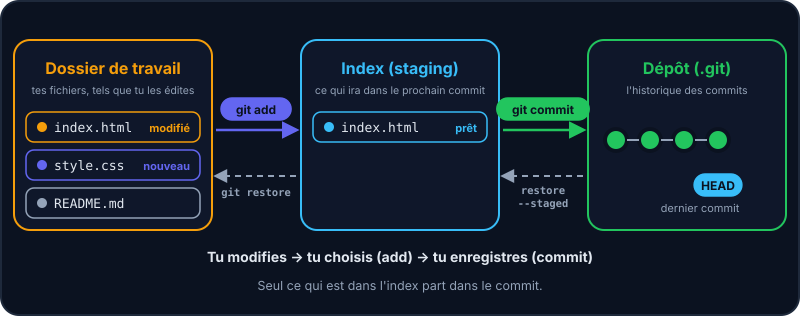

Git ne sauvegarde pas automatiquement tes fichiers : c'est toi qui décides *quand* prendre une photo. Pour ça, il s'appuie sur **trois zones**.



L'**index** (ou *staging area*) est une salle d'attente : tu y mets uniquement les modifications que tu veux regrouper dans un même commit. Les trois colonnes du labo à droite montrent exactement ces zones, en direct.

## Le cycle en 4 commandes

```shell run
git status
git add index.html
git commit -m "Ajoute la page d'accueil"
git status
```

1. **`git status`** : où j'en suis ?
2. **`git add`** : je choisis ce qui ira dans la photo.
3. **`git commit -m "…"`** : je prends la photo, avec un message.
4. **`git status`** : tout est propre !

:::tip
`git status` est ton meilleur ami : lance-le tout le temps, il te dit où tu en es et ce qu'il est possible de faire ensuite.
:::

## Lire `git status`

```console
Sur la branche main

Modifications qui seront validées :
	nouveau fichier : index.html

Fichiers non suivis :
	style.css
```

| Section | Signification | Zone |
| --- | --- | --- |
| *Modifications qui seront validées* | Dans l'index : partira au prochain commit | Index |
| *Modifications qui ne seront pas validées* | Fichier suivi modifié, pas encore indexé | Dossier de travail |
| *Fichiers non suivis* | Fichier que Git ne connaît pas encore | Dossier de travail |

## Écrire un bon message de commit

- Une ligne courte (≈ 50 caractères) qui décrit **ce que fait** le commit : « Ajoute le formulaire de contact ».
- Utilise l'impératif présent, comme si tu complétais « Ce commit… ».
- Un commit = une idée. Évite les « modifs diverses » de 40 fichiers.
- Toujours avec l'option `-m "…"` : sans elle, Git ouvre un éditeur de texte (`nano` dans ton terminal), dans lequel il faut écrire puis enregistrer le message.

| ✅ Message utile | ❌ Message inutile |
| --- | --- |
| Ajoute la validation du formulaire de contact | fix |
| Corrige le calcul de la TVA sur les devis | modifs |
| Supprime les images inutilisées | asdf |

:::info Raccourci
`git add .` ajoute *tous* les changements du dossier. Pratique, mais relis `git status` avant pour ne pas embarquer un fichier par accident.
:::

## Entraîne-toi

:::lab
engine: real
intro: |
  Le dépôt est initialisé et contient deux fichiers non suivis. Fais-en un historique !
commands:
  - git init -q
  - 'echo "<h1>Bienvenue</h1>" > index.html'
  - 'echo "body { font-family: sans-serif; }" > style.css'
steps:
  - text: "Ajoute `index.html` à l'index avec `git add`"
    hint: git add index.html
    checks:
      - output-contains: ['git diff --cached --name-only', '(?m)^index\.html$']
    solution:
      - git add index.html
  - text: 'Crée ton premier commit avec `git commit -m "…"`'
    hint: "git commit -m \"Ajoute la page d'accueil\""
    checks:
      - command-succeeds: 'git rev-parse --verify -q HEAD'
    solution:
      - "git commit -m \"Ajoute la page d'accueil\""
  - text: 'Ajoute `style.css` puis fais un second commit'
    hint: 'git add style.css puis git commit -m "Ajoute le style"'
    checks:
      - command-succeeds: 'test "$(git rev-list --count HEAD)" -ge 2 && git cat-file -e HEAD:style.css'
    solution:
      - git add style.css
      - 'git commit -m "Ajoute le style"'
  - text: "Vérifie que tout est propre avec `git status`, puis enregistre l'historique avec `git log --oneline > historique.txt`"
    hint: 'Deux commandes : git status, puis git log --oneline > historique.txt'
    after: [3]
    checks:
      - env-file-contains: [historique.txt, 'Ajoute le style']
    solution:
      - git status
      - git log --oneline > historique.txt
:::

## Vérifie tes acquis

:::quiz
Dans quel ordre se déroule le cycle de base ?

- [ ] commit → add → modifier
- [x] modifier → add → commit
- [ ] add → modifier → commit
- [ ] modifier → commit → add

> Tu modifies tes fichiers, tu les places dans l'index avec add, puis tu les valides avec commit.
:::

:::quiz
À quoi sert git add ?

- [ ] À envoyer les fichiers sur GitLab
- [ ] À créer un commit
- [x] À placer des modifications dans l'index, en vue du prochain commit
- [ ] À installer un paquet

> add prépare le commit ; rien n'est enregistré dans l'historique tant que tu n'as pas lancé commit.
:::

:::quiz
Quel est le meilleur message de commit ?

- [ ] fix
- [ ] modifs
- [x] Ajoute la validation du formulaire de contact
- [ ] asdf

> Dans 6 mois, ce message te dira précisément ce que le commit faisait.
:::
