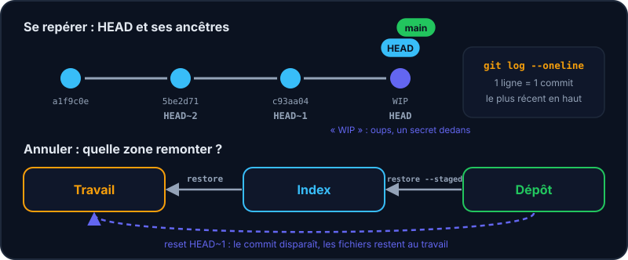
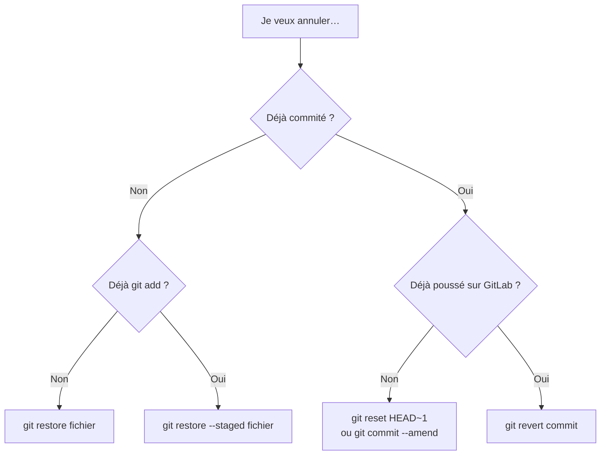

L'historique, c'est ton filet de sécurité. Apprends à le lire, puis à t'en servir pour **revenir en arrière** sans paniquer.



## Lire l'historique

```shell run
git log
git log --oneline
git show HEAD
```

```console
c93aa04 (HEAD -> main) WIP
5be2d71 Ajoute le script principal
a1f9c0e Initialise le projet
```

`HEAD` désigne « là où tu es » : en général le dernier commit de ta branche. `HEAD~1` est son parent, `HEAD~2` son grand-parent…

## Voir ce qui a changé

```shell run
git diff
git diff --staged
```

| Commande | Compare… | Répond à la question |
| --- | --- | --- |
| `git diff` | dossier de travail ↔ index | « Qu'est-ce que je n'ai **pas encore** indexé ? » |
| `git diff --staged` | index ↔ dernier commit | « Qu'est-ce qui **va partir** dans mon commit ? » |

:::info Les fichiers non suivis
`git diff` ne montre que les fichiers que Git suit déjà. Un fichier tout neuf n'y apparaît qu'après un `git add` (il est alors visible avec `git diff --staged`). Pour le repérer avant, utilise `git status`.
:::

## Annuler : quel outil pour quel problème ?



| Situation | Commande |
| --- | --- |
| J'ai modifié un fichier et je veux tout abandonner | `git restore fichier` |
| J'ai fait `git add` par erreur | `git restore --staged fichier` |
| Je veux corriger le message du dernier commit | `git commit --amend -m "Nouveau message"` |
| Je veux défaire le dernier commit mais garder mes fichiers | `git reset HEAD~1` |
| Je veux défaire un commit déjà partagé | `git revert <commit>` (crée un commit inverse) |

:::warning Attention
`git restore fichier` et `git reset --hard` *détruisent* définitivement les modifications non commitées. Un commit, lui, est quasiment indestructible : commite souvent !
:::

:::danger Ne réécris pas l'historique partagé
`reset` et `--amend` modifient des commits existants. Fais-le **uniquement** sur des commits que personne d'autre n'a récupérés. Une fois poussé, utilise `git revert`.
:::

## Entraîne-toi

:::labo
moteur: reel
intro: |
  Le projet a 3 commits… et le dernier contient un fichier `secret.txt` qui n'aurait jamais dû être commité. Heureusement, il n'a pas encore été publié.
commandes:
  - git init -q
  - 'echo "# Projet Mentor" > README.md'
  - 'git add . && git commit -q -m "Initialise le projet"'
  - "echo \"console.log('salut');\" > app.js"
  - 'git add . && git commit -q -m "Ajoute le script principal"'
  - 'echo "MOT_DE_PASSE=hunter2" > secret.txt'
  - 'git add . && git commit -q -m "WIP"'
etapes:
  - texte: "Affiche l'historique compact avec `git log --oneline`, puis enregistre-le avec `git log --oneline > historique.txt`"
    indice: git log --oneline > historique.txt
    verif:
      - fichier-contient-dans-env: [historique.txt, 'WIP']
    solution:
      - git log --oneline
      - git log --oneline > historique.txt
  - texte: 'Modifie `README.md` (par exemple `echo "ligne" >> README.md`), puis observe avec `git diff`'
    indice: 'echo "Une ligne en plus" >> README.md puis git diff'
    verif:
      - commande-reussit: '! git diff --quiet -- README.md'
    solution:
      - 'echo "Une ligne en plus" >> README.md'
      - git diff
  - texte: 'Annule cette modification avec `git restore README.md`'
    indice: git restore README.md
    apres: [2]
    verif:
      - commande-reussit: 'git diff --quiet -- README.md'
    solution:
      - git restore README.md
  - texte: 'Défais le commit « WIP » sans perdre tes fichiers : `git reset HEAD~1`'
    indice: git reset HEAD~1  — secret.txt redevient « non suivi ».
    verif:
      - commande-reussit: 'test "$(git rev-list --count HEAD)" -eq 2'
      - fichier-existe-dans-env: secret.txt
    solution:
      - git reset HEAD~1
  - texte: 'Supprime `secret.txt` du dossier avec `rm secret.txt`'
    indice: rm secret.txt
    verif:
      - commande-reussit: 'test "$(git rev-list --count HEAD)" -eq 2'
      - fichier-absent-dans-env: secret.txt
    solution:
      - rm secret.txt
:::

## Vérifie tes acquis

:::quiz
git diff (sans option) compare…

- [ ] Le dernier commit et l'avant-dernier
- [x] Le dossier de travail et l'index
- [ ] L'index et le dernier commit
- [ ] Ta branche et le serveur

> Pour voir ce qui est indexé, il faut --staged.
:::

:::quiz
Que fait git restore fichier ?

- [ ] Il restaure le fichier depuis la corbeille
- [x] Il annule les modifications non indexées du fichier (irréversible)
- [ ] Il supprime le dernier commit
- [ ] Il envoie le fichier sur le serveur

> Le fichier retrouve son contenu de l'index. Les modifications perdues ne sont pas récupérables.
:::

:::quiz
Un commit déjà poussé contient une erreur. Que faire ?

- [ ] git reset --hard puis push --force
- [x] git revert pour créer un commit qui l'annule
- [ ] Supprimer le dossier .git
- [ ] Rien, c'est impossible à corriger

> revert ne réécrit pas l'historique partagé : il ajoute un commit inverse, sans danger pour tes collègues.
:::
