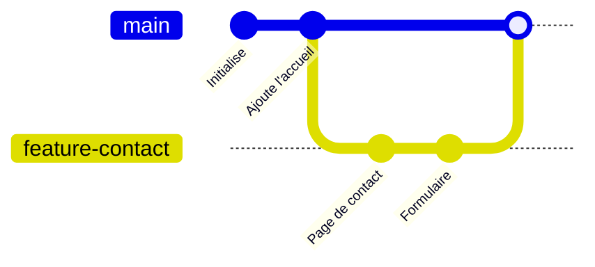
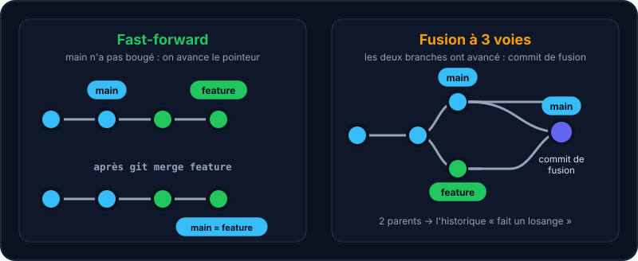

Une **branche** n'est qu'un petit pointeur vers un commit. En créer une est instantané et gratuit : n'hésite donc jamais à en ouvrir une pour une nouvelle fonctionnalité ou un correctif.



## Créer, changer, lister

```shell run
git branch
git switch -c feature-contact
git switch main
```

:::info
`git switch` est la commande moderne. Tu verras aussi `git checkout` dans les tutos : elle fait la même chose (et bien d'autres choses, d'où la nouvelle commande).
:::

## Fusionner

Pour ramener le travail d'une branche dans une autre, place-toi sur la branche *qui reçoit* et lance `git merge`.

```shell run
git switch main
git merge feature-contact
git branch -d feature-contact
```

Dans le labo ci-contre, `main` n'avancera pas pendant que tu travailles sur ta branche : ta fusion sera donc un **fast-forward**. Le conflit de la leçon suivante te fera découvrir une vraie fusion à trois voies.



| | Fast-forward | Fusion à 3 voies |
| --- | --- | --- |
| **Quand ?** | `main` n'a pas bougé depuis la création de la branche | Les deux branches ont avancé |
| **Ce que fait Git** | Avance simplement le pointeur | Crée un commit de fusion à deux parents |
| **Historique** | Linéaire | En « losange » |

:::tip
`git branch -d` refuse de supprimer une branche non fusionnée : c'est un garde-fou. Pour forcer (en sachant ce que tu fais), c'est `-D`.
:::

## Entraîne-toi

:::labo
moteur: reel
intro: |
  Ajoute une page de contact sur une branche dédiée, puis fusionne-la dans `main`. Pour voir le graphe : `git log --oneline --graph --all`.
commandes:
  - git init -q
  - 'echo "# Site du club" > README.md'
  - 'echo "<h1>Accueil</h1>" > index.html'
  - 'git add . && git commit -q -m "Initialise le site"'
etapes:
  - texte: 'Crée et rejoins la branche `feature-contact`'
    indice: git switch -c feature-contact
    verif:
      - sortie-contient: ['git branch --show-current', '^feature-contact$']
    solution:
      - git switch -c feature-contact
  - texte: 'Crée `contact.html` et commite-le sur cette branche'
    indice: 'echo "<h1>Contact</h1>" > contact.html puis git add . puis git commit -m "Ajoute la page de contact"'
    verif:
      - commande-reussit: 'git cat-file -e feature-contact:contact.html'
    solution:
      - 'echo "<h1>Contact</h1>" > contact.html'
      - git add .
      - 'git commit -m "Ajoute la page de contact"'
  - texte: 'Reviens sur `main` : `contact.html` disparaît !'
    indice: git switch main
    verif:
      - sortie-contient: ['git branch --show-current', '^main$']
      - commande-reussit: 'git rev-parse --verify -q feature-contact'
      - fichier-absent-dans-env: contact.html
    solution:
      - git switch main
  - texte: 'Fusionne la branche dans `main`'
    indice: git merge feature-contact
    verif:
      - sortie-contient: ['git branch --show-current', '^main$']
      - commande-reussit: 'git merge-base --is-ancestor feature-contact main'
      - fichier-existe-dans-env: contact.html
    solution:
      - git merge feature-contact
  - texte: 'Supprime la branche devenue inutile avec `git branch -d`'
    indice: git branch -d feature-contact
    verif:
      - commande-echoue: 'git rev-parse --verify -q feature-contact'
      - fichier-existe-dans-env: contact.html
    solution:
      - git branch -d feature-contact
:::

## Vérifie tes acquis

:::quiz
Qu'est-ce qu'une branche Git ?

- [ ] Une copie complète du projet
- [x] Un pointeur léger vers un commit
- [ ] Un dossier sur le serveur
- [ ] Un type de commit

> C'est ce qui rend les branches si rapides à créer : il n'y a rien à copier.
:::

:::quiz
Quand une fusion est-elle un « fast-forward » ?

- [ ] Quand il y a un conflit
- [x] Quand la branche cible n'a pas divergé : Git avance juste le pointeur
- [ ] Quand on utilise --force
- [ ] Quand les deux branches ont modifié le même fichier

> Aucun nouveau commit n'est nécessaire : l'historique reste linéaire.
:::

:::quiz
Que fait git switch -c ma-branche ?

- [ ] Supprime ma-branche
- [x] Crée ma-branche et bascule dessus
- [ ] Fusionne ma-branche
- [ ] Renomme la branche courante

> -c comme « create ». Équivalent de git checkout -b.
:::
