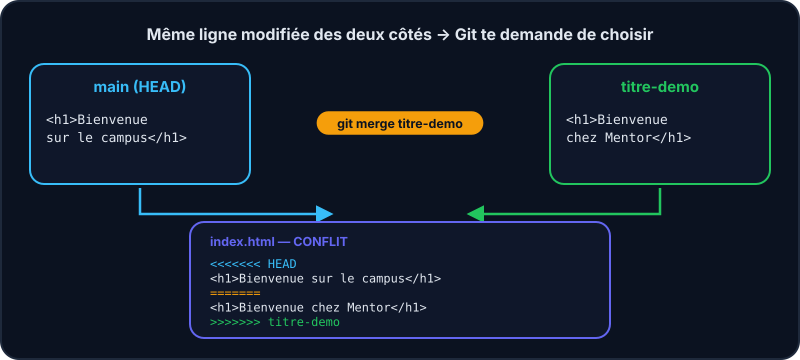
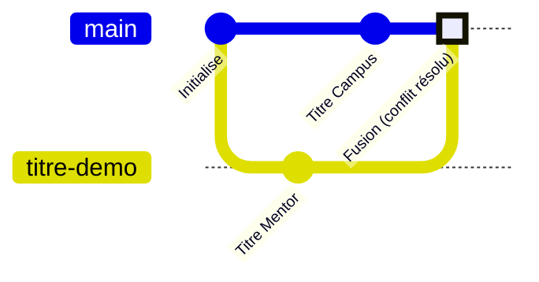

Un **conflit** survient quand deux branches modifient *la même zone* d'un fichier : Git ne peut pas deviner laquelle garder. Ça arrive à tout le monde, tout le temps. Ce n'est pas une erreur, c'est une question.





## À quoi ça ressemble

```text
<<<<<<< HEAD
<h1>Bienvenue sur le campus</h1>
=======
<h1>Bienvenue chez Mentor</h1>
>>>>>>> titre-demo
```

- Entre `<<<<<<< HEAD` et `=======` : **ta version** (branche courante).
- Entre `=======` et `>>>>>>>` : la version **de l'autre branche**.

## La recette en 4 étapes

1. `git merge autre-branche` → Git annonce un *CONFLIT* et s'arrête à mi-chemin.
2. Ouvre le fichier, garde la bonne version (ou un mélange) et **supprime les marqueurs** `<<<<<<<`, `=======`, `>>>>>>>`.
3. `git add fichier` pour dire « c'est réglé ».
4. `git commit` pour conclure la fusion.

:::tip Pris de panique ?
`git merge --abort` remet tout comme avant la fusion. Aucune conséquence.
:::

:::info
Dans un vrai éditeur (VS Code, IntelliJ…), des boutons « Accepter la modification courante / entrante » font le travail. Ici, tu édites le fichier à la main.
:::

## Comment éviter les conflits ?

:::cards
### Branches courtes

Plus une branche vit longtemps, plus elle s'éloigne de `main`. Fusionne souvent.

### Pull régulièrement

Récupère le travail des autres avant de commencer, et avant de publier.

### Parle-en

Deux personnes sur le même fichier au même endroit ? Un message suffit pour s'organiser.
:::

## Entraîne-toi

:::lab
engine: real
intro: |
  Deux personnes ont modifié le titre de `index.html` : l'une dans `main`, l'autre dans `titre-demo`. Fusionne et tranche !
commands:
  - git init -q
  - 'echo "<h1>Bienvenue</h1>" > index.html'
  - 'echo "<p>Formation Git</p>" >> index.html'
  - 'git add . && git commit -q -m "Initialise la page"'
  - git switch -q -c titre-demo
  - 'echo "<h1>Bienvenue chez Mentor</h1>" > index.html'
  - 'echo "<p>Formation Git</p>" >> index.html'
  - 'git commit -q -am "Titre version Mentor"'
  - git switch -q main
  - "echo \"<h1>Bienvenue sur le campus</h1>\" > index.html"
  - 'echo "<p>Formation Git</p>" >> index.html'
  - 'git commit -q -am "Titre version Campus"'
steps:
  - text: 'Lance `git merge titre-demo` et constate le conflit'
    hint: git merge titre-demo
    checks:
      - command-succeeds: 'test -f .git/MERGE_HEAD && test -n "$(git ls-files -u)"'
    solution:
      - git merge titre-demo
  - text: 'Édite `index.html` (avec `nano index.html`) : garde un seul titre, supprime tous les marqueurs'
    hint: "Avec nano index.html, ou : `echo \"<h1>Bienvenue chez Mentor sur le campus</h1>\" > index.html` puis `echo \"<p>Formation Git</p>\" >> index.html`"
    after: [1]
    checks:
      - command-succeeds: 'test -f .git/MERGE_HEAD && ! grep -qE "^(<<<<<<<|=======|>>>>>>>)" index.html'
    solution:
      - "echo \"<h1>Bienvenue chez Mentor sur le campus</h1>\" > index.html"
      - 'echo "<p>Formation Git</p>" >> index.html'
  - text: 'Marque le conflit comme résolu avec `git add index.html`'
    hint: git add index.html
    after: [2]
    checks:
      - command-succeeds: 'test -f .git/MERGE_HEAD && test -z "$(git ls-files -u)"'
    solution:
      - git add index.html
  - text: 'Termine la fusion avec `git commit -m "…"`'
    hint: 'git commit -m "Fusionne titre-demo"'
    after: [3]
    checks:
      - command-succeeds: 'git rev-parse --verify -q HEAD^2 && test ! -f .git/MERGE_HEAD'
    solution:
      - 'git commit -m "Fusionne titre-demo"'
:::

## Vérifie tes acquis

:::quiz
Quand y a-t-il un conflit ?

- [ ] À chaque merge
- [x] Quand deux branches modifient la même zone d'un fichier différemment
- [ ] Quand on oublie git add
- [ ] Quand le serveur est en panne

> Si les modifications touchent des endroits différents, Git fusionne seul.
:::

:::quiz
Que représente la partie entre <<<<<<< HEAD et ======= ?

- [ ] La version de l'autre branche
- [x] Ta version, sur la branche courante
- [ ] L'ancêtre commun
- [ ] Un commentaire de Git

> HEAD = là où tu es. Le bloc suivant (jusqu'à >>>>>>>) vient de la branche fusionnée.
:::

:::quiz
Une fois le fichier corrigé, que faut-il faire ?

- [x] git add fichier puis git commit
- [ ] git merge --abort
- [ ] git push --force
- [ ] Supprimer .git

> add marque la résolution, commit finalise la fusion.
:::
