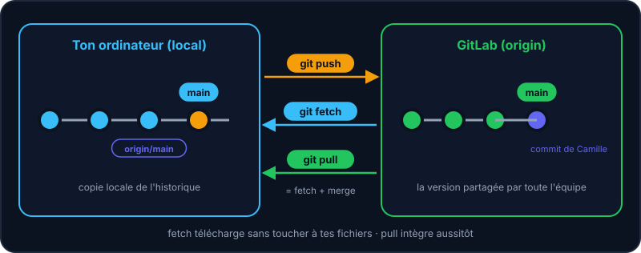
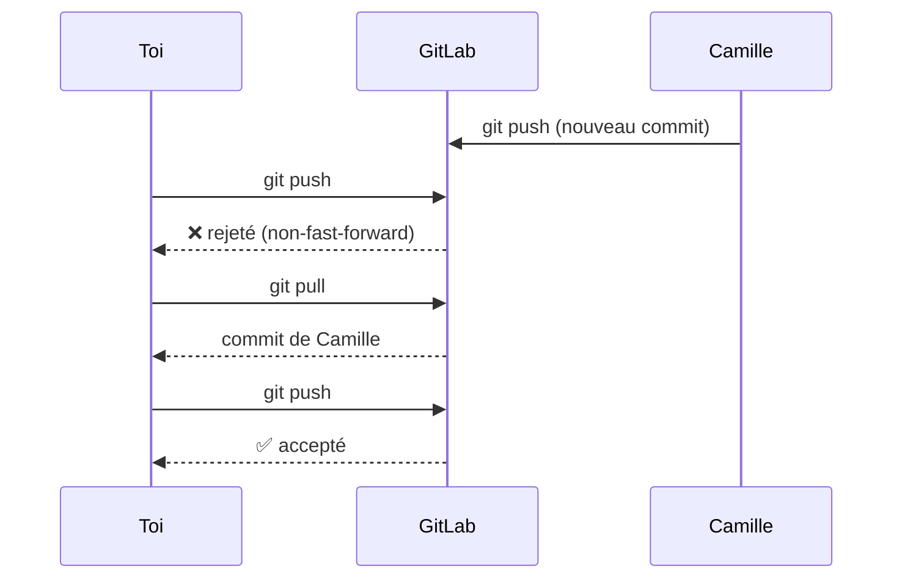

Un **dépôt distant** (*remote*) est une copie de ton dépôt hébergée ailleurs, par exemple sur GitLab. Par convention, il s'appelle `origin`. Tout le monde pousse et tire depuis ce point commun.



## Récupérer un projet existant

```shell run
git clone git@gitlab.example.org:equipe/formation-git.git
```

`clone` télécharge tout l'historique et configure `origin` automatiquement. Dans le **Bac à sable**, choisis le scénario « Cloner » pour l'essayer.

## Relier un dépôt local à un serveur

```shell run
git remote add origin git@gitlab.example.org:equipe/formation-git.git
git remote -v
git push -u origin main
```

`-u` mémorise que ta branche `main` suit `origin/main` : ensuite, un simple `git push` ou `git pull` suffit.

## Le quotidien

| Commande | Effet |
| --- | --- |
| `git fetch` | Télécharge les nouveautés du serveur *sans toucher* à tes fichiers. Met à jour `origin/main`. |
| `git pull` | `fetch` + `merge` : récupère et intègre dans ta branche. |
| `git push` | Envoie tes commits locaux sur le serveur. |

:::tip fetch avant pull ?
`git fetch` est sans risque : tu regardes d'abord ce qui a changé (`git status` te dit « en retard de 1 commit »), puis tu intègres avec `git pull` quand tu es prêt·e.

`origin/main` est un « signet » local qui mémorise où en était `main` sur GitLab la dernière fois que tu as parlé au serveur : il ne bouge que lors d'un `fetch`, d'un `pull` ou d'un `push`.
:::

## Quand le push est rejeté



:::warning
Si ton `push` est **rejeté** (*non-fast-forward*), c'est que quelqu'un a poussé avant toi. Fais d'abord un `git pull`, règle les éventuels conflits, puis repousse. N'utilise **jamais** `--force` pour contourner ça sur une branche partagée.
:::

## Entraîne-toi

:::lab
engine: real
intro: |
  Ton dépôt local a 2 commits. Un « GitLab » vide t'attend (un dépôt local qui répond à l'adresse `git@gitlab.example.org:equipe/formation-git.git`). Une coéquipière, Camille, va bientôt pousser du code…
commands:
  - 'rm -rf ~/.gitlab-sim && git init -q --bare ~/.gitlab-sim/formation-git.git'
  - git init -q
  - 'echo "# Formation Git" > README.md'
  - 'git add . && git commit -q -m "Initialise le dépôt"'
  - 'echo "<h1>Accueil</h1>" > index.html'
  - "git add . && git commit -q -m \"Ajoute l'accueil\""
steps:
  - text: 'Déclare le serveur : `git remote add origin <url>`'
    hint: 'git remote add origin git@gitlab.example.org:equipe/formation-git.git'
    checks:
      - command-succeeds: 'git remote get-url origin'
    solution:
      - 'git remote add origin git@gitlab.example.org:equipe/formation-git.git'
  - text: "Publie `main` et mémorise l'amont : `git push -u origin main`"
    hint: git push -u origin main
    checks:
      - command-succeeds: 'test "$(git rev-parse main)" = "$(git rev-parse origin/main)" && test "$(git rev-parse --abbrev-ref main@{upstream})" = origin/main'
    solution:
      - git push -u origin main
  - text: 'Camille vient de pousser ! Lance `camille` pour simuler son travail, puis télécharge sans fusionner : `git fetch`, puis `git status`'
    hint: 'camille, puis git fetch, puis git status : tu es « en retard » de 1 commit'
    after: [2]
    checks:
      - command-succeeds: 'test "$(git rev-list --count main..origin/main)" -ge 1'
    solution:
      - camille
      - git fetch
      - git status
  - text: 'Intègre son travail avec `git pull`'
    hint: git pull — contact.html apparaît dans ton dossier
    after: [3]
    checks:
      - env-file-exists: contact.html
      - command-succeeds: 'test "$(git rev-parse main)" = "$(git rev-parse origin/main)"'
    solution:
      - git pull
  - text: 'Fais un nouveau commit puis `git push`'
    hint: '`echo "<p>Salut</p>" >> index.html` puis `git commit -am "Dit salut"` puis `git push`'
    after: [4]
    checks:
      - command-succeeds: 'test "$(git rev-list --count origin/main)" -ge 4 && test "$(git rev-parse main)" = "$(git rev-parse origin/main)" && test "$(git log -1 --format=%an main)" != Camille'
    solution:
      - 'echo "<p>Salut</p>" >> index.html'
      - 'git commit -am "Dit salut"'
      - git push
:::

## Vérifie tes acquis

:::quiz
Quelle est la différence entre git fetch et git pull ?

- [ ] Aucune
- [x] fetch télécharge sans fusionner ; pull = fetch + merge
- [ ] pull télécharge sans fusionner ; fetch fusionne
- [ ] fetch envoie les commits

> fetch est sans risque : tu regardes d'abord ce qui a changé, tu intègres ensuite.
:::

:::quiz
Ton push est rejeté (non-fast-forward). Que faire ?

- [ ] git push --force
- [x] git pull, régler les conflits éventuels, puis git push
- [ ] Supprimer le dépôt distant
- [ ] Recloner le projet

> Le serveur a des commits que tu n'as pas. Intègre-les d'abord.
:::

:::quiz
Que signifie « origin » ?

- [ ] La première branche
- [x] Le nom par défaut du dépôt distant d'où on a cloné
- [ ] Le premier commit
- [ ] Un mot-clé de Git

> C'est juste une convention : un nom court pour l'URL du serveur.
:::
