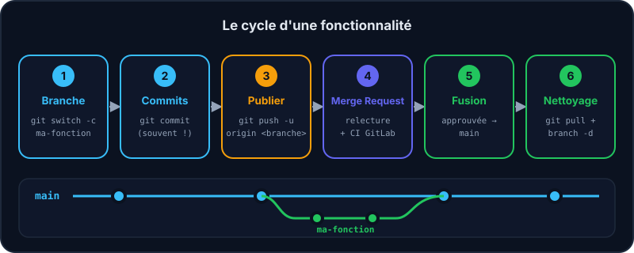
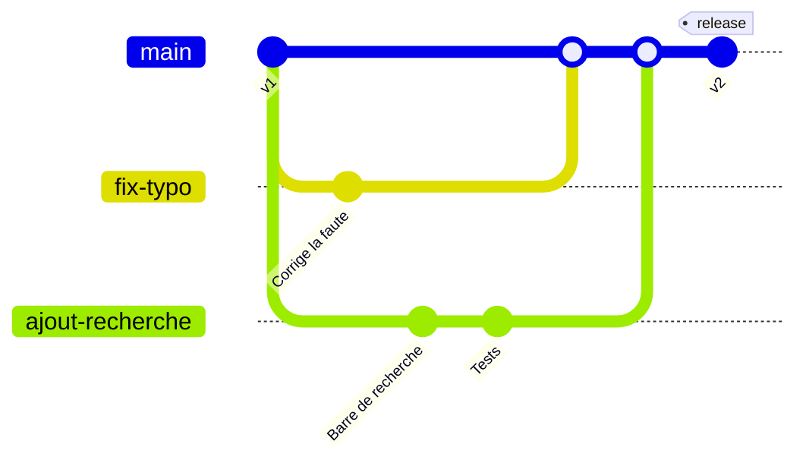

Savoir utiliser les commandes, c'est bien. Savoir *comment s'organiser à plusieurs*, c'est ce qui fait qu'un projet associatif tient dans la durée. Voici le flux utilisé par la plupart des équipes.

## Le flux « feature branch + Merge Request »



1. `main` reste toujours stable et déployable : on n'y commite jamais directement.
2. Pour chaque tâche : `git switch -c ma-fonctionnalite` depuis un `main` à jour.
3. Tu commites régulièrement, puis tu publies : `git push -u origin ma-fonctionnalite`.
4. Sur GitLab, tu ouvres une **Merge Request** (MR) : l'équipe relit, commente, la CI teste.
5. Une fois approuvée, la MR est fusionnée dans `main`. Tu fais `git switch main && git pull` et tu supprimes ta branche.



:::info Merge Request ou Pull Request ?
C'est la même chose : **Merge Request** sur GitLab, **Pull Request** sur GitHub. Ce n'est pas une fonction de Git lui-même, mais du service qui héberge ton dépôt.
:::

## Les bons réflexes

:::cartes
### Commits atomiques

Un commit = un changement logique, qui fonctionne. Plus facile à relire, à annuler, à comprendre.

### .gitignore

Liste les fichiers à ne jamais suivre : `node_modules/`, `.env`, fichiers compilés, clés d'API…

### Pull avant push

Récupère le travail des autres avant de publier le tien : moins de rejets, moins de conflits.

### Jamais de secrets

Un mot de passe commité reste dans l'historique, même supprimé ensuite. Il faut le **révoquer** immédiatement.
:::

## Un fichier .gitignore typique

```text
# dépendances
node_modules/

# secrets
.env

# fichiers générés
dist/
*.log
```

:::danger Un secret commité est un secret compromis
Même si tu le supprimes au commit suivant, il reste dans l'historique. Change le mot de passe ou la clé tout de suite, *puis* nettoie.
:::

:::info Contribuer dans l'équipe
Les projets sont sur [GitLab](https://gitlab.example.org/equipe). Aucun prérequis technique : l'équipe forme les nouvelles recrues aux outils et technologies utilisés.
:::

## Entraîne-toi

:::labo
moteur: reel
intro: |
  Mini-projet final : tu corriges une faute de frappe via une branche, tu la publies, et la « Merge Request » est acceptée par l'équipe.
commandes:
  - 'rm -rf ~/.gitlab-sim && git init -q --bare ~/.gitlab-sim/formation-git.git'
  - git init -q
  - 'echo "# Annuaire des assos" > README.md'
  - 'echo "Bienvenu sur le site." >> README.md'
  - "git add . && git commit -q -m \"Initialise l'annuaire\""
  - 'git remote add origin git@gitlab.example.org:equipe/formation-git.git'
  - git push -q -u origin main
etapes:
  - texte: 'Crée la branche `fix-typo`'
    indice: git switch -c fix-typo
    verif:
      - commande-reussit: 'git rev-parse --verify -q fix-typo'
    solution:
      - git switch -c fix-typo
  - texte: 'Corrige « Bienvenu » en « Bienvenue » dans `README.md` et commite'
    indice: "Avec nano README.md, ajoute le « e » manquant, enregistre, puis lance git commit -am \"Corrige la faute de frappe\""
    apres: [1]
    verif:
      - commande-reussit: 'test "$(git rev-list --count main..fix-typo)" -ge 1 && git show fix-typo:README.md | grep -q Bienvenue'
    solution:
      - "sed -i 's/Bienvenu /Bienvenue /' README.md"
      - 'git commit -am "Corrige la faute de frappe"'
  - texte: 'Publie ta branche : `git push -u origin fix-typo`'
    indice: git push -u origin fix-typo
    apres: [2]
    verif:
      - commande-reussit: 'test "$(git rev-parse fix-typo)" = "$(git --git-dir="$HOME/.gitlab-sim/formation-git.git" rev-parse fix-typo)"'
    solution:
      - git push -u origin fix-typo
  - texte: 'La MR est acceptée ! Lance `mr-acceptee fix-typo` pour simuler l''équipe, puis reviens sur `main` et mets-le à jour avec `git pull`'
    indice: mr-acceptee fix-typo puis git switch main puis git pull
    apres: [3]
    verif:
      - sortie-contient: ['git branch --show-current', '^main$']
      - commande-reussit: 'test "$(git rev-parse main)" = "$(git rev-parse fix-typo)"'
    solution:
      - mr-acceptee fix-typo
      - git switch main
      - git pull
  - texte: 'Nettoie : supprime la branche locale avec `git branch -d fix-typo`'
    indice: git branch -d fix-typo
    apres: [4]
    verif:
      - commande-echoue: 'git rev-parse --verify -q fix-typo'
    solution:
      - git branch -d fix-typo
:::

## Vérifie tes acquis

:::quiz
À quoi sert un fichier .gitignore ?

- [ ] À lister les contributeurs
- [x] À indiquer à Git les fichiers à ne pas suivre (secrets, dépendances, fichiers générés)
- [ ] À configurer GitLab
- [ ] À accélérer Git

> Il évite de polluer le dépôt et, surtout, de publier des secrets par erreur.
:::

:::quiz
Tu as commité un mot de passe puis supprimé le fichier au commit suivant. Est-ce réglé ?

- [ ] Oui, il n'existe plus
- [x] Non : il reste dans l'historique, il faut le révoquer/changer
- [ ] Oui si on fait git gc
- [ ] Oui, si on supprime la branche qui le contenait

> Quiconque a accès à l'historique peut le retrouver. Considère-le comme compromis.
:::

:::quiz
Qu'est-ce qu'une Merge Request ?

- [ ] Une commande Git
- [x] Une demande de fusion sur GitLab pour relecture avant d'intégrer une branche
- [ ] Un type de conflit
- [ ] Un backup

> C'est une fonctionnalité de GitLab (Pull Request sur GitHub), pas de Git lui-même.
:::

:::quiz
Peut-on utiliser git push --force sur la branche main partagée ?

- [ ] Oui, c'est la méthode normale
- [x] Non, ça peut écraser le travail des autres : à éviter
- [ ] Oui, tant que personne n'a encore ouvert de merge request
- [ ] Oui, si tu préviens l'équipe après coup

> --force réécrit l'historique distant : tes collègues perdent des commits.
:::
