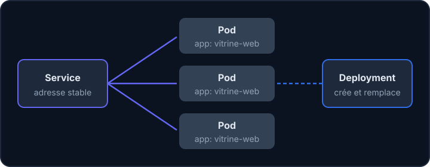

## À quoi ça sert, et pourquoi ?

Avec Docker (parcours précédents), tu lances un conteneur avec `docker run`. C'est parfait sur ton poste. Mais sur un serveur qui héberge les sites des associations, il faut plus : si un conteneur plante à 3 h du matin, quelqu'un doit le relancer ; si le site est très visité, il faut en lancer plusieurs copies ; si on met à jour, il ne faut pas tout casser.

**Kubernetes** (on écrit souvent « K8s ») est un logiciel qui s'occupe de tout cela à ta place. Pense à un **chef d'orchestre** : tu lui donnes la partition (ce que tu veux), et il fait jouer les musiciens (les conteneurs), remplace celui qui s'arrête et vérifie que l'ensemble reste juste.

Quelques mots à connaître dès maintenant :

- un **cluster** est l'ensemble des machines pilotées par Kubernetes ; chaque machine s'appelle un **nœud** (*node*) ;
- **`kubectl`** (« koub-contrôle ») est la commande qui parle au cluster ;
- les ordres se donnent dans des fichiers **YAML** : du texte structuré par l'indentation (deux espaces par niveau), où `clé: valeur` décrit une propriété et `- ` commence un élément de liste ;
- un **port** est le numéro de « guichet » d'une machine : un même ordinateur peut faire tourner plusieurs programmes, chacun écoute sur son propre numéro (80 pour le web en HTTP, 8000 pour Django en développement) ;
- le principe est **déclaratif** : tu ne dis pas « lance ceci », tu décris l'**état voulu** (« je veux 1 copie de ce site »), et Kubernetes agit jusqu'à ce que la réalité corresponde.



## Les trois objets de base

:::cards
### Pod

La plus petite unité : un ou plusieurs conteneurs qui partagent le même réseau et les mêmes volumes. Un pod est **jetable** : s'il disparaît, son adresse IP disparaît avec lui.

### Deployment

Le « contrat » : quelle image, combien de copies, quelles sondes. Il crée et remplace les pods pour respecter ce contrat.

### Service

Une adresse et un nom DNS **stables** devant un groupe de pods. Il retrouve ses pods grâce à des **labels**.
:::

## Lire le déploiement de Vitrine

Le dossier `helm/` du dépôt [Vitrine](https://gitlab.example.org/equipe/vitrine) contient le fichier `templates/deployment-web.yaml`. Voici sa structure, simplifiée et sans les variables Helm (nous les verrons dans la leçon 4) :

```yaml
apiVersion: apps/v1
kind: Deployment
metadata:
  name: vitrine-web
spec:
  replicas: 1
  strategy:
    type: Recreate
  selector:
    matchLabels:
      app: vitrine-web
  template:
    metadata:
      labels:
        app: vitrine-web
    spec:
      containers:
        - name: web
          image: registry.example.org/equipe/vitrine:master
          ports:
            - name: django
              containerPort: 8000
          readinessProbe:
            httpGet:
              path: /
              port: 8000
            initialDelaySeconds: 60
            periodSeconds: 5
          resources:
            requests:
              cpu: 300m
              memory: 500Mi
            limits:
              cpu: 500m
              memory: 1Gi
        - name: nginx
          image: nginx
          ports:
            - name: http
              containerPort: 8080
```

Ligne par ligne, du haut vers le bas :

- `apiVersion: apps/v1` et `kind: Deployment` : tous les objets Kubernetes commencent ainsi. `kind` dit **quel type d'objet** tu décris ; `apiVersion` dit dans quelle version de l'API il est défini.
- `metadata.name` : le nom de l'objet, qu'on retapera dans `kubectl`.
- `spec` : la **spécification**, c'est-à-dire l'état voulu. Tout ce qui suit en dépend.
- `template` : le modèle des pods à fabriquer. Le déploiement ne contient pas de pods, il sait **en créer** à partir de ce modèle.
- `labels` : des étiquettes `clé: valeur` collées sur un objet. Elles servent à retrouver des objets (ici, tous les pods `app: vitrine-web`).
- `containers` : la liste des conteneurs du pod ; `image` est l'image Docker à lancer, comme dans `docker run`. Elle est téléchargée depuis un **registry**, un serveur qui range les images Docker (ici `registry.gitlab.example.org`, celui de GitLab) ; le mot après les deux-points (`master`) est l'**étiquette** (*tag*) de la version.
- `ports` / `containerPort` : le port sur lequel écoute le programme dans le conteneur ; `name` lui donne un surnom réutilisable.
- `replicas: 1` : une seule copie. Le chart ne fixe ce nombre que si l'autoscaling est désactivé.
- `strategy: Recreate` : lors d'une mise à jour, l'ancien pod est **arrêté avant** que le nouveau démarre (au lieu de `RollingUpdate`, où les deux coexistent un moment). Il y a donc une courte coupure, mais jamais deux versions qui écrivent dans le même volume.
- `selector.matchLabels` et `template.metadata.labels` : le déploiement reconnaît « ses » pods par le label `app`. Les deux doivent correspondre.
- **Deux conteneurs dans un seul pod** : Django (`web`, port 8000) et un nginx (port 8080) qui sert les fichiers statiques. Ils partagent le réseau du pod.
- `readinessProbe` : une **sonde** est un petit test que Kubernetes refait régulièrement. Ici, il demande la page `/` sur le port 8000 toutes les 5 secondes (`periodSeconds`), après avoir attendu 60 secondes au démarrage (`initialDelaySeconds`), le temps que Django s'allume. Tant que le test échoue, le pod est **retiré du service** (il ne reçoit pas de visiteurs). Une `livenessProbe` (non reprise ici) fonctionne pareil mais sert à **redémarrer** un conteneur bloqué.
- `requests` / `limits` : `requests` est ce que le pod **réserve** (300m = 0,3 cœur de processeur, 500Mi = 500 mébioctets de mémoire) pour que Kubernetes le place sur une machine assez libre ; `limits` est le plafond à ne pas dépasser (au-delà de la mémoire autorisée, le conteneur est tué).

## Le service devant les pods

Le fichier `templates/service-nginx.yaml` du même chart donne ceci (simplifié) :

```yaml
apiVersion: v1
kind: Service
metadata:
  name: vitrine-nginx-svc
spec:
  type: ClusterIP
  selector:
    app: vitrine-web
  ports:
    - name: http
      port: 80
      targetPort: http
```

- `selector` : le service envoie le trafic à tous les pods **prêts** qui portent le label `app: vitrine-web`.
- `port: 80` : le port du service ; `targetPort: http` : le port **nommé** `http` du conteneur nginx (8080).
- `type: ClusterIP` : joignable seulement **dans** le cluster. L'ouverture vers l'extérieur est le rôle de l'Ingress (leçon 3).

Dans le cluster, un autre pod joint ce service par son nom : `http://vitrine-nginx-svc`.

:::warning Un label qui ne correspond pas
Si le `selector` du service diffère d'une lettre des labels du pod, le service existe mais n'a **aucun point de terminaison** : tout semble créé, et rien ne répond. `kubectl get endpoints` (ou `kubectl describe service`) montre alors une liste vide.
:::

## Les commandes de base

```bash
kubectl apply -f deployment.yaml     # crée ou met à jour ce que décrit le fichier
kubectl get pods                     # liste les pods du namespace courant
kubectl get deploy,svc               # déploiements et services
kubectl describe deployment vitrine-web
```

- `apply -f` envoie le fichier au cluster. Comme c'est **déclaratif**, tu peux le relancer : seule la différence est appliquée.
- `get` affiche une liste d'objets d'un type ; `describe` affiche le détail d'un objet, avec ses évènements récents (très utile en cas de problème, voir la leçon 6).
- Un **namespace** est un « dossier » du cluster qui range les objets par projet (`keycloak`, `adhesion`…). Sans option, `kubectl` travaille dans le namespace `default` ; `-n nom` en choisit un autre.

## Contrôler un fichier sans cluster

Les commandes ci-dessus parlent toutes à un cluster. Or dans l'atelier de cette formation, **il n'y a pas de cluster** : tu ne peux donc pas lancer `kubectl apply`, ni voir de vrais pods démarrer. Deux outils permettent pourtant de travailler sérieusement hors ligne :

- `kubectl create deployment … --dry-run=client -o yaml` **fabrique** le YAML d'un objet sans rien envoyer (`--dry-run=client` : « simule côté client » ; `-o yaml` : « affiche le résultat en YAML ») ;
- `kubeconform fichier.yaml` **compare** ton fichier au schéma officiel de Kubernetes et signale une clé mal écrite, un type faux ou un champ inconnu. Il ne dit pas si l'application marchera : seulement si Kubernetes **acceptera** le fichier.

:::info Ce que l'atelier ne fait pas
Rien n'est exécuté sur un vrai cluster : ni démarrage de pods, ni sondes, ni réseau. Le reste de la leçon (ce qui se passe quand un pod tourne) est expliqué, pas essayé.
:::

:::info À confirmer avec l'équipe Infra
Quels namespaces, quelles ressources par défaut (`requests`, `limits`) et quelle version de Kubernetes sont en usage sur le cluster de production aujourd'hui ? Le README du chart de Vitrine indique seulement qu'il a été testé sur Kubernetes 1.18.
:::

## Entraîne-toi

:::lab
engine: real
intro: |
  Tu travailles dans un atelier Linux avec `kubectl`, `kubeconform` et un petit outil de l'équipe, `verifier-k8s`. **Il n'y a pas de cluster Kubernetes dans cet atelier** : rien n'est lancé pour de vrai. Tu écris des fichiers YAML et tu les contrôles. `kubeconform` compare un fichier au schéma officiel de Kubernetes (pour dire s'il est valide) ; `verifier-k8s` refait, sur tes fichiers, le raisonnement que ferait le cluster pour relier un service à ses pods. Le fichier `service.yaml` de Vitrine t'est fourni, mais il est cassé.
commands:
  - cp /opt/exercices/01-deploiement/service.yaml .
steps:
  - text: 'Génère un squelette de déploiement nommé `vitrine-web` (image `nginx:1.27`, 2 copies) dans `deployment.yaml`, sans rien envoyer à un cluster : `kubectl create deployment vitrine-web --image=nginx:1.27 --replicas=2 --dry-run=client -o yaml > deployment.yaml` (`--dry-run=client` = « simule, n''envoie rien » ; `-o yaml` = « affiche en YAML » ; `>` écrit le résultat dans le fichier)'
    hint: 'Ouvre ensuite le fichier avec `cat deployment.yaml` et retrouve `kind`, `replicas`, `selector` et `template`, vus dans la leçon.'
    checks:
      - command-succeeds: 'kubeconform deployment.yaml'
      - command-succeeds: "verifier-k8s champ --kind Deployment --nom vitrine-web --chemin 'spec.replicas' --egal 2 deployment.yaml"
      - command-succeeds: "verifier-k8s champ --kind Deployment --nom vitrine-web --chemin 'spec.template.spec.containers[0].image' --texte nginx:1.27 deployment.yaml"
    solution:
      - kubectl create deployment vitrine-web --image=nginx:1.27 --replicas=2 --dry-run=client -o yaml > deployment.yaml
  - text: 'Lance `verifier-k8s selecteur deployment.yaml service.yaml` : le service ne trouve aucun pod. Corrige le `selector` de `service.yaml` (avec `nano service.yaml`) pour qu''il reprenne le label du déploiement, puis relance la commande'
    hint: 'Le label des pods est `app: vitrine-web` (regarde `template.metadata.labels` dans `deployment.yaml`). Le `selector` du service doit le reprendre exactement.'
    after: [1]
    checks:
      - command-succeeds: 'verifier-k8s selecteur deployment.yaml service.yaml'
      - command-succeeds: 'kubeconform service.yaml'
      - command-succeeds: "verifier-k8s champ --kind Service --chemin 'spec.selector.app' --texte vitrine-web service.yaml"
    solution:
      - "sed -i 's/app: web$/app: vitrine-web/' service.yaml"
  - text: 'Ajoute dans `deployment.yaml`, au même niveau que `name` et `image` du conteneur, une `readinessProbe` : un `httpGet` sur `path: /` et `port: 80`, avec `initialDelaySeconds: 10`'
    hint: 'Les clés `path` et `port` sont sous `httpGet`, lui-même sous `readinessProbe`. Les espaces comptent : deux par niveau, jamais de tabulation. Valide avec `kubeconform deployment.yaml`.'
    after: [1]
    checks:
      - command-succeeds: 'kubeconform deployment.yaml'
      - command-succeeds: "verifier-k8s champ --kind Deployment --nom vitrine-web --chemin 'spec.template.spec.containers[0].readinessProbe.httpGet.path' --texte / deployment.yaml"
      - command-succeeds: "verifier-k8s champ --kind Deployment --nom vitrine-web --chemin 'spec.template.spec.containers[0].readinessProbe.httpGet.port' --egal 80 deployment.yaml"
      - command-succeeds: "verifier-k8s champ --kind Deployment --nom vitrine-web --chemin 'spec.template.spec.containers[0].readinessProbe.initialDelaySeconds' --egal 10 deployment.yaml"
    solution:
      - write:
          deployment.yaml: |
            apiVersion: apps/v1
            kind: Deployment
            metadata:
              labels:
                app: vitrine-web
              name: vitrine-web
            spec:
              replicas: 2
              selector:
                matchLabels:
                  app: vitrine-web
              strategy: {}
              template:
                metadata:
                  labels:
                    app: vitrine-web
                spec:
                  containers:
                  - image: nginx:1.27
                    name: nginx
                    readinessProbe:
                      httpGet:
                        path: /
                        port: 80
                      initialDelaySeconds: 10
  - text: 'Ajoute au conteneur des `resources` : `requests` de `100m` de CPU et `128Mi` de mémoire, `limits` de `500m` de CPU et `256Mi` de mémoire'
    hint: 'La clé `resources` est au même niveau que `readinessProbe` ; elle contient `requests` et `limits`, qui contiennent chacun `cpu` et `memory`.'
    after: [3]
    checks:
      - command-succeeds: 'kubeconform deployment.yaml'
      - command-succeeds: "verifier-k8s champ --kind Deployment --nom vitrine-web --chemin 'spec.template.spec.containers[0].resources.requests.cpu' --texte 100m deployment.yaml"
      - command-succeeds: "verifier-k8s champ --kind Deployment --nom vitrine-web --chemin 'spec.template.spec.containers[0].resources.requests.memory' --texte 128Mi deployment.yaml"
      - command-succeeds: "verifier-k8s champ --kind Deployment --nom vitrine-web --chemin 'spec.template.spec.containers[0].resources.limits.cpu' --texte 500m deployment.yaml"
      - command-succeeds: "verifier-k8s champ --kind Deployment --nom vitrine-web --chemin 'spec.template.spec.containers[0].resources.limits.memory' --texte 256Mi deployment.yaml"
    solution:
      - write:
          deployment.yaml: |
            apiVersion: apps/v1
            kind: Deployment
            metadata:
              labels:
                app: vitrine-web
              name: vitrine-web
            spec:
              replicas: 2
              selector:
                matchLabels:
                  app: vitrine-web
              strategy: {}
              template:
                metadata:
                  labels:
                    app: vitrine-web
                spec:
                  containers:
                  - image: nginx:1.27
                    name: nginx
                    readinessProbe:
                      httpGet:
                        path: /
                        port: 80
                      initialDelaySeconds: 10
                    resources:
                      requests:
                        cpu: 100m
                        memory: 128Mi
                      limits:
                        cpu: 500m
                        memory: 256Mi
  - text: 'Remplace `strategy: {}` par la stratégie `Recreate` (la clé `type` est sous `strategy`), puis valide une dernière fois les deux fichiers avec `kubeconform deployment.yaml service.yaml`'
    hint: 'Il faut deux lignes à la place de `strategy: {}` : `strategy:` puis, indentée de deux espaces de plus, `type: Recreate`.'
    after: [4]
    checks:
      - command-succeeds: 'kubeconform deployment.yaml service.yaml'
      - command-succeeds: "verifier-k8s champ --kind Deployment --nom vitrine-web --chemin 'spec.strategy.type' --texte Recreate deployment.yaml"
      - command-succeeds: 'verifier-k8s selecteur deployment.yaml service.yaml'
    solution:
      - write:
          deployment.yaml: |-
            apiVersion: apps/v1
            kind: Deployment
            metadata:
              labels:
                app: vitrine-web
              name: vitrine-web
            spec:
              replicas: 2
              selector:
                matchLabels:
                  app: vitrine-web
              strategy:
                type: Recreate
              template:
                metadata:
                  labels:
                    app: vitrine-web
                spec:
                  containers:
                  - image: nginx:1.27
                    name: nginx
                    readinessProbe:
                      httpGet:
                        path: /
                        port: 80
                      initialDelaySeconds: 10
                    resources:
                      requests:
                        cpu: 100m
                        memory: 128Mi
                      limits:
                        cpu: 500m
                        memory: 256Mi
:::

## Vérifie tes acquis

:::quiz
Pourquoi ne crée-t-on presque jamais un pod « à la main » en production ?

- [ ] Parce qu'un pod ne peut contenir qu'un seul conteneur
- [x] Parce qu'un pod seul n'est pas recréé s'il disparaît ; c'est le rôle du déploiement
- [ ] Parce que les pods n'ont pas de réseau
- [ ] Parce qu'un pod ne peut pas avoir de volume

> Un déploiement garantit le nombre de copies voulu et remplace les pods perdus.
:::

:::quiz
Le service `vitrine-nginx-svc` existe, mais `kubectl get endpoints` ne montre aucune adresse. Quelle est la cause la plus probable ?

- [ ] L'image Docker est trop volumineuse
- [ ] Le service est de type `ClusterIP`
- [ ] Le déploiement utilise la stratégie `Recreate`
- [x] Le `selector` du service ne correspond à aucun label de pod prêt

> Le service ne route que vers des pods prêts qui portent exactement les labels du `selector`.
:::

:::quiz
Que provoque l'échec de la `readinessProbe` d'un pod ?

- [ ] Le conteneur est redémarré
- [ ] Le déploiement est supprimé
- [x] Le pod est retiré du service, sans être redémarré
- [ ] L'image est retéléchargée

> La sonde de disponibilité décide si le pod reçoit du trafic ; la sonde de vie (`livenessProbe`) décide du redémarrage.
:::

:::quiz
Que change `strategy: Recreate` par rapport à `RollingUpdate` ?

- [ ] Les pods sont mis à jour un par un, sans coupure
- [ ] Les anciennes images sont supprimées du registry
- [x] L'ancien pod est arrêté avant le démarrage du nouveau
- [ ] Le déploiement est recréé de zéro à chaque `kubectl get`

> Avec `Recreate`, il y a une brève coupure, mais deux versions n'écrivent jamais en même temps dans un volume partagé.
:::
