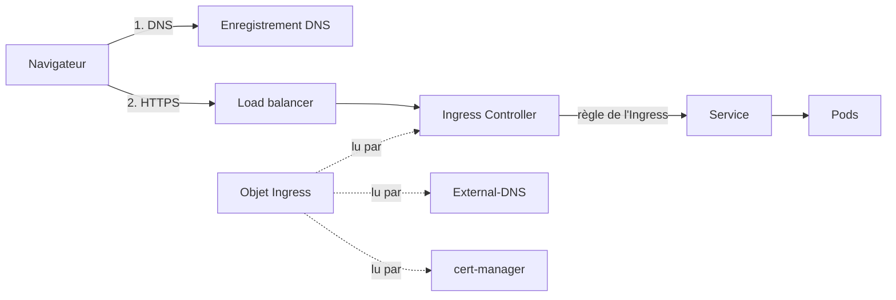

## À quoi ça sert, et pourquoi ?

Un service `ClusterIP` (leçon 1) n'est joignable que depuis l'**intérieur** du cluster. Or un visiteur tape `portail.example.org` dans son navigateur, depuis Internet. Pour que ça marche, trois problèmes se posent, que l'on peut comparer à l'ouverture d'un magasin :

- **le DNS** est l'annuaire d'Internet : il traduit un nom (`portail.example.org`) en adresse IP. Sans lui, personne ne trouve l'adresse du magasin ;
- **l'Ingress** est l'accueil : il lit le nom demandé et oriente le visiteur vers le bon rayon (le bon service) ;
- **le certificat** est la preuve d'identité qui permet le **HTTPS** (la version chiffrée de HTTP, le cadenas du navigateur). Le chiffrement repose sur **TLS** (*Transport Layer Security*), le successeur de **SSL** : SSL est l'ancien nom, resté dans le langage courant (« un certificat SSL » désigne en fait un certificat TLS). Sans certificat, le navigateur affiche un avertissement.

Un quatrième acteur se tient devant le cluster : le **load balancer** (« répartiteur de charge »). C'est une machine ou un service de l'hébergeur qui reçoit le trafic venu d'Internet à une adresse IP fixe et le distribue aux machines du cluster, comme l'hôtesse qui répartit les clients entre plusieurs caisses.

Chacun a son outil automatique dans le cluster de l'équipe, que cette leçon présente.



## Ingress et Ingress Controller

Un **reverse proxy** est un serveur placé devant d'autres serveurs, qui reçoit les requêtes et les transmet au bon endroit. Ici :

- Un **Ingress** est un objet YAML : « le nom d'hôte X, chemin Y, doit aller vers le service Z ».
- Un **Ingress Controller** est un programme (un reverse proxy HTTP) qui **lit** ces objets et se reconfigure tout seul. Sans lui, l'Ingress ne fait rien.

Voici l'Ingress du chart de Vitrine, simplifié :

```yaml
apiVersion: networking.k8s.io/v1
kind: Ingress
metadata:
  name: vitrine-ingress
spec:
  rules:
    - host: portail.example.org
      http:
        paths:
          - path: /
            pathType: Prefix
            backend:
              service:
                name: vitrine-nginx-svc
                port:
                  number: 80
```

Ligne par ligne : `host` est le nom de domaine demandé par le visiteur ; `path: /` avec `pathType: Prefix` signifie « toute adresse qui commence par `/` », donc tout le site ; `backend.service` désigne le service qui reçoit le trafic. On retrouve le service de la leçon 1 : `port.number: 80` choisit le port du service. L'Ingress envoie donc tout le trafic de ce nom d'hôte vers `vitrine-nginx-svc`, port 80.

:::info Deux contrôleurs, deux contextes
Selon les dépôts de l'équipe, le contrôleur n'est pas le même. Dans `cluster-configuration`, le dossier `ingress/` installe **HAProxy Ingress** (chart `haproxy-ingress`) avec le **protocole PROXY** activé et une **annotation** propre à un load balancer OVH. Le protocole PROXY est un petit en-tête que le load balancer ajoute à chaque connexion pour transmettre l'adresse IP réelle du visiteur ; sans lui, le contrôleur ne verrait que l'adresse du load balancer. Une annotation est une étiquette libre collée sur un objet, que seul le programme concerné sait lire (ici, un réglage pour le load balancer d'OVH, l'hébergeur). Dans le cluster de dev local d'`infra-dev`, c'est **Traefik**, fourni d'origine par k3s (la version allégée de Kubernetes de la leçon 5).
:::

## cert-manager : les certificats

Un **certificat** est un fichier qui prouve que tu es bien le propriétaire du nom de domaine et qui contient de quoi chiffrer la connexion (TLS). **Let's Encrypt** est une **autorité de certification** gratuite : un organisme de confiance, reconnu par les navigateurs, qui en délivre. Ils expirent tous les 90 jours : les renouveler à la main serait une corvée. **cert-manager** est un programme du cluster qui demande et renouvelle ces certificats automatiquement. Le dépôt `cluster-configuration` y déclare un `ClusterIssuer`, c'est-à-dire « l'autorité à utiliser » :

```yaml
apiVersion: certmanager.k8s.io/v1alpha1
kind: ClusterIssuer
metadata:
  name: letsencrypt-production
spec:
  acme:
    server: https://acme-v02.api.letsencrypt.org/directory
    email: contact@exemple.invalid
    privateKeySecretRef:
      name: letsencrypt-production
    dns01:
      providers:
        - name: cloudflare
          cloudflare:
            email: contact@exemple.invalid
            apiKeySecretRef:
              name: cloudflare
              key: api
```

(Le fichier réel contient l'adresse de contact de l'équipe ; elle est remplacée ici par une adresse d'exemple.) Ce qu'on y lit :

- `kind: ClusterIssuer` : un « émetteur » utilisable dans tout le cluster ;
- `acme` : le protocole (ACME) par lequel on dialogue avec Let's Encrypt ;
- `privateKeySecretRef` : le nom du Secret où est rangée la clé du compte ;
- l'autorité est l'API de production de Let's Encrypt ;
- la preuve de propriété du domaine se fait par un enregistrement **DNS-01** : cert-manager crée un enregistrement DNS temporaire chez Cloudflare ;
- la clé d'API Cloudflare vient d'un **Secret** nommé `cloudflare`, jamais écrite dans ce fichier.

## External-DNS : les enregistrements

Créer à la main chaque entrée de l'annuaire DNS est long et on oublie de les supprimer. **External-DNS** surveille les Ingress et crée seul les enregistrements DNS correspondants. Dans le dépôt, il est installé avec le fournisseur `cloudflare` (la zone DNS y est hébergée) et un filtre de domaine `exemple.fr` : il ne touche à aucun autre domaine.

## En local : nip.io

Sur ton poste, tu n'as pas de nom de domaine à toi. Le cluster de dev utilise donc `nip.io` : `sso.172.17.0.1.nip.io` se résout vers `172.17.0.1`, sans rien configurer. Il n'y a ni cert-manager ni HTTPS (donc pas de TLS) en local.

:::warning cluster-configuration date de 2019 environ
Ne recopie pas ce dépôt tel quel. Plusieurs éléments sont **probablement obsolètes** :

- le dossier `helm-setup/` installe **Tiller**, composant de Helm 2 qui n'existe plus en Helm 3 ;
- les charts `stable/` et `incubator/` viennent de dépôts de charts abandonnés ;
- cert-manager est installé en version 0.6, avec l'`apiVersion` `certmanager.k8s.io/v1alpha1` ; les versions récentes utilisent `cert-manager.io/v1` ;
- la commande `kubectl apply` qui installe les CRD de cert-manager (les nouveaux types d'objets vus plus haut) pointe vers une branche `release-0.6` du dépôt de cert-manager.

Le dépôt s'appuie aussi sur **Terraform** (un outil qui décrit l'infrastructure dans des fichiers puis la crée) et sur un espace de travail `production` : lis attentivement le plan avant tout `apply`.
:::

:::info À confirmer avec l'équipe Infra
Le cluster de production fonctionne-t-il encore avec HAProxy Ingress, cert-manager et External-DNS tels que décrits dans `cluster-configuration`, ou ont-ils été remplacés ? Le chart de Vitrine ne déclare ni `tls`, ni annotation cert-manager, ni classe d'Ingress : comment le certificat est-il alors obtenu ? Comment demander un nouveau nom de domaine ?
:::

## Entraîne-toi

:::labo
moteur: reel
intro: |
  Atelier sans cluster (donc **sans Ingress Controller, sans cert-manager et sans DNS réel** : rien n'est routé ni signé), avec `kubeconform`, `yamllint` (un correcteur de syntaxe YAML) et `verifier-k8s`. Tu as sous la main `service.yaml` (le service de Vitrine), `ingress-ancien.yaml` (un Ingress écrit à l'ancienne mode) et `cluster-issuer.yaml` (un émetteur cert-manager avec une erreur). Les schémas des CRD de cert-manager ne sont pas embarqués : `kubeconform` ne peut donc pas contrôler le ClusterIssuer lui-même, seulement `yamllint` sa syntaxe.
commandes:
  - cp /opt/exercices/03-ingress/service.yaml /opt/exercices/03-ingress/ingress-ancien.yaml /opt/exercices/03-ingress/cluster-issuer.yaml /opt/exercices/03-ingress/.yamllint .
etapes:
  - texte: 'Lance `kubeconform ingress-ancien.yaml` : il refuse l''ancienne `apiVersion`. Copie le fichier en `ingress.yaml` et modernise-le : `apiVersion: networking.k8s.io/v1`, `pathType: Prefix`, et le service désigné par `backend.service.name` et `backend.service.port.number` (80)'
    indice: 'Dans la version 1, `serviceName` et `servicePort` disparaissent au profit de `service.name` et `service.port.number`. Compare avec l''exemple de la leçon.'
    verif:
      - commande-reussit: 'kubeconform ingress.yaml'
      - commande-reussit: "verifier-k8s champ --kind Ingress --chemin 'apiVersion' --texte networking.k8s.io/v1 ingress.yaml"
      - commande-reussit: "verifier-k8s champ --kind Ingress --chemin 'spec.rules[0].http.paths[0].pathType' --texte Prefix ingress.yaml"
      - commande-reussit: "verifier-k8s champ --kind Ingress --chemin 'spec.rules[0].http.paths[0].backend.service.name' --texte vitrine-nginx-svc ingress.yaml"
      - commande-reussit: "verifier-k8s champ --kind Ingress --chemin 'spec.rules[0].http.paths[0].backend.service.port.number' --egal 80 ingress.yaml"
      - commande-reussit: 'verifier-k8s references ingress.yaml service.yaml'
    solution:
      - ecrire:
          ingress.yaml: |
            apiVersion: networking.k8s.io/v1
            kind: Ingress
            metadata:
              name: vitrine-ingress
            spec:
              rules:
                - host: portail.example.org
                  http:
                    paths:
                      - path: /
                        pathType: Prefix
                        backend:
                          service:
                            name: vitrine-nginx-svc
                            port:
                              number: 80
  - texte: 'Prépare le HTTPS dans `ingress.yaml` : ajoute sous `metadata` une annotation `cert-manager.io/cluster-issuer: letsencrypt-production`, et sous `spec` un bloc `tls` qui liste l''hôte `portail.example.org` avec `secretName: portail-tls`'
    indice: '`annotations` est un dictionnaire sous `metadata` ; `tls` est une liste (un tiret) dont chaque élément a `hosts` (une liste) et `secretName`. cert-manager rangera le certificat dans le Secret `portail-tls`.'
    apres: [1]
    verif:
      - commande-reussit: 'kubeconform ingress.yaml'
      - commande-reussit: "verifier-k8s champ --kind Ingress --chemin 'metadata.annotations[cert-manager.io/cluster-issuer]' --texte letsencrypt-production ingress.yaml"
      - commande-reussit: "verifier-k8s champ --kind Ingress --chemin 'spec.tls[0].secretName' --texte portail-tls ingress.yaml"
      - commande-reussit: "verifier-k8s champ --kind Ingress --chemin 'spec.tls[0].hosts' --contient portail.example.org ingress.yaml"
    solution:
      - ecrire:
          ingress.yaml: |
            apiVersion: networking.k8s.io/v1
            kind: Ingress
            metadata:
              name: vitrine-ingress
              annotations:
                cert-manager.io/cluster-issuer: letsencrypt-production
            spec:
              tls:
                - hosts:
                    - portail.example.org
                  secretName: portail-tls
              rules:
                - host: portail.example.org
                  http:
                    paths:
                      - path: /
                        pathType: Prefix
                        backend:
                          service:
                            name: vitrine-nginx-svc
                            port:
                              number: 80
  - texte: 'Lance `yamllint cluster-issuer.yaml` : il signale une clé en double. Corrige le fichier (supprime la ligne `email` en trop) et passe l''`apiVersion` à `cert-manager.io/v1`, la version actuelle de cert-manager'
    indice: 'Relis le message de `yamllint` : il donne le numéro de la ligne fautive. Attention : la structure `acme` a aussi changé dans les versions récentes ; ici, seule la syntaxe est contrôlée.'
    verif:
      - commande-reussit: 'yamllint cluster-issuer.yaml'
      - commande-reussit: "verifier-k8s champ --kind ClusterIssuer --chemin 'apiVersion' --texte cert-manager.io/v1 cluster-issuer.yaml"
      - commande-reussit: "verifier-k8s champ --kind ClusterIssuer --chemin 'spec.acme.email' --existe cluster-issuer.yaml"
    solution:
      - ecrire:
          cluster-issuer.yaml: |
            apiVersion: cert-manager.io/v1
            kind: ClusterIssuer
            metadata:
              name: letsencrypt-production
            spec:
              acme:
                server: https://acme-v02.api.letsencrypt.org/directory
                email: contact@exemple.invalid
                privateKeySecretRef:
                  name: letsencrypt-production
  - texte: 'Écris la version « cluster de dev » dans `ingress-dev.yaml` : même Ingress, mais pour l''hôte `portail.172.17.0.1.nip.io`, **sans** bloc `tls` et sans annotation cert-manager (il n''y a pas de HTTPS en local)'
    indice: 'Pars de ton `ingress.yaml` (`cp ingress.yaml ingress-dev.yaml`), change l''hôte et supprime les deux blocs en trop.'
    apres: [1]
    verif:
      - fichier-existe-dans-env: ingress-dev.yaml
      - commande-reussit: 'kubeconform ingress-dev.yaml'
      - commande-reussit: "verifier-k8s champ --kind Ingress --chemin 'spec.rules[0].host' --texte portail.172.17.0.1.nip.io ingress-dev.yaml"
      - commande-reussit: "verifier-k8s champ --kind Ingress --chemin 'spec.rules[0].http.paths[0].backend.service.name' --texte vitrine-nginx-svc ingress-dev.yaml"
      - commande-reussit: "verifier-k8s champ --kind Ingress --chemin 'spec.tls' --absent ingress-dev.yaml"
      - commande-reussit: "verifier-k8s champ --kind Ingress --chemin 'metadata.annotations[cert-manager.io/cluster-issuer]' --absent ingress-dev.yaml"
    solution:
      - ecrire:
          ingress-dev.yaml: |
            apiVersion: networking.k8s.io/v1
            kind: Ingress
            metadata:
              name: vitrine-ingress
            spec:
              rules:
                - host: portail.172.17.0.1.nip.io
                  http:
                    paths:
                      - path: /
                        pathType: Prefix
                        backend:
                          service:
                            name: vitrine-nginx-svc
                            port:
                              number: 80
  - texte: 'Valide tout d''un coup et garde la trace : `kubeconform -summary -ignore-missing-schemas service.yaml ingress.yaml ingress-dev.yaml cluster-issuer.yaml > resultat.txt`. Lis `resultat.txt` : le ClusterIssuer est « ignoré » (*Skipped*), faute de schéma de CRD'
    indice: 'L''option `-ignore-missing-schemas` dit à kubeconform de ne pas échouer quand il ne connaît pas le type d''un objet.'
    apres: [2, 3, 4]
    verif:
      - sortie-contient: ['kubeconform -summary -ignore-missing-schemas service.yaml ingress.yaml ingress-dev.yaml cluster-issuer.yaml', 'Invalid: 0']
      - sortie-contient: ['kubeconform -summary -ignore-missing-schemas service.yaml ingress.yaml ingress-dev.yaml cluster-issuer.yaml', 'Skipped: 1']
      - commande-reussit: 'kubeconform -summary -ignore-missing-schemas service.yaml ingress.yaml ingress-dev.yaml cluster-issuer.yaml | diff -q - resultat.txt'
    solution:
      - kubeconform -summary -ignore-missing-schemas service.yaml ingress.yaml ingress-dev.yaml cluster-issuer.yaml > resultat.txt
:::

## Vérifie tes acquis

:::quiz
Tu crées un objet Ingress, mais aucun Ingress Controller n'est installé dans le cluster. Que se passe-t-il ?

- [ ] Kubernetes en installe un automatiquement
- [ ] Le trafic passe directement par le service
- [x] L'objet existe mais ne route rien
- [ ] Le certificat est émis quand même

> Un Ingress n'est qu'une règle ; c'est le contrôleur qui la met en œuvre.
:::

:::quiz
Quel est le rôle d'External-DNS ?

- [ ] Émettre des certificats TLS
- [x] Créer les enregistrements DNS à partir des objets Ingress
- [ ] Répartir la charge entre les pods
- [ ] Résoudre les noms à l'intérieur du cluster

> Il observe le cluster et met à jour la zone DNS chez le fournisseur (Cloudflare dans le dépôt de l'équipe).
:::

:::quiz
Dans le `ClusterIssuer` de l'équipe, d'où vient la clé d'API Cloudflare ?

- [ ] Elle est écrite dans le champ `email`
- [ ] Elle est dans l'image de cert-manager
- [ ] Elle est dans l'Ingress de chaque site
- [x] D'un Secret Kubernetes référencé par `apiKeySecretRef`

> Le fichier ne contient qu'un renvoi vers le Secret `cloudflare`.
:::

:::quiz
Pourquoi le dossier `helm-setup/` de `cluster-configuration` est-il à utiliser avec prudence ?

- [ ] Il installe Helm 3 sans sécurité
- [ ] Il supprime les Ingress existants
- [x] Il installe Tiller, un composant de Helm 2 disparu avec Helm 3
- [ ] Il ne fonctionne qu'avec Traefik

> Les charts modernes (`apiVersion: v2`) se déploient avec Helm 3, sans Tiller.
:::
