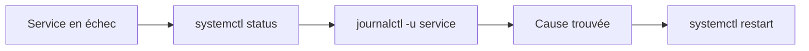

Une application ne répond plus. Avant de redémarrer au hasard, il faut répondre à trois questions : tourne-t-elle encore ? Qui la pilote ? Que dit-elle dans ses journaux ? Cette leçon te donne les outils pour y répondre.

## Processus

Un **processus** est un programme en cours d'exécution, identifié par un numéro, le **PID** (*process identifier*). Un navigateur ouvert, un serveur web et même ton terminal sont chacun un ou plusieurs processus.

```bash
ps aux | head
top
kill 4242
kill -9 4242
```

- `ps aux` liste tous les processus (`a` et `x` : ceux de tout le monde, même sans terminal ; `u` : un affichage détaillé). Chaque ligne donne le PID, la personne propriétaire, la consommation de CPU et de mémoire.
- `| head` (le tube, vu en détail dans la leçon suivante) ne garde que les dix premières lignes de la liste.
- `top` affiche l'activité en direct (quitte avec `q`).
- `kill 4242` demande poliment au processus 4242 de s'arrêter (signal `SIGTERM`).
- `kill -9 4242` l'arrête de force (`SIGKILL`), sans lui laisser le temps de se terminer proprement.

:::warning kill -9 en dernier recours
Un processus tué avec `-9` ne ferme pas ses fichiers ni ses connexions : tu risques de laisser des données à moitié écrites. Essaie d'abord `kill` tout court, attends quelques secondes, puis seulement force.
:::

## Services avec systemd

Sur la plupart des serveurs Linux, les programmes de fond (serveur web, base de données…) sont des **services** : des processus lancés au démarrage de la machine, sans fenêtre, et gérés par `systemd`, le programme qui démarre et surveille tous les services. On les pilote avec `systemctl`.

```bash
systemctl status nginx
sudo systemctl restart nginx
sudo systemctl enable nginx
systemctl is-active nginx
```

| Commande | Effet |
| --- | --- |
| `status` | État actuel et dernières lignes de journal |
| `start` / `stop` | Démarre / arrête maintenant |
| `restart` | Arrête puis redémarre |
| `enable` | Lance le service automatiquement au démarrage de la machine |
| `is-active` | Répond `active` ou `inactive` |

`start` n'agit que maintenant, `enable` que pour les prochains démarrages : ce sont deux choses différentes.

## Journaux avec journalctl

`systemd` centralise les journaux de tous les services.

```bash
journalctl -u nginx
journalctl -u nginx -n 50
journalctl -u nginx -f
journalctl -u nginx --since "1 hour ago"
journalctl -p err -b
```

1. `-u nginx` ne montre que le service `nginx`.
2. `-n 50` limite aux 50 dernières lignes.
3. `-f` suit les nouvelles lignes en direct (comme `tail -f`).
4. `--since` filtre par date.
5. `-p err -b` ne garde que les erreurs depuis le dernier démarrage de la machine.



:::info Et dans un conteneur ?
Un conteneur Docker n'a en général pas `systemd` : le processus principal écrit sur sa sortie, et on lit ses journaux avec `docker logs`. La démarche reste la même : l'état d'abord, les journaux ensuite, le redémarrage en dernier.
:::

:::info Dans le labo
Le terminal du labo est un conteneur : il n'a **pas** `systemd` ni `journalctl`. Tu vas t'entraîner sur ce qui existe partout : lancer un processus en arrière-plan avec `&`, le retrouver avec `ps`, l'arrêter avec `kill` et lire son journal, qui est un simple fichier.
:::

## Entraîne-toi

:::labo
moteur: reel
intro: |
  Dans ton dossier de travail, deux petits scripts jouent le rôle de services : `demo.sh`, un service sage qui écrit une ligne dans son journal toutes les 5 secondes, et `tetu.sh`, un service têtu. Pour lancer un script en arrière-plan (ton terminal reste libre), ajoute `&` à la fin de la ligne : `bash demo.sh service.log &` (`bash` lance le script, `service.log` est le nom du journal dans lequel il écrit).
commandes:
  - cp -R /opt/exercices/03-processus/. .
etapes:
  - texte: 'Démarre `demo.sh` en arrière-plan, avec `service.log` comme journal : `bash demo.sh service.log &`'
    indice: 'N''oublie pas le `&` final : sans lui, le script garde ton terminal occupé. Contrôle avec `ps aux | grep demo`.'
    verif:
      - commande-reussit: 'sleep 1; pgrep -f "[d]emo\.sh service\.log"'
      - fichier-contient-dans-env: [service.log, 'le service demo répond']
    solution:
      - bash demo.sh service.log > /dev/null 2>&1 &
  - texte: 'Lis son journal avec `cat service.log`, trouve le PID du service avec `ps aux` (ou `pgrep -f demo`), puis arrête-le **proprement**, sans l''option `-9`'
    indice: '`kill PID` envoie SIGTERM. Ce service sait alors noter « arrêt propre » dans son journal : relis `service.log` après.'
    apres: [1]
    verif:
      - commande-reussit: 'tail -n 1 service.log | grep -q "arrêt propre du service demo"'
      - commande-reussit: 'grep -q "le service demo répond" service.log'
      - commande-echoue: 'pgrep -f "[d]emo"'
    solution:
      - cat service.log
      - kill $(pgrep -f "[d]emo")
  - texte: 'Redémarre le service, mais avec un nouveau journal `service2.log`'
    indice: 'Même commande que pour l''étape 1, avec un autre nom de journal.'
    apres: [2]
    verif:
      - fichier-contient-dans-env: [service2.log, 'le service demo répond']
      - commande-reussit: 'pgrep -f "[d]emo\.sh service2\.log"'
    solution:
      - bash demo.sh service2.log > /dev/null 2>&1 &
  - texte: 'Démarre maintenant le service têtu en arrière-plan : `bash tetu.sh &`. Quand il démarre, il crée le fichier `tetu-demarre.txt`'
    indice: 'Pour le retrouver : `ps aux | grep tetu`.'
    verif:
      - fichier-contient-dans-env: [tetu-demarre.txt, '^tetu est démarré']
      - commande-reussit: 'sleep 1; pgrep -f "[t]etu\.sh"'
    solution:
      - bash tetu.sh > /dev/null 2>&1 &
  - texte: 'Arrête `tetu.sh`. Essaie d''abord `kill PID` : il l''ignore. Il ne reste plus qu''à le forcer, en dernier recours'
    indice: '`kill -9 PID` envoie SIGKILL, que le processus ne peut pas ignorer. Vérifie avec `ps aux | grep tetu` qu''il a disparu.'
    apres: [4]
    verif:
      - fichier-contient-dans-env: [tetu-demarre.txt, 'SIGTERM reçu et ignoré']
      - commande-echoue: 'pgrep -f "[t]etu"'
    solution:
      - kill $(pgrep -f "[t]etu")
      - sleep 1
      - kill -9 $(pgrep -f "[t]etu")
:::

## Vérifie tes acquis

:::quiz
Quelle commande suit en direct les journaux du service `nginx` ?

- [ ] `systemctl status nginx -f`
- [x] `journalctl -u nginx -f`
- [ ] `ps aux nginx`

> `journalctl -u` filtre par service et `-f` suit les nouvelles lignes. `systemctl status` n'affiche que les dernières.
:::

:::quiz
Quelle différence entre `systemctl start` et `systemctl enable` ?

- [ ] Aucune, ce sont deux noms de la même action
- [ ] `start` est réservé à `root`, pas `enable`
- [x] `start` lance le service maintenant, `enable` le lance à chaque démarrage de la machine

> On combine souvent les deux. `systemctl enable --now` fait les deux d'un coup.
:::

:::quiz
Que fait `kill 4242` sans option ?

- [x] Envoie `SIGTERM` : le processus 4242 est invité à se terminer proprement
- [ ] Supprime le programme du disque
- [ ] Arrête immédiatement et sans condition le processus

> `SIGKILL` (`-9`) force l'arrêt, `SIGTERM` laisse au processus le temps de se fermer correctement.
:::

:::quiz
Un service est en échec. Quel est le meilleur premier réflexe ?

- [ ] Redémarrer la machine entière
- [ ] Le redémarrer en boucle jusqu'à ce que ça marche
- [x] Lire `systemctl status` puis ses journaux avec `journalctl -u`

> Redémarrer sans lire le message d'erreur masque la cause et elle reviendra.
:::
