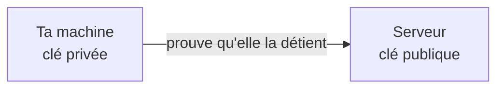

Les serveurs ne sont pas sur ton bureau : tu les atteins à travers le réseau. SSH (*Secure Shell*) ouvre un terminal sur une machine **distante** (une autre machine que la tienne, un serveur) avec un canal **chiffré** : personne sur le réseau ne peut lire ce que tu tapes. C'est l'outil de base de toute personne qui administre des serveurs Linux.

## Se connecter

```bash
ssh alice@serveur.example.org
ssh -p 2222 alice@serveur.example.org
exit
```

1. `ssh utilisateur@machine` ouvre une **session** (un échange du début à la fin de ta connexion) sur la machine `machine`, au nom du compte `utilisateur`, avec un mot de passe ou une clé.
2. `-p 2222` précise le **port** (le « numéro de porte » sur lequel le serveur écoute) quand ce n'est pas le port par défaut, `22`.
3. `exit` (ou Ctrl+D) ferme la session et te ramène sur ta machine.

À la première connexion, SSH affiche l'**empreinte** du serveur et te demande de la confirmer. Elle est ensuite mémorisée dans `~/.ssh/known_hosts`. Si elle change un jour, SSH te prévient : c'est soit une réinstallation du serveur, soit une tentative d'usurpation. Vérifie avant de continuer.

## Les clés plutôt que les mots de passe

Une **paire de clés** est composée d'une clé **privée**, qui ne quitte jamais ta machine, et d'une clé **publique**, que tu déposes sur les serveurs.

```bash
ssh-keygen -t ed25519 -C "alice@exemple"
ssh-copy-id alice@serveur.example.org
ssh alice@serveur.example.org
```

- `ssh-keygen` (*key generator*) fabrique la paire de clés ; `-t ed25519` choisit l'algorithme (un standard moderne) et `-C "alice@exemple"` ajoute un commentaire pour reconnaître la clé. Elle crée les fichiers `~/.ssh/id_ed25519` (privée) et `~/.ssh/id_ed25519.pub` (publique). Choisis une phrase de passe (un mot de passe qui protège ta clé) quand elle te la demande.
- `ssh-copy-id` ajoute la clé publique dans `~/.ssh/authorized_keys` du serveur.
- La connexion suivante se fait sans mot de passe de compte.



:::danger Ne partage jamais ta clé privée
Seule la clé publique (`.pub`) se donne, s'envoie ou se colle dans un formulaire. Une clé privée copiée, envoyée par messagerie ou ajoutée à un dépôt Git donne ton accès à qui la lit. Si cela arrive, retire la clé publique correspondante des serveurs et crées-en une nouvelle.
:::

## Copier des fichiers et se simplifier la vie

```bash
scp rapport.pdf alice@serveur.example.org:/tmp/
scp alice@serveur.example.org:/var/log/app.log .
```

`scp source destination` copie par SSH. Le côté distant s'écrit `utilisateur@machine:chemin`. Dans le second exemple, le `.` signifie « dans le dossier courant ».

Pour ne pas retaper les options, déclare un raccourci dans `~/.ssh/config`.

```text
Host demo-dev
    HostName serveur.example.org
    User alice
    Port 2222
    IdentityFile ~/.ssh/id_ed25519
```

Tu te connectes alors avec `ssh demo-dev`, et `scp` utilise le même raccourci.

:::tip Les droits comptent aussi ici
SSH refuse une clé privée lisible par d'autres personnes : `chmod 600 ~/.ssh/id_ed25519` règle le problème, et `chmod 700 ~/.ssh` protège le dossier. Tu retrouves les droits de la leçon précédente.
:::

:::info Dans le labo
Le terminal du labo n'a pas de réseau : tu ne peux pas te connecter à un vrai serveur. Tu fabriques en revanche de vraies clés, un vrai fichier de configuration, et SSH sait relire cette configuration sans se connecter (`ssh -G demo-dev`). Les clés du labo disparaissent à l'arrêt de l'environnement. Pour l'exercice, **laisse la phrase de passe vide** (`-N ""`) ; pour une vraie clé, choisis-en toujours une.
:::

## Entraîne-toi

:::lab
engine: real
intro: |
  Tu prépares tout ce qu'il faut pour te connecter à un serveur imaginaire, `serveur.example.org`, sans réellement t'y connecter. Les clés se rangent dans le dossier caché `~/.ssh`, que `ssh-keygen` crée au besoin. `~` désigne ton dossier personnel.
commands:
  - cp -R /opt/exercices/06-ssh/. .
steps:
  - text: 'Crée une paire de clés ed25519 dans les fichiers par défaut `~/.ssh/id_ed25519` (privée) et `~/.ssh/id_ed25519.pub` (publique), avec une phrase de passe vide'
    hint: '`ssh-keygen -t ed25519 -f ~/.ssh/id_ed25519 -N ""` : `-f` donne le fichier de la clé privée, `-N` la phrase de passe (ici vide).'
    checks:
      - command-succeeds: 'grep -q "^ssh-ed25519 " "$HOME/.ssh/id_ed25519.pub" && test "$(ssh-keygen -y -f "$HOME/.ssh/id_ed25519" < /dev/null | cut -d" " -f1,2)" = "$(cut -d" " -f1,2 "$HOME/.ssh/id_ed25519.pub")"'
    solution:
      - ssh-keygen -t ed25519 -f ~/.ssh/id_ed25519 -N ""
  - text: 'Écris l''empreinte de ta clé publique dans `empreinte.txt` (à la racine de ton dossier de travail)'
    hint: '`ssh-keygen -lf ~/.ssh/id_ed25519.pub > empreinte.txt` : `-l` affiche l''empreinte du fichier donné avec `-f`.'
    after: [1]
    checks:
      - command-succeeds: 'ssh-keygen -lf "$HOME/.ssh/id_ed25519.pub" | cmp -s - empreinte.txt'
    solution:
      - ssh-keygen -lf ~/.ssh/id_ed25519.pub > empreinte.txt
  - text: 'Autorise ta propre clé publique, comme le ferait `ssh-copy-id` sur un serveur : ajoute-la à `~/.ssh/authorized_keys`, et donne à ce fichier les droits `600`'
    hint: '`cat ~/.ssh/id_ed25519.pub >> ~/.ssh/authorized_keys` (`>>` ajoute à la fin), puis `chmod 600 ~/.ssh/authorized_keys`.'
    after: [1]
    checks:
      - command-succeeds: 'grep -qxF "$(cat "$HOME/.ssh/id_ed25519.pub")" "$HOME/.ssh/authorized_keys"'
      - output-contains: ['stat -c %a "$HOME/.ssh/authorized_keys"', '^600$']
    solution:
      - cat ~/.ssh/id_ed25519.pub >> ~/.ssh/authorized_keys
      - chmod 600 ~/.ssh/authorized_keys
  - text: 'Le fichier `fausse-cle` imite une clé privée mais il est lisible par tout le monde, ce que SSH refuserait. Donne-lui les droits `600`'
    hint: 'Tu as vu cela dans la leçon précédente : `chmod 600 fausse-cle`, puis `ls -l fausse-cle` pour contrôler (`-rw-------`).'
    checks:
      - output-contains: ['stat -c %a fausse-cle', '^600$']
    solution:
      - chmod 600 fausse-cle
  - text: 'Crée `~/.ssh/config` avec un raccourci `demo-dev` : machine `serveur.example.org`, utilisateur `alice`, port `2222`'
    hint: 'Reprends le bloc `Host demo-dev` de la leçon (les lignes suivantes sont décalées de quatre espaces). Vérifie avec `ssh -G demo-dev`, qui affiche la configuration retenue sans se connecter.'
    checks:
      - output-contains: ['ssh -G demo-dev', '^hostname serveur\.example\.org$']
      - output-contains: ['ssh -G demo-dev', '^user alice$']
      - output-contains: ['ssh -G demo-dev', '^port 2222$']
    solution:
      - |-
        mkdir -p ~/.ssh && cat > ~/.ssh/config <<'EOF'
        Host demo-dev
            HostName serveur.example.org
            User alice
            Port 2222
        EOF
:::

## Vérifie tes acquis

:::quiz
Quel fichier ne doit jamais quitter ta machine ?

- [ ] `~/.ssh/id_ed25519.pub`
- [ ] `~/.ssh/known_hosts`
- [x] `~/.ssh/id_ed25519`

> C'est la clé privée. La clé publique (`.pub`) est faite pour être déposée sur les serveurs.
:::

:::quiz
Quelle commande ouvre une session sur le port 2222 ?

- [x] `ssh -p 2222 alice@serveur.example.org`
- [ ] `ssh alice@serveur.example.org --port=22`
- [ ] `ssh alice@serveur.example.org:2222`

> L'option `-p` précise le port pour `ssh`. Attention, `scp` utilise `-P` en majuscule.
:::

:::quiz
Que fait `ssh-copy-id alice@serveur.example.org` ?

- [ ] Copie ta clé privée sur le serveur
- [ ] Copie un fichier du serveur vers ton poste
- [x] Ajoute ta clé publique aux clés autorisées du serveur

> La clé publique est inscrite dans `~/.ssh/authorized_keys` côté serveur, ce qui autorise les connexions sans mot de passe.
:::

:::quiz
SSH t'avertit que l'empreinte du serveur a changé. Que fais-tu ?

- [ ] Tu ignores l'alerte, c'est toujours sans danger
- [ ] Tu supprimes ta clé publique du serveur
- [x] Tu vérifies auprès de l'équipe si le serveur a été réinstallé avant de continuer

> Un changement d'empreinte peut être légitime, mais aussi le signe d'une usurpation. Mieux vaut vérifier.
:::
