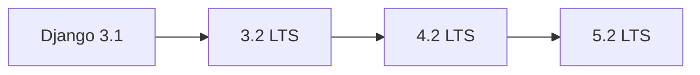

Imagine que tu hérites d'une voiture dont le carnet d'entretien s'arrête il y a cinq ans. Tu peux la garder telle quelle, mais le jour où une pièce lâche, il n'y en aura plus en rayon. Un logiciel vieillit de la même façon : les briques sur lesquelles il repose (les **dépendances**) cessent d'être corrigées, notamment pour les failles de sécurité. **Maintenir du code hérité**, c'est remettre ces briques à niveau sans casser ce qui fonctionne. Cette leçon explique pourquoi, puis comment regarder avant d'agir.

## À quoi ça sert, et pourquoi maintenant ?

Quelques mots de vocabulaire, que tu retrouveras dans tout le cours :

- Une **dépendance** est un morceau de code écrit par d'autres, que ton projet utilise (par exemple Django, qui gère le site web).
- Un **framework** est une dépendance qui impose la structure de tout le projet. Django et React en sont.
- Une **version** est un numéro (`3.1.13`) qui identifie un état précis d'une dépendance.
- Une **montée de version** consiste à remplacer une version par une plus récente.

Pourquoi s'y mettre ? Parce qu'une version qui n'est plus **maintenue** (plus aucun correctif de la part de ses auteurs) laisse les failles connues ouvertes. Et plus on attend, plus l'écart grandit et plus la montée est douloureuse. Plusieurs projets de l'équipe sont dans ce cas : PlanningAPI, l'API d'Adhésion, Planning.

## Faire l'état des lieux

Un projet « hérité » n'est pas forcément mauvais : il est simplement resté en arrière. Première étape, lister **ce qui est installé** et **ce qui le fait tourner**. Où lire ces informations ?

- Un **dépôt** est le dossier qui contient tout le code d'un projet, avec son historique géré par **Git** (l'outil qui garde la trace de chaque modification). Les fichiers ci-dessous se trouvent à la racine du dépôt.
- En Python, le fichier `requirements.txt` liste les dépendances, une par ligne, avec leur version **épinglée** : `Django==3.1.13` signifie « exactement la version 3.1.13 ». C'est **`pip`**, l'outil d'installation de Python, qui lit ce fichier et télécharge les paquets.
- En JavaScript, le fichier `package.json` joue ce rôle. Un `^16.13.1` signifie « 16.13.1 ou toute version 16.x plus récente ».
- Le `Dockerfile` est la « recette » qui décrit comment fabriquer l'**image** du projet. **Docker** est l'outil qui lance les projets dans des boîtes isolées (des **conteneurs**), et une image est le modèle figé, avec le système, le langage et le code, à partir duquel on lance un conteneur. La première ligne du `Dockerfile` indique l'image de base, donc la version du langage : `FROM python:3.8` veut dire « Python 3.8 ».

Voici ce que contiennent, aujourd'hui, les dépôts de l'équipe (relevé dans les fichiers au moment de la rédaction) :

| Projet | Fichier | Versions notables |
| --- | --- | --- |
| [PlanningAPI](https://gitlab.example.org/equipe/dev/planning/planning-api) | `requirements.txt`, `Dockerfile` | Django 3.1.1, Django REST framework 3.11.1, `python:3.8` |
| [API d'Adhésion](https://gitlab.example.org/equipe/adhesion/api) | `requirements.txt`, `Dockerfile` | Django 3.1.13, Django REST framework 3.12.1, `python:3.9-slim` |
| [Planning (front)](https://gitlab.example.org/equipe/dev/planning/planning-js) | `package.json` | React `^16.13.1`, `react-scripts` 3.4.3, `@material-ui/core` `^4.11.0` |
| [Connecteur Paiement](https://gitlab.example.org/equipe/dev/paiement-connector) | `requirements.txt` | Django 3.0.7, Django REST framework 3.11.0 |

Trois remarques sur ce relevé :

- **Le langage compte autant que le framework.** Chaque version de Django n'accepte qu'une plage de versions de Python. Monter Django peut donc obliger à changer l'image `python:3.8` du `Dockerfile`.
- **Les dépendances ne vieillissent pas toutes au même rythme.** Dans l'API d'Adhésion, des bibliothèques comme `Pillow` (11.3.0), `Requests` (2.32.3) ou `gunicorn` (22.0.0) sont récentes, alors que Django est resté en 3.1.13. Quelqu'un a donc corrigé des failles autour du noyau sans le toucher.
- **Une ligne peut être suspecte.** `requirements.txt` de PlanningAPI contient à la fois `django-rest-framework==0.1.0` et `djangorestframework==3.11.1`. Le vrai paquet est le second ; à ma connaissance le premier est un paquet sans rapport avec le framework (à vérifier sur PyPI, le site public où sont publiés les paquets Python et d'où `pip` les télécharge, avant de le retirer).

:::info Ce qui vient de l'équipe, ce qui vient d'ailleurs
Les versions du tableau sont lues dans les dépôts de l'équipe. Les règles sur Django, Python et React ci-dessous viennent de la documentation officielle et de connaissances générales : vérifie-les à chaque montée de version, elles évoluent.
:::

## Lire une politique de support

Une **politique de support** dit combien de temps une version reçoit des correctifs. Django publie une nouvelle version de fonctionnalités environ tous les huit mois (3.2, 4.0, 4.1, 4.2, 5.0…). Certaines sont **LTS** (*Long-Term Support*, « support à long terme ») : comme une édition « longue durée » d'un système, elles reçoivent des correctifs de sécurité beaucoup plus longtemps. À la date de rédaction, les LTS sont 3.2, 4.2 et 5.2. Les **notes de version** (*release notes*) sont la page où les auteurs listent, pour chaque version, ce qui est ajouté, déprécié et retiré : c'est ta première source quand tu prépares une montée. La page officielle « Download Django » donne les dates de fin de support à jour.

Retiens deux idées :

1. **Django 3.1 n'est plus maintenu depuis longtemps.** Un projet qui l'utilise ne reçoit plus de correctif de sécurité du framework : c'est la vraie raison de monter de version, pas le goût de la nouveauté.
2. **Django n'est pas en *semver*.** Le *semver* (versionnage sémantique) est la convention « `MAJEUR.MINEUR.CORRECTIF`, seule une version majeure casse la compatibilité ». Django ne la suit pas : passer de 3.1 à 3.2 est une « version de fonctionnalités » qui peut retirer des API. Le numéro de version majeure ne dit pas si ça va casser.

La règle de dépréciation de Django rend la montée prévisible. Une fonction **dépréciée** est une fonction « bientôt retirée » : elle marche encore, mais affiche un avertissement `RemovedInDjangoNNWarning` (NN indique la version qui la supprimera). Elle est **supprimée** deux versions plus tard. Les avertissements te donnent donc la liste des travaux avant qu'ils deviennent des erreurs. Python les cache par défaut : pour les voir, on lance le programme avec `python -W default` (la leçon 3 y revient en détail).

## Choisir un chemin par paliers

Comme on traverse une rivière en posant le pied sur des pierres, le chemin le plus sûr passe par les LTS intermédiaires. Un petit script Python l'illustre (il a été exécuté tel quel). Il ne touche à aucun projet : il calcule seulement la liste des paliers.

```python
VERSIONS = ["3.1", "3.2", "4.0", "4.1", "4.2", "5.0", "5.1", "5.2"]
LTS = {"3.2", "4.2", "5.2"}


def paliers(depart, arrivee):
    """Versions à traverser : les LTS intermédiaires, puis la cible."""
    debut = VERSIONS.index(depart) + 1
    fin = VERSIONS.index(arrivee) + 1
    return [v for v in VERSIONS[debut:fin] if v in LTS or v == arrivee]


print(" -> ".join(["3.1", *paliers("3.1", "5.2")]))
print(f"Versions de fonctionnalités entre les deux : {len(VERSIONS) - 1}")
```

Ligne à ligne :

- `VERSIONS` liste les versions de Django dans l'ordre de sortie, `LTS` celles qui sont à support long.
- `paliers(depart, arrivee)` prend les versions situées après `depart` et jusqu'à `arrivee`, et ne garde que les LTS et la cible finale.
- Les deux `print` affichent le chemin, puis le nombre de versions de fonctionnalités traversées (`len(VERSIONS) - 1`).

Voici la sortie :

```console
3.1 -> 3.2 -> 4.2 -> 5.2
Versions de fonctionnalités entre les deux : 7
```

Sept versions de fonctionnalités nous séparent de Django 5.2, mais seulement **trois paliers** à stabiliser. À chaque palier (une étape stable où l'on s'arrête) : les tests passent, la **CI** (intégration continue, le robot qui rejoue les tests à chaque modification ; une exécution complète s'appelle un *pipeline*) est verte, on fusionne. On ne démarre jamais le suivant sur une base cassée.



Pense aussi à Python : Django 5.2 demande au moins Python 3.10, alors que les `Dockerfile` de PlanningAPI et d'Adhésion partent de Python 3.8 et 3.9. Le changement d'image fait partie du dernier palier.

:::warning Ne saute pas les paliers
Passer directement de 3.1 à 5.2 supprime les avertissements intermédiaires : tu perds la liste des travaux et tu ne sais plus quelle version a cassé quoi.
:::

## Entraîne-toi

:::lab
engine: real
intro: |
  Tu viens d'hériter d'un projet : ses fichiers `requirements.txt`, `Dockerfile` et `package.json` sont dans ton dossier de travail, avec deux petits scripts (`demo_warn.py`, `paliers.py`). Tu fais l'état des lieux dans le terminal, sans rien modifier au projet. Quatre versions de Django sont installées côte à côte dans `/opt/venvs/` (`django31`, `django32`, `django42`, `django52`) : un *environnement virtuel* est un dossier qui contient un Python et ses paquets, isolés du reste. Les commandes fonctionnent hors ligne.
commands:
  - cp -R /opt/exercices/01-etat-des-lieux/. .
steps:
  - text: 'Écris dans un nouveau fichier `etat-des-lieux.txt` la ligne de `requirements.txt` qui épingle Django'
    hint: '`grep ''^Django'' requirements.txt > etat-des-lieux.txt` : `grep` garde les lignes qui commencent par « Django », et `>` écrit le résultat dans le fichier.'
    checks:
      - command-succeeds: '/opt/outils/verifier-legacy sortie --inchange etat-des-lieux.txt ligne-django'
    solution:
      - grep '^Django' requirements.txt > etat-des-lieux.txt

  - text: 'Ajoute à la fin de `etat-des-lieux.txt` la ligne `FROM` du `Dockerfile`, qui donne la version de Python'
    hint: '`grep ''^FROM'' Dockerfile >> etat-des-lieux.txt` : avec `>>`, la ligne est ajoutée à la fin au lieu d''écraser le fichier.'
    after: [1]
    checks:
      - command-succeeds: '/opt/outils/verifier-legacy sortie --inchange etat-des-lieux.txt ligne-from'
      - command-succeeds: '/opt/outils/verifier-legacy sortie etat-des-lieux.txt ligne-django'
    solution:
      - grep '^FROM' Dockerfile >> etat-des-lieux.txt

  - text: 'Repère la ligne suspecte de `requirements.txt` (le faux paquet `django-rest-framework`) et note-la, avec son numéro de ligne, dans `suspect.txt`'
    hint: '`grep -n ''django-rest-framework=='' requirements.txt > suspect.txt` : l''option `-n` ajoute le numéro de ligne devant chaque résultat.'
    checks:
      - command-succeeds: '/opt/outils/verifier-legacy sortie --inchange suspect.txt suspect'
    solution:
      - grep -n 'django-rest-framework==' requirements.txt > suspect.txt

  - text: 'Fais apparaître l''avertissement de dépréciation du script `demo_warn.py` avec Django 5.2, et garde-le dans `avertissements.txt`'
    hint: 'Lance le Python de l''environnement `django52` avec `-W default`, et redirige les messages d''erreur (les avertissements en font partie) avec `2>` : `/opt/venvs/django52/bin/python -W default demo_warn.py 2> avertissements.txt`.'
    checks:
      - command-succeeds: '/opt/outils/verifier-legacy sortie avertissements.txt avertissements'
    solution:
      - /opt/venvs/django52/bin/python -W default demo_warn.py 2> avertissements.txt

  - text: 'Calcule le chemin de montée de Django 3.1 vers 5.2 avec `paliers.py` et écris-le dans `chemin.txt`'
    hint: 'Le script prend la version de départ et la version d''arrivée : `python3 paliers.py 3.1 5.2 > chemin.txt`.'
    checks:
      - command-succeeds: '/opt/outils/verifier-legacy sortie chemin.txt chemin'
    solution:
      - python3 paliers.py 3.1 5.2 > chemin.txt

  - text: 'Demande à Django 5.2 quelle version de Python il exige, et écris la réponse dans `python-requis.txt`'
    hint: 'Les métadonnées d''un paquet installé disent quelle version de Python il accepte (champ `Requires-Python`). Lance `/opt/venvs/django52/bin/python -c "import importlib.metadata as m; print(m.metadata(''Django'')[''Requires-Python''])" > python-requis.txt`.'
    checks:
      - command-succeeds: '/opt/outils/verifier-legacy sortie python-requis.txt python-requis'
    solution:
      - |-
        /opt/venvs/django52/bin/python -c "import importlib.metadata as m; print(m.metadata('Django')['Requires-Python'])" > python-requis.txt
:::

## Vérifie tes acquis

:::quiz
Dans le `requirements.txt` de l'API d'Adhésion, `Django==3.1.13` côtoie `Pillow==11.3.0`. Que peut-on en déduire ?

- [ ] Que Django 3.1.13 est la dernière version disponible
- [ ] Que le projet est abandonné depuis la sortie de Django 3.1
- [x] Que certaines dépendances ont été mises à jour alors que le noyau est resté en retard
- [ ] Que `Pillow` n'a pas besoin de Python

> Les bibliothèques périphériques ont été patchées, mais le framework n'a pas suivi : le risque se concentre sur lui.
:::

:::quiz
Pourquoi Django est-il un cas particulier pour juger du risque d'une montée de version ?

- [x] Une « petite » montée (3.1 vers 3.2) peut retirer des API, car il n'utilise pas le *semver*
- [ ] Il casse toujours tout lors d'une montée de version
- [ ] Seules les versions majeures (3, 4, 5) peuvent casser quelque chose
- [ ] Il ne publie jamais de notes de version

> Dans Django, c'est la version de fonctionnalités (X.Y) qui compte, et les notes de version détaillent chaque retrait.
:::

:::quiz
Quel chemin est recommandé pour passer de Django 3.1 à 5.2 ?

- [ ] Changer le numéro dans `requirements.txt` et corriger au fil des erreurs
- [ ] Passer par chaque version de fonctionnalités sans exception, y compris 4.0 et 5.0
- [x] Stabiliser les LTS intermédiaires : 3.1 vers 3.2, puis 4.2, puis 5.2
- [ ] Réécrire le projet dans un autre framework

> Les LTS sont des paliers stables : on y fusionne, on y déploie, puis on repart.
:::

:::quiz
Que signifie un avertissement `RemovedInDjango60Warning` ?

- [ ] Que Django 6.0 est déjà installé
- [x] Qu'une fonction sera supprimée dans Django 6.0 : il faut la remplacer maintenant
- [ ] Qu'une migration a échoué
- [ ] Que Python est trop ancien

> Le nom de l'avertissement indique la version qui supprimera la fonction.
:::
