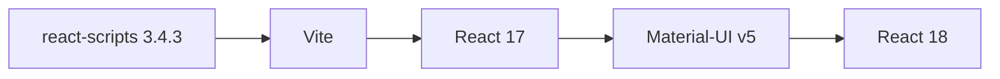

Planning, le front de l'outil de gestion d'événements de l'équipe, démarre avec `npm start` et se construit avec `npm run build`. Un jour, sur un ordinateur récent, ces commandes plantent avec une erreur de chiffrement incompréhensible. Le coupable n'est pas ton code : c'est l'outil qui le construit, devenu trop vieux.

## À quoi ça sert, et pourquoi maintenant ?

Quelques termes d'abord :

- **JavaScript** est le langage de programmation des pages web : il s'exécute dans le navigateur.
- **Node.js** est le programme qui permet d'exécuter du JavaScript en dehors d'un navigateur, par exemple sur ton ordinateur ou en CI. C'est lui qui fait tourner `npm` et les outils de construction.
- **React** est une bibliothèque JavaScript qui construit l'interface d'un site à partir de petits composants réutilisables (un bouton, un formulaire).
- **npm** est le gestionnaire de dépendances de JavaScript, livré avec Node.js. Il lit `package.json`, comme `pip` (l'outil d'installation de Python) lit `requirements.txt`.
- Un navigateur ne comprend pas directement le code React (qui contient du JSX, un mélange de JavaScript et de balises). Un **outil de construction** (*build tool*) le transforme en fichiers que le navigateur sait lire. C'est aussi lui qui sert la page pendant que tu développes.
- **Material-UI** (MUI) est une bibliothèque de composants graphiques prêts à l'emploi.

Dans le `package.json` de Planning (lu dans le dépôt), l'outil de construction est `react-scripts` en version `3.4.3`, fourni par **Create React App**. À ma connaissance, l'équipe de React a officiellement mis ce projet en fin de vie début 2025, et les versions anciennes de `react-scripts` ne fonctionnent pas bien avec les versions récentes de Node.js. Remplacer l'outil est donc la première étape, **avant** de monter React.

:::info Ce qui est vérifié ici
Les versions viennent du `package.json` de Planning. La migration vers Vite a été essayée sur un petit projet d'essai (React 18, Vite 6) : le build a réussi. L'application réelle de Planning, elle, n'a pas été migrée dans cette leçon.
:::

## Ce que contient le front aujourd'hui

Extrait du `package.json` de Planning :

```json
{
  "dependencies": {
    "@material-ui/core": "^4.11.0",
    "react": "^16.13.1",
    "react-dom": "^16.13.1",
    "react-router-dom": "5.2.0",
    "react-scripts": "3.4.3",
    "reactstrap": "^8.6.0"
  },
  "scripts": {
    "start": "react-scripts start",
    "build": "react-scripts build",
    "test": "react-scripts test"
  }
}
```

Chaque script est un raccourci : `npm start` lance `react-scripts start`, etc. Remplacer l'outil, c'est remplacer ces trois lignes, pas réécrire l'application.

## L'ordre des étapes

Comme pour Django, on avance par paliers qui restent chacun fonctionnels :



1. **Vite** remplace `react-scripts` : le code de l'application ne change presque pas.
2. **React 17**, puis **Material-UI v5** : la v4 de MUI accepte React 16 et 17, la v5 demande au moins React 17 (à confirmer dans le guide officiel de migration de MUI).
3. **React 18** en dernier, car il change la façon de démarrer l'application.

## Étape 1 : passer à Vite

**Vite** est un outil de construction moderne, beaucoup plus rapide. Voici les changements, testés sur un projet d'essai.

Le `package.json` perd `react-scripts` et gagne Vite :

```diff
 "scripts": {
-  "start": "react-scripts start",
-  "build": "react-scripts build",
-  "test": "react-scripts test"
+  "start": "vite",
+  "build": "vite build"
 },
+"devDependencies": {
+  "@vitejs/plugin-react": "^4.3.4",
+  "vite": "^6.0.0"
+}
```

Un fichier `vite.config.js` à la racine déclare le greffon React et garde le dossier de sortie `build`, comme avant :

```js
import { defineConfig } from "vite";
import react from "@vitejs/plugin-react";

export default defineConfig({
  plugins: [react()],
  build: { outDir: "build" },
});
```

Ensuite, trois différences à connaître :

- `index.html` passe **à la racine** du projet (et non dans `public/`) et charge le code lui-même : `<script type="module" src="/src/index.jsx"></script>`.
- Les fichiers qui contiennent du JSX portent l'extension `.jsx`.
- Les variables d'environnement s'appellent `VITE_…` (et non `REACT_APP_…`) et se lisent avec `import.meta.env.VITE_NOM`.

Le build se lance, puis se vérifie, avec :

```bash
npm install
npx vite build
```

```console
vite v6.4.3 building for production...
✓ 25 modules transformed.
build/index.html                  0.21 kB │ gzip:  0.18 kB
build/assets/index-C6H27Non.js  143.59 kB │ gzip: 46.09 kB
✓ built in 3.75s
```

Les tests, aujourd'hui lancés par `react-scripts test`, se confient à un autre outil (Vitest est le choix courant avec Vite) ; sans test, tu n'as pas de filet : reviens à la leçon précédente.

## Étapes suivantes : Material-UI et React 18

- **Material-UI v4 vers v5** : le paquet change de nom (`@material-ui/core` devient `@mui/material`, `@material-ui/icons` devient `@mui/icons-material`). La documentation officielle fournit des **codemods**, des scripts qui réécrivent automatiquement tes imports ; passe-les, puis relis le résultat (`git diff`).
- **React 17 vers 18** : la fonction de démarrage `ReactDOM.render` est remplacée par `createRoot`.
- **Réutilise le bon réflexe** : un palier, des tests, une **merge request** (la proposition de modification que l'équipe relit avant de la fusionner).

:::warning Deux bibliothèques d'interface dans le même projet
Planning dépend à la fois de Material-UI et de `reactstrap` (Bootstrap). Au moment de migrer, décide si tu gardes les deux : chaque bibliothèque en plus est une montée de version à faire.
:::

## Entraîne-toi

:::lab
engine: real
intro: |
  Les fichiers du front de Planning sont dans ton dossier de travail : `package.json`, `public/index.html` et le code dans `src/`. **Node.js n'est pas installé dans cet environnement** : tu ne lances donc ni `npm` ni `vite build`. Tu prépares la migration vers Vite en modifiant les fichiers, et le serveur vérifie leur contenu. Le vrai build se fait ensuite sur ton poste.
commands:
  - cp -R /opt/exercices/04-react/. .
steps:
  - text: 'Dans `package.json`, remplace les scripts `react-scripts` : `start` lance `vite`, `build` lance `vite build`, et le script `test` disparaît'
    hint: 'Édite le bloc `scripts` avec `nano package.json`. Il ne doit rester que `"start": "vite"` et `"build": "vite build"`.'
    checks:
      - command-succeeds: '/opt/outils/verifier-legacy react scripts'
    solution:
      - |-
        python3 - <<'PY'
        import json
        d = json.load(open("package.json"))
        d["scripts"] = {"start": "vite", "build": "vite build"}
        json.dump(d, open("package.json", "w"), indent=2)
        PY

  - text: 'Retire `react-scripts` des `dependencies` de `package.json`, puis ajoute `vite` et `@vitejs/plugin-react` dans un bloc `devDependencies`'
    hint: 'Les versions de la leçon : `"@vitejs/plugin-react": "^4.3.4"` et `"vite": "^6.0.0"`. Garde un JSON valide (virgules !).'
    checks:
      - command-succeeds: '/opt/outils/verifier-legacy react deps'
    solution:
      - |-
        python3 - <<'PY'
        import json
        d = json.load(open("package.json"))
        del d["dependencies"]["react-scripts"]
        d["devDependencies"] = {"@vitejs/plugin-react": "^4.3.4", "vite": "^6.0.0"}
        json.dump(d, open("package.json", "w"), indent=2)
        PY

  - text: 'Crée `vite.config.js` à la racine : il déclare le greffon React et garde `build` comme dossier de sortie'
    hint: 'Reprends le fichier de la leçon : `defineConfig`, `plugins: [react()]` et `build: { outDir: "build" }`.'
    checks:
      - command-succeeds: '/opt/outils/verifier-legacy react vite'
    solution:
      - write:
          vite.config.js: |
            import { defineConfig } from "vite";
            import react from "@vitejs/plugin-react";

            export default defineConfig({
              plugins: [react()],
              build: { outDir: "build" },
            });

  - text: 'Déplace `public/index.html` à la racine du projet et fais-lui charger `/src/index.jsx` avec une balise `<script type="module">`'
    hint: '`mv public/index.html index.html`, puis ajoute `<script type="module" src="/src/index.jsx"></script>` juste avant `</body>`.'
    checks:
      - command-succeeds: '/opt/outils/verifier-legacy react index-html'
    solution:
      - mv public/index.html index.html
      - |-
        sed -i 's#</body>#    <script type="module" src="/src/index.jsx"></script>\n  </body>#' index.html

  - text: 'Renomme `src/index.js` en `src/index.jsx` et `src/App.js` en `src/App.jsx`, puisqu''ils contiennent du JSX'
    hint: '`mv src/index.js src/index.jsx` et `mv src/App.js src/App.jsx`.'
    checks:
      - command-succeeds: '/opt/outils/verifier-legacy react renommage'
    solution:
      - mv src/index.js src/index.jsx
      - mv src/App.js src/App.jsx

  - text: 'Dans `src/App.jsx`, remplace la variable `process.env.REACT_APP_API_URL` par `import.meta.env.VITE_API_URL`'
    hint: 'Avec Vite, la variable s''appelle `VITE_API_URL` et se lit avec `import.meta.env`. Contrôle qu''il ne reste aucun `REACT_APP` : `grep -rn REACT_APP src`.'
    after: [5]
    checks:
      - command-succeeds: '/opt/outils/verifier-legacy react variable'
    solution:
      - sed -i 's/process.env.REACT_APP_API_URL/import.meta.env.VITE_API_URL/' src/App.jsx
:::

## Vérifie tes acquis

:::quiz
À quoi sert `react-scripts` dans Planning ?

- [ ] À stocker les données des utilisateurs
- [ ] À fournir les composants graphiques
- [x] À construire l'application et à la servir en développement
- [ ] À relier le front à l'API Django

> C'est l'outil de construction : il transforme le code React en fichiers lisibles par un navigateur.
:::

:::quiz
Pourquoi remplacer l'outil de construction avant de monter React ?

- [x] Pour qu'une seule chose change à la fois et que l'application reste fonctionnelle à chaque palier
- [ ] Parce que React 18 interdit `react-scripts` par licence
- [ ] Parce que Vite installe Material-UI
- [ ] Parce que ça évite d'écrire des tests

> Si l'outil est déjà à jour, une erreur après la montée de React ne peut venir que de React.
:::

:::quiz
Après migration vers Vite, comment lis-tu la variable `VITE_NOM_EVENT` dans le code ?

- [ ] `process.env.REACT_APP_NOM_EVENT`
- [ ] `window.VITE_NOM_EVENT`
- [ ] `require("VITE_NOM_EVENT")`
- [x] `import.meta.env.VITE_NOM_EVENT`

> Vite ne rend visibles au navigateur que les variables préfixées par `VITE_`.
:::

:::quiz
À quoi servent les codemods fournis pour passer de Material-UI v4 à v5 ?

- [ ] À installer Node.js
- [x] À réécrire automatiquement une partie du code (comme les imports), que tu dois ensuite relire
- [ ] À supprimer les tests devenus inutiles
- [ ] À mettre à jour la base de données

> Un codemod est un script de transformation de code : il fait le travail répétitif, pas la relecture.
:::
