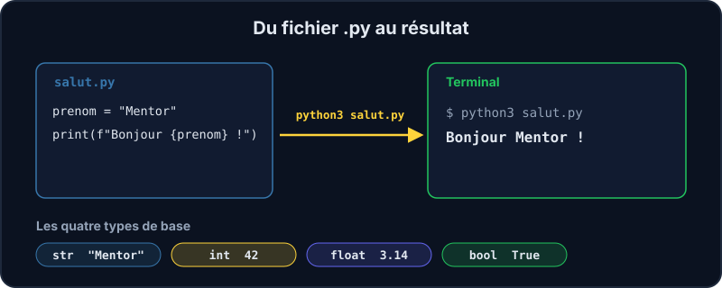

Presque tous les projets de l'équipe ont du Python quelque part : le portail des associations (Vitrine), l'API d'adhésion, les scripts de sauvegarde… Python est un langage **lisible** : on peut presque le lire comme de l'anglais. Dans ce parcours, tu l'apprends dans un **vrai terminal Linux** (un conteneur rien que pour toi), pas dans une simulation.

:::info Un vrai environnement
Clique sur **Démarrer l'environnement** dans le panneau « Labo ». Le serveur te prête un conteneur avec Python 3.13 et `pytest`, sans droits administrateur et **sans accès à Internet**. À l'arrêt, ton dossier de travail est **effacé** : tout ce que tu écris ici est un brouillon d'entraînement.
:::



## Deux façons de lancer Python

Le **mode interactif** (le REPL) exécute chaque ligne dès que tu la tapes : parfait pour essayer une idée.

```shell run
python3
```

Dans le REPL, tape par exemple `2 + 3`, puis `"mentor".upper()`, puis `exit()` pour en sortir. Si tu veux garder ton code, tu l'écris dans un **fichier** `.py` et tu le lances avec `python3` :

```shell run
echo 'print("Salut !")' > essai.py
python3 essai.py
```

:::tip nano, ton éditeur de terminal
Pour écrire un fichier à la main, utilise `nano mon_fichier.py`. Enregistre avec `Ctrl+O` puis `Entrée`, quitte avec `Ctrl+X`. Pour un éditeur complet, passe en mode « VS Code » dans le panneau (si ton portail le propose : la leçon s'affiche alors dans VS Code, avec ses boutons ▶) ou utilise ton propre VS Code (section « Utiliser ton propre VS Code »).
:::

## Variables et types

Une **variable** est un nom collé sur une valeur. Pas de déclaration : on écrit `nom = valeur`.

```python
prenom = "Ada"        # str : du texte
age = 36              # int : un entier
taille = 1.65         # float : un nombre à virgule
est_membre = True     # bool : vrai ou faux
```

| Type | Exemple | Pour quoi faire |
| --- | --- | --- |
| `str` | `"Mentor"` | du texte, entre guillemets simples ou doubles |
| `int` | `42` | compter, indexer |
| `float` | `3.14` | mesurer, calculer avec des décimales |
| `bool` | `True` | tester une condition |

La fonction `type()` te dit à quoi tu as affaire, et `print()` affiche une valeur :

```shell run
python3 -c "print(type(42), type('Mentor'), type(3.14))"
```

## Calculer

| Opérateur | Rôle | Avec 7 et 3 |
| --- | --- | --- |
| `+` `-` `*` | addition, soustraction, multiplication | `7 + 3` → `10` |
| `/` | division (toujours un `float`) | `7 / 3` → `2.333…` |
| `//` | division entière | `7 // 3` → `2` |
| `%` | reste de la division | `7 % 3` → `1` |
| `**` | puissance | `7 ** 3` → `343` |

## Les f-strings : mélanger texte et valeurs

Une **f-string** est une chaîne précédée de la lettre `f` : ce qui est entre accolades est remplacé par sa valeur.

```python
prenom = "Ada"
age = 36
print(f"Je m'appelle {prenom} et j'ai {age} ans")
```

:::warning Un piège classique
`"Age : " + 36` provoque une `TypeError` : on ne colle pas du texte et un nombre avec `+`. Utilise une f-string (`f"Age : {36}"`) ou convertis avec `str(36)`.
:::

## Lire un message d'erreur

Quand Python plante, il t'affiche une **trace** ; lis-la **de bas en haut** : la dernière ligne dit *ce qui* ne va pas, celle au-dessus *où*. Par exemple `NameError: name 'prenom' is not defined` veut dire que tu utilises une variable qui n'a pas été créée (souvent une faute de frappe).

## Entraîne-toi

:::lab
engine: real
intro: |
  Démarre ton environnement : les tests de la leçon (`test_premiers_pas.py`) sont déjà dans ton dossier de travail. Écris trois petits scripts, puis lance `pytest -q` pour les valider.
commands:
  - cp -R /opt/exercices/01-premiers-pas/. .
steps:
  - text: 'Crée `salut.py` qui affiche exactement `Bonjour Mentor !`'
    hint: 'Une seule ligne suffit : `print(...)` avec le texte entre guillemets. Lance ensuite `python3 salut.py` pour voir le résultat.'
    checks:
      - output-contains: ['python3 salut.py', '^Bonjour Mentor !$']
    solution:
      - |
        cat > salut.py <<'EOF'
        print("Bonjour Mentor !")
        EOF
  - text: 'Crée `profil.py` : deux variables (`prenom`, `age`) et une f-string qui affiche `Je m''appelle <prénom> et j''ai <âge> ans`'
    hint: 'Commence par `prenom = "Ada"` et `age = 36`, puis `print(f"...")` avec `{prenom}` et `{age}` dans le texte.'
    checks:
      - output-contains: ['python3 profil.py', "^Je m'appelle .+ et j'ai [0-9]+ ans$"]
    solution:
      - |
        cat > profil.py <<'EOF'
        prenom = "Ada"
        age = 36
        print(f"Je m'appelle {prenom} et j'ai {age} ans")
        EOF
  - text: 'Crée `calcul.py` qui affiche `7 // 3`, `7 % 3` et `7 ** 3`, un résultat par ligne'
    hint: 'Trois appels à `print()`. Tu peux mettre `7` et `3` dans les variables `a` et `b`.'
    checks:
      - output-contains: ['python3 calcul.py', '^2\n1\n343$']
    solution:
      - |
        cat > calcul.py <<'EOF'
        a = 7
        b = 3
        print(a // b)  # division entière : 2
        print(a % b)   # reste : 1
        print(a ** b)  # puissance : 343
        EOF
  - text: 'Écris dans `types.txt` ce qu''affiche `type(3.14)` (avec `python3 -c` et une redirection `>`)'
    hint: 'Commande de la forme `python3 -c "print(...)" > types.txt`. Tu peux vérifier avec `cat types.txt`.'
    checks:
      - env-file-contains: [types.txt, 'float']
    solution:
      - python3 -c "print(type(3.14))" > types.txt

  - text: 'Lance les tests de la leçon avec `pytest -q` : ils doivent tous passer'
    hint: 'Si un test échoue, lis son message : il te dit ce qu''il attendait et ce qu''il a reçu.'
    after: [1, 2, 3]
    checks:
      - command-succeeds: 'pytest -q test_premiers_pas.py'
    solution:
      - pytest -q
:::

## Vérifie tes acquis

:::quiz
Quel est le type de la valeur `7 // 2` ?

- [ ] `float`, car c'est une division
- [x] `int`, car `//` est la division entière
- [ ] `str`, car il y a deux `/`
- [ ] Une erreur : on ne peut pas diviser deux entiers

> `//` retourne le quotient entier (`3`). Seul `/` retourne toujours un `float` (`3.5`).
:::

:::quiz
Que se passe-t-il avec `print("Age : " + 36)` ?

- [ ] Python affiche `Age : 36`
- [ ] Python affiche `Age : 36.0`
- [x] Python lève une `TypeError` : on ne peut pas additionner un texte et un entier
- [ ] Rien ne s'affiche, mais il n'y a pas d'erreur

> Il faut convertir (`str(36)`) ou utiliser une f-string : `print(f"Age : {36}")`.
:::

:::quiz
Dans quel ordre lis-tu une trace d'erreur Python ?

- [ ] De haut en bas : la première ligne contient la cause
- [x] La dernière ligne dit quelle erreur s'est produite, les lignes au-dessus disent où
- [ ] Il n'y a rien à lire : il faut relancer le script
- [ ] Seul le numéro de ligne compte

> Le type et le message de l'erreur sont à la fin (`NameError: ...`), les lignes précédentes remontent la pile des appels.
:::
