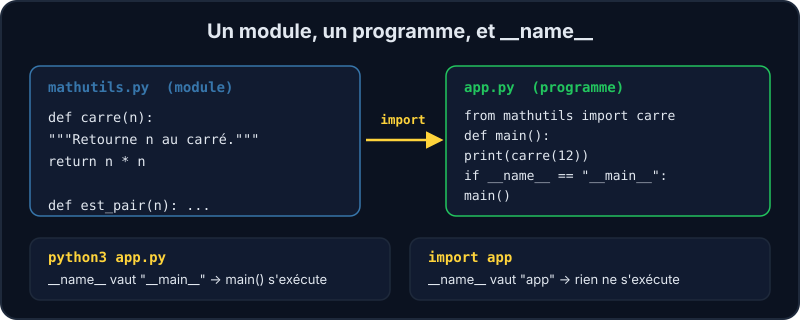

Quand le même bout de code apparaît trois fois dans un script, il est temps d'en faire une **fonction**. Quand tes fonctions deviennent nombreuses, tu les ranges dans un **module**, c'est-à-dire un simple fichier `.py` que d'autres fichiers peuvent importer. C'est ainsi que sont construits Vitrine et tous les projets Django.



## Définir une fonction

```python
def carre(n):
    """Retourne n au carré."""
    return n * n

resultat = carre(4)   # resultat vaut 16
```

- `def` introduit la fonction, suivie de son nom et de ses **paramètres** entre parenthèses.
- Le **corps** est **indenté** de 4 espaces : en Python, l'indentation fait partie de la syntaxe.
- `return` renvoie une valeur à celui qui appelle. Sans `return`, la fonction renvoie `None`.
- La phrase entre triples guillemets est la **docstring** : elle explique ce que fait la fonction, et `help(carre)` l'affiche.

:::tip Retourner ou afficher ?
`print()` écrit à l'écran, `return` donne une valeur au reste du programme. Une fonction qui calcule doit **retourner** : on peut alors l'afficher, la tester, la réutiliser. C'est aussi ce qui la rend testable avec `pytest`.
:::

## Paramètres par défaut et noms

```python
def saluer(prenom, politesse="Bonjour"):
    return f"{politesse} {prenom} !"

saluer("Ada")                      # « Bonjour Ada ! »
saluer("Ada", politesse="Salut")   # « Salut Ada ! »
```

Un paramètre avec une valeur par défaut devient optionnel. On peut nommer les arguments à l'appel : c'est plus lisible, surtout quand il y en a plusieurs.

## Importer un module

Dans ton dossier, `mathutils.py` est un module. Dans un autre fichier :

```python
from mathutils import carre      # importe une fonction précise
import mathutils                 # importe tout le module : mathutils.carre(3)
```

Python cherche le module dans le dossier du script puis dans les paquets installés. La bibliothèque standard fournit des dizaines de modules prêts à l'emploi (`math`, `json`, `pathlib`, `datetime`…).

## `if __name__ == "__main__":`

Quand tu **importes** un module, Python exécute son code. Si `mathutils.py` affichait quelque chose au niveau principal, ce texte apparaîtrait à chaque import ! La parade : réserver le « programme » à un bloc qui ne s'exécute que lorsque le fichier est lancé directement.

```python
def main():
    print(carre(12))

if __name__ == "__main__":
    main()
```

| Tu fais | `__name__` vaut | Le bloc `if` s'exécute |
| --- | --- | --- |
| `python3 app.py` | `"__main__"` | oui |
| `import app` (depuis un autre fichier) | `"app"` | non |

## Tester avec pytest

Un **test** est une fonction dont le nom commence par `test_` et qui contient des `assert`. `pytest` les trouve, les lance et te dit lesquels échouent. Écrire d'abord le test, puis le code qui le fait passer, c'est le **TDD** : les exercices de ce cours fonctionnent comme ça.

```shell run
pytest -q
```

:::info Lire la sortie de pytest
`.` = test réussi, `F` = test en échec. Pour chaque échec, pytest montre la ligne de l'`assert` et les valeurs comparées. Pour ne lancer qu'un test : `pytest -q -k carre`.
:::

## Entraîne-toi

:::lab
engine: real
intro: |
  Le module `mathutils.py` et ses tests (`test_mathutils.py`) sont dans ton dossier de travail. Les fonctions ne sont pas écrites : lance `pytest -q`, observe les échecs, puis corrige-les un par un.
commands:
  - cp -R /opt/exercices/02-fonctions-modules/. .
steps:
  - text: 'Écris `carre(n)` dans `mathutils.py` : le test `test_carre` doit passer'
    hint: 'Ouvre `mathutils.py` (avec `nano` ou VS Code), remplace la ligne `raise NotImplementedError(...)` par un `return`. Puis `pytest -q -k carre`.'
    checks:
      - command-succeeds: 'pytest -q test_mathutils.py -k "test_carre"'
    solution:
      - |
        cat > mathutils.py <<'EOF'
        """Petits outils mathématiques."""


        def carre(n):
            """Retourne n au carré."""
            return n * n


        def moyenne(valeurs):
            raise NotImplementedError("À toi de jouer : somme des valeurs divisée par leur nombre (et ajoute une docstring !)")


        def est_pair(n):
            """Retourne True si n est pair, False sinon."""
            raise NotImplementedError("À toi de jouer : regarde le reste de la division par 2")
        EOF
  - text: 'Écris `moyenne(valeurs)` avec **une docstring** : `test_moyenne` et `test_moyenne_documentee` doivent passer'
    hint: 'La moyenne est `sum(valeurs) / len(valeurs)`. La docstring est une phrase entre triples guillemets, juste sous la ligne `def`.'
    after: [1]
    checks:
      - command-succeeds: 'pytest -q test_mathutils.py -k moyenne'
      - env-file-contains: [mathutils.py, 'def moyenne\(valeurs\):\n\s+"""']
    solution:
      - |
        cat > mathutils.py <<'EOF'
        """Petits outils mathématiques."""


        def carre(n):
            """Retourne n au carré."""
            return n * n


        def moyenne(valeurs):
            """Retourne la moyenne arithmétique d'une liste de nombres."""
            return sum(valeurs) / len(valeurs)


        def est_pair(n):
            """Retourne True si n est pair, False sinon."""
            raise NotImplementedError("À toi de jouer : regarde le reste de la division par 2")
        EOF
  - text: 'Écris `est_pair(n)` : `test_est_pair` doit passer'
    hint: 'Un nombre est pair quand le reste de sa division par 2 vaut 0. L''expression `n % 2 == 0` est déjà un booléen.'
    after: [1]
    checks:
      - command-succeeds: 'pytest -q test_mathutils.py -k est_pair'
    solution:
      - |
        cat > mathutils.py <<'EOF'
        """Petits outils mathématiques."""


        def carre(n):
            """Retourne n au carré."""
            return n * n


        def moyenne(valeurs):
            """Retourne la moyenne arithmétique d'une liste de nombres."""
            return sum(valeurs) / len(valeurs)


        def est_pair(n):
            """Retourne True si n est pair, False sinon."""
            return n % 2 == 0
        EOF
  - text: 'Crée `app.py` qui **importe** `carre` depuis `mathutils` et affiche `144` quand on le lance, **sans** rien afficher quand on l''importe'
    hint: 'Mets l''appel à `print(carre(12))` dans une fonction `main()`, appelée sous `if __name__ == "__main__":`.'
    after: [1]
    checks:
      - output-contains: ['python3 app.py', '^144$']
      - command-succeeds: 'test -z "$(python3 -c ''import app'')"'
    solution:
      - |
        cat > app.py <<'EOF'
        """Petite application qui utilise mathutils."""

        from mathutils import carre


        def main():
            print(carre(12))


        if __name__ == "__main__":
            main()
        EOF
:::

## Vérifie tes acquis

:::quiz
Que retourne une fonction qui n'a pas d'instruction `return` ?

- [ ] `0`
- [ ] Une chaîne vide
- [x] `None`
- [ ] Elle provoque une erreur à l'appel

> En l'absence de `return`, Python renvoie la valeur spéciale `None`. C'est une erreur fréquente quand on affiche au lieu de retourner.
:::

:::quiz
À quoi sert `if __name__ == "__main__":` ?

- [ ] À importer le module `__main__`
- [x] À exécuter du code seulement quand le fichier est lancé directement, pas quand il est importé
- [ ] À empêcher d'importer le fichier
- [ ] À déclarer la fonction principale obligatoire

> Quand un autre fichier fait `import app`, `__name__` vaut `"app"` : le bloc est ignoré.
:::

:::quiz
Quelle ligne importe uniquement la fonction `carre` du module `mathutils` ?

- [ ] `import carre from mathutils`
- [x] `from mathutils import carre`
- [ ] `import mathutils.carre()`
- [ ] `use mathutils::carre`

> `from module import nom` importe un nom précis. `import module` importe le module entier (il faut alors écrire `module.nom`).
:::

:::quiz
Que fait `pytest` quand un `assert` est faux ?

- [ ] Il corrige automatiquement le code
- [ ] Il ignore le test et continue sans le signaler
- [x] Il marque le test en échec et affiche les valeurs comparées
- [ ] Il arrête immédiatement tous les tests suivants

> Chaque test est indépendant : un échec n'empêche pas les autres de s'exécuter, et le rapport indique ce qui diffère.
:::
