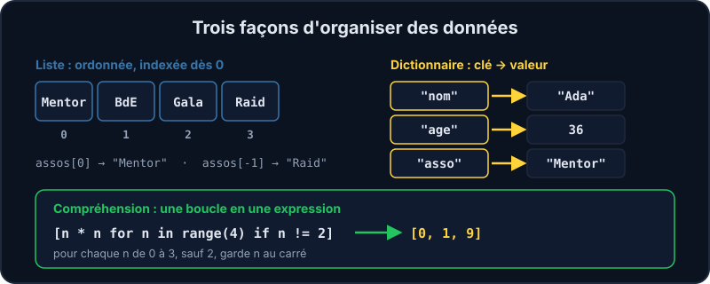

Un programme manipule rarement une seule valeur : il traite des **collections** (les adhérent·e·s d'une association, les lignes d'un fichier, les paramètres d'une application). Python en propose deux, que tu vas utiliser tous les jours : la **liste** et le **dictionnaire**.



## Les listes

Une liste est une suite **ordonnée** de valeurs, entre crochets. On y accède par la **position** (l'index), qui commence à **0**.

```python
assos = ["Mentor", "BdE", "Gala"]
assos[0]          # "Mentor"
assos[-1]         # "Gala" (le dernier)
assos.append("Raid")   # ajoute à la fin
len(assos)        # 4
```

| Besoin | Écriture |
| --- | --- |
| Ajouter à la fin | `ma_liste.append(x)` |
| Retirer le dernier | `ma_liste.pop()` |
| Savoir si `x` y est | `x in ma_liste` |
| Prendre un morceau | `ma_liste[1:3]` (index 1 et 2) |
| Trier | `sorted(ma_liste)` (retourne une nouvelle liste) |

## Les dictionnaires

Un dictionnaire associe une **clé** à une **valeur**, entre accolades. On l'interroge par la clé, pas par la position.

```python
membre = {"nom": "Ada", "age": 36}
membre["nom"]              # "Ada"
membre["asso"] = "Mentor"     # ajoute ou remplace
membre.get("ville", "?")   # "?" : valeur par défaut si la clé n'existe pas
```

:::warning KeyError
`membre["ville"]` plante avec une `KeyError` si la clé n'existe pas. Quand une clé peut manquer, utilise `membre.get("ville")`.
:::

## Les boucles

```python
for asso in assos:
    print(asso)

for numero, asso in enumerate(assos, start=1):
    print(f"{numero}. {asso}")

for cle, valeur in membre.items():
    print(cle, valeur)
```

`for ... in ...` répète le bloc indenté pour chaque élément. `enumerate` ajoute un compteur, `.items()` donne les paires clé-valeur d'un dictionnaire. Avec un `if` dans la boucle, on filtre :

```python
total = 0
for n in [1, 2, 3, 4, 10]:
    if n % 2 == 0:
        total += n     # total vaut 16
```

## Les compréhensions

Une **compréhension** construit une collection en une expression, à la place d'une boucle qui remplit une liste :

```python
noms = ["ada", "alan"]
majuscules = [nom.upper() for nom in noms]       # ["ADA", "ALAN"]
pairs = [n for n in range(10) if n % 2 == 0]     # [0, 2, 4, 6, 8]
inverse = {v: k for k, v in {"a": 1}.items()}    # {1: "a"}
```

:::tip Quand utiliser une compréhension ?
Quand elle tient lisiblement sur **une ligne** et qu'elle fait une seule chose (transformer ou filtrer). Dès que ça devient compliqué, reviens à une vraie boucle `for` : la lisibilité passe avant la concision.
:::

## Essayer dans le REPL

```shell run
python3 -c "print([n * n for n in range(1, 6)])"
python3 -c "print({'a': 1, 'b': 2}.items())"
```

## Entraîne-toi

:::lab
engine: real
intro: |
  `collections_exo.py` contient quatre fonctions à écrire, `test_collections_exo.py` les teste. Lance `pytest -q` après chaque modification pour voir ta progression.
commands:
  - cp -R /opt/exercices/03-collections-boucles/. .
steps:
  - text: 'Écris `compter_mots(texte)` : elle retourne un dictionnaire `{mot: nombre d''occurrences}`'
    hint: 'Parcours `texte.split()` avec une boucle `for` et utilise `compteur.get(mot, 0) + 1` pour incrémenter.'
    checks:
      - command-succeeds: 'pytest -q test_collections_exo.py -k compter_mots'
    solution:
      - |
        cat > collections_exo.py <<'EOF'
        """Listes, dictionnaires et boucles."""


        def compter_mots(texte):
            """Retourne un dictionnaire {mot: nombre d'occurrences}."""
            compteur = {}
            for mot in texte.split():
                compteur[mot] = compteur.get(mot, 0) + 1
            return compteur


        def en_majuscules(noms):
            """Retourne une nouvelle liste avec les noms en majuscules (avec une compréhension de liste)."""
            raise NotImplementedError("À toi de jouer : une compréhension de liste, comme dans la leçon")


        def somme_pairs(nombres):
            """Retourne la somme des nombres pairs de la liste."""
            raise NotImplementedError("À toi de jouer : une boucle avec un if, ou sum() sur une compréhension")


        def inverser(dictionnaire):
            """Retourne un dictionnaire où les valeurs deviennent les clés (et inversement)."""
            raise NotImplementedError("À toi de jouer : parcours dictionnaire.items()")
        EOF
  - text: 'Écris `en_majuscules(noms)` **avec une compréhension de liste**'
    hint: 'Forme générale : `[expression for nom in noms]`. Pour passer un texte en majuscules : `nom.upper()`.'
    after: [1]
    checks:
      - command-succeeds: 'pytest -q test_collections_exo.py -k en_majuscules'
    solution:
      - |
        cat > collections_exo.py <<'EOF'
        """Listes, dictionnaires et boucles."""


        def compter_mots(texte):
            """Retourne un dictionnaire {mot: nombre d'occurrences}."""
            compteur = {}
            for mot in texte.split():
                compteur[mot] = compteur.get(mot, 0) + 1
            return compteur


        def en_majuscules(noms):
            """Retourne une nouvelle liste avec les noms en majuscules."""
            return [nom.upper() for nom in noms]


        def somme_pairs(nombres):
            """Retourne la somme des nombres pairs de la liste."""
            raise NotImplementedError("À toi de jouer : une boucle avec un if, ou sum() sur une compréhension")


        def inverser(dictionnaire):
            """Retourne un dictionnaire où les valeurs deviennent les clés (et inversement)."""
            raise NotImplementedError("À toi de jouer : parcours dictionnaire.items()")
        EOF
  - text: 'Écris `somme_pairs(nombres)` : la somme des nombres pairs de la liste'
    hint: 'Une boucle avec un `if n % 2 == 0`, ou `sum(...)` sur une compréhension avec une condition.'
    after: [1]
    checks:
      - command-succeeds: 'pytest -q test_collections_exo.py -k somme_pairs'
    solution:
      - |
        cat > collections_exo.py <<'EOF'
        """Listes, dictionnaires et boucles."""


        def compter_mots(texte):
            """Retourne un dictionnaire {mot: nombre d'occurrences}."""
            compteur = {}
            for mot in texte.split():
                compteur[mot] = compteur.get(mot, 0) + 1
            return compteur


        def en_majuscules(noms):
            """Retourne une nouvelle liste avec les noms en majuscules."""
            return [nom.upper() for nom in noms]


        def somme_pairs(nombres):
            """Retourne la somme des nombres pairs de la liste."""
            return sum(n for n in nombres if n % 2 == 0)


        def inverser(dictionnaire):
            """Retourne un dictionnaire où les valeurs deviennent les clés (et inversement)."""
            raise NotImplementedError("À toi de jouer : parcours dictionnaire.items()")
        EOF
  - text: 'Écris `inverser(dictionnaire)` : les valeurs deviennent les clés'
    hint: 'Parcours `dictionnaire.items()` ; une compréhension de dictionnaire s''écrit `{cle: valeur for ... in ...}`.'
    after: [1]
    checks:
      - command-succeeds: 'pytest -q test_collections_exo.py -k inverser'
    solution:
      - |
        cat > collections_exo.py <<'EOF'
        """Listes, dictionnaires et boucles."""


        def compter_mots(texte):
            """Retourne un dictionnaire {mot: nombre d'occurrences}."""
            compteur = {}
            for mot in texte.split():
                compteur[mot] = compteur.get(mot, 0) + 1
            return compteur


        def en_majuscules(noms):
            """Retourne une nouvelle liste avec les noms en majuscules."""
            return [nom.upper() for nom in noms]


        def somme_pairs(nombres):
            """Retourne la somme des nombres pairs de la liste."""
            return sum(n for n in nombres if n % 2 == 0)


        def inverser(dictionnaire):
            """Retourne un dictionnaire où les valeurs deviennent les clés (et inversement)."""
            return {valeur: cle for cle, valeur in dictionnaire.items()}
        EOF
:::

## Vérifie tes acquis

:::quiz
Que vaut `ma_liste[-1]` ?

- [ ] Une erreur : un index ne peut pas être négatif
- [ ] Le premier élément
- [x] Le dernier élément
- [ ] L'élément à la position 1

> Les index négatifs comptent depuis la fin : `-1` est le dernier, `-2` l'avant-dernier.
:::

:::quiz
Comment obtenir `0` plutôt qu'une `KeyError` quand la clé `"age"` peut manquer dans le dictionnaire `d` ?

- [ ] `d["age"] or 0`
- [x] `d.get("age", 0)`
- [ ] `d.age`
- [ ] `d[age]`

> `get(cle, defaut)` retourne la valeur par défaut au lieu de lever une exception.
:::

:::quiz
Que contient `[n for n in range(6) if n % 2 == 0]` ?

- [ ] `[1, 3, 5]`
- [ ] `[0, 1, 2, 3, 4, 5]`
- [x] `[0, 2, 4]`
- [ ] `[2, 4, 6]`

> `range(6)` va de 0 à 5 ; la condition ne garde que les nombres pairs.
:::

:::quiz
Quelle boucle parcourt les clés **et** les valeurs d'un dictionnaire `d` ?

- [ ] `for cle in d.values():`
- [ ] `for cle, valeur in d:`
- [x] `for cle, valeur in d.items():`
- [ ] `for cle, valeur in enumerate(d.keys()):`

> `.items()` retourne les paires `(clé, valeur)`. Boucler directement sur `d` ne donne que les clés.
:::
