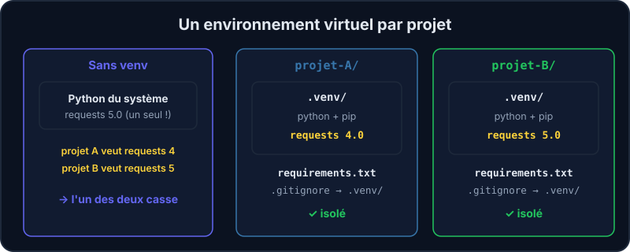

Imagine deux projets : l'un a besoin de la version 4 d'une bibliothèque, l'autre de la version 5. Si tout est installé « globalement » sur ta machine, l'un des deux va casser. La solution : un **environnement virtuel** (*virtual environment*, ou **venv**) par projet, c'est-à-dire un dossier qui contient *son propre* Python et *ses propres* paquets. C'est exactement ce que font Vitrine et les autres projets de l'équipe (avec `pipenv`, qui automatise la même idée).



## Créer et utiliser un venv

```shell run
python3 -m venv .venv
ls .venv/bin
```

`.venv/` contient un `python`, un `pip` et un dossier `lib/` pour les paquets du projet. Tu l'**actives** avec `source .venv/bin/activate` (dans ton environnement comme sur ton ordinateur) : le prompt change (`(.venv)`) et `python` désigne alors celui du venv (`deactivate` revient à la normale). Tu peux aussi appeler le Python du venv **sans l'activer** : `.venv/bin/python mon_script.py`, ce qui est très pratique dans des scripts. Bonne pratique pour `pip` : passe par le Python du venv, `python -m pip …` (ou `.venv/bin/python -m pip list` sans activer) : tu es sûr·e d'installer dans **ce** venv et pas ailleurs.

:::tip Pourquoi `.venv` ?
Le nom `.venv` est une convention : le point le rend caché, et la plupart des éditeurs (VS Code compris) le détectent tout seuls.
:::

## pip : installer des paquets

`pip` installe des bibliothèques depuis **PyPI**, le catalogue public de paquets Python :

```shell
pip install requests
pip install "django==5.2.*"
pip list
pip freeze > requirements.txt
```

| Commande | Effet |
| --- | --- |
| `pip install nom` | installe le paquet (et ses dépendances) dans le venv actif |
| `pip list` | liste ce qui est installé |
| `pip freeze` | liste les paquets **avec leurs versions exactes** |
| `pip install -r requirements.txt` | installe tout ce qui est listé dans le fichier |

:::warning Un environnement d'entraînement sans réseau
Pour des raisons de sécurité, **ton conteneur n'a aucun accès au réseau** : `pip install` y échoue, faute de pouvoir joindre PyPI. Tout le reste fonctionne comme sur ton ordinateur : `source .venv/bin/activate` (le prompt affiche `(.venv)`), `pip list`, `deactivate`. Ici, tu crées le venv, tu regardes ce qu'il contient et tu écris le `requirements.txt` à la main ; sur ton ordinateur, `pip install -r requirements.txt` fait le reste. Les paquets dont les exercices ont besoin (`pytest`) sont déjà installés dans l'image.
:::

## `requirements.txt` : la recette du projet

Ce fichier liste les dépendances, une par ligne, idéalement avec leur version :

```text
pytest==8.3.5
requests>=2.32
```

Quelqu'un qui récupère ton projet n'a qu'à créer un venv et lancer `pip install -r requirements.txt` pour retrouver **le même environnement** que toi. Sans ce fichier, on devine.

## Organiser un projet

```text
mon-projet/
├── README.md          ← à quoi ça sert, comment le lancer
├── requirements.txt   ← les dépendances
├── .gitignore         ← ce que Git ne doit pas suivre
├── src/               ← ton code
│   └── mon_projet/
└── tests/             ← les tests pytest
```

Le `.gitignore` indique à Git ce qu'il ne doit **jamais** commiter. Pour Python, au minimum : `.venv/` (énorme, et spécifique à ta machine) et `__pycache__/` (fichiers générés).

```text
.venv/
__pycache__/
*.pyc
```

:::info Dans les projets de l'équipe
Tu retrouveras ce schéma partout : `requirements.txt` ou `Pipfile` pour les dépendances, un dossier de tests, et des secrets (mots de passe, clés) dans un fichier `.env` **jamais** commité. Voir le parcours « Git basics » pour le `.gitignore`.
:::

## Entraîne-toi

:::lab
engine: real
intro: |
  Ton dossier de travail est vide : tu construis un petit projet de A à Z. Les commandes fonctionnent hors ligne.
steps:
  - text: 'Crée un environnement virtuel dans `.venv` avec `python3 -m venv .venv`'
    hint: 'Une seule commande, lancée dans ton dossier de travail. Vérifie ensuite avec `ls .venv/bin`.'
    checks:
      - env-file-exists: .venv/bin/python
    solution:
      - python3 -m venv .venv

  - text: 'Écris la liste des paquets du venv dans `paquets.txt` avec `.venv/bin/python -m pip list`'
    hint: 'Lance pip *par le Python du venv* : `.venv/bin/python -m pip list` (avec `-m pip`, tu es sûr·e d''utiliser le pip de CE venv ; après `source .venv/bin/activate`, `pip list` marche aussi). Redirige la sortie avec `>`.'
    after: [1]
    checks:
      - env-file-contains: [paquets.txt, '^pip ']
    solution:
      - .venv/bin/python -m pip list > paquets.txt

  - text: 'Crée `requirements.txt` avec une ligne `pytest==8.3.5`'
    hint: 'Un `echo "..." > requirements.txt` suffit. Le nom du paquet, deux signes `=`, puis la version.'
    checks:
      - env-file-contains: [requirements.txt, '^pytest==8\.3\.5$']
    solution:
      - echo "pytest==8.3.5" > requirements.txt

  - text: 'Crée l''arborescence du projet : les dossiers `src` et `tests`, et le fichier `README.md`'
    hint: '`mkdir -p src tests` crée les deux dossiers d''un coup, `touch README.md` crée le fichier vide.'
    checks:
      - env-file-exists: src
      - env-file-exists: tests
      - env-file-exists: README.md
    solution:
      - mkdir -p src tests
      - touch README.md

  - text: 'Crée un `.gitignore` qui exclut `.venv/` et `__pycache__/`'
    hint: 'Deux lignes dans le fichier. Tu peux utiliser `printf ".venv/\n__pycache__/\n" > .gitignore`.'
    after: [1]
    checks:
      - env-file-contains: [.gitignore, '^\.venv/$']
      - env-file-contains: [.gitignore, '^__pycache__/$']
    solution:
      - printf ".venv/\n__pycache__/\n" > .gitignore
:::

## Vérifie tes acquis

:::quiz
À quoi sert un environnement virtuel ?

- [ ] À accélérer l'exécution des programmes
- [x] À isoler les paquets d'un projet de ceux des autres projets et du système
- [ ] À faire tourner Python dans une machine virtuelle complète
- [ ] À chiffrer le code source

> Un venv est juste un dossier avec son propre Python et ses propres paquets : chaque projet a ses versions sans gêner les autres.
:::

:::quiz
Que contient un fichier `requirements.txt` ?

- [ ] Le code source du projet
- [x] La liste des paquets (et de leurs versions) dont le projet a besoin
- [ ] Les mots de passe de l'application
- [ ] Les tests à exécuter

> `pip install -r requirements.txt` reconstruit le même environnement sur une autre machine.
:::

:::quiz
Pourquoi ne faut-il **pas** commiter le dossier `.venv/` ?

- [ ] Parce que Git ne sait pas lire les fichiers Python
- [ ] Parce qu'il contient les mots de passe du projet
- [x] Parce qu'il est volumineux, spécifique à ta machine, et recréable avec `requirements.txt`
- [ ] Parce que GitLab refuse les dossiers cachés

> On versionne la recette (`requirements.txt`), pas le résultat. Le venv se recrée en une commande.
:::
