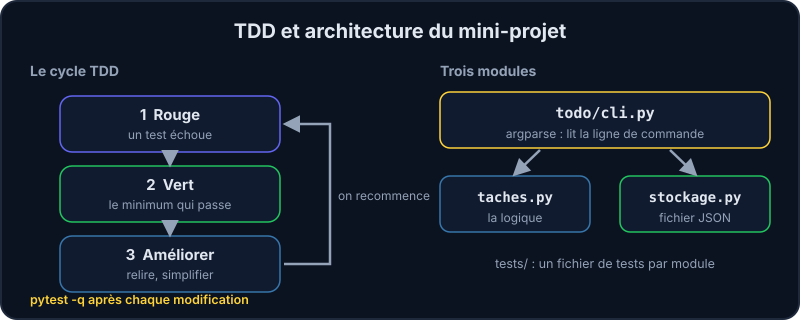

Dernière étape : tu construis un **vrai petit outil**. Il s'appelle `todo` et se pilote en ligne de commande :

```text
python3 -m todo ajouter "Écrire la doc"
python3 -m todo lister
python3 -m todo terminer 1
```

Les tests sont **déjà écrits** : ton travail est de faire passer chacun d'eux, étape par étape. C'est exactement la méthode TDD (*test-driven development*) que les équipes de l'équipe utilisent pour Vitrine.



## L'architecture : trois modules

On sépare ce qui change pour des raisons différentes :

| Module | Responsabilité | Dépend de |
| --- | --- | --- |
| `todo/taches.py` | la **logique** : ajouter, terminer, formater (aucune entrée/sortie) | rien |
| `todo/stockage.py` | **lire et écrire** le fichier JSON | `json` |
| `todo/cli.py` | l'**interface** : lire la ligne de commande, afficher | les deux autres |

Cette séparation rend la logique **facile à tester** : `taches.py` ne touche ni au disque ni à l'écran. C'est la même idée que « modèles / vues » dans Django.

## argparse : une interface en dix lignes

Le module `argparse` de la bibliothèque standard lit la ligne de commande, vérifie les arguments, et génère l'aide gratuitement :

```python
import argparse

parser = argparse.ArgumentParser(prog="todo")
parser.add_argument("--fichier", default="taches.json")
sous = parser.add_subparsers(dest="commande", required=True)
sous.add_parser("lister")
ajout = sous.add_parser("ajouter")
ajout.add_argument("texte")
args = parser.parse_args(["ajouter", "Pain"])
print(args.commande, args.texte)   # ajouter Pain
```

Une commande inconnue ou un argument manquant fait quitter le programme avec un message clair (`SystemExit`) : `argparse` s'occupe des erreurs d'usage.

## JSON : sauvegarder des données

Le format **JSON** représente listes, dictionnaires, textes et nombres dans un fichier lisible. Le module `json` fait la conversion :

```python
import json

with open("taches.json", "w", encoding="utf-8") as fichier:
    json.dump([{"texte": "Pain", "fait": False}], fichier, ensure_ascii=False, indent=2)
```

`ensure_ascii=False` garde les accents lisibles dans le fichier au lieu de les écrire `é`.

## Le cycle du TDD

1. **Rouge** : lance `pytest -q`, un test échoue. Lis le message.
2. **Vert** : écris le **minimum** de code qui le fait passer.
3. **Amélioration** : relis, simplifie, renomme, puis relance les tests.

:::tip Avance par petits pas
Ne cherche pas à tout écrire d'un coup. Un test à la fois, et un `pytest -q` après chaque modification : tu sais toujours que ton code marchait il y a trente secondes.
:::

```shell run
pytest -q
```

Le labo copie le projet dans ton dossier au démarrage : lance `pytest -q` tout de suite pour voir **tous** les tests échouer. C'est normal, c'est le point de départ.

## Entraîne-toi

:::lab
engine: real
intro: |
  Le projet est dans ton dossier de travail : `todo/` (le code à écrire) et `tests/` (déjà écrits). Les trois modules lèvent `NotImplementedError` : ton but est de faire passer chaque série de tests, jusqu'à un `pytest -q` entièrement vert.
commands:
  - cp -R /opt/exercices/06-mini-projet/. .
steps:
  - text: 'Écris la logique dans `todo/taches.py` : `ajouter`, `terminer` et `formater` (tests de `tests/test_taches.py`)'
    hint: 'Commence par `ajouter` : retourne une **nouvelle** liste (`taches + [...]`). Pour `terminer`, copie chaque dictionnaire avant de modifier le bon. `formater` utilise `enumerate(taches, start=1)`.'
    checks:
      - command-succeeds: 'pytest -q tests/test_taches.py'
    solution:
      - |
        cat > todo/taches.py <<'EOF'
        """Logique métier : une tâche est un dictionnaire {"texte": ..., "fait": False}."""


        def ajouter(taches, texte):
            """Retourne une NOUVELLE liste avec la tâche ajoutée à la fin."""
            return taches + [{"texte": texte, "fait": False}]


        def terminer(taches, numero):
            """Retourne une nouvelle liste où la tâche numéro `numero` (à partir de 1) est faite."""
            if not 1 <= numero <= len(taches):
                raise IndexError(f"la tâche {numero} n'existe pas")
            copie = [dict(tache) for tache in taches]
            copie[numero - 1]["fait"] = True
            return copie


        def formater(taches):
            """Retourne le texte à afficher, une ligne par tâche."""
            if not taches:
                return "Aucune tâche."
            lignes = []
            for numero, tache in enumerate(taches, start=1):
                case = "x" if tache["fait"] else " "
                lignes.append(f"{numero}. [{case}] {tache['texte']}")
            return "\n".join(lignes)
        EOF
  - text: 'Écris `todo/stockage.py` : `charger` (liste vide si le fichier n''existe pas) et `sauver` (JSON, accents lisibles)'
    hint: '`json.load` dans un `try` / `except FileNotFoundError`, et `json.dump(..., ensure_ascii=False, indent=2)` pour `sauver`. N''oublie pas `encoding="utf-8"`.'
    after: [1]
    checks:
      - command-succeeds: 'pytest -q tests/test_stockage.py'
    solution:
      - |
        cat > todo/stockage.py <<'EOF'
        """Lecture et écriture des tâches dans un fichier JSON."""

        import json


        def charger(chemin):
            """Retourne la liste des tâches du fichier JSON, ou [] si le fichier n'existe pas encore."""
            try:
                with open(chemin, encoding="utf-8") as fichier:
                    return json.load(fichier)
            except FileNotFoundError:
                return []


        def sauver(chemin, taches):
            """Écrit la liste des tâches dans le fichier JSON."""
            with open(chemin, "w", encoding="utf-8") as fichier:
                json.dump(taches, fichier, ensure_ascii=False, indent=2)
        EOF
  - text: 'Écris `todo/cli.py` : `construire_parser()` (option `--fichier`, sous-commandes `ajouter`, `lister`, `terminer`) et `main(argv)`'
    hint: 'Pars de l''exemple `argparse` de la leçon. `main` charge les tâches, appelle la bonne fonction de `taches.py`, sauvegarde ou affiche, et retourne `0` (ou `1` après avoir affiché l''erreur d''un numéro inconnu sur `stderr`).'
    after: [1, 2]
    checks:
      - command-succeeds: 'pytest -q tests/test_cli.py'
    solution:
      - |
        cat > todo/cli.py <<'EOF'
        """Interface en ligne de commande avec argparse."""

        import argparse
        import sys

        from todo import stockage, taches


        def construire_parser():
            """Retourne le parseur : option --fichier et sous-commandes ajouter, lister, terminer."""
            parser = argparse.ArgumentParser(prog="todo", description="Un petit gestionnaire de tâches.")
            parser.add_argument("--fichier", default="taches.json", help="fichier de sauvegarde (défaut : taches.json)")
            sous = parser.add_subparsers(dest="commande", required=True)
            sous.add_parser("lister", help="affiche les tâches")
            ajout = sous.add_parser("ajouter", help="ajoute une tâche")
            ajout.add_argument("texte")
            fin = sous.add_parser("terminer", help="marque une tâche comme faite")
            fin.add_argument("numero", type=int)
            return parser


        def main(argv=None):
            """Lit les arguments, appelle taches.py et stockage.py, affiche le résultat."""
            args = construire_parser().parse_args(argv)
            liste = stockage.charger(args.fichier)
            try:
                if args.commande == "ajouter":
                    stockage.sauver(args.fichier, taches.ajouter(liste, args.texte))
                elif args.commande == "terminer":
                    stockage.sauver(args.fichier, taches.terminer(liste, args.numero))
                else:
                    print(taches.formater(liste))
            except IndexError as erreur:
                print(f"Erreur : {erreur}", file=sys.stderr)
                return 1
            return 0
        EOF
  - text: 'Utilise ton outil : ajoute la tâche `Écrire la doc` avec `python3 -m todo ajouter "Écrire la doc"` (fichier `taches.json`)'
    hint: 'La commande est donnée dans l''introduction de la leçon. Vérifie le résultat avec `cat taches.json`.'
    after: [3]
    checks:
      - env-file-contains: [taches.json, 'Écrire la doc']
    solution:
      - python3 -m todo ajouter "Écrire la doc"

  - text: 'Marque-la comme faite avec `python3 -m todo terminer 1`, puis affiche la liste avec `python3 -m todo lister`'
    hint: 'Le numéro de la tâche est celui affiché par `lister`. Dans `taches.json`, la tâche passe à `"fait": true`.'
    after: [4]
    checks:
      - env-file-contains: [taches.json, '"fait": true']
      - output-contains: ['python3 -m todo lister', '^1\. \[x\] Écrire la doc$']
    solution:
      - python3 -m todo terminer 1
      - python3 -m todo lister

  - text: 'Lance toute la suite avec `pytest -q` : **tout doit être vert** !'
    hint: 'Si un test échoue, lis le message : il dit ce qui était attendu. Corrige le module concerné et relance `pytest -q`.'
    after: [3]
    checks:
      - command-succeeds: 'pytest -q'
    solution:
      - pytest -q
:::

## Et maintenant ?

Bravo : tu sais écrire, organiser, tester et lancer un programme Python. La suite logique est le parcours **Django**, le framework web des applications de l'équipe : tu y retrouveras les modules, les tests, les environnements virtuels et les `requirements.txt` de ce parcours.

## Vérifie tes acquis

:::quiz
Pourquoi la logique (`taches.py`) est-elle séparée de l'interface (`cli.py`) ?

- [ ] Parce que `argparse` l'exige
- [x] Pour pouvoir la tester sans lire le clavier ni écrire à l'écran, et la réutiliser ailleurs
- [ ] Pour que le programme s'exécute plus vite
- [ ] Parce que Python interdit d'écrire dans le même fichier

> Une fonction pure (qui retourne un résultat sans effet de bord) est triviale à tester. Les entrées/sorties restent à la périphérie.
:::

:::quiz
Que fait `argparse` si l'utilisateur tape une commande inconnue ?

- [ ] Il l'ignore et continue
- [x] Il affiche un message d'usage et quitte le programme
- [ ] Il crée la commande automatiquement
- [ ] Il lève une `KeyError` que tu dois rattraper

> `argparse` quitte avec un message d'erreur et le code 2 : tu n'as pas à écrire ces vérifications toi-même.
:::

:::quiz
Dans le cycle TDD, que fais-tu juste après avoir vu un test échouer ?

- [ ] Tu supprimes le test
- [ ] Tu réécris tout le programme
- [x] Tu écris le minimum de code pour le faire passer, puis tu relances les tests
- [ ] Tu attends que le test passe tout seul

> Rouge, vert, amélioration : on avance par petits pas, en gardant les tests verts.
:::

:::quiz
Pourquoi utiliser `ensure_ascii=False` avec `json.dump` ?

- [ ] Pour que le fichier soit plus petit
- [ ] Pour interdire les caractères spéciaux
- [x] Pour garder les accents lisibles dans le fichier au lieu de les échapper en `\uXXXX`
- [ ] Parce que JSON ne sait pas écrire de nombres sinon

> Sans lui, « Écrire » serait écrit `Écrire` : valide, mais illisible pour un humain qui ouvre le fichier.
:::
