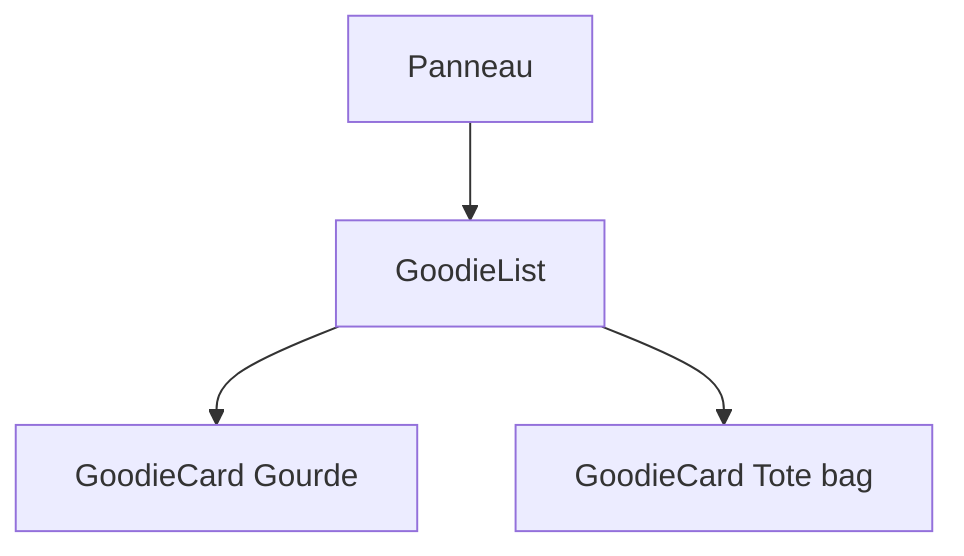

Imagine une boutique en ligne avec trente produits. Chaque produit a la même présentation : un nom, un prix, un stock. Si tu recopies trente fois le même bloc de HTML, le jour où tu veux changer la forme du prix, tu dois modifier trente endroits. **React** résout ce problème : tu écris la présentation **une seule fois**, et tu la réutilises avec des données différentes.

## À quoi ça sert, et pourquoi l'équipe l'utilise

**React** est une bibliothèque JavaScript pour construire des interfaces (ce que la personne voit et sur quoi elle clique). Son idée centrale : **l'écran est le résultat d'une fonction qui reçoit des données**. Tu décris « avec ces données, voilà à quoi ressemble la page », et React met la page à jour tout seul quand les données changent.

**Next.js** (que tu verras à partir de la leçon 4) est un cadre (*framework* : un ensemble d'outils et de règles qui organise tout un projet) construit sur React : il ajoute les pages, les URL et l'exécution côté serveur. [MiniShop](https://gitlab.example.org/equipe/minishop) et le front public d'[Adhésion](https://gitlab.example.org/equipe/adhesion/adhesion-front-public-next) sont écrits ainsi. Leurs `package.json` déclarent `next` et `react` (version 19).

:::info Un vrai environnement, sans navigateur
Dans cette leçon, tu ne te contentes pas de lire : un exercice t'attend à la fin. Il se déroule dans un petit ordinateur Linux que le serveur te prête (clique sur **Démarrer l'environnement** dans le panneau « Labo »). Il contient Node.js (de quoi exécuter du JavaScript), React et TypeScript, mais **pas de navigateur** et **pas d'accès à Internet**. À la place, des **tests** vérifient ton travail : un test est un petit programme qui affiche ton composant dans une page fictive, puis contrôle ce qu'on y voit. L'outil qui les lance s'appelle **Vitest**. Ton dossier de travail est effacé à l'arrêt de l'environnement : c'est un brouillon d'entraînement.
:::

## Un composant, c'est une fonction qui renvoie de l'affichage

Un **composant** est une fonction dont le nom commence par une majuscule et qui renvoie une description de ce qu'il faut afficher. Cette description s'écrit en **JSX** : une syntaxe qui ressemble à du HTML, écrite directement dans le code TypeScript. Les fichiers qui contiennent du JSX ont l'extension `.tsx`.

Voici un premier composant, dans un domaine fictif (des goodies d'association). Lis-le ligne à ligne.

```tsx
type Goodie = { id: number; nom: string; prixCents: number; stock: number };

function formatEur(cents: number): string {
  return new Intl.NumberFormat("fr-FR", { style: "currency", currency: "EUR" }).format(cents / 100);
}

function GoodieCard({ nom, prixCents, stock }: Readonly<Omit<Goodie, "id">>) {
  return (
    <article>
      <h3>{nom}</h3>
      <p>{formatEur(prixCents)}</p>
      {stock === 0 ? <p>Épuisé</p> : <p>{stock} en stock</p>}
    </article>
  );
}
```

- `type Goodie = …` : un type TypeScript (tu l'as vu dans le parcours TypeScript) qui décrit la forme d'un goodie. Le prix est en **centimes** pour éviter les erreurs d'arrondi des nombres à virgule.
- `formatEur` : une fonction ordinaire. `Intl.NumberFormat` est fournie par le navigateur et sait écrire `12,50 €` à la française. MiniShop a la même fonction dans `src/lib/cart-utils.ts`.
- `function GoodieCard(…)` : le composant. La majuscule est **obligatoire** : c'est comme ça que React distingue `<GoodieCard />` d'une balise HTML comme `<article>`.
- `{ nom, prixCents, stock }` : ce sont les **props** (*properties*), les « paramètres » du composant. React les transmet sous forme d'un seul objet, et on les **déstructure** tout de suite : on extrait chaque champ de l'objet dans une variable du même nom.
- `Readonly<Omit<Goodie, "id">>` : le type des props. `Omit` retire `id` (le composant n'en a pas besoin), `Readonly` interdit de modifier les props. MiniShop écrit ses props avec `Readonly<…>` partout, par exemple `Readonly<AddToCartButtonProps>`.
- `return ( … )` : la fonction renvoie le JSX. Les parenthèses permettent de l'écrire sur plusieurs lignes. Un composant renvoie **un seul** élément à la racine, ici l'`<article>`.
- `<h3>{nom}</h3>` : les accolades `{ }` ouvrent une parenthèse JavaScript dans le JSX. Tout ce qui est dedans est une **expression** : une variable, un appel de fonction, un calcul.
- `{stock === 0 ? … : …}` : une condition **ternaire**. Si le stock est nul, on affiche « Épuisé », sinon on affiche le stock.

Pour utiliser le composant, tu l'écris comme une balise, et tes props deviennent des attributs :

```tsx
<GoodieCard nom="Gourde Éco" prixCents={1250} stock={8} />
```

Une chaîne se met entre guillemets (`nom="…"`), tout le reste (nombre, variable, booléen) entre accolades (`prixCents={1250}`).

:::info Props en lecture seule
Un composant ne modifie **jamais** ses props. Elles descendent du parent vers l'enfant, dans un seul sens. Si une valeur doit changer au cours du temps, c'est de l'**état** : on en parle à la leçon suivante.
:::

## Afficher une liste : `map` et `key`

Pour afficher tous les goodies, on transforme un tableau de données en tableau de JSX avec `map` (la méthode de tableau qui construit un nouveau tableau en appliquant une fonction à chaque élément).

```tsx
function GoodieList({ goodies }: Readonly<{ goodies: Goodie[] }>) {
  if (goodies.length === 0) {
    return <p>Aucun goodie pour le moment.</p>;
  }
  return (
    <section>
      {goodies.map((g) => (
        <GoodieCard key={g.id} nom={g.nom} prixCents={g.prixCents} stock={g.stock} />
      ))}
    </section>
  );
}
```

- Le `if … return` du début traite le cas « liste vide » : un composant peut renvoyer un affichage différent selon la situation. La page d'accueil de MiniShop fait la même chose avec « Aucun produit pour le moment. ».
- `goodies.map((g) => (…))` produit une carte par goodie.
- `key={g.id}` est **obligatoire** dans une liste. La `key` est l'identifiant stable de l'élément : quand la liste change, React s'en sert pour savoir quelle carte a été ajoutée, retirée ou déplacée. Prends un identifiant de ta base de données (comme `product.id` dans MiniShop), pas la position dans le tableau.

:::warning N'utilise pas l'index comme `key`
`key={index}` supprime l'avertissement mais crée des bugs dès qu'on réordonne ou qu'on supprime un élément : React associe alors les mauvaises données aux mauvaises cartes. Utilise un identifiant propre à la donnée.
:::

## Emboîter des composants avec `children`

Un composant peut aussi recevoir **ce qu'on écrit entre ses balises**. Cette prop spéciale s'appelle `children` et a pour type `ReactNode` (« n'importe quoi que React sait afficher »).

```tsx
import type { ReactNode } from "react";

function Panneau({ titre, children }: Readonly<{ titre: string; children: ReactNode }>) {
  return (
    <div>
      <h2>{titre}</h2>
      {children}
    </div>
  );
}

<Panneau titre="Nos goodies">
  <GoodieList goodies={goodies} />
</Panneau>
```

Lis le composant ligne à ligne :

- `import type { ReactNode } from "react";` importe un **type** (il disparaît à l'exécution) depuis la bibliothèque React.
- `{ titre, children }` : on déstructure les deux props. `titre` est un texte ; `children` est ce qui est écrit entre `<Panneau …>` et `</Panneau>`.
- `<h2>{titre}</h2>` affiche le titre, puis `{children}` affiche le contenu fourni par le parent.
- En dessous, `<Panneau titre="Nos goodies"> … </Panneau>` utilise le composant : le `GoodieList` écrit à l'intérieur arrive dans `children`.

Le `Panneau` ne sait pas ce qu'il contient : il fournit le cadre, le parent fournit le contenu. C'est exactement le rôle des **layouts** de Next.js, que tu rencontreras à la leçon 4 : `ShopLayout` de MiniShop reçoit `children` et l'entoure d'une barre de navigation et d'un pied de page.



Une page React est donc un **arbre** de composants. Les données descendent par les props.

## Ce que ça donne

Si on donne ces composants à `renderToStaticMarkup` (la fonction de `react-dom/server` qui transforme un composant en texte HTML) avec deux goodies, on obtient ce HTML, remis en forme :

```console
<div>
  <h2>Nos goodies</h2>
  <section>
    <article><h3>Gourde Éco</h3><p>12,50 €</p><p>8 en stock</p></article>
    <article><h3>Tote bag</h3><p>6,00 €</p><p>Épuisé</p></article>
  </section>
</div>
```

Avec une liste vide, on obtient `<p>Aucun goodie pour le moment.</p>`.

## Entraîne-toi

:::labo
moteur: reel
intro: |
  Démarre ton environnement. Ton dossier de travail contient une petite boutique de goodies (les objets aux couleurs de l'association). Dans le dossier `src`, les fichiers `GoodieCard.tsx`, `GoodieList.tsx`, `Panneau.tsx` et `App.tsx` sont à écrire ou à corriger avec `nano` (un éditeur de texte qui s'ouvre dans le terminal : `Ctrl+O` puis `Entrée` enregistre, `Ctrl+X` quitte).

  Il n'y a pas de navigateur dans l'environnement. C'est un **test** (un petit programme qui vérifie ton travail) qui joue ce rôle : il affiche ton composant dans une page fictive et regarde ce qui s'y trouve. Pour valider une étape, le portail rejoue les tests d'origine sur une copie de ton dossier : modifier ou remplacer un test ne sert à rien, il faut faire passer celui d'origine. Trois commandes te serviront :

  - `npx vitest run GoodieCard` lance les tests dont le nom de fichier contient `GoodieCard` (`npx` lance un outil déjà installé, `vitest` est l'outil de test) ;
  - `npx tsc --noEmit` demande à TypeScript de vérifier les types de tout le projet, sans rien produire ;
  - `npx tsx src/afficher.tsx` affiche le HTML de la page, tel que le serveur l'enverrait.
commandes:
  - cp -R /opt/exercices/commun/. .
  - cp -R /opt/exercices/01-composants-props/. .
  - lier-outils
etapes:
  - texte: >-
      Ouvre `src/GoodieCard.tsx` et écris le composant `GoodieCard` : il reçoit les props `nom`, `prixCents` et `stock`, et renvoie un `<article>` avec le nom dans un `<h3>`, le prix mis en forme par `formatEur` dans un `<p>`, puis « Épuisé » si le stock est nul ou « N en stock » sinon. Vérifie avec `npx vitest run GoodieCard`.
    indice: >-
      Copie le composant de la leçon. Il faut importer `formatEur` et le type `Goodie` depuis `./goodies`, et écrire `{stock === 0 ? <p>Épuisé</p> : <p>{stock} en stock</p>}`.
    verif:
      - commande-reussit: controler tests 01-composants-props GoodieCard
      - commande-reussit: contient src/GoodieCard.tsx '<article'
    solution:
      - ecrire:
          'src/GoodieCard.tsx': |
            import { formatEur, type Goodie } from "./goodies";

            export function GoodieCard({ nom, prixCents, stock }: Readonly<Omit<Goodie, "id">>) {
              return (
                <article>
                  <h3>{nom}</h3>
                  <p>{formatEur(prixCents)}</p>
                  {stock === 0 ? <p>Épuisé</p> : <p>{stock} en stock</p>}
                </article>
              );
            }
  - texte: >-
      Écris `GoodieList` dans `src/GoodieList.tsx` : une `<section>` qui affiche une `GoodieCard` par goodie de la prop `goodies`, avec une `key`, ou le paragraphe « Aucun goodie pour le moment. » quand le tableau est vide. Vérifie avec `npx vitest run GoodieList` : un des tests contrôle que React ne se plaint pas d'une `key` manquante.
    indice: >-
      Utilise `goodies.map((g) => (<GoodieCard key={g.id} … />))`. Pour la liste vide, un `if (goodies.length === 0) { return <p>…</p>; }` avant le `return` principal.
    verif:
      - commande-reussit: controler tests 01-composants-props GoodieList
      - commande-reussit: contient src/GoodieList.tsx '\.map\s*\('
      - commande-reussit: contient src/GoodieList.tsx '\bkey\s*='
    apres: [1]
    solution:
      - ecrire:
          'src/GoodieList.tsx': |
            import { GoodieCard } from "./GoodieCard";
            import type { Goodie } from "./goodies";

            export function GoodieList({ goodies }: Readonly<{ goodies: Goodie[] }>) {
              if (goodies.length === 0) {
                return <p>Aucun goodie pour le moment.</p>;
              }
              return (
                <section>
                  {goodies.map((g) => (
                    <GoodieCard key={g.id} nom={g.nom} prixCents={g.prixCents} stock={g.stock} />
                  ))}
                </section>
              );
            }
  - texte: >-
      Écris `Panneau` dans `src/Panneau.tsx` : un `<div>` avec la prop `titre` dans un `<h2>`, suivie des enfants (`children`, de type `ReactNode`). Vérifie avec `npx vitest run Panneau`.
    indice: >-
      `import type { ReactNode } from "react";` puis des props `Readonly<{ titre: string; children: ReactNode }>` ; affiche `{children}` sous le `<h2>`.
    verif:
      - commande-reussit: controler tests 01-composants-props Panneau
      - commande-reussit: contient src/Panneau.tsx '\bchildren\b'
    solution:
      - ecrire:
          'src/Panneau.tsx': |
            import type { ReactNode } from "react";

            export function Panneau({ titre, children }: Readonly<{ titre: string; children: ReactNode }>) {
              return (
                <div>
                  <h2>{titre}</h2>
                  {children}
                </div>
              );
            }
  - texte: >-
      Lance `npx tsc --noEmit` : TypeScript signale une erreur dans `src/App.tsx` (le prix est un texte au lieu d'un nombre). Corrige-la, de façon que `tsc` ne signale plus rien et que `npx tsx src/afficher.tsx` affiche le prix `12,50`.
    indice: >-
      Une prop numérique s'écrit avec des accolades : `prixCents={goodies[0].prixCents}`, pas avec des guillemets.
    verif:
      - commande-reussit: controler types 01-composants-props
      - sortie-contient:
          - controler executer 01-composants-props npx tsx src/afficher.tsx
          - 12,50
    apres: [1, 2, 3]
    solution:
      - ecrire:
          'src/App.tsx': |
            import { GoodieCard } from "./GoodieCard";
            import { goodies } from "./goodies";

            export function App() {
              return <GoodieCard nom={goodies[0].nom} prixCents={goodies[0].prixCents} stock={goodies[0].stock} />;
            }
  - texte: >-
      Dernière étape : fais afficher à `App` tous les goodies. Remplace la carte seule par un `Panneau` de titre « Nos goodies » qui contient une `GoodieList` alimentée par `goodies`. `npx tsx src/afficher.tsx` doit montrer le titre, la gourde et le tote bag épuisé.
    indice: >-
      `<Panneau titre="Nos goodies"><GoodieList goodies={goodies} /></Panneau>` ; n'oublie pas d'importer `GoodieList` et `Panneau`.
    verif:
      - commande-reussit: controler types 01-composants-props
      - commande-reussit: contient src/App.tsx '<Panneau[^>]*>'
      - commande-reussit: contient src/App.tsx '<GoodieList'
      - sortie-contient:
          - controler executer 01-composants-props npx tsx src/afficher.tsx
          - <h2>Nos goodies</h2><section>.*Gourde Éco.*Tote bag.*Épuisé
    apres: [4]
    solution:
      - ecrire:
          'src/App.tsx': |
            import { GoodieList } from "./GoodieList";
            import { Panneau } from "./Panneau";
            import { goodies } from "./goodies";

            export function App() {
              return (
                <Panneau titre="Nos goodies">
                  <GoodieList goodies={goodies} />
                </Panneau>
              );
            }
:::

## Vérifie tes acquis

:::quiz
Pourquoi un composant React s'appelle-t-il `GoodieCard` et pas `goodieCard` ?

- [ ] Pour que TypeScript accepte le fichier
- [ ] Parce que les props doivent commencer par une majuscule
- [x] Parce que React distingue ainsi un composant d'une balise HTML
- [ ] Pour que la fonction soit exportée automatiquement

> Une balise qui commence par une minuscule (`article`) est une balise HTML ; une majuscule (`GoodieCard`) désigne un composant.
:::

:::quiz
Dans `{goodies.map((g) => …)}`, à quoi sert `key={g.id}` ?

- [ ] À trier les cartes par identifiant
- [x] À permettre à React d'identifier chaque élément quand la liste change
- [ ] À transmettre `id` en prop à `GoodieCard`
- [ ] À afficher l'identifiant dans la page

> La `key` n'est pas une prop du composant : elle sert uniquement à React pour suivre les éléments d'une liste.
:::

:::quiz
Que contient la prop `children` de `Panneau` dans `<Panneau titre="A"><p>Salut</p></Panneau>` ?

- [x] Le `<p>Salut</p>` écrit entre les balises
- [ ] La chaîne `"A"`
- [ ] Un tableau vide, rempli plus tard par React
- [ ] Le composant parent de `Panneau`

> Tout ce qui est écrit entre la balise ouvrante et la balise fermante arrive dans `children`.
:::

:::quiz
Que se passe-t-il si tu écris `props.nom = "Autre"` dans un composant ?

- [ ] La carte est mise à jour à l'écran
- [ ] Le nom est modifié chez le parent
- [x] C'est une mauvaise pratique : les props sont en lecture seule, `Readonly` fait refuser l'écriture par TypeScript
- [ ] React ignore silencieusement la ligne

> Les données circulent du parent vers l'enfant. Pour une valeur qui change, on utilise l'état (leçon suivante).
:::
