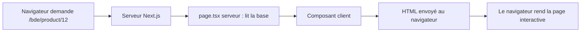

Avec React seul, tu as des composants, mais personne ne t'a dit comment les relier à des adresses (`/boutique/produit/12`) ni où ils s'exécutent. Next.js répond à ces deux questions : **les dossiers deviennent les URL**, et **chaque composant s'exécute soit sur le serveur, soit dans le navigateur**.

## À quoi sert Next.js

React sait afficher un composant, mais il ne s'occupe ni des adresses, ni du serveur, ni du chargement des pages. **Next.js** est un cadre (*framework*) qui apporte tout cela. Deux idées à retenir :

1. **Le routage par dossiers.** Pas de fichier de configuration à tenir à jour : la structure de `app/` est la liste des pages.
2. **Le rendu côté serveur** (*server-side rendering*). Au lieu d'envoyer au navigateur une page vide que JavaScript remplit ensuite, le serveur fabrique déjà le HTML de la page. Résultat : l'affichage est plus rapide, les moteurs de recherche voient le contenu, et on peut lire la base de données sans exposer ses identifiants.

## Les dossiers deviennent des URL

Le dossier `src/app/` de MiniShop contient (extrait réel, simplifié) :

```text
src/app/
├── layout.tsx                  ← cadre commun à tout le site
├── page.tsx                    ← l'adresse /
├── [shop]/
│   ├── layout.tsx              ← barre de navigation et pied de page de la boutique
│   ├── page.tsx                ← /<boutique>
│   ├── search/page.tsx         ← /<boutique>/search
│   └── product/[id]/page.tsx   ← /<boutique>/product/<numéro>
├── admin/[shop]/...            ← l'administration d'une boutique
└── api/cron_jobs/route.ts      ← une route d'API (pas une page)
```

Un mot de l'arbre mérite une explication : `cron_jobs`. **Cron** est le planificateur de tâches des systèmes Linux (« lance ceci tous les jours à 3 h »). Ici, `cron_jobs` est le nom d'une adresse que l'équipe fait appeler automatiquement à heure fixe pour déclencher un traitement (nous y revenons à la fin de la leçon). Le nom du dossier, `api/cron_jobs`, donne l'adresse `/api/cron_jobs`.

Les noms de fichiers ont un sens réservé :

| Fichier | Rôle |
| --- | --- |
| `page.tsx` | La page affichée à cette adresse |
| `layout.tsx` | Un cadre qui entoure les pages du dossier et de ses sous-dossiers, et **reste en place** quand on navigue entre elles |
| `route.ts` | Une route d'API : elle répond à une requête HTTP (GET, POST…) sans afficher de page |
| `[shop]` | Un **segment dynamique** : n'importe quelle valeur à cet endroit (`/bde`, `/asso-x`) correspond au dossier, et la valeur est transmise au code |

## Une page dynamique, ligne à ligne

Voici une page de fiche produit dans un domaine fictif, sur le modèle de `src/app/[shop]/product/[id]/page.tsx` de MiniShop.

```tsx
import { notFound } from "next/navigation";
import type { Metadata } from "next";

type Props = { params: Promise<{ boutique: string; id: string }> };

async function lireProduit(params: Props["params"]) {
  const { id } = await params;
  const produitId = Number(id);
  return Number.isNaN(produitId) ? null : await chargerProduit(produitId);
}

export default async function PageProduit({ params }: Readonly<Props>) {
  const produit = await lireProduit(params);
  if (!produit) notFound();
  return <FicheProduit initial={produit} />;
}

export async function generateMetadata({ params }: Readonly<Props>): Promise<Metadata> {
  const produit = await lireProduit(params);
  return {
    title: produit ? produit.nom : "Produit introuvable",
    description: produit?.description,
  };
}
```

- `type Props = { params: Promise<…> }` décrit ce que Next.js transmet à la page, et `Props["params"]` réutilise le type d'un seul champ de `Props`. `Readonly<Props>` interdit de modifier ces valeurs.
- Le fichier est dans `app/[boutique]/produit/[id]/`, donc Next.js appelle la fonction avec `params` contenant `boutique` et `id`, **toujours sous forme de texte** (l'URL ne contient que du texte).
- `params: Promise<…>` : dans les versions récentes de Next.js, `params` est une promesse (un résultat futur) qu'il faut attendre avec `await`. MiniShop l'écrit ainsi.
- `export default async function` : la page est une fonction **asynchrone**. C'est possible parce que ce composant s'exécute sur le serveur : il peut attendre la base de données avant de répondre.
- `Number(id)` convertit le texte en nombre ; si l'URL contient n'importe quoi, `Number.isNaN` le détecte et on évite d'interroger la base avec une valeur absurde.
- `notFound()` interrompt le rendu et affiche la page 404. Elle ne renvoie jamais (type `never`), donc après le `if`, TypeScript sait que `produit` n'est plus `null`.
- `import { notFound } from "next/navigation"` charge une fonction de Next.js ; `import type { Metadata }` charge seulement un type, utilisé pour `generateMetadata`.
- `generateMetadata` est une fonction que Next.js appelle pour fabriquer le `<title>` et la description de la page (visibles dans l'onglet et les résultats de recherche).

## Composant serveur ou composant client ?

Dans `app/`, **tout composant est un composant serveur par défaut**. Il s'exécute sur le serveur, ne peut pas utiliser `useState`, `useEffect` ni `onClick`, mais peut lire la base de données et utiliser des secrets.

Pour avoir de l'interactivité, on écrit `"use client"` tout en haut du fichier. Ce composant s'exécute alors **aussi dans le navigateur** et peut utiliser les hooks.

| | Composant serveur (défaut) | Composant client (`"use client"`) |
| --- | --- | --- |
| Hooks (`useState`…) et événements | Non | Oui |
| Accès direct à la base ou aux secrets | Oui | Non (le navigateur est public) |
| Exemple dans MiniShop | `[shop]/layout.tsx`, `product/[id]/page.tsx` | `[shop]/page.tsx`, `AddToCart.tsx` |

Le schéma classique est celui de la fiche produit : la **page serveur** charge la donnée, puis la passe en prop à un **composant client** qui gère les clics.

```tsx
// FicheProduit.tsx
"use client";
import { useState } from "react";

type Produit = { id: number; nom: string; description: string };

export function FicheProduit({ initial }: Readonly<{ initial: Produit }>) {
  const [produit] = useState(initial);
  return <h1>{produit.nom}</h1>;
}
```

Lis ce composant ligne à ligne : `"use client";` doit être la **toute première ligne** du fichier ; `useState(initial)` crée un état dont la valeur de départ est le produit reçu en prop ; `const [produit] = useState(initial)` ne garde que la valeur (pas la fonction de mise à jour, car ici on ne la change jamais) ; le composant renvoie ensuite le nom dans un `<h1>`.

Dans MiniShop, `page.tsx` charge `getProductWithVariations(productId)` puis rend `<ClientProductPage productId={…} initialProduct={product ?? undefined} />`. Le composant client dispose ainsi du produit dès le premier affichage, sans attendre un second appel.



L'étape finale s'appelle l'**hydratation** : le navigateur reçoit un HTML déjà prêt, puis React « branche » les clics dessus.

## Actions serveur et routes d'API

Un composant client a besoin de données ou doit modifier quelque chose en base. Il ne peut pas se connecter directement à la base. Next.js propose deux façons d'appeler le serveur :

- Les **actions serveur** : un fichier qui commence par `"use server"` exporte des fonctions que le navigateur peut appeler comme des fonctions ordinaires. Next.js génère l'appel réseau à ta place. MiniShop range les siennes dans `src/app/actions/` (`product.ts`, `stock.ts`…) et les stores (leçon 2) les appellent directement.
- Les **routes d'API** (`route.ts`) : des adresses HTTP classiques, utiles quand c'est un autre système qui appelle. **HTTP** est le langage que parlent navigateurs et serveurs ; une requête porte une **méthode** (`GET` pour lire, `POST` pour envoyer quelque chose), des **en-têtes** (des informations jointes, comme `Authorization`) et parfois un contenu. Deux cas typiques : un **webhook** (une adresse que l'autre système appelle de lui-même pour te prévenir d'un événement, par exemple « le paiement est confirmé ») et une tâche planifiée (le `cron_jobs` vu plus haut). Celle de MiniShop est `app/api/cron_jobs/route.ts`. Voici une version simplifiée :

```ts
export async function POST(req: Request) {
  const secret = process.env.CRON_SECRET;
  if (!secret || req.headers.get("authorization") !== `Bearer ${secret}`) {
    return Response.json({ error: "Unauthorized" }, { status: 401 });
  }
  return Response.json({ message: "ok" });
}
```

- La fonction exportée porte le nom de la méthode HTTP gérée (`POST`). Elle reçoit la `Request` et renvoie une `Response`.
- `process.env.CRON_SECRET` lit une **variable d'environnement** (un réglage placé hors du code, que le serveur fournit au programme).
- L'en-tête `Authorization: Bearer …` doit contenir ce secret partagé (*Bearer* signifie « porteur » : celui qui présente ce secret est autorisé). `!==` signifie « est différent de ».
- `!secret ||` refuse tout si la variable n'est pas définie. Sans cette précaution, `Bearer ${undefined}` donnerait le texte `Bearer undefined`, que n'importe qui pourrait envoyer.
- `Response.json(…, { status: 401 })` répond avec le code `401` (« non autorisé ») et un contenu JSON.

C'est un job de **CI** qui appelle cette route : la CI (*continuous integration*, « intégration continue ») est le robot de GitLab qui exécute automatiquement des tâches décrites dans un fichier (nous la détaillons à la leçon 7), et ce job planifié s'appelle `sync-shop-purchases`.

:::warning Une action serveur est une porte ouverte
Une action `"use server"` est une adresse que **n'importe qui** peut appeler, même sans passer par ton interface. Vérifie toujours les droits **dans l'action elle-même**, avant tout : `updateProductVersion` de MiniShop commence par `await requireAuth(["admin", "superadmin"])`. Nous y revenons à la leçon 6.
:::

## Entraîne-toi

:::labo
moteur: reel
intro: |
  Démarre ton environnement. Tu vas construire un morceau d'application Next.js : une page de fiche produit à l'adresse `/<boutique>/produit/<numéro>`, un composant interactif et une route d'API. Les fichiers se créent avec `nano` (`Ctrl+O` puis `Entrée` enregistre, `Ctrl+X` quitte) ; `mkdir -p` crée un dossier, y compris ses dossiers parents. Dans `src/produits.ts`, une fausse base de données contient deux produits (numéros 12 et 13). L'alias `@/` désigne le dossier `src`, comme dans MiniShop.

  Il n'y a pas de navigateur ni de serveur à lancer : des **tests** appellent tes pages comme le ferait Next.js (une page serveur est une simple fonction `async`) et regardent le résultat. `npx vitest run page-produit` lance les tests dont le nom de fichier contient `page-produit`.
commandes:
  - cp -R /opt/exercices/commun/. .
  - cp -R /opt/exercices/04-routage-rendu-serveur/. .
  - lier-outils
etapes:
  - texte: >-
      Crée la page `app/[boutique]/produit/[id]/page.tsx` (les crochets forment des **segments dynamiques** : n'importe quelle valeur est acceptée). Elle exporte par défaut une fonction `async` qui reçoit `params` (une promesse contenant `boutique` et `id`, toujours des textes), attend `params`, charge le produit avec `chargerProduit(Number(id))` et affiche son nom dans un `<h1>`. Pour créer le dossier : `mkdir -p "app/[boutique]/produit/[id]"`. Vérifie avec `npx vitest run page-produit`.
    indice: >-
      `const { id } = await params;` puis `const produit = await chargerProduit(Number(id));` et `return <h1>{produit?.nom}</h1>;`. Importe `chargerProduit` avec `import { chargerProduit } from "@/produits";`.
    verif:
      - fichier-existe-dans-env: app/[boutique]/produit/[id]/page.tsx
      - commande-reussit: controler tests 04-routage-rendu-serveur page-produit
      - commande-reussit: contient 'app/[boutique]/produit/[id]/page.tsx' 'chargerProduit\s*\('
    solution:
      - mkdir -p "app/[boutique]/produit/[id]"
      - ecrire:
          'app/[boutique]/produit/[id]/page.tsx': |
            import { chargerProduit } from "@/produits";

            type Props = { params: Promise<{ boutique: string; id: string }> };

            export default async function PageProduit({ params }: Readonly<Props>) {
              const { id } = await params;
              const produit = await chargerProduit(Number(id));
              return <h1>{produit?.nom}</h1>;
            }
  - texte: >-
      Un identifiant inconnu (`999`) ou absurde (`abc`) ne doit pas afficher une page vide. Convertis l'identifiant avec `Number`, repère `Number.isNaN`, et appelle `notFound()` (importée de `next/navigation`) quand il n'y a pas de produit : Next.js affiche alors sa page 404. Vérifie avec `npx vitest run page-introuvable`.
    indice: >-
      Écris une fonction `lireProduit(params)` qui renvoie `null` si `Number.isNaN(produitId)`, sinon `await chargerProduit(produitId)`. Dans la page : `if (!produit) notFound();`. Après ce `if`, TypeScript sait que `produit` existe.
    verif:
      - commande-reussit: controler tests 04-routage-rendu-serveur page-introuvable
      - commande-reussit: contient 'app/[boutique]/produit/[id]/page.tsx' '\bnotFound\s*\('
    apres: [1]
    solution:
      - ecrire:
          'app/[boutique]/produit/[id]/page.tsx': |
            import { notFound } from "next/navigation";
            import { chargerProduit } from "@/produits";

            type Props = { params: Promise<{ boutique: string; id: string }> };

            async function lireProduit(params: Props["params"]) {
              const { id } = await params;
              const produitId = Number(id);
              return Number.isNaN(produitId) ? null : await chargerProduit(produitId);
            }

            export default async function PageProduit({ params }: Readonly<Props>) {
              const produit = await lireProduit(params);
              if (!produit) notFound();
              return <h1>{produit.nom}</h1>;
            }
  - texte: >-
      Ajoute à la même page la fonction `generateMetadata` (exportée, `async`, avec les mêmes `params`) : elle renvoie `{ title, description }`, avec le nom et la description du produit, ou le titre « Produit introuvable » (sans description) quand il n'existe pas. Son type de retour est `Promise<Metadata>`, importé de `next`. Vérifie avec `npx vitest run metadonnees`.
    indice: >-
      Réutilise `lireProduit` : `return { title: produit ? produit.nom : "Produit introuvable", description: produit?.description };`.
    verif:
      - commande-reussit: controler tests 04-routage-rendu-serveur metadonnees
      - commande-reussit: contient 'app/[boutique]/produit/[id]/page.tsx' 'export\s+(async\s+)?function\s+generateMetadata'
    apres: [2]
    solution:
      - ecrire:
          'app/[boutique]/produit/[id]/page.tsx': |
            import type { Metadata } from "next";
            import { notFound } from "next/navigation";
            import { chargerProduit } from "@/produits";

            type Props = { params: Promise<{ boutique: string; id: string }> };

            async function lireProduit(params: Props["params"]) {
              const { id } = await params;
              const produitId = Number(id);
              return Number.isNaN(produitId) ? null : await chargerProduit(produitId);
            }

            export default async function PageProduit({ params }: Readonly<Props>) {
              const produit = await lireProduit(params);
              if (!produit) notFound();
              return <h1>{produit.nom}</h1>;
            }

            export async function generateMetadata({ params }: Readonly<Props>): Promise<Metadata> {
              const produit = await lireProduit(params);
              return {
                title: produit ? produit.nom : "Produit introuvable",
                description: produit?.description,
              };
            }
  - texte: >-
      Rends la fiche interactive. Un composant serveur ne peut pas utiliser `useState` : dans `src/FicheProduit.tsx`, ajoute `"use client"` en toute première ligne, un état `quantite` (au départ 1), un `<output>` qui l'affiche et un bouton « Une de plus » qui l'augmente. Puis fais afficher `<FicheProduit initial={produit} />` par la page, à la place du `<h1>` seul. Vérifie avec `npx vitest run fiche-client`.
    indice: >-
      `"use client";` doit être la première ligne du fichier, avant les imports. Le composant garde le `<h1>{initial.nom}</h1>` et ajoute `<output>{quantite}</output>` et le bouton.
    verif:
      - fichier-existe-dans-env: src/FicheProduit.tsx
      - commande-reussit: contient -d src/FicheProduit.tsx '[\x27"]use client[\x27"]'
      - commande-reussit: controler tests 04-routage-rendu-serveur fiche-client
      - commande-reussit: contient 'app/[boutique]/produit/[id]/page.tsx' '<FicheProduit'
    apres: [3]
    solution:
      - ecrire:
          'src/FicheProduit.tsx': |
            "use client";

            import { useState } from "react";
            import type { Produit } from "./produits";

            export function FicheProduit({ initial }: Readonly<{ initial: Produit }>) {
              const [quantite, setQuantite] = useState(1);
              return (
                <div>
                  <h1>{initial.nom}</h1>
                  <output>{quantite}</output>
                  <button type="button" onClick={() => setQuantite((q) => q + 1)}>
                    Une de plus
                  </button>
                </div>
              );
            }
          'app/[boutique]/produit/[id]/page.tsx': |
            import type { Metadata } from "next";
            import { notFound } from "next/navigation";
            import { FicheProduit } from "@/FicheProduit";
            import { chargerProduit } from "@/produits";

            type Props = { params: Promise<{ boutique: string; id: string }> };

            async function lireProduit(params: Props["params"]) {
              const { id } = await params;
              const produitId = Number(id);
              return Number.isNaN(produitId) ? null : await chargerProduit(produitId);
            }

            export default async function PageProduit({ params }: Readonly<Props>) {
              const produit = await lireProduit(params);
              if (!produit) notFound();
              return <FicheProduit initial={produit} />;
            }

            export async function generateMetadata({ params }: Readonly<Props>): Promise<Metadata> {
              const produit = await lireProduit(params);
              return {
                title: produit ? produit.nom : "Produit introuvable",
                description: produit?.description,
              };
            }
  - texte: >-
      Crée une **route d'API** : le fichier `app/api/cron_jobs/route.ts` exporte une fonction `POST` qui reçoit une `Request`. Elle répond `401` avec `{ error: "Unauthorized" }` quand l'en-tête `authorization` n'est pas exactement `Bearer ` suivi du secret lu dans `process.env.CRON_SECRET`, ou quand ce secret n'est pas défini ; sinon elle répond `{ message: "ok" }`. Vérifie avec `npx vitest run cron`.
    indice: >-
      `Response.json({ error: "Unauthorized" }, { status: 401 })`. Compare `req.headers.get("authorization")` à `` `Bearer ${secret}` ``, et refuse d'emblée si `secret` est vide : `if (!secret || … )`.
    verif:
      - fichier-existe-dans-env: app/api/cron_jobs/route.ts
      - commande-reussit: controler tests 04-routage-rendu-serveur cron
      - commande-reussit: contient app/api/cron_jobs/route.ts 'export\s+(async\s+)?function\s+POST'
    solution:
      - mkdir -p app/api/cron_jobs
      - ecrire:
          'app/api/cron_jobs/route.ts': |
            export async function POST(req: Request) {
              const secret = process.env.CRON_SECRET;
              if (!secret || req.headers.get("authorization") !== `Bearer ${secret}`) {
                return Response.json({ error: "Unauthorized" }, { status: 401 });
              }
              return Response.json({ message: "ok" });
            }
  - texte: >-
      Fais compiler l'ensemble par Next.js : lance `npx next build --webpack` (compte environ une minute ; l'option `--webpack` choisit le compilateur classique, parce que le compilateur par défaut n'accepte pas le dossier `node_modules` de cet environnement). Next.js vérifie les types, compile les pages et affiche la liste des routes. Le build réussi laisse un dossier `.next` qui décrit tes routes.
    indice: >-
      Si le build s'arrête sur une erreur de type, Next.js indique le fichier et la ligne. Corrige-la, puis relance la commande.
    verif:
      - fichier-contient-dans-env:
          - .next/app-path-routes-manifest.json
          - produit/\[id\]
    apres: [4, 5]
    solution:
      - npx next build --webpack
:::

## Vérifie tes acquis

:::quiz
Quelle URL sert le fichier `app/[boutique]/produit/[id]/page.tsx` ?

- [ ] `/boutique/produit/id`
- [x] `/bde/produit/12`
- [ ] `/bde/page/12`
- [ ] `/produit`

> Les dossiers entre crochets sont des segments dynamiques : ils acceptent n'importe quelle valeur.
:::

:::quiz
Tu veux ajouter un bouton qui utilise `useState` dans un fichier de `app/`. Que dois-tu faire ?

- [ ] Rien : tous les composants de `app/` acceptent les hooks
- [ ] Renommer le fichier en `client.ts`
- [x] Ajouter `"use client"` en première ligne du fichier
- [ ] Ajouter `"use server"` en première ligne du fichier

> Par défaut un composant est exécuté sur le serveur, où les hooks d'état n'existent pas.
:::

:::quiz
Pourquoi une page serveur peut-elle être `async` et attendre la base de données ?

- [ ] Parce que Next.js remplace `await` par du code synchrone
- [x] Parce qu'elle s'exécute sur le serveur avant l'envoi du HTML
- [ ] Parce que le navigateur sait parler à la base
- [ ] Parce que `await` est autorisé uniquement dans `layout.tsx`

> Le serveur attend le résultat, fabrique le HTML complet, puis l'envoie.
:::

:::quiz
Un collègue dit : « Mon action serveur est sûre, car le bouton n'est visible que des administrateur·rice·s. » Qu'en penses-tu ?

- [ ] Il a raison : un bouton caché ne peut pas être utilisé
- [x] Il a tort : l'action reste appelable par n'importe qui, il faut contrôler les droits dans l'action
- [ ] Il a raison si l'action est dans un fichier `.ts`
- [ ] Il a tort seulement pour les routes `route.ts`

> Masquer un bouton améliore l'interface, mais ne protège rien : la vérification se fait côté serveur.
:::
