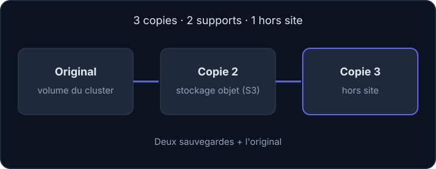

Un disque tombe en panne, quelqu'un lance un `DROP TABLE` sur la mauvaise base, ou un volume Kubernetes est supprimé par erreur. La question n'est pas « est-ce que ça arrivera ? » mais « que perd-on, et en combien de temps repart-on ? ». Avant de parler d'outils, il faut répondre à ces deux questions.

## Trois mots à connaître avant de commencer

Ce cours suppose que tu as déjà utilisé Docker, mais pas forcément les bases de données ni Kubernetes. Voici ce que recouvrent les mots de l'accroche.

:::info Vocabulaire de départ
- **Sauvegarde** : une copie de données, faite à une date précise et rangée ailleurs que l'original, pour pouvoir revenir en arrière après une panne ou une erreur.
- **Base de données** : un logiciel (ici PostgreSQL ou MySQL) qui range des informations dans des **tables**, des tableaux de lignes et de colonnes (par exemple une table des adhérent·e·s d'une association). On lui parle dans un langage appelé **SQL**.
- **`DROP TABLE`** : une instruction SQL qui **supprime une table entière**, lignes comprises, sans demander de confirmation. Lancée sur la mauvaise base, elle efface les données de tout un service : c'est le genre d'accident contre lequel on se sauvegarde. Dans le même esprit, `DELETE` supprime des lignes, et un `DELETE` sans `WHERE` (la condition qui choisit les lignes concernées) les supprime **toutes**.
- **Kubernetes** : un logiciel qui fait tourner des conteneurs Docker sur plusieurs machines (un **cluster**). Les applications y sont décrites dans des fichiers texte au format YAML.
- **Volume Kubernetes** : un espace de stockage que Kubernetes branche sur un conteneur, comme un disque externe. Les fichiers qu'une application doit garder (photos téléversées, pièces jointes) y sont écrits. Si ce volume est supprimé, les fichiers disparaissent avec lui.
- **Terminal** : la fenêtre où tu tapes des **commandes** (des ordres écrits) que l'ordinateur exécute. Dans le labo de cette leçon, le terminal est un vrai Linux jetable.
:::

Tu n'as pas besoin d'en savoir plus : chaque notion est reprise en détail dans la leçon où elle sert.

## La règle 3-2-1



- **3** copies des données : l'original et deux sauvegardes.
- **2** supports différents. Un **support** est l'endroit physique qui stocke les données : un disque d'ordinateur, un volume du cluster, un stockage objet chez un hébergeur, une clé USB.
- **1** copie hors site : si le site entier disparaît (incendie, vol, hébergeur en panne), une copie survit ailleurs.

Une copie sur le même disque que l'original ne compte pas : elle disparaît avec lui.

## RPO et RTO

Deux sigles servent à cadrer le besoin avec les utilisateur·rice·s d'un service.

:::cards
### RPO (Recovery Point Objective)

La quantité de données qu'on accepte de perdre, exprimée en temps. Une sauvegarde quotidienne donne un RPO de 24 heures au pire : si la panne arrive juste avant la sauvegarde suivante, tout ce qui a été fait depuis la dernière est perdu.

### RTO (Recovery Time Objective)

La durée maximale acceptable pour remettre le service en route. Elle inclut le temps de retrouver la sauvegarde et de la restaurer.
:::

Le RPO dicte la **fréquence** des sauvegardes, le RTO dicte la **facilité de restauration** (scripts prêts, accès connus, documentation).

## Réplication, sauvegarde, archive

La **réplication** consiste à faire tenir à jour, en continu, une seconde copie d'un service (par exemple une seconde base de données qui reçoit chaque modification de la première). Une **archive** est un ensemble de données conservé longtemps, parfois pour des raisons légales.

| Mécanisme | Protège de | Ne protège pas de |
| --- | --- | --- |
| Réplication (deux bases synchronisées) | Panne d'un serveur | Une suppression ou une corruption, copiée aussitôt |
| Sauvegarde (copies datées) | Erreur humaine, corruption | Un incident qui touche aussi le lieu de stockage |
| Archive (conservation longue) | Besoin légal ou historique | Un besoin de restauration rapide |

## Exemple concret : une sauvegarde quotidienne

Les modèles de tâches planifiées du dépôt `backups3` (l'image de sauvegarde vers S3 de l'équipe, étudiée dans la leçon 4) utilisent `schedule: "@daily"`. Cette ligne dit à Kubernetes de lancer la tâche une fois par jour. Le RPO est donc d'environ 24 heures, et le RTO dépend de la procédure de restauration, que l'on verra dans la dernière leçon.

:::warning Une réplication n'est pas une sauvegarde
Une base répliquée reproduit instantanément un `DELETE` malheureux sur son réplica (la copie répliquée). Seule une copie **datée** permet de revenir en arrière.
:::

## Entraîne-toi

Dans le labo, tu appliques la règle 3-2-1 à un petit dossier de données. Tu utilises quatre commandes, expliquées ici une par une.

```bash
tar czf sauvegarde.tar.gz donnees
mc mb labo/hors-site
mc cp sauvegarde.tar.gz labo/hors-site/
diff -r donnees essai/donnees
```

- `tar czf sauvegarde.tar.gz donnees` : `tar` range un dossier dans un seul fichier, une **archive**. `c` veut dire « créer », `z` « compresser en gzip » (le fichier devient plus petit), `f` « le nom du fichier est le mot suivant », ici `sauvegarde.tar.gz`. Le dernier mot, `donnees`, est le dossier à archiver.
- `mc mb labo/hors-site` : `mc` est le client de MinIO (un serveur de stockage objet, présenté dans la leçon suivante). `mb` veut dire *make bucket* : créer un **bucket**, c'est-à-dire un conteneur nommé du stockage objet, comparable à un dossier de premier niveau. `labo` est un **alias**, un surnom qui désigne le serveur et les identifiants à utiliser ; `hors-site` est le nom du bucket.
- `mc cp sauvegarde.tar.gz labo/hors-site/` : `cp` copie le fichier local vers le bucket, comme un `cp` normal mais vers le serveur.
- `diff -r donnees essai/donnees` : compare deux dossiers fichier par fichier (`-r` pour « récursivement », sous-dossiers compris). Il n'affiche rien et rend le code de sortie 0 si les deux sont identiques.

Dans le labo, le serveur de stockage tourne dans le même conteneur que ton terminal : c'est une **simulation** de la copie hors site. Dans la réalité, le « hors site » est une autre machine, dans un autre lieu.

:::lab
engine: real
intro: |
  Le dossier `donnees` contient les fichiers fictifs d'une association (`membres.csv` et `compte-rendu.txt`). Tu appliques la règle 3-2-1 : l'original est la copie n°1, une archive est la copie n°2, et un bucket S3 joue la copie « hors site » (la n°3). Un serveur de stockage objet MinIO a déjà été démarré pour toi dans ce conteneur, avec des identifiants factices ; l'alias `labo` de la commande `mc` le désigne. Chaque étape est vérifiée par le serveur du portail sur le résultat obtenu.
commands:
  - demarrer-minio
  - cp -r /opt/exercices/donnees donnees
steps:
  - text: 'Crée l''archive `sauvegarde.tar.gz` qui contient le dossier `donnees` (copie n°2)'
    hint: 'tar czf sauvegarde.tar.gz donnees'
    checks:
      - env-file-exists: sauvegarde.tar.gz
      - command-succeeds: tar tzf sauvegarde.tar.gz | grep -q membres.csv
    solution:
      - tar czf sauvegarde.tar.gz donnees
  - text: 'Crée le bucket `hors-site` sur le serveur S3, avec `mc mb labo/hors-site`'
    hint: 'mc mb labo/hors-site'
    checks:
      - command-succeeds: mc ls labo/hors-site
    solution:
      - mc mb labo/hors-site
  - text: 'Envoie l''archive dans le bucket `hors-site` (copie n°3) avec `mc cp`'
    hint: 'mc cp sauvegarde.tar.gz labo/hors-site/'
    after: [1, 2]
    checks:
      - command-succeeds: mc stat labo/hors-site/sauvegarde.tar.gz
    solution:
      - mc cp sauvegarde.tar.gz labo/hors-site/
  - text: 'Tu sauvegardes toutes les 6 heures. Écris dans `rpo.txt` le nombre d''heures de données que tu peux perdre au pire (le nombre seul)'
    hint: 'Le RPO est l''écart maximal entre deux sauvegardes. Commande : echo 6 > rpo.txt'
    checks:
      - env-file-contains: [rpo.txt, '^6\s*$']
    solution:
      - echo 6 > rpo.txt
  - text: 'Teste la restauration : télécharge l''archive depuis le bucket dans un dossier `essai`, extrais-la, puis vérifie que `essai/donnees` est identique à `donnees`'
    hint: 'mkdir essai, puis mc cp labo/hors-site/sauvegarde.tar.gz essai/, puis tar xzf essai/sauvegarde.tar.gz -C essai, puis diff -r donnees essai/donnees'
    after: [3]
    checks:
      - command-succeeds: diff -r donnees essai/donnees
    solution:
      - mkdir essai
      - mc cp labo/hors-site/sauvegarde.tar.gz essai/
      - tar xzf essai/sauvegarde.tar.gz -C essai
      - diff -r donnees essai/donnees
:::

## Vérifie tes acquis

:::quiz
Que signifie le « 1 » de la règle 3-2-1 ?

- [ ] Une seule personne connaît le mot de passe
- [ ] Un seul outil de sauvegarde
- [x] Une copie conservée hors site
- [ ] Une sauvegarde par jour

> Le « 1 » désigne la copie hors site, qui survit à la perte du site principal.
:::

:::quiz
Une association accepte de perdre au plus une heure de données. De quel objectif s'agit-il ?

- [x] Le RPO
- [ ] Le RTO
- [ ] Le SLA de l'hébergeur
- [ ] La rétention

> Le RPO mesure la perte de données acceptable ; ici, il impose une sauvegarde au moins toutes les heures.
:::

:::quiz
Une base PostgreSQL est répliquée sur un second serveur. Un `DELETE` sans `WHERE` est exécuté. Que se passe-t-il ?

- [ ] Le réplica garde les données intactes
- [ ] Le réplica refuse la suppression
- [x] Le réplica applique aussi la suppression
- [ ] Le réplica bascule en lecture seule

> La réplication recopie les changements, y compris les erreurs. Il faut une sauvegarde datée pour revenir en arrière.
:::

:::quiz
Deux copies sur deux dossiers du même disque respectent-elles « 2 supports » ?

- [ ] Oui, ce sont deux dossiers
- [x] Non, une panne du disque les emporte ensemble
- [ ] Oui, si elles sont compressées
- [ ] Oui, si elles ont des noms différents

> Les supports doivent être indépendants face à une panne.
:::
