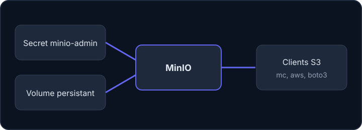

Pour stocker des sauvegardes, un dossier sur un serveur ne suffit pas : il faut un espace séparé, accessible par réseau, bon marché et pensé pour les gros fichiers. C'est le rôle du **stockage objet**.

## Buckets et objets

Un **bucket** (« seau » en anglais) est un conteneur nommé. Il contient des **objets** : un fichier, ses métadonnées (sa taille, sa date…), et une **clé**, c'est-à-dire son nom (par exemple `backup.tgz`). Il n'y a pas de vrais dossiers, seulement des clés contenant des `/` : l'objet `2026/janvier/backup.tgz` est un seul objet dont le nom contient des barres obliques.

Un logiciel parle à ce stockage par une **API**, c'est-à-dire un ensemble de requêtes réseau convenues à l'avance (« envoie cet objet », « liste ce bucket »). L'API **S3**, créée par Amazon, est devenue un standard : beaucoup de logiciels la parlent, ce qui permet d'utiliser les mêmes outils partout. Un programme qui utilise cette API s'appelle un **client**.

| Solution | Particularité |
| --- | --- |
| MinIO | S3 auto-hébergé, léger, déployable sur Kubernetes |
| Ceph (RGW) | Ceph est un système de stockage libre pour de grosses capacités ; RGW (*RADOS Gateway*) est sa passerelle qui parle S3. Souvent proposé par un hébergeur |
| Swift | Le stockage objet d'OpenStack (un ensemble de logiciels libres pour construire un cloud). Il a sa propre API, différente de S3 ; il est utilisé par `backup-files-swift` et `mysql-backup-container` |

## MinIO dans l'équipe

Le dépôt `cluster-configuration` explique pourquoi : pour une association, les coûts d'un S3 commercial sont trop élevés, et réimplémenter S3 serait risqué. L'équipe déploie donc MinIO sur son cluster Kubernetes (la grappe de machines qui fait tourner ses services) avec un **chart Helm**, c'est-à-dire un paquet d'installation Kubernetes, lui-même piloté par **Terraform**, un outil qui décrit l'infrastructure dans des fichiers. Le domaine par défaut de la configuration est `s3.example.org`, avec un volume de 75 Gio.



La **clé d'accès** (l'identifiant) et la **clé secrète** (le mot de passe) sont générées aléatoirement par Terraform et stockées dans un **secret Kubernetes**, un objet réservé aux données sensibles. Elles ne doivent jamais apparaître dans un dépôt.

## Un accès par bucket

Le module `minio-bucket` crée pour chaque besoin un bucket, une **politique** et un utilisateur. Une politique est un fichier au format **JSON** (un format texte fait de clés et de valeurs entre accolades) qui liste ce qu'un utilisateur a le droit de faire. Elle n'autorise ici que les actions nécessaires sur **un seul** bucket :

- `s3:PutObject` : envoyer un objet ;
- `s3:GetObject` : lire un objet ;
- `s3:DeleteObject` : supprimer un objet ;
- `s3:ListBucket` : lister le contenu du bucket.

Voici une politique complète, avec le bucket fictif `sauvegardes-asso`. C'est exactement celle que tu écriras dans le labo.

```json
{
  "Version": "2012-10-17",
  "Statement": [
    {
      "Effect": "Allow",
      "Action": ["s3:PutObject", "s3:GetObject", "s3:DeleteObject"],
      "Resource": ["arn:aws:s3:::sauvegardes-asso/*"]
    },
    {
      "Effect": "Allow",
      "Action": ["s3:ListBucket"],
      "Resource": ["arn:aws:s3:::sauvegardes-asso"]
    }
  ]
}
```

Ligne à ligne :

- `"Version": "2012-10-17"` : la version du format des politiques. On la recopie telle quelle.
- `"Statement"` : la liste des règles. Ici, il y en a deux.
- `"Effect": "Allow"` : la règle **autorise** (le contraire est `Deny`, qui interdit).
- `"Action"` : les actions autorisées par la règle.
- `"Resource"` : sur quoi elles portent. Un **ARN** (*Amazon Resource Name*) est l'adresse d'une ressource : `arn:aws:s3:::sauvegardes-asso/*` désigne **tous les objets** (`/*`) du bucket `sauvegardes-asso`, alors que `arn:aws:s3:::sauvegardes-asso` désigne le bucket lui-même.
- Pourquoi deux règles ? Lire, écrire ou supprimer un objet porte sur les objets (`/*`), alors que lister porte sur le bucket.

Cette liste précise est le **principe du moindre privilège** : chaque compte n'a que les droits dont il a besoin.

## Créer le bucket, la politique et l'utilisateur

`mc` est le client en ligne de commande de MinIO. Il désigne un serveur par un **alias**, un surnom enregistré une fois pour toutes avec l'adresse et les identifiants (dans le labo, l'alias `labo` est déjà prêt et pointe vers le MinIO local). Voici le principe, avec des valeurs fictives :

```bash
mc mb labo/mon-service --region=ovh-gra5
mc admin policy create labo mon-service-policy mon-service-policy.json
mc admin user add labo ACCESS_FACTICE SECRET_FACTICE
mc admin policy attach labo mon-service-policy --user ACCESS_FACTICE
```

Chaque commande, dans l'ordre :

1. `mc mb labo/mon-service` crée le bucket `mon-service` sur le serveur de l'alias `labo` (`mb` = *make bucket*). L'option `--region=ovh-gra5` indique la région, une étiquette géographique de la configuration du dépôt (inutile dans le labo) ;
2. `mc admin policy create` enregistre dans MinIO la politique lue dans le fichier JSON, sous le nom `mon-service-policy` ;
3. `mc admin user add` crée un utilisateur : son identifiant (la clé d'accès) puis son mot de passe (la clé secrète) ;
4. `mc admin policy attach` **rattache** la politique à l'utilisateur (`--user`).

:::warning L'ancienne syntaxe de mc
Les versions récentes de `mc` ont remplacé `mc admin policy add` par `mc admin policy create`, et le rattachement se fait à part avec `mc admin policy attach`. Le dépôt `cluster-configuration` de l'équipe, lui, utilise encore l'ancienne forme `mc admin policy add labo mon-service-policy mon-service-policy.json` (et rattachait la politique en la donnant à `mc admin user add`). Elle peut ne plus exister sur un `mc` à jour : si une commande de cette source est refusée, utilise les formes ci-dessus et signale-le à l'équipe Infra.
:::

## Se connecter depuis un poste

Le README de `backups3` présente deux clients : `mc` (celui de MinIO) et `aws` (l'**AWS CLI**, l'outil en ligne de commande d'Amazon). Avec un S3 qui n'est pas celui d'Amazon, il faut préciser le **point d'accès** (en anglais *endpoint*), l'adresse du service, avec l'option `--endpoint-url` (le README écrit l'abréviation `--endpoint`).

```bash
aws --endpoint-url=https://s3.exemple.invalid s3api list-buckets
aws --endpoint-url=https://s3.exemple.invalid s3api list-object-versions --bucket mon-bucket
```

La première liste les buckets accessibles. La seconde liste les **versions** d'un bucket (les anciennes copies d'un même objet, expliquées dans la leçon 5). `s3api` est le sous-ensemble de l'AWS CLI qui correspond une à une aux requêtes de l'API S3. Tu t'en serviras pour restaurer.

Dans le labo, l'adresse et les identifiants (factices) sont déjà fournis par des **variables d'environnement**, des réglages que les programmes lisent dans leur environnement : tu n'as pas besoin de `--endpoint-url`.

:::tip Un compte par service
Un bucket et un utilisateur par service limitent les dégâts : une clé qui fuit ne donne accès qu'à une seule sauvegarde.
:::

## Entraîne-toi

Dans le labo, tu reproduis ce que fait le module `minio-bucket`, sur un MinIO local : le serveur est déjà démarré, l'alias `labo` est prêt (il utilise le compte administrateur factice du labo) et un second bucket, `prive`, existe déjà. Tu vas créer le bucket `sauvegardes-asso`, la politique ci-dessus, l'utilisateur `app-sauvegarde` (mot de passe factice `secret-factice-42`), puis vérifier que ce compte peut écrire dans son bucket mais pas dans `prive`.

Pour écrire `politique.json`, ouvre l'éditeur avec `nano politique.json`, colle le JSON de la section « Un accès par bucket », enregistre avec Ctrl+O puis Entrée, et quitte avec Ctrl+X.

Pour agir « en tant que » l'utilisateur limité, tu préfixes la commande par ses identifiants, ce qui les définit pour cette seule commande :

```bash
AWS_ACCESS_KEY_ID=app-sauvegarde AWS_SECRET_ACCESS_KEY=secret-factice-42 aws s3 cp notes.txt s3://sauvegardes-asso/notes.txt
```

- `AWS_ACCESS_KEY_ID=…` et `AWS_SECRET_ACCESS_KEY=…` : les variables que l'AWS CLI lit pour s'identifier. Placées devant la commande, elles ne valent que pour elle.
- `aws s3 cp notes.txt s3://sauvegardes-asso/notes.txt` : copie le fichier local `notes.txt` vers l'objet `notes.txt` du bucket (`s3://bucket/clé` est la façon d'écrire l'adresse d'un objet).

:::lab
engine: real
intro: |
  Un MinIO fictif tourne dans ton conteneur ; l'alias `labo` le désigne avec le compte administrateur factice du labo, et le bucket `prive` existe déjà. Tu crées un bucket, une politique de moindre privilège et un compte dédié, puis tu prouves qu'il est bien limité. Dans la réalité, ces commandes passent par les modules Terraform de l'équipe. Les étapes sont vérifiées par le serveur du portail sur l'état du MinIO.
files:
  notes.txt: |
    Notes de l'association (contenu fictif).
commands:
  - demarrer-minio
  - mc mb --ignore-existing labo/prive
steps:
  - text: 'Crée le bucket `sauvegardes-asso` avec `mc mb`'
    hint: 'mc mb labo/sauvegardes-asso'
    checks:
      - command-succeeds: mc ls labo/sauvegardes-asso
    solution:
      - mc mb labo/sauvegardes-asso
  - text: 'Écris le fichier `politique.json` : les actions `s3:PutObject`, `s3:GetObject`, `s3:DeleteObject` sur les objets de `sauvegardes-asso` et `s3:ListBucket` sur le bucket lui-même, sans jamais utiliser `s3:*`'
    hint: 'Recopie le JSON de la section « Un accès par bucket » avec nano politique.json. Le nom du bucket doit être sauvegardes-asso partout.'
    checks:
      - command-succeeds: python3 -m json.tool politique.json
      - env-file-contains: [politique.json, 'arn:aws:s3:::sauvegardes-asso/\*']
      - env-file-contains: [politique.json, 's3:PutObject']
      - command-fails: grep -q '"s3:\*"' politique.json
    solution:
      - write:
          politique.json: |
            {
              "Version": "2012-10-17",
              "Statement": [
                {
                  "Effect": "Allow",
                  "Action": ["s3:PutObject", "s3:GetObject", "s3:DeleteObject"],
                  "Resource": ["arn:aws:s3:::sauvegardes-asso/*"]
                },
                {
                  "Effect": "Allow",
                  "Action": ["s3:ListBucket"],
                  "Resource": ["arn:aws:s3:::sauvegardes-asso"]
                }
              ]
            }
  - text: 'Enregistre cette politique dans MinIO sous le nom `pol-sauvegardes`, avec `mc admin policy create`'
    hint: 'mc admin policy create labo pol-sauvegardes politique.json'
    after: [2]
    checks:
      - command-succeeds: mc admin policy info labo pol-sauvegardes
    solution:
      - mc admin policy create labo pol-sauvegardes politique.json
  - text: 'Crée l''utilisateur `app-sauvegarde` (mot de passe `secret-factice-42`) puis rattache-lui la politique `pol-sauvegardes` avec `mc admin policy attach`'
    hint: 'mc admin user add labo app-sauvegarde secret-factice-42, puis mc admin policy attach labo pol-sauvegardes --user app-sauvegarde'
    after: [3]
    checks:
      - output-contains:
          - mc admin user info labo app-sauvegarde
          - 'pol-sauvegardes'
    solution:
      - mc admin user add labo app-sauvegarde secret-factice-42
      - mc admin policy attach labo pol-sauvegardes --user app-sauvegarde
  - text: 'Avec les identifiants de `app-sauvegarde`, envoie `notes.txt` dans le bucket `sauvegardes-asso`'
    hint: 'AWS_ACCESS_KEY_ID=app-sauvegarde AWS_SECRET_ACCESS_KEY=secret-factice-42 aws s3 cp notes.txt s3://sauvegardes-asso/notes.txt'
    after: [4]
    checks:
      - command-succeeds: mc stat labo/sauvegardes-asso/notes.txt
    solution:
      - AWS_ACCESS_KEY_ID=app-sauvegarde AWS_SECRET_ACCESS_KEY=secret-factice-42 aws s3 cp notes.txt s3://sauvegardes-asso/notes.txt
  - text: 'Avec le même compte, tente d''envoyer `notes.txt` dans le bucket `prive` en gardant le message d''erreur dans `refus.txt` (la commande doit être refusée)'
    hint: 'Ajoute 2> refus.txt à la fin de la commande : 2> redirige les messages d''erreur vers un fichier.'
    after: [5]
    checks:
      - env-file-contains: [refus.txt, 'AccessDenied|Access Denied']
      - command-fails: mc stat labo/prive/notes.txt
    solution:
      - AWS_ACCESS_KEY_ID=app-sauvegarde AWS_SECRET_ACCESS_KEY=secret-factice-42 aws s3 cp notes.txt s3://prive/notes.txt 2> refus.txt || true
:::

## Vérifie tes acquis

:::quiz
Qu'est-ce qu'un bucket ?

- [ ] Un serveur dédié aux sauvegardes
- [ ] Un type de disque réseau
- [x] Un conteneur nommé qui regroupe des objets
- [ ] Un utilisateur du service S3

> Un bucket est un espace de nommage qui contient des objets identifiés par leur clé.
:::

:::quiz
Pourquoi crée-t-on un utilisateur et une politique par bucket ?

- [x] Pour limiter l'accès d'une clé à ce seul bucket
- [ ] Pour augmenter la vitesse d'envoi
- [ ] Pour que le bucket soit chiffré
- [ ] Pour éviter de créer des secrets

> Le principe du moindre privilège : si la clé fuit, un seul bucket est concerné.
:::

:::quiz
Tu utilises la CLI `aws` avec un S3 qui n'est pas celui d'Amazon. Que faut-il ajouter ?

- [ ] Rien, `aws` trouve l'hébergeur seul
- [ ] L'option `--local`
- [x] L'option `--endpoint-url` avec l'adresse du service
- [ ] Un fichier `Dockerfile`

> Sans point d'accès, `aws` interroge Amazon. Le README de `backups3` écrit l'abréviation `--endpoint`.
:::

:::quiz
Quelle commande de `mc` récent rattache une politique existante à un utilisateur ?

- [ ] `mc admin policy add`
- [x] `mc admin policy attach`
- [ ] `mc mb`
- [ ] `mc cp`

> `mc admin policy add` est l'ancienne syntaxe (encore visible dans la source de l'équipe) ; on crée la politique avec `create`, puis on la rattache avec `attach`.
:::
