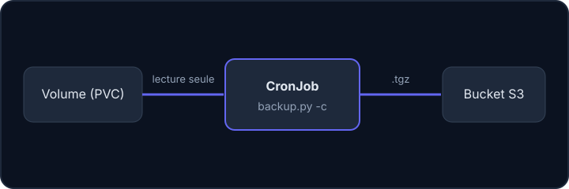

Les fichiers déposés par les utilisateur·rice·s d'une application (pièces jointes, médias) vivent dans un **volume** : un espace de stockage que Kubernetes branche sur un conteneur, un peu comme un disque externe. Pour les protéger, on lance régulièrement un petit conteneur qui lit ce volume et envoie une archive vers le stockage objet.



## Quelques mots de Kubernetes

Kubernetes décrit tout dans des fichiers **YAML** (un format texte où l'indentation exprime la hiérarchie). Les objets dont on a besoin ici :

- **Pod** : un ou plusieurs conteneurs lancés ensemble, la plus petite unité de Kubernetes.
- **Job** : une tâche qui s'exécute **une fois** jusqu'à réussite (un pod qui se termine).
- **CronJob** : un Job relancé automatiquement selon un horaire, comme une tâche **cron** (voir la leçon précédente).
- **Secret** : un objet réservé aux données sensibles (clés, mots de passe), séparé des autres fichiers de configuration.
- **PersistentVolumeClaim** (PVC) : la « demande » d'un espace de stockage durable, qu'un pod peut ensuite monter. C'est ce qui relie une application à son volume.

Tu ne vas pas manipuler un cluster dans cette leçon : le labo n'a ni Kubernetes ni Docker. Tu liras un CronJob, et tu pratiqueras ce qu'il fait réellement, c'est-à-dire lancer `backup.py` sur un dossier.

## L'image backups3

Une **image** est le modèle à partir duquel Docker crée des conteneurs. Celle-ci contient trois scripts **Python** (un langage de programmation) qui s'appuient sur `boto3`, la bibliothèque Python qui parle à l'API S3 :

| Script | Rôle |
| --- | --- |
| `test_connection_s3.py` | liste les buckets accessibles, pour tester l'accès |
| `backup.py` | envoie un fichier ou un dossier vers un bucket |
| `restore.py` | télécharge un objet, avec extraction facultative |

Les trois lisent trois variables d'environnement (des réglages donnés au programme au moment où on le lance) : `URL` (point d'accès), `ACCESSKEY` et `SECRETKEY`. Pour comprendre ce qu'ils font, voici le cœur de `backup.py`, simplifié :

```python
s3 = boto3.client(
    "s3",
    endpoint_url=os.environ["URL"],
    aws_access_key_id=os.environ["ACCESSKEY"],
    aws_secret_access_key=os.environ["SECRETKEY"],
)
s3.upload_file("/tmp/archive.tgz", "mon-bucket", "backup.tgz")
```

- `boto3.client("s3", …)` crée un client S3, c'est-à-dire un objet capable d'envoyer des requêtes à un serveur S3.
- `endpoint_url=os.environ["URL"]` : le point d'accès vient de la variable `URL`. `os.environ[...]` lit une variable d'environnement.
- `aws_access_key_id=…` et `aws_secret_access_key=…` : la clé d'accès et la clé secrète, lues dans `ACCESSKEY` et `SECRETKEY`.
- `s3.upload_file(fichier, bucket, clé)` envoie le fichier local `/tmp/archive.tgz` dans `mon-bucket`, sous le nom `backup.tgz`.

## Les arguments de backup.py

Un **argument** est un mot donné à une commande pour la régler ; une **option** est un argument qui commence par un tiret (`-c`).

```bash
backup.py -v -c mon-bucket /data/ backup.tgz
```

- `mon-bucket` : le bucket de destination ;
- `/data/` : ce qu'on sauvegarde (chemin absolu, c'est-à-dire écrit depuis la racine `/`) ;
- `backup.tgz` : le nom de l'objet dans le bucket ;
- `-c` : compresse en archive `tar.gz` avant l'envoi (une archive `tar.gz` range un dossier entier dans un seul fichier compressé) ;
- `-v` : affiche les messages d'information.

Dans l'image de l'équipe, on écrit `python backup.py …` depuis le dossier du script ; dans le labo, `backup.py` est directement dans ton PATH (la liste des dossiers où le terminal cherche les commandes).

:::warning Un dossier sans -c échoue
Le script refuse de sauvegarder un dossier non compressé (« not supported ») et se termine avec une erreur. Pense aussi que la copie temporaire est faite dans `/tmp` du conteneur : prévois de la place.
:::

## Le CronJob

Le modèle `deploy/k8s/backup_cronjob.yaml` contient l'essentiel :

```yaml
spec:
  schedule: "@daily"
  jobTemplate:
    spec:
      template:
        spec:
          containers:
            - name: backup-cron
              image: registry.exemple.invalid/backups3:latest
              command: ["python"]
              args: ["backup.py", "-v", "-c", "mon-bucket", "/data/", "backup.tgz"]
              env:
                - name: ACCESSKEY
                  valueFrom:
                    secretKeyRef:
                      name: s3-credentials
                      key: accessKey
              volumeMounts:
                - mountPath: /data
                  name: volume
                  readOnly: true
          restartPolicy: OnFailure
          volumes:
            - name: volume
              persistentVolumeClaim:
                claimName: pvc
```

Ligne à ligne (les trois premiers niveaux, `spec`, `jobTemplate` et `template`, ne font qu'emboîter la description du CronJob, de son Job puis de son pod) :

- `schedule: "@daily"` : l'horaire, une fois par jour.
- `containers:` / `name: backup-cron` : la liste des conteneurs du pod, ici un seul, nommé `backup-cron`.
- `image: registry.exemple.invalid/backups3:latest` : l'image à lancer (`registry` est le serveur qui range les images, `latest` la version la plus récente).
- `command: ["python"]` et `args: [...]` : la commande lancée dans le conteneur et ses arguments, exactement ceux de `backup.py` vus plus haut.
- `env:` / `name: ACCESSKEY` / `valueFrom: secretKeyRef:` : définit la variable d'environnement `ACCESSKEY`, dont la valeur n'est pas écrite ici mais lue dans le secret `s3-credentials`, à la clé `accessKey`.
- `volumeMounts:` / `mountPath: /data` / `name: volume` / `readOnly: true` : branche le volume nommé `volume` sur le dossier `/data` du conteneur, **en lecture seule**.
- `restartPolicy: OnFailure` : si le conteneur échoue, Kubernetes le relance ; s'il réussit, il s'arrête là.
- `volumes:` / `persistentVolumeClaim: claimName: pvc` : le volume nommé `volume` correspond à la demande de stockage `pvc`, celle de l'application sauvegardée.

Les clés `URL` et `SECRETKEY` suivent le même modèle (extrait abrégé). Points à retenir :

- les identifiants viennent du secret `s3-credentials` que **tu dois créer** : ils ne sont jamais écrits dans le YAML du CronJob ;
- le volume est monté en **lecture seule** (`readOnly: true`) : la sauvegarde ne peut pas abîmer les données ;
- le nom `backup.tgz` est fixe : chaque nuit, un nouvel objet **remplace** le précédent. L'historique est conservé grâce au **versionnement** du bucket, vu dans la leçon suivante.

Un secret se décrit lui aussi en YAML. Voici celui qu'attend le CronJob, avec des valeurs factices :

```yaml
apiVersion: v1
kind: Secret
metadata:
  name: s3-credentials
stringData:
  url: https://s3.exemple.invalid
  accessKey: ACCESS_FACTICE
  secretKey: SECRET_FACTICE
```

- `apiVersion: v1` et `kind: Secret` : le type d'objet décrit (un secret).
- `metadata: name: s3-credentials` : son nom, celui que le CronJob référence.
- `stringData:` : les valeurs, écrites en clair dans ce fichier. C'est pourquoi **ce fichier ne doit jamais être versionné avec de vraies valeurs** : on le crée sur le cluster, on ne le met pas dans Git.

## Variante Swift

Pour un stockage Swift, `backup-files-swift` fait `tar -czvf` de `/data/` puis `swift upload`. Il est livré avec un chart Helm (`pvcName`, `schedule: 0 1 * * *`, `OS_BUCKET_NAME`…), et le nom de l'archive porte la date : `<fileName>-AAAA-MM-JJ_HHhMM.backup.tar.gz`.

:::tip Tester avant de planifier
Lance d'abord `test_connection_s3.py` dans un Job pour vérifier le point d'accès et les clés, puis un `backup_job.yaml` ponctuel, avant d'activer le CronJob.
:::

## Entraîne-toi

Dans le labo, le dossier `data` joue le rôle du volume (un fichier `piece-jointe.txt` et un dossier `media`, contenus fictifs). Un MinIO local joue le S3. Tu fais ce que fait le CronJob, mais à la main. Le CronJob lui-même n'est pas exécuté (il faudrait un cluster Kubernetes) : tu écris seulement le fichier du secret.

:::lab
engine: real
intro: |
  Le dossier `data` est la copie fictive d'un volume d'application. Le serveur MinIO local est démarré, et les variables `URL`, `ACCESSKEY` et `SECRETKEY` (factices) sont déjà définies : tu peux les afficher avec `echo $URL`. Les scripts `test_connection_s3.py` et `backup.py` sont des versions simplifiées de ceux de `backups3`. Les étapes sont vérifiées sur les fichiers et sur le contenu du bucket.
commands:
  - demarrer-minio
  - cp -r /opt/exercices/volume data
steps:
  - text: 'Teste l''accès S3 avec `test_connection_s3.py` et garde la sortie dans `connexion.txt`'
    hint: 'test_connection_s3.py > connexion.txt'
    checks:
      - env-file-contains: [connexion.txt, '^Connexion OK']
    solution:
      - test_connection_s3.py > connexion.txt
  - text: 'Crée le bucket `volumes` avec `mc mb`'
    hint: 'mc mb labo/volumes'
    checks:
      - command-succeeds: mc ls labo/volumes
    solution:
      - mc mb labo/volumes
  - text: 'Essaie de sauvegarder le dossier `data/` SANS l''option `-c` vers l''objet `sans-c.tgz`, en gardant le message d''erreur dans `erreur.txt`'
    hint: 'backup.py volumes data/ sans-c.tgz 2> erreur.txt (2> envoie les messages d''erreur dans le fichier)'
    after: [2]
    checks:
      - env-file-contains: [erreur.txt, 'not supported']
    solution:
      - backup.py volumes data/ sans-c.tgz 2> erreur.txt || true
  - text: 'Sauvegarde correctement `data/` vers l''objet `backup.tgz` du bucket `volumes`, avec `-v` et `-c`'
    hint: 'backup.py -v -c volumes data/ backup.tgz'
    after: [2]
    checks:
      - command-succeeds: mc stat labo/volumes/backup.tgz
      - output-contains:
          - aws s3 cp s3://volumes/backup.tgz - | tar tzf -
          - 'data/media/photo-1\.txt'
    solution:
      - backup.py -v -c volumes data/ backup.tgz
  - text: 'Comme `readOnly: true` dans le CronJob, prouve que la sauvegarde n''a besoin que de lire : retire le droit d''écriture sur `data`, puis sauvegarde-le vers l''objet `backup-lecture-seule.tgz`'
    hint: 'chmod -R a-w data (retire le droit d''écriture pour tout le monde), puis backup.py -c volumes data/ backup-lecture-seule.tgz'
    after: [4]
    checks:
      - command-fails: test -w data
      - command-succeeds: mc stat labo/volumes/backup-lecture-seule.tgz
    solution:
      - chmod -R a-w data
      - backup.py -c volumes data/ backup-lecture-seule.tgz
  - text: 'Écris le fichier `s3-credentials.yaml` : un `Secret` Kubernetes nommé `s3-credentials` avec les clés `url`, `accessKey` et `secretKey` (valeurs factices)'
    hint: 'Recopie le YAML du cours avec nano s3-credentials.yaml. Tu ne peux pas l''appliquer ici : il n''y a pas de cluster.'
    checks:
      - env-file-contains: [s3-credentials.yaml, '^kind: Secret\s*$']
      - env-file-contains: [s3-credentials.yaml, 'name: s3-credentials']
      - env-file-contains: [s3-credentials.yaml, 'accessKey:']
      - env-file-contains: [s3-credentials.yaml, 'secretKey:']
      - env-file-contains: [s3-credentials.yaml, 'url:']
    solution:
      - write:
          s3-credentials.yaml: |-
            apiVersion: v1
            kind: Secret
            metadata:
              name: s3-credentials
            stringData:
              url: https://s3.exemple.invalid
              accessKey: ACCESS_FACTICE
              secretKey: SECRET_FACTICE
:::

## Vérifie tes acquis

:::quiz
Quelles variables d'environnement lit `backup.py` ?

- [ ] `BUCKET`, `PATH`, `NAME`
- [x] `URL`, `ACCESSKEY`, `SECRETKEY`
- [ ] `S3_HOST`, `S3_USER`
- [ ] Aucune, tout passe par les arguments

> Ces trois variables viennent du secret Kubernetes.
:::

:::quiz
Que se passe-t-il si tu sauvegardes un dossier sans l'option `-c` ?

- [ ] Le dossier est envoyé fichier par fichier
- [ ] Le script ajoute `-c` tout seul
- [x] Le script s'arrête avec une erreur
- [ ] Seul le premier fichier est envoyé

> Un dossier doit être compressé en archive pour être envoyé.
:::

:::quiz
Pourquoi monter le volume avec `readOnly: true` ?

- [ ] Pour accélérer la lecture
- [x] Pour que la sauvegarde ne puisse pas modifier les données
- [ ] Parce que S3 l'exige
- [ ] Pour économiser de l'espace

> La sauvegarde n'a besoin que de lire.
:::

:::quiz
Le CronJob envoie toujours `backup.tgz`. Comment retrouve-t-on la sauvegarde d'il y a trois jours ?

- [ ] C'est impossible
- [ ] Grâce au nom, qui contient la date
- [x] Grâce au versionnement du bucket, qui garde les anciennes versions
- [ ] Grâce au volume Kubernetes

> Chaque envoi crée une nouvelle version de l'objet si le versionnement est activé.
:::
