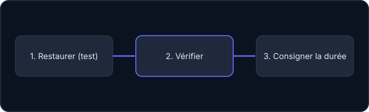

Une sauvegarde qu'on n'a jamais restaurée est une hypothèse. Archive corrompue, mauvais accès, version introuvable : on veut le découvrir un jour calme, pas pendant un incident.



## Le script restore.py

```bash
restore.py -v -c mon-bucket backup.tgz /data/
```

- `mon-bucket` : le bucket ;
- `backup.tgz` : le nom de l'objet ;
- `/data/` : le dossier où télécharger (avec un `/` final : le script concatène simplement le chemin et le nom) ;
- `-c` : extrait l'archive puis supprime le fichier téléchargé ;
- `-v` : affiche les messages d'information.

Il lit les mêmes variables que `backup.py` : `URL`, `ACCESSKEY`, `SECRETKEY` (le point d'accès et les clés, voir la leçon 4). Sans `--date`, il télécharge la **dernière** version. Comme dans la leçon précédente, l'image de l'équipe se lance avec `python restore.py …`, alors que dans le labo `restore.py` est directement dans ton PATH.

## Revenir à une version précise

```bash
restore.py -v -c --date "2024-01-15 02:00:00" mon-bucket backup.tgz /data/
```

La date est en **heure UTC**, le temps universel, sans heure d'été ni fuseau (Paris a 1 ou 2 heures d'avance sur UTC selon la saison). Elle se donne au format `AAAA-MM-JJ HH:MM:SS`. Le script cherche la version dont le `LastModified` correspond **exactement**. Recopie donc la date affichée par `list-object-versions`, sans l'arrondir.

:::warning Une date inexacte fait échouer la commande
Si aucune version ne correspond à la seconde près, le script ne trouve pas de `VersionId` et se termine sur une erreur. Ce n'est pas une restauration silencieuse de la dernière version.
:::

Pour obtenir cette date sans la recopier à la main, tu peux demander à `aws` la plus ancienne version et la convertir :

```bash
aws s3api list-object-versions --bucket mon-bucket --prefix backup.tgz \
  --query 'sort_by(Versions, &LastModified)[0].LastModified' --output text \
  | xargs -I{} date -u -d {} '+%Y-%m-%d %H:%M:%S'
```

- `--prefix backup.tgz` : ne liste que les objets dont la clé commence par `backup.tgz`.
- `--query '…'` : filtre la réponse avec une expression JMESPath (un petit langage de requête sur du JSON). `sort_by(Versions, &LastModified)` trie les versions par date croissante, `[0]` prend la première, donc la plus ancienne, et `.LastModified` en garde la date.
- `--output text` : affiche le résultat en texte brut plutôt qu'en JSON.
- `| xargs -I{} date -u -d {} '+%Y-%m-%d %H:%M:%S'` : `xargs` passe la date reçue à la commande `date`, qui la convertit (`-u` = en UTC) au format `AAAA-MM-JJ HH:MM:SS` demandé par `restore.py`.

## Restaurer une base de données

Pour une base PostgreSQL, on restaure **dans une base vide**, jamais par-dessus la production :

```bash
createdb asso_restauration
pg_restore -d asso_restauration asso.dump
psql -d asso_restauration -c "SELECT count(*) FROM adherents;"
```

- `createdb asso_restauration` crée une base vide avec ce nom.
- `pg_restore -d asso_restauration asso.dump` recharge dans cette base le contenu de la sauvegarde `asso.dump` (celle faite avec `pg_dump -Fc`, leçon 3).
- `psql -d … -c "…"` envoie une requête SQL à la base : `SELECT count(*) FROM adherents` compte les lignes de la table `adherents`. Le nombre doit être celui de la base d'origine.

Hors labo, il faut aussi donner `-h` (la machine du serveur) et `-U` (l'utilisateur), voir la leçon 3.

## Restaurer sans casser la production

Le modèle `deploy/k8s/restore_job.yaml` est un `Job` (une seule exécution, `backoffLimit: 3`, c'est-à-dire trois nouvelles tentatives au plus en cas d'échec) qui monte un volume sur `/data`. Si tu le pointes vers le volume de production, tu **écrases** des fichiers existants.

Procédure prudente :

1. Crée un volume vide de test (ou un nouveau `PersistentVolumeClaim`).
2. Lance le Job de restauration vers ce volume.
3. Vérifie le contenu : nombre de fichiers, quelques fichiers ouverts, date du dernier.
4. Pour une base : rejoue le dump dans une base temporaire, puis compte les lignes d'une table clé.
5. Seulement ensuite, décide de la remise en production.

Dans le labo, les étapes 1 et 2 sont remplacées par des dossiers de test, puisqu'il n'y a pas de cluster Kubernetes.

## Un test régulier

- Planifie un test à intervalle fixe, par exemple chaque trimestre, pour les services critiques.
- Note la durée mesurée : c'est ton RTO **réel**.
- Note la date de la plus ancienne version utilisable : c'est ton RPO **réel**.
- Garde la procédure à jour, avec les noms de buckets et de secrets (jamais les valeurs).

:::danger Ne restaure jamais sur la production sans plan
Restaurer à la place des données actuelles est irréversible pour ce qui n'a pas été sauvegardé depuis. Fais d'abord une copie de l'état présent.
:::

## Entraîne-toi

Le labo prépare un scénario : un bucket `sauvegardes` versionné contient **deux versions** de l'archive `backup.tgz` (le fichier `notes.txt` qu'elle contient dit « version A » dans la plus ancienne et « version B » dans la plus récente), ainsi que le dump `asso.dump` de la base PostgreSQL `asso`. À toi de restaurer, sans toucher à la base `asso`.

:::labo
moteur: reel
intro: |
  Le bucket `sauvegardes` de ton MinIO local est versionné et contient deux versions de `backup.tgz` ainsi que `asso.dump` (le dump de la base `asso`, qui contient 5 adhérent·e·s). Tu restaures la version ancienne par sa date, la plus récente, puis la base dans une base vide, et tu consignes ton RTO. Les identifiants sont factices et déjà configurés. Les étapes sont vérifiées sur les fichiers restaurés et sur l'état des bases.
commandes:
  - preparer-restauration
etapes:
  - texte: 'Trouve la date UTC de la plus ancienne version de `backup.tgz` et écris-la dans `date-ancienne.txt`, au format `AAAA-MM-JJ HH:MM:SS`'
    indice: 'Commence par aws s3api list-object-versions --bucket sauvegardes --prefix backup.tgz pour voir les deux versions, puis utilise la commande du cours (avec --query, puis xargs et date) en ajoutant > date-ancienne.txt'
    verif:
      - commande-reussit: test "$(cat date-ancienne.txt)" = "$(controle-date-ancienne)"
    solution:
      - aws s3api list-object-versions --bucket sauvegardes --prefix backup.tgz --query 'sort_by(Versions, &LastModified)[0].LastModified' --output text | xargs -I{} date -u -d {} '+%Y-%m-%d %H:%M:%S' > date-ancienne.txt
  - texte: 'Restaure cette version ancienne de `backup.tgz` dans le dossier `restauration-ancienne/` avec `restore.py --date`'
    indice: 'restore.py -v -c --date "$(cat date-ancienne.txt)" sauvegardes backup.tgz restauration-ancienne/'
    apres: [1]
    verif:
      - fichier-contient-dans-env: [restauration-ancienne/data/notes.txt, 'version A']
    solution:
      - restore.py -v -c --date "$(cat date-ancienne.txt)" sauvegardes backup.tgz restauration-ancienne/
  - texte: 'Restaure la version la plus récente dans le dossier `restauration-recente/` (sans `--date`)'
    indice: 'restore.py -v -c sauvegardes backup.tgz restauration-recente/'
    verif:
      - fichier-contient-dans-env: [restauration-recente/data/notes.txt, 'version B']
    solution:
      - restore.py -v -c sauvegardes backup.tgz restauration-recente/
  - texte: 'Crée une base vide `asso_restauration` avec `createdb`'
    indice: 'createdb asso_restauration'
    verif:
      - sortie-contient:
          - psql -d postgres -Atc "SELECT count(*) FROM pg_database WHERE datname = 'asso_restauration'"
          - '^1$'
    solution:
      - createdb asso_restauration
  - texte: 'Télécharge `asso.dump` depuis le bucket `sauvegardes`, puis restaure-le dans `asso_restauration` avec `pg_restore -d`'
    indice: 'aws s3 cp s3://sauvegardes/asso.dump asso.dump, puis pg_restore -d asso_restauration asso.dump'
    apres: [4]
    verif:
      - sortie-contient:
          - psql -d asso_restauration -Atc "SELECT count(*) FROM adherents"
          - '^5$'
    solution:
      - aws s3 cp s3://sauvegardes/asso.dump asso.dump
      - pg_restore -d asso_restauration asso.dump
  - texte: 'Consigne ton test : écris dans `rapport-restauration.txt` une ligne `RTO : ` suivie de la durée (en minutes) que tu estimes avoir mise pour restaurer, par exemple `RTO : 2 minutes`'
    indice: 'echo "RTO : 2 minutes" > rapport-restauration.txt'
    apres: [5]
    verif:
      - fichier-contient-dans-env: [rapport-restauration.txt, '^RTO ?: ?[0-9]+']
    solution:
      - 'echo "RTO : 2 minutes" > rapport-restauration.txt'
:::

## Vérifie tes acquis

:::quiz
Quelle version télécharge `restore.py` sans l'option `--date` ?

- [ ] La plus ancienne
- [ ] Une version choisie au hasard
- [x] La dernière version
- [ ] Toutes les versions

> Sans `--date`, le script télécharge la dernière version de l'objet.
:::

:::quiz
Dans quel fuseau horaire donnes-tu la date de `--date` ?

- [ ] Celui du poste
- [ ] Heure de Paris
- [x] UTC
- [ ] Peu importe

> Le script interprète la date comme du temps UTC, au format `AAAA-MM-JJ HH:MM:SS`.
:::

:::quiz
Pourquoi restaurer d'abord dans un volume de test ?

- [ ] C'est plus rapide
- [x] Pour vérifier la sauvegarde sans écraser les données de production
- [ ] Pour économiser du stockage objet
- [ ] Parce que Kubernetes l'impose

> Un test réussi ne doit jamais dépendre des données qu'on cherche à protéger.
:::

:::quiz
Que mesure un test de restauration chronométré ?

- [x] Ton RTO réel
- [ ] Ta règle 3-2-1
- [ ] La taille du bucket
- [ ] La durée de rétention

> Le temps mesuré de bout en bout est la valeur réaliste du RTO.
:::
