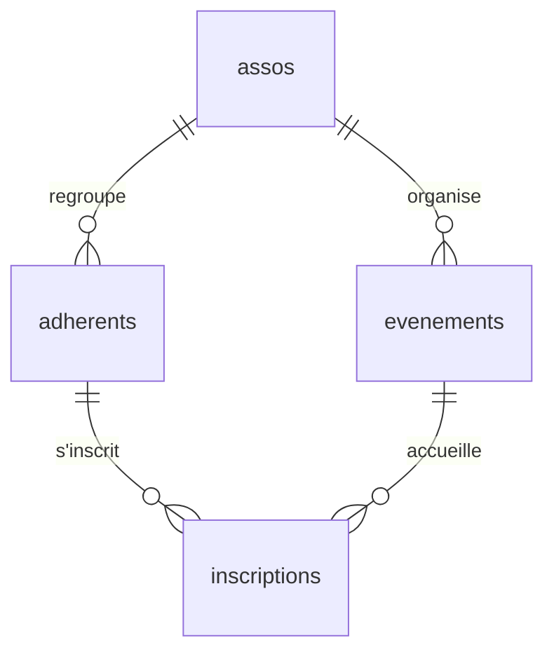

Tu ouvres le schéma d'un projet de l'équipe et tu vois des dizaines de tables qui se répondent à coups de `asso_id`, `user_id` ou `event_id`. Avant d'écrire la moindre requête, il faut comprendre ce que racontent ces colonnes. Et avant cela, il faut comprendre ce qu'est une base de données. Ici, on part de zéro : aucune connaissance préalable n'est nécessaire.

## Une base de données, et SQL : à quoi ça sert ?

Une application web (le site d'une association, une boutique en ligne) doit **se souvenir** de choses : qui est inscrit·e, quels événements existent, qui a payé. Ces informations ne peuvent pas rester dans la mémoire du programme, qui s'efface quand il s'arrête, ni dans un tableur partagé par dix personnes qui l'éditent en même temps. On les confie à une **base de données** : un logiciel dont le seul métier est de **ranger des informations de façon durable, de les retrouver vite, et d'empêcher qu'elles deviennent incohérentes**.

Ce logiciel s'appelle un **SGBD** (système de gestion de base de données). **PostgreSQL** est l'un des plus répandus, et c'est celui des projets de l'équipe. Il fonctionne en mode **client-serveur** :

- le **serveur** est le programme PostgreSQL, qui garde les données et attend qu'on lui parle ;
- un **client** est un programme qui lui envoie des demandes et affiche les réponses. Dans ce parcours, ton client est **`psql`**, un outil que l'on tape dans le terminal. Une application (Django, par exemple) est aussi un client.

Pour parler au serveur, on utilise **SQL** (*Structured Query Language*, « langage de requêtes structuré »). Une **requête** est une demande écrite en SQL : « donne-moi les adhérent·e·s de la Robotique », « ajoute cette personne », « supprime cette ligne ». Une requête se termine toujours par un **point-virgule** `;`, qui dit au serveur « j'ai fini, exécute ».

:::info Comment exécuter une requête dans les labos
Chaque labo de ce parcours te prête un vrai terminal Linux, avec **un serveur PostgreSQL déjà démarré** et une base vide ou remplie qui s'appelle `asso`. Trois façons d'y envoyer du SQL :

- `psql` seul ouvre une **session interactive** : l'invite `asso=#` apparaît, tu tapes une requête terminée par `;`, tu lis la réponse. `\q` quitte `psql` ; `\d` liste les tables ; `\d adherents` décrit une table.
- `psql -c "SELECT 1;"` exécute **une** requête (`-c` comme *command*) puis rend la main : pratique pour un one-liner et pour les labos.
- `psql -f demande.sql` exécute toutes les requêtes contenues dans le fichier `demande.sql` (`-f` comme *file*).

Les étapes du labo sont vérifiées par le serveur du portail, qui interroge ta base et regarde le **résultat** : tu peux donc choisir la façon qui te convient.
:::

:::info Vocabulaire à connaître
- **Schéma** : le plan de la base, c'est-à-dire la liste de ses tables, de leurs colonnes et de leurs règles. Dans ce parcours, « le schéma » désigne ce plan (PostgreSQL emploie aussi ce mot pour un « dossier » qui regroupe des tables, mais on n'en a pas besoin ici).
- **Type** : la nature de ce que contient une colonne (nombre entier, texte, date…). PostgreSQL refuse un texte dans une colonne de nombres.
- **`timestamptz`** : un type « horodatage avec fuseau horaire » (*timestamp with time zone*), c'est-à-dire un instant précis : date, heure et décalage (`2026-11-12 20:00+01` se lit « le 12 novembre 2026 à 20 h, heure d'Europe de l'Ouest en hiver »). PostgreSQL le convertit et le stocke sans ambiguïté.
- **`now()`** : une fonction que PostgreSQL remplace par l'instant présent. `CURRENT_DATE` fait de même pour la seule date du jour.
- **Ligne** (ou enregistrement) : un élément rangé dans une table. **Colonne** (ou champ) : une propriété que toutes les lignes possèdent.
- **`NULL`** : « pas de valeur » (inconnue ou absente). Ce n'est ni zéro ni une chaîne vide.
:::

On travaille, dans tout le parcours, sur un **schéma fictif** : des associations, leurs adhérent·e·s, leurs événements et les inscriptions. Il ne vient d'aucun projet réel de l'équipe, mais il ressemble à ce que tu y croiseras. Dans cette leçon, **tu le construis toi-même** dans le labo.

## Une table, des lignes, des colonnes

PostgreSQL est une base de données **relationnelle** : les données sont rangées dans des **tables**. Une table est un tableau :

- chaque **colonne** a un nom et un **type** : `integer` (nombre entier), `text` (texte de longueur libre), `date` (un jour), `timestamptz` (un instant précis, voir l'encadré plus haut), `boolean` (vrai ou faux)… ;
- chaque **ligne** décrit une chose (une association, une personne).

Par exemple, la table `assos` contient une ligne par association, avec les colonnes `id`, `nom` et `cree_le`. Le même nom de colonne peut exister dans plusieurs tables (`nom` existe dans `assos` et dans `adherents`) : il ne désigne la même chose que dans sa propre table.

Une colonne peut porter des **contraintes** qui protègent les données :

| Contrainte | Rôle |
| --- | --- |
| `PRIMARY KEY` | Clé primaire : identifie une ligne de façon unique (jamais vide, jamais en double) |
| `REFERENCES` | Clé étrangère : la valeur doit exister dans une autre table |
| `NOT NULL` | La colonne ne peut pas rester vide |
| `UNIQUE` | Deux lignes ne peuvent pas avoir la même valeur |
| `DEFAULT` | Valeur utilisée quand on n'en donne pas |

## Relier les tables

Plutôt que de recopier le nom de l'association dans chaque adhérent·e (il faudrait le corriger partout si elle change de nom), on stocke **son identifiant**, un numéro unique. La colonne `adherents.asso_id` est une **clé étrangère** : elle pointe vers la clé primaire `assos.id`.



Lis chaque trait comme une phrase : « une association regroupe plusieurs adhérent·e·s ». La table `inscriptions` relie adhérent·e·s et événements : une personne peut s'inscrire à plusieurs événements, un événement accueille plusieurs personnes.

## Créer le schéma

`CREATE TABLE` est l'instruction SQL qui **crée** une table. On crée d'abord les tables **référencées** (`assos`), puis celles qui les référencent. Voici la première, ligne par ligne :

```sql
CREATE TABLE assos (
    id       integer GENERATED ALWAYS AS IDENTITY PRIMARY KEY,
    nom      text NOT NULL UNIQUE,
    cree_le  date NOT NULL DEFAULT CURRENT_DATE
);
```

- `CREATE TABLE assos (` : « crée une table nommée `assos` », dont la liste de colonnes suit entre parenthèses.
- `id integer GENERATED ALWAYS AS IDENTITY PRIMARY KEY,` : une colonne `id`, de type nombre entier, numérotée automatiquement par PostgreSQL (1, 2, 3…), qui sert de clé primaire.
- `nom text NOT NULL UNIQUE,` : le nom de l'association, obligatoire et sans doublon.
- `cree_le date NOT NULL DEFAULT CURRENT_DATE` : la date de création, obligatoire ; si on ne la donne pas, PostgreSQL met la date du jour.
- `);` : on ferme la parenthèse et on termine l'instruction par `;`. Les virgules séparent les colonnes (pas de virgule après la dernière).

Les quatre tables du schéma complet :

```sql
CREATE TABLE assos (
    id       integer GENERATED ALWAYS AS IDENTITY PRIMARY KEY,
    nom      text NOT NULL UNIQUE,
    cree_le  date NOT NULL DEFAULT CURRENT_DATE
);

CREATE TABLE adherents (
    id       integer GENERATED ALWAYS AS IDENTITY PRIMARY KEY,
    prenom   text NOT NULL,
    nom      text NOT NULL,
    email    text NOT NULL UNIQUE,
    asso_id  integer REFERENCES assos (id)
);

CREATE TABLE evenements (
    id               integer GENERATED ALWAYS AS IDENTITY PRIMARY KEY,
    asso_id          integer NOT NULL REFERENCES assos (id),
    titre            text NOT NULL,
    lieu             text,
    debut            timestamptz NOT NULL,
    places_restantes integer NOT NULL DEFAULT 0
);

CREATE TABLE inscriptions (
    adherent_id  integer REFERENCES adherents (id) ON DELETE CASCADE,
    evenement_id integer REFERENCES evenements (id),
    inscrit_le   timestamptz NOT NULL DEFAULT now(),
    PRIMARY KEY (adherent_id, evenement_id)
);
```

Ce qu'il faut lire dans les trois autres :

- `GENERATED ALWAYS AS IDENTITY` : PostgreSQL numérote tout seul les lignes (1, 2, 3…). On ne fournit jamais l'`id`.
- `REFERENCES assos (id)` : « cette colonne doit contenir un `id` qui existe dans `assos` » (la clé étrangère).
- `timestamptz NOT NULL DEFAULT now()` (dans `inscriptions.inscrit_le`) : l'instant de l'inscription est enregistré automatiquement, grâce à `now()`.
- `adherents.asso_id` n'a pas de `NOT NULL` : une personne peut ne rattacher aucune association.
- `ON DELETE CASCADE` : si on supprime un·e adhérent·e, ses inscriptions disparaissent avec elle.
- `PRIMARY KEY (adherent_id, evenement_id)` : une clé **composée**. Une personne ne peut pas s'inscrire deux fois au même événement.

:::tip
Les projets plus anciens déclarent souvent `serial` au lieu de `GENERATED ALWAYS AS IDENTITY`. Le résultat est le même pour toi : une colonne numérotée automatiquement.
:::

## Insérer des lignes

`INSERT INTO table (colonnes) VALUES (valeurs)` ajoute des lignes. Les valeurs sont données **dans l'ordre des colonnes** annoncées ; le texte et les dates s'écrivent entre **apostrophes** simples (`'Ciné-club'`). On ne donne pas `id` : il est généré.

```sql
INSERT INTO assos (nom, cree_le) VALUES
    ('Ciné-club', '2019-09-01'),
    ('Robotique', '2021-02-15'),
    ('Jazz',      '2023-10-01');

INSERT INTO adherents (prenom, nom, email, asso_id) VALUES
    ('Alice', 'Martin', 'alice.martin@example.org', 1),
    ('Bilal', 'Haddad', 'bilal.haddad@example.org', 1),
    ('Chloé', 'Durand', 'chloe.durand@example.org', 2),
    ('David', 'Roux',   'david.roux@example.org',    2);
```

```console
INSERT 0 3
INSERT 0 4
```

`INSERT 0 3` signifie « 3 lignes insérées » (le `0` est un détail historique). Chaque association a reçu un `id` : Ciné-club le 1, Robotique le 2, Jazz le 3, d'où les `asso_id` 1 et 2 des adhérent·e·s ci-dessus. Ajoute `RETURNING id` pour récupérer l'identifiant généré :

```sql
INSERT INTO adherents (prenom, nom, email, asso_id)
VALUES ('Emma', 'Petit', 'emma.petit@example.org', NULL)
RETURNING id;
```

```console
 id
----
  5
(1 row)

INSERT 0 1
```

Emma n'a pas d'association : `NULL` veut dire « pas de valeur ». `RETURNING id` a affiché le numéro attribué (5). On termine avec les événements et les inscriptions, utilisés dans toutes les leçons suivantes (dans le labo de cette leçon, tu crées seulement `assos` et `adherents` ; les labos suivants démarrent avec les quatre tables déjà remplies) :

```sql
INSERT INTO evenements (asso_id, titre, lieu, debut, places_restantes) VALUES
    (1, 'Soirée Kubrick',     'Salle A', '2026-11-12 20:00+01', 30),
    (1, 'Courts-métrages',    'Salle B', '2026-12-03 19:30+01', 20),
    (2, 'Coupe de robotique', 'Gymnase', '2026-11-21 14:00+01', 10),
    (2, 'Atelier soudure',    NULL,      '2026-12-10 18:00+01',  8);

INSERT INTO inscriptions (adherent_id, evenement_id) VALUES
    (1, 1), (2, 1), (1, 2), (3, 3), (4, 3), (3, 4);
```

## Les contraintes te protègent

PostgreSQL refuse ce qui casserait les règles. Deux erreurs que tu verras souvent (les messages sont en anglais par défaut) :

```sql
INSERT INTO assos (nom) VALUES ('Jazz');
```

```console
ERROR:  duplicate key value violates unique constraint "assos_nom_key"
DETAIL:  Key (nom)=(Jazz) already exists.
```

```sql
INSERT INTO adherents (prenom, nom, email, asso_id)
VALUES ('Farid', 'Benali', 'farid.benali@example.org', 99);
```

```console
ERROR:  insert or update on table "adherents" violates foreign key constraint "adherents_asso_id_fkey"
DETAIL:  Key (asso_id)=(99) is not present in table "assos".
```

Le nom de la contrainte (`assos_nom_key`, `adherents_asso_id_fkey`) est construit à partir de la table et de la colonne : il t'indique d'un coup d'œil où chercher.

:::warning Mauvais type, mauvais réflexe
Range une date dans une colonne `date` ou `timestamptz`, pas dans un `text`. Avec le bon type, PostgreSQL sait trier, comparer et calculer. Avec du texte, `'10/12/2026'` passe avant `'2/1/2026'`.
:::

## Entraîne-toi

:::lab
engine: real
intro: |
  Un serveur PostgreSQL est déjà démarré dans ton conteneur, avec une base **vide** nommée `asso`. Tu y construis le début du schéma : les tables `assos` et `adherents`, puis tu y ranges des données. Envoie chaque requête avec `psql -c "…"` (une requête, puis tu récupères le terminal) ou tape `psql` pour une session interactive (n'oublie pas le `;` final, et `\q` pour quitter). Chaque étape est vérifiée sur **l'état de la base**, pas sur ce que tu as tapé.
commands:
  - /opt/exercices/demarrer.sh
steps:
  - text: 'Crée la table `assos` avec les colonnes `id` (clé primaire numérotée automatiquement), `nom` (texte obligatoire et unique) et `cree_le` (date obligatoire, par défaut la date du jour)'
    hint: 'Reprends le `CREATE TABLE assos (…)` du cours : `psql -c "CREATE TABLE assos (id integer GENERATED ALWAYS AS IDENTITY PRIMARY KEY, nom text NOT NULL UNIQUE, cree_le date NOT NULL DEFAULT CURRENT_DATE);"`. Vérifie ensuite avec `psql -c "\d assos"`.'
    checks:
      - output-contains:
          - psql -Atc "SELECT count(*) FROM pg_constraint WHERE conrelid = to_regclass('assos') AND contype IN ('p', 'u')"
          - '^2$'
      - output-contains:
          - psql -Atc "SELECT count(*) FROM information_schema.columns WHERE table_name = 'assos' AND column_name IN ('id', 'nom', 'cree_le')"
          - '^3$'
    solution:
      - psql -c "CREATE TABLE assos (id integer GENERATED ALWAYS AS IDENTITY PRIMARY KEY, nom text NOT NULL UNIQUE, cree_le date NOT NULL DEFAULT CURRENT_DATE);"
  - text: 'Crée la table `adherents` avec `id` (clé primaire numérotée automatiquement), `prenom`, `nom` et `email` (textes obligatoires, `email` unique) et `asso_id` : une **clé étrangère** facultative vers `assos (id)`'
    hint: 'La clé étrangère s''écrit `asso_id integer REFERENCES assos (id)`, sans `NOT NULL` puisqu''une personne peut n''avoir aucune association.'
    after: [1]
    checks:
      - output-contains:
          - psql -Atc "SELECT count(*) FROM pg_constraint WHERE conrelid = to_regclass('adherents') AND contype = 'f' AND confrelid = to_regclass('assos')"
          - '^1$'
      - output-contains:
          - psql -Atc "SELECT count(*) FROM information_schema.columns WHERE table_name = 'adherents' AND column_name IN ('id', 'prenom', 'nom', 'email', 'asso_id')"
          - '^5$'
    solution:
      - psql -c "CREATE TABLE adherents (id integer GENERATED ALWAYS AS IDENTITY PRIMARY KEY, prenom text NOT NULL, nom text NOT NULL, email text NOT NULL UNIQUE, asso_id integer REFERENCES assos (id));"
  - text: 'Insère les trois associations `Ciné-club` (créée le `2019-09-01`), `Robotique` (`2021-02-15`) et `Jazz` (`2023-10-01`), dans cet ordre'
    hint: 'Un seul `INSERT INTO assos (nom, cree_le) VALUES (…), (…), (…);` suffit. Le texte et les dates s''écrivent entre apostrophes.'
    after: [1]
    checks:
      - output-contains:
          - psql -Atc "SELECT string_agg(id || ':' || nom, ',' ORDER BY id) FROM assos"
          - '^1:Ciné-club,2:Robotique,3:Jazz$'
    solution:
      - psql -c "INSERT INTO assos (nom, cree_le) VALUES ('Ciné-club', '2019-09-01'), ('Robotique', '2021-02-15'), ('Jazz', '2023-10-01');"
  - text: 'Insère quatre adhérent·e·s : Alice Martin et Bilal Haddad dans le `Ciné-club` (`asso_id` 1), Chloé Durand et David Roux dans la `Robotique` (`asso_id` 2), avec les e-mails `prenom.nom@example.org` en minuscules et sans accent (`chloe.durand@example.org`)'
    hint: 'Un `INSERT INTO adherents (prenom, nom, email, asso_id) VALUES (…), (…), (…), (…);`. Le dernier nombre de chaque ligne est l''`id` de l''association.'
    after: [2, 3]
    checks:
      - output-contains:
          - psql -Atc "SELECT string_agg(a.prenom || '>' || s.nom || '>' || a.email, ' ' ORDER BY a.prenom) FROM adherents a JOIN assos s ON s.id = a.asso_id"
          - '^Alice>Ciné-club>alice.martin@example.org Bilal>Ciné-club>bilal.haddad@example.org Chloé>Robotique>chloe.durand@example.org David>Robotique>david.roux@example.org$'
    solution:
      - psql -c "INSERT INTO adherents (prenom, nom, email, asso_id) VALUES ('Alice', 'Martin', 'alice.martin@example.org', 1), ('Bilal', 'Haddad', 'bilal.haddad@example.org', 1), ('Chloé', 'Durand', 'chloe.durand@example.org', 2), ('David', 'Roux', 'david.roux@example.org', 2);"
  - text: 'Insère Emma Petit (`emma.petit@example.org`) **sans association** (`asso_id` à `NULL`) et fais afficher son `id` avec `RETURNING id`'
    hint: 'Ajoute `RETURNING id` à la fin de ton `INSERT`, avant le `;`. Pour l''association, écris `NULL` sans apostrophes.'
    after: [4]
    checks:
      - output-contains:
          - psql -Atc "SELECT id || ':' || (asso_id IS NULL) FROM adherents WHERE email = 'emma.petit@example.org'"
          - '^5:true$'
    solution:
      - psql -c "INSERT INTO adherents (prenom, nom, email, asso_id) VALUES ('Emma', 'Petit', 'emma.petit@example.org', NULL) RETURNING id;"
:::

## Vérifie tes acquis

:::quiz
Dans `adherents`, la colonne `asso_id` contient `2`. Que représente cette valeur ?

- [ ] Le nombre d'adhérent·e·s de l'association
- [ ] Le rang de la personne dans l'association
- [x] L'identifiant d'une ligne de la table `assos`
- [ ] Un code libre, sans lien avec une autre table

> C'est une clé étrangère : elle référence la clé primaire `assos.id`, et PostgreSQL vérifie que cette ligne existe.
:::

:::quiz
Pourquoi crée-t-on `assos` avant `adherents` ?

- [x] Parce que `adherents` référence `assos` : la table cible doit déjà exister
- [ ] Parce que PostgreSQL crée les tables dans l'ordre alphabétique
- [ ] Parce qu'une table sans clé étrangère est plus rapide à créer
- [ ] Parce que `assos` contient plus de lignes

> Une clé étrangère ne peut pointer que vers une table (et une colonne unique) qui existe déjà.
:::

:::quiz
Que se passe-t-il avec `INSERT INTO adherents (prenom, nom, email, asso_id) VALUES ('Farid', 'Benali', 'farid.benali@example.org', 99);` si aucune association n'a l'`id` 99 ?

- [ ] La ligne est créée avec `asso_id` à `NULL`
- [ ] La ligne est créée et l'association 99 est ajoutée automatiquement
- [x] PostgreSQL refuse l'insertion avec une erreur de clé étrangère
- [ ] La ligne est créée mais marquée comme invalide

> La contrainte `REFERENCES` interdit les références orphelines. Rien n'est inséré.
:::

:::quiz
Que garantit `PRIMARY KEY (adherent_id, evenement_id)` sur `inscriptions` ?

- [ ] Qu'une personne ne peut s'inscrire qu'à un seul événement
- [ ] Qu'un événement ne peut accueillir qu'une seule personne
- [x] Qu'une même personne ne peut pas être inscrite deux fois au même événement
- [ ] Que les deux colonnes sont numérotées automatiquement

> C'est la **combinaison** des deux colonnes qui doit être unique. Une personne peut avoir plusieurs inscriptions, mais pas deux pour le même événement.
:::
