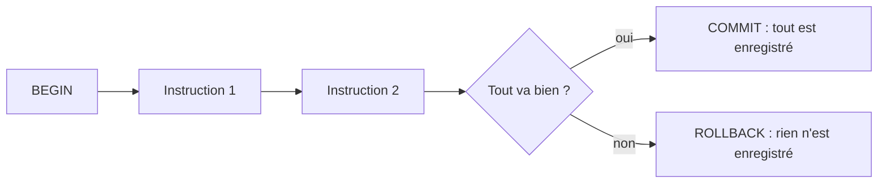

Une personne s'inscrit à un événement : il faut **ajouter l'inscription** et **retirer une place**. Si le serveur plante entre les deux, tu te retrouves avec une inscription sans place retirée, ou l'inverse. Les transactions existent pour que ça n'arrive jamais.

## Tout ou rien

Une **transaction** regroupe plusieurs instructions en un seul bloc **atomique** (« indivisible », comme un atome) : soit tout est enregistré, soit rien ne l'est. On l'ouvre avec `BEGIN`, on la **valide** avec `COMMIT` (« enregistre pour de bon ») ou on l'**annule** avec `ROLLBACK` (« reviens en arrière »).



Sans `BEGIN`, chaque instruction est sa propre transaction, validée immédiatement.

```sql
BEGIN;

INSERT INTO inscriptions (adherent_id, evenement_id) VALUES (4, 4);
UPDATE evenements SET places_restantes = places_restantes - 1 WHERE id = 4;

COMMIT;
```

```console
BEGIN
INSERT 0 1
UPDATE 1
COMMIT
```

Ligne par ligne : `BEGIN;` ouvre la transaction. `INSERT …` inscrit David (adhérent 4) à l'Atelier soudure (événement 4). `UPDATE evenements SET … WHERE id = 4;` modifie la ligne de l'événement 4 : `SET colonne = valeur` dit quoi changer, `WHERE` dit quelle ligne. `COMMIT;` enregistre l'ensemble. Les réponses (`INSERT 0 1`, `UPDATE 1`) indiquent le nombre de lignes touchées.

Les autres sessions ne voient rien avant le `COMMIT`. Si tu changes d'avis avant, `ROLLBACK` annule tout depuis le `BEGIN`.

Remarque que l'on écrit `places_restantes = places_restantes - 1` : PostgreSQL fait le calcul lui-même, sur la valeur la plus récente. Lire la valeur dans l'application, retirer 1 puis la réécrire expose à des erreurs quand deux personnes s'inscrivent en même temps.

## Les contraintes comme garde-fous

Une transaction protège la **cohérence d'un enchaînement** ; une contrainte (règle déclarée sur une table, vue à la première leçon) protège **chaque ligne**. Ensemble, elles évitent des états impossibles, comme un nombre de places négatif. `CHECK (condition)` refuse toute ligne qui ne vérifie pas la condition. `ALTER TABLE` (« modifie la table ») change la structure d'une table qui existe déjà ; ici `ADD CONSTRAINT nom` y ajoute une règle nommée :

```sql
ALTER TABLE evenements
    ADD CONSTRAINT evenements_places_positives CHECK (places_restantes >= 0);
```

```console
ALTER TABLE
```

PostgreSQL vérifie d'abord les lignes existantes : si l'une d'elles viole la règle, la contrainte est refusée. Imaginons maintenant que l'atelier soudure n'ait plus de place, et qu'Emma tente de s'y inscrire :

```sql
UPDATE evenements SET places_restantes = 0 WHERE id = 4;

BEGIN;
INSERT INTO inscriptions (adherent_id, evenement_id) VALUES (5, 4);
UPDATE evenements SET places_restantes = places_restantes - 1 WHERE id = 4;
```

```console
UPDATE 1
BEGIN
INSERT 0 1
ERROR:  new row for relation "evenements" violates check constraint "evenements_places_positives"
```

La transaction est maintenant **en échec** : PostgreSQL refuse tout le reste jusqu'à la fin du bloc.

```sql
SELECT count(*) FROM inscriptions WHERE adherent_id = 5;
COMMIT;
```

```console
ERROR:  current transaction is aborted, commands ignored until end of transaction block
ROLLBACK
```

Même en écrivant `COMMIT`, PostgreSQL répond `ROLLBACK` : rien n'est enregistré. L'inscription d'Emma, pourtant acceptée juste avant l'erreur, a disparu avec le reste :

```sql
SELECT count(*) FROM inscriptions WHERE adherent_id = 5;
```

```console
 count
-------
     0
(1 row)
```

:::info PostgreSQL annule aussi les changements de schéma
Contrairement à d'autres bases, PostgreSQL gère `CREATE TABLE` et `ALTER TABLE` dans une transaction : on peut les annuler avec `ROLLBACK`. Tu t'en serviras pour les migrations.
:::

## UPDATE et DELETE : le réflexe de sécurité

`UPDATE` et `DELETE` s'écrivent comme `SELECT … WHERE`. Sans `WHERE`, ils touchent **toutes** les lignes de la table.

:::danger Pas de WHERE, pas de retour en arrière
`UPDATE evenements SET lieu = 'Salle A';` place tous les événements en Salle A. Une fois validé, c'est fini (sauf sauvegarde). Prends le réflexe : ouvre une transaction, lance la requête, **lis le nombre de lignes touchées** dans la réponse (`UPDATE 1` ? `UPDATE 5000` ?), puis `COMMIT` ou `ROLLBACK`.
:::

```sql
BEGIN;
UPDATE adherents SET email = 'emma.petit@example.net' WHERE id = 5;
```

```console
BEGIN
UPDATE 1
```

`UPDATE 1` : une seule ligne touchée, c'est ce qu'on attendait. On valide avec `COMMIT;`. Si le compteur avait annoncé 5, on aurait tapé `ROLLBACK;`.

## Entraîne-toi

:::lab
engine: real
intro: |
  Les quatre tables sont chargées dans la base `asso` : l'événement `4` (Atelier soudure) a `8` places, David est l'adhérent `4`, Emma l'adhérente `5`. Envoie du SQL avec `psql -c "…"` ou dans une session interactive `psql` (`\q` pour quitter). Avec `-c`, plusieurs instructions séparées par `;` forment déjà un seul bloc : si l'une échoue, rien n'est enregistré. Chaque étape est vérifiée sur l'état de la base.
commands:
  - /opt/exercices/demarrer.sh
  - psql -q -v ON_ERROR_STOP=1 -f /opt/exercices/schema.sql -f /opt/exercices/donnees.sql
steps:
  - text: 'En **une seule transaction** (`BEGIN` … `COMMIT`), inscris David (`adherent_id` 4) à l''Atelier soudure (`evenement_id` 4) et retire une place à l''événement 4 avec `places_restantes = places_restantes - 1`'
    hint: 'psql -c "BEGIN; INSERT INTO inscriptions (adherent_id, evenement_id) VALUES (4, 4); UPDATE evenements SET places_restantes = places_restantes - 1 WHERE id = 4; COMMIT;"'
    checks:
      - output-contains:
          - psql -Atc "SELECT (SELECT count(*) FROM inscriptions WHERE adherent_id = 4 AND evenement_id = 4) || '/' || (SELECT places_restantes <= 7 FROM evenements WHERE id = 4)"
          - '^1/true$'
    solution:
      - psql -c "BEGIN; INSERT INTO inscriptions (adherent_id, evenement_id) VALUES (4, 4); UPDATE evenements SET places_restantes = places_restantes - 1 WHERE id = 4; COMMIT;"
  - text: 'Ajoute à `evenements` une contrainte `CHECK` nommée `evenements_places_positives` qui impose `places_restantes >= 0`'
    hint: 'psql -c "ALTER TABLE evenements ADD CONSTRAINT evenements_places_positives CHECK (places_restantes >= 0);"'
    checks:
      - output-contains:
          - psql -Atc "SELECT conname FROM pg_constraint WHERE conrelid = to_regclass('evenements') AND contype = 'c'"
          - '^evenements_places_positives$'
      - command-fails: psql -v ON_ERROR_STOP=1 -c "BEGIN; UPDATE evenements SET places_restantes = -1 WHERE id = 1; ROLLBACK;"
    solution:
      - psql -c "ALTER TABLE evenements ADD CONSTRAINT evenements_places_positives CHECK (places_restantes >= 0);"
  - text: 'Corrige l''e-mail d''Emma (`id` 5) en `emma.petit@example.net` avec un `UPDATE` qui a bien un `WHERE`, et lis le message `UPDATE 1`'
    hint: 'Commande : `psql -c "UPDATE adherents SET email = ''emma.petit@example.net'' WHERE id = 5;"`. Le compteur doit annoncer une seule ligne.'
    checks:
      - output-contains:
          - psql -Atc "SELECT email FROM adherents WHERE id = 5"
          - '^emma\.petit@example\.net$'
    solution:
      - psql -c "UPDATE adherents SET email = 'emma.petit@example.net' WHERE id = 5;"
  - text: 'L''Atelier soudure est complet : mets ses `places_restantes` à `0`, sans toucher aux autres événements. La contrainte `CHECK` doit rester respectée'
    hint: 'Un `UPDATE evenements SET places_restantes = 0 WHERE id = 4;`. Sans `WHERE`, tu viderais tous les événements !'
    after: [1, 2]
    checks:
      - output-contains:
          - psql -Atc "SELECT string_agg(places_restantes::text, ',' ORDER BY id) FROM evenements"
          - '^30,20,10,0$'
    solution:
      - psql -c "UPDATE evenements SET places_restantes = 0 WHERE id = 4;"
:::

## Vérifie tes acquis

:::quiz
Dans une transaction, la deuxième instruction échoue. Que devient la première après `ROLLBACK` ?

- [ ] Elle reste enregistrée, seule la seconde est annulée
- [ ] Elle est enregistrée à moitié
- [x] Elle est annulée avec la seconde
- [ ] Elle est mise en attente jusqu'au prochain `COMMIT`

> Une transaction est atomique : tout est validé ensemble ou tout est annulé ensemble.
:::

:::quiz
Que répond PostgreSQL à `COMMIT;` si une instruction précédente de la transaction a échoué ?

- [ ] `COMMIT`, et il enregistre les instructions qui avaient réussi
- [x] `ROLLBACK` : la transaction est annulée
- [ ] Une erreur de syntaxe
- [ ] Il rouvre automatiquement une nouvelle transaction

> Une transaction en échec ne peut plus être validée. Elle se termine par un `ROLLBACK`, même si tu as tapé `COMMIT`.
:::

:::quiz
Pourquoi écrire `SET places_restantes = places_restantes - 1` plutôt que `SET places_restantes = 29` calculé dans l'application ?

- [ ] Parce que `29` est interdit par la contrainte `CHECK`
- [ ] Parce que PostgreSQL refuse les constantes dans un `UPDATE`
- [ ] Parce que ça évite d'écrire un `WHERE`
- [x] Parce que la base calcule à partir de la valeur la plus récente, même si d'autres personnes s'inscrivent en parallèle

> Une valeur lue puis recalculée côté application peut être périmée quand l'écriture arrive.
:::

:::quiz
Tu dois corriger l'adresse d'une personne avec un `UPDATE`. Quel est le bon réflexe ?

- [ ] Lancer l'`UPDATE` directement, on peut toujours annuler plus tard
- [ ] Ajouter `LIMIT 1` à la fin
- [x] Ouvrir une transaction, vérifier le `WHERE` et le nombre de lignes touchées, puis valider
- [ ] Supprimer la ligne et la recréer

> Le compteur renvoyé par `UPDATE` te dit combien de lignes ont changé. Tant que tu n'as pas fait `COMMIT`, tu peux encore annuler.
:::
