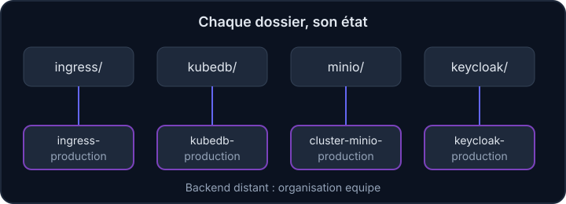

## À quoi ça sert et pourquoi

Imagine un inventaire de magasin : sans lui, impossible de savoir ce qui est déjà en rayon et ce qu'il faut commander. L'état est cet inventaire. Comprendre où il est, qui peut le lire et comment il se perd évite les pires incidents Terraform.

Terraform ne « devine » pas ce qui existe déjà dans le cluster : il consulte un **état** (*state*), une sorte de carnet qui associe chaque ressource du code à l'objet réel. Sans lui, Terraform croit que tout est à créer.

## À quoi sert l'état ?

- Faire le lien entre `kubernetes_secret.minio` (dans le code) et le secret réel du cluster.
- Mémoriser les valeurs générées, comme celles de `random_string` : relancer Terraform sans l'état produirait **d'autres** mots de passe.
- Accélérer les plans en évitant d'interroger tous les services (leurs API) à chaque fois.

:::warning L'état contient des secrets en clair
Les mots de passe générés par `random_string`, les clés d'API passées en variable, les certificats : tout cela est enregistré dans l'état, même avec `sensitive = true`. Donne l'accès à l'état aux seules personnes qui peuvent déjà administrer le cluster.
:::

## Un état local, pourquoi ce n'est pas assez

Par défaut, l'état est un fichier `terraform.tfstate` dans le dossier de travail. À plusieurs personnes, c'est un piège : chacune a sa copie, les versions divergent, deux `apply` simultanés se marchent dessus. Perdre le fichier revient à oublier toute l'infrastructure.

C'est pourquoi le `README.md` du dépôt indique : *ne pas oublier de stocker l'état quelque part*, et précise qu'il utilise le **backend distant** (*remote*) de Terraform.

## Le backend du dépôt

Un **backend** est l'endroit où Terraform range son état. Chaque dossier (`ingress/`, `keycloak/`, `kubedb/`, `minio/`, `helm-setup/`) commence par un bloc `terraform { backend "remote" { … } }`. Exemple de `keycloak/main.tf` :

```hcl
terraform {
  backend "remote" {
    organization = "equipe"
    workspaces {
      prefix = "keycloak-"
    }
  }
}
```

Ligne par ligne :

- `terraform { … }` : le bloc de réglages de Terraform lui-même ;
- `backend "remote"` : l'état est conservé sur un service distant plutôt que sur ton disque.
- `organization` : l'organisation sur le service distant qui héberge l'état.
- `workspaces { prefix = "keycloak-" }` : les workspaces de ce dossier s'appellent `keycloak-…`. Les dossiers ont chacun leur préfixe (`ingress-`, `kubedb-`, `cluster-minio-`, `helm-`), donc **chacun a son propre état**.
- Le service distant conserve l'état, gère un **verrou** (une seule personne applique à la fois) et garde un historique des versions.



Cette séparation limite les dégâts : une erreur dans `keycloak/` ne peut pas détruire par accident l'état de `minio/`.

## Les commandes utiles autour de l'état

```bash
terraform state list                       # liste les ressources suivies
terraform state show random_string.access_key   # détail d'une ressource
```

Si tu t'exerces en local, `terraform.tfstate` est un fichier texte (au format JSON : des paires `"clé": valeur`) que tu peux ouvrir avec `cat`, mais il ne faut jamais l'éditer à la main.

`state list` affiche les ressources connues de Terraform ; `state show` détaille l'une d'elles (la sortie contient parfois des secrets : ne la partage pas). D'autres commandes (`state rm`, `state mv`, `import`) **modifient** l'état : `state rm` fait oublier une ressource à Terraform, `state mv` la renomme dans l'état, `import` rattache un objet déjà existant. Elles servent à des opérations délicates. Ne les lance jamais sans une copie de l'état et l'accord d'une personne expérimentée.

:::danger Ne modifie jamais l'état à la main
Une ressource « orpheline » existe toujours dans le cluster mais Terraform l'a oubliée : il ne la gérera plus, ou tentera de la recréer. Supprimer une ressource de l'état sans la supprimer du cluster la rend « orpheline » ; renommer une ressource dans le code sans `state mv` lui fait détruire l'ancienne et créer la nouvelle. Les deux se voient dans un plan : relis-le.
:::

:::info À confirmer avec l'équipe Infra
Le dépôt cite le *Terraform Remote backend* de 2019 (service hébergé de HashiCorp). Où l'état est-il stocké aujourd'hui, qui a accès à l'organisation `equipe`, et comment sont gérés les accès et les sauvegardes de l'état ? Ces informations ne figurent pas dans le dépôt. Par ailleurs, la syntaxe `backend "remote"` est remplacée dans les versions récentes par un bloc `cloud` (une écriture plus récente pour le même service) : y a-t-il une migration prévue ?
:::

## Entraîne-toi

:::info Un état local pour s'exercer
Dans la vraie vie, l'état de l'équipe est dans un backend distant. Ici, tu travailles avec l'état **local** (le fichier `terraform.tfstate`), qui contient la même chose et se lit de la même façon. Aucun fournisseur `helm` ou `kubernetes` n'est exécuté dans ce labo.
:::

Quelques commandes Linux serviront : `cp source destination` copie un fichier ; `commande > fichier` envoie le résultat d'une commande dans un fichier ; `grep texte fichier` cherche un texte dans un fichier ; `cat fichier` affiche le contenu d'un fichier ; `test -s fichier` vérifie qu'un fichier n'est pas vide.

:::lab
engine: real
intro: |
  Ton dossier contient un `main.tf` avec un nom aléatoire (`random_pet` fabrique un nom du genre `calm-otter`), un mot de passe aléatoire (`random_password`) et un fichier `rapport.txt`. Tu vas créer l'état, l'inspecter, constater qu'il contient un secret en clair, faire une sauvegarde, puis voir ce qui arrive quand une ressource est « oubliée » de l'état.
commands:
  - cp -R /opt/exercices/03-etat/. .
steps:
  - text: 'Initialise puis applique : `terraform init` puis `terraform apply -auto-approve`. Le fichier `terraform.tfstate` apparaît'
    hint: 'Deux commandes à la suite. À la fin, `ls` montre `terraform.tfstate` (l''état) et `rapport.txt`.'
    checks:
      - command-succeeds: 'terraform state list | grep -q "^local_file.rapport$" && terraform state list | grep -q "^random_password.admin$"'
      - command-succeeds: 'grep -qx "Service : $(terraform output -raw nom)" rapport.txt'
    solution:
      - terraform init
      - terraform apply -auto-approve
  - text: 'Écris la liste des ressources suivies par Terraform dans `etat.txt` : `terraform state list > etat.txt` (`>` envoie la sortie dans un fichier)'
    after: [1]
    hint: 'Le fichier doit contenir `local_file.rapport`, `random_password.admin` et `random_pet.nom`.'
    checks:
      - command-succeeds: 'terraform state list | cmp -s - etat.txt'
      - env-file-contains: [etat.txt, 'local_file\.rapport']
    solution:
      - terraform state list > etat.txt
  - text: 'La sortie `mot_de_passe` est marquée `sensitive`, donc masquée. Écris sa vraie valeur dans `fuite.txt` avec `terraform output -raw mot_de_passe > fuite.txt`, puis cherche cette valeur dans `terraform.tfstate` avec `grep`'
    after: [1]
    hint: 'Compare `terraform output` (qui affiche `<sensitive>`) et `terraform output -raw mot_de_passe`. Puis `grep "$(cat fuite.txt)" terraform.tfstate` : le mot de passe est en clair dans l''état.'
    checks:
      - command-succeeds: 'test -s fuite.txt && test "$(cat fuite.txt)" = "$(terraform output -raw mot_de_passe)" && grep -q "$(cat fuite.txt)" terraform.tfstate'
    solution:
      - terraform output -raw mot_de_passe > fuite.txt
      - grep "$(cat fuite.txt)" terraform.tfstate
  - text: 'Fais une sauvegarde de l''état avant toute opération délicate : `cp terraform.tfstate sauvegarde.tfstate`'
    after: [1]
    hint: '`cp source destination` copie un fichier. La sauvegarde doit contenir la ressource `rapport`.'
    checks:
      - env-file-contains: [sauvegarde.tfstate, '"name": "rapport"']
      - command-succeeds: 'cmp -s sauvegarde.tfstate terraform.tfstate'
    solution:
      - cp terraform.tfstate sauvegarde.tfstate
  - text: 'Fais « oublier » `local_file.rapport` à Terraform avec `terraform state rm local_file.rapport`. Le fichier `rapport.txt` reste sur le disque, mais n''est plus suivi : la ressource est devenue « orpheline »'
    after: [4]
    hint: 'Contrôle avec `terraform state list` : `local_file.rapport` a disparu. Lance aussi `terraform plan` : Terraform veut le créer, puisqu''il ne le connaît plus.'
    checks:
      - command-fails: 'terraform state list | grep -q rapport'
      - command-succeeds: 'terraform state list | grep -q "^random_pet.nom$"'
      - env-file-exists: rapport.txt
      - command-succeeds: 'terraform plan -input=false -detailed-exitcode > /dev/null; test $? -eq 2'
    solution:
      - terraform state rm local_file.rapport
  - text: 'Répare avec ta sauvegarde : `cp sauvegarde.tfstate terraform.tfstate`. `terraform state list` doit de nouveau citer `local_file.rapport` et `terraform plan -detailed-exitcode` doit répondre « aucun changement »'
    after: [5]
    hint: 'Une copie de l''état est ce qui te sauve ici. En production, c''est le backend distant qui garde l''historique des versions.'
    checks:
      - output-contains: ['terraform state list', 'local_file\.rapport']
      - command-succeeds: 'terraform plan -input=false -detailed-exitcode'
      - command-succeeds: 'cmp -s sauvegarde.tfstate terraform.tfstate'
    solution:
      - cp sauvegarde.tfstate terraform.tfstate
:::

## Vérifie tes acquis

:::quiz
Que se passe-t-il si Terraform n'a plus accès à l'état d'un dossier ?

- [ ] Il le reconstruit à partir du code
- [x] Il considère que rien n'existe et propose de tout recréer
- [ ] Il le lit directement dans le cluster Kubernetes
- [ ] Il bloque et ne propose aucun plan

> Sans état, le code est comparé à du vide : le plan veut tout créer, avec des conflits ou des doublons à la clé.
:::

:::quiz
Pourquoi l'état est-il considéré comme sensible ?

- [ ] Parce qu'il est très volumineux
- [ ] Parce qu'il contient le code source du dépôt
- [x] Parce qu'il contient en clair des valeurs comme des mots de passe générés
- [ ] Parce qu'il est modifié par chaque développeur·se

> `sensitive` masque l'affichage mais pas le contenu stocké : l'accès à l'état doit être restreint.
:::

:::quiz
Dans `keycloak/main.tf`, que fait `prefix = "keycloak-"` ?

- [ ] Il impose le préfixe aux noms des ressources Kubernetes
- [x] Il nomme les workspaces distants de ce dossier `keycloak-…`, donc un état propre
- [ ] Il chiffre l'état avec la clé « keycloak »
- [ ] Il copie l'état dans tous les autres dossiers

> Le préfixe isole l'état de chaque dossier dans le backend distant.
:::
