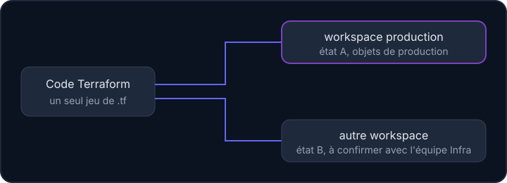

## À quoi ça sert et pourquoi

Une entreprise teste souvent ses changements dans un environnement d'essai avant de toucher à la production (celle que les vraies personnes utilisent). Terraform propose les **workspaces** pour garder un seul code et plusieurs « copies » indépendantes de l'infrastructure. Le risque est de se tromper de copie : cette leçon t'apprend à toujours vérifier où tu es.

Une même configuration peut servir plusieurs environnements. Terraform appelle cela des **workspaces** : un code unique, plusieurs états. Le `README.md` de `cluster-configuration` donne la consigne centrale : **tout le travail de production se fait dans le workspace `production`**.

## Un code, plusieurs états



Un workspace est avant tout **un état distinct**. Appliquer le même code dans deux workspaces crée deux jeux de ressources indépendants (si le code les distingue, voir plus bas). Sans autre précaution, un workspace ne protège pas le cluster : tous partagent les mêmes identifiants d'accès.

## Les commandes

```bash
terraform workspace list            # liste, * devant le workspace actif
terraform workspace show            # affiche le workspace actif
terraform workspace select production
```

Ligne par ligne : `list` affiche les workspaces (une étoile marque l'actif), `show` donne le nom du workspace actif, `select` en choisit un autre. Le `README.md` de `kubedb/` enchaîne justement `terraform init`, `terraform workspace select production`, puis un nouveau `terraform init`. Le deuxième `init` est utile : il prépare l'état du workspace choisi.

Avec le backend `remote` du dépôt, les workspaces sont préfixés par dossier : `terraform workspace select production` dans `keycloak/` sélectionne l'état distant `keycloak-production`.

:::warning Vérifie avant chaque plan
Le piège classique n'est pas une commande dangereuse, mais une commande lancée **au mauvais endroit**. Prends l'habitude de lancer `terraform workspace show` avant `plan`, et de lire l'en-tête du plan pour vérifier le cluster visé.
:::

## terraform.workspace dans le code

Le code peut lire le workspace actif. Dans `keycloak/main.tf`, le bucket de sauvegarde en dépend : `bucket = "keycloak-backup-${terraform.workspace}"`, soit `keycloak-backup-production` dans le workspace de production. Voici le même principe en syntaxe actuelle. `locals` calcule des valeurs : `bucket` insère le nom du workspace dans un texte ; `replicas_par_workspace` est un tableau « nom → nombre » ; `lookup(tableau, clé, défaut)` retourne la valeur de la clé, ou le défaut (1) si elle n'existe pas. Les `output` affichent les résultats.

```hcl
locals {
  bucket = "keycloak-backup-${terraform.workspace}"

  replicas_par_workspace = {
    production = 2
    default    = 1
  }

  replicas = lookup(local.replicas_par_workspace, terraform.workspace, 1)
}

output "bucket" {
  value = local.bucket
}

output "replicas" {
  value = local.replicas
}
```

Conséquence : **changer de workspace change les noms**. Dans un autre workspace, le même code créerait un bucket `keycloak-backup-…` différent.

## Les limites des workspaces

- Le dépôt ne définit que le workspace `production` dans ses instructions. Rien dans les fichiers ne prouve qu'un workspace `dev` ou équivalent existe.
- Une partie des valeurs est écrite en dur : le nom de domaine `sso.example.org`, l'espace de noms `keycloak`, le libellé `env = "production"`. Appliquer le code dans un autre workspace **sans les adapter** viserait les mêmes noms dans le cluster.
- Le workspace `default` existe toujours en local : ne l'utilise pas pour la production.

:::info À confirmer avec l'équipe Infra
Quels workspaces existent réellement (`production` seul, ou aussi un workspace de test) ? Un workspace de test vise-t-il le même cluster ou un cluster à part ? Le dépôt ne le dit pas : ne tente pas de déduire d'un nom de workspace où tu appliques.
:::

## Entraîne-toi

:::info Workspaces en local
Le backend distant de l'équipe est remplacé ici par le backend **local** : chaque workspace a son état dans `terraform.tfstate.d/<nom>/`. Le principe est identique. Aucun fournisseur `helm` ou `kubernetes` n'est exécuté dans ce labo.
:::

Commandes du labo : `terraform workspace new nom` crée un workspace et s'y place ; `terraform workspace delete nom` en supprime un (qui doit être vide et inactif) ; `terraform destroy` détruit tout ce que le workspace actif a créé ; `ls dossier` liste le contenu d'un dossier.

:::labo
moteur: reel
intro: |
  Ton dossier contient un `main.tf` inspiré de `keycloak/main.tf` : un fichier nommé `keycloak-backup-<workspace>.txt` contient le nombre de réplicas (2 dans `production`, 1 ailleurs). Tu vas créer deux workspaces, appliquer dans chacun, vérifier où tu es, puis nettoyer. Dans un terminal, `terraform workspace show` est ton réflexe avant chaque commande.
commandes:
  - cp -R /opt/exercices/04-workspaces/. .
etapes:
  - texte: 'Initialise le dossier avec `terraform init`'
    indice: 'La commande est `terraform init`.'
    verif:
      - commande-reussit: 'find -L .terraform/providers -name "terraform-provider-local*" -type f | grep -q . && grep -q "h1:" .terraform.lock.hcl'
    solution:
      - terraform init
  - texte: 'Crée le workspace `production` avec `terraform workspace new production` (Terraform s''y place aussitôt). Contrôle avec `terraform workspace list`'
    apres: [1]
    indice: 'La liste affiche une étoile devant le workspace actif. Avant, seul `default` existait.'
    verif:
      - sortie-contient: ['terraform workspace list', 'production']
      - sortie-contient: ['terraform workspace show', '^production$']
    solution:
      - terraform workspace new production
  - texte: 'Dans `production`, applique : `terraform apply -auto-approve`. Le fichier `keycloak-backup-production.txt` doit contenir `replicas = 2`'
    apres: [2]
    indice: 'Le nom du fichier vient de `terraform.workspace`. Affiche-le avec `cat keycloak-backup-production.txt`.'
    verif:
      - fichier-contient-dans-env: [keycloak-backup-production.txt, 'replicas = 2']
      - commande-reussit: 'grep -q "local_file" terraform.tfstate.d/production/terraform.tfstate'
    solution:
      - terraform apply -auto-approve
  - texte: 'Crée un second workspace `essai` (`terraform workspace new essai`) et applique-y : `keycloak-backup-essai.txt` doit contenir `replicas = 1`'
    apres: [3]
    indice: 'Même code, autre workspace : autre nom de fichier, autre nombre de réplicas (la valeur par défaut de `lookup`).'
    verif:
      - fichier-contient-dans-env: [keycloak-backup-essai.txt, 'replicas = 1']
      - commande-reussit: 'grep -q "local_file" terraform.tfstate.d/essai/terraform.tfstate'
    solution:
      - terraform workspace new essai
      - terraform apply -auto-approve
  - texte: 'Reviens dans `production` avec `terraform workspace select production`, puis vérifie avec `terraform workspace show`. Regarde aussi `ls terraform.tfstate.d` : un dossier d''état par workspace'
    apres: [4]
    indice: 'Fais-le avant chaque `plan` ou `apply` : le piège classique est de lancer une commande dans le mauvais workspace.'
    verif:
      - sortie-contient: ['terraform workspace show', '^production$']
    solution:
      - terraform workspace select production
  - texte: 'Nettoie `essai` : sélectionne-le, détruis ce qu''il a créé (`terraform destroy -auto-approve`), reviens dans `production`, puis supprime le workspace (`terraform workspace delete essai`)'
    apres: [5]
    indice: 'On ne peut pas supprimer le workspace où l''on se trouve, ni (sans option `-force`) un workspace dont l''état contient encore des ressources. Ordre : select essai, destroy, select production, delete essai.'
    verif:
      - fichier-absent-dans-env: keycloak-backup-essai.txt
      - commande-echoue: 'terraform workspace list | grep -q essai'
      - fichier-existe-dans-env: keycloak-backup-production.txt
      - sortie-contient: ['terraform workspace show', '^production$']
    solution:
      - terraform workspace select essai
      - terraform destroy -auto-approve
      - terraform workspace select production
      - terraform workspace delete essai
:::

## Vérifie tes acquis

:::quiz
Qu'isole un workspace Terraform ?

- [ ] Le code source de la configuration
- [ ] Les identifiants d'accès au cluster
- [x] L'état Terraform
- [ ] La version du fournisseur

> Un workspace est un état distinct pour un même code. Les accès et la version restent communs.
:::

:::quiz
Quelle commande affiche le workspace actif ?

- [x] `terraform workspace show`
- [ ] `terraform state show`
- [ ] `terraform output workspace`
- [ ] `terraform plan -workspace`

> `terraform workspace show` donne le nom du workspace courant ; `list` les liste tous avec une étoile devant l'actif.
:::

:::quiz
Dans le workspace `production`, que vaut `"keycloak-backup-${terraform.workspace}"` ?

- [ ] `keycloak-backup-default`
- [ ] `keycloak-backup-${terraform.workspace}`
- [x] `keycloak-backup-production`
- [ ] `production-keycloak-backup`

> `terraform.workspace` est remplacé par le nom du workspace actif au moment du plan.
:::

:::quiz
Un workspace de test réutilise le code de `keycloak/` sans modification. Quel risque principal ?

- [ ] Terraform refuse de démarrer
- [x] Des valeurs écrites en dur (domaine, espace de noms) visent les mêmes objets que la production
- [ ] L'état de production est copié dans le workspace de test
- [ ] Les fournisseurs sont téléchargés deux fois

> Seuls les noms construits avec `terraform.workspace` changent. Le reste doit être paramétré, sinon les environnements se télescopent.
:::
