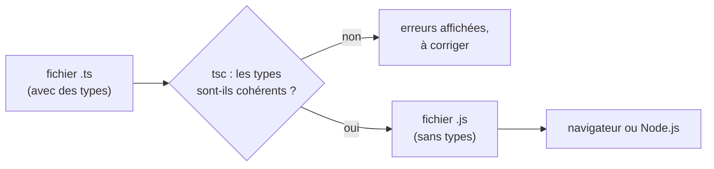

Tu as sûrement déjà vu `Cannot read properties of undefined` dans la console du navigateur, ou un `NaN` affiché dans une page parce qu'une fonction a reçu du texte au lieu d'un nombre. En JavaScript, ces fautes n'apparaissent qu'**à l'exécution**, parfois chez quelqu'un d'autre.

## À quoi ça sert, et pourquoi ?

Imagine un formulaire d'inscription où chaque case a une forme imposée : une case pour un nombre, une case pour du texte. Si quelqu'un écrit du texte dans la case « nombre de places », le formulaire le refuse tout de suite. JavaScript, lui, accepte tout : il ne se plaint que quand la mauvaise valeur provoque un plantage.

TypeScript ajoute ces « cases à forme imposée » à ton code. Le bénéfice est triple :

- les fautes de frappe et les mauvais arguments sont signalés **pendant que tu écris**, pas en production ;
- ton éditeur (VS Code) te propose les bonnes propriétés au fur et à mesure (l'autocomplétion) ;
- le code se **documente** : en lisant `places: number`, tout le monde sait ce que contient `places`.

## Ce qu'ajoute TypeScript

Quelques mots à connaître avant de continuer :

- Un **type** décrit le genre d'une valeur : un nombre (`number`), un texte (`string`), un objet avec telles propriétés…
- Une **annotation de type** est l'indication écrite dans le code, après un deux-points : `places: number` se lit « `places` est un nombre ».
- Un **compilateur** est un programme qui lit ton code et le vérifie ou le transforme. Celui de TypeScript s'appelle `tsc` (*TypeScript Compiler*).
- **Node.js** est un programme qui exécute du JavaScript en dehors du navigateur, par exemple sur ton ordinateur ou sur un serveur. Il sert aussi d'environnement aux outils de développement, dont `tsc`.
- **npm** est le gestionnaire de paquets de Node.js : il télécharge les outils et les bibliothèques dont un projet a besoin.
- TypeScript est un **sur-ensemble** de JavaScript : tout code JavaScript valide est déjà du TypeScript. Tu n'as donc rien à désapprendre, tu ajoutes seulement des annotations. Les fichiers portent l'extension `.ts`.

[MiniShop](https://gitlab.example.org/equipe/minishop) et le frontend d'[Adhésion](https://gitlab.example.org/equipe/adhesion/frontend) sont écrits en TypeScript. Le `package.json` de MiniShop (le fichier qui décrit un projet Node.js : son nom, ses dépendances et ses scripts, c'est-à-dire des raccourcis de commandes) contient d'ailleurs un script `"ts-check": "tsc --noEmit"` : il vérifie les types sans produire aucun fichier.



Lecture du schéma : le fichier `.ts` passe d'abord par `tsc`. Si les types sont incohérents, rien n'est produit et on corrige. Sinon, `tsc` sort un fichier `.js` ordinaire (les annotations en moins), que le navigateur ou Node.js exécute.

## Voir une erreur arriver

Prenons un événement d'association. Voici trois fautes classiques, que JavaScript laisserait passer jusqu'à l'exécution :

```ts
const evenement = { titre: "Soirée d'intégration", lieu: "Amphi Chappe", places: 120 };

console.log(evenement.titer.toUpperCase());

function reserver(places: number, demandees: number): number {
  return places - demandees;
}

reserver(120, "4");

let compteur = 3;
compteur = "trois";
```

- `evenement.titer` : une faute de frappe sur le nom d'une propriété.
- `reserver(120, "4")` : un texte passé là où la fonction attend un nombre.
- `compteur = "trois"` : TypeScript a **déduit** que `compteur` est un nombre (c'est l'*inférence de type*), puis refuse qu'on y range du texte.

Ligne par ligne :

- Ligne 1 : on crée un objet `evenement` avec trois propriétés. Aucune annotation, et pourtant `tsc` retient que `titre` et `lieu` sont des textes et `places` un nombre.
- Ligne 3 : `console.log(...)` affiche une valeur dans la console. On y appelle `.toUpperCase()` (met un texte en majuscules) sur `evenement.titer`, qui n'existe pas.
- Lignes 5 à 7 : `function reserver(places: number, demandees: number): number` déclare une fonction. Les deux `: number` entre parenthèses sont les types des **paramètres** (les valeurs reçues) ; le dernier `: number` est le type de la valeur **renvoyée**.
- Ligne 9 : on appelle la fonction avec `"4"` (du texte) au lieu de `4`.
- Lignes 11-12 : `let compteur = 3;` crée une variable modifiable ; on essaie ensuite d'y mettre du texte.

Pour lancer la vérification, il faut d'abord que le projet contienne TypeScript. Dans un dossier de projet (celui de la leçon *Modules et npm*), on l'installe comme outil de développement, puis on lance `tsc`. Dans le labo de cette leçon, c'est déjà fait pour toi :

```bash
npm install --save-dev typescript
npx tsc --noEmit
```

- `npm install --save-dev typescript` télécharge `tsc` dans le dossier du projet et l'ajoute aux dépendances de développement du `package.json`.
- `npx tsc` exécute le programme `tsc` installé dans le projet. `--noEmit` veut dire « ne fabrique aucun fichier, vérifie seulement ».
- Il lit pour cela un fichier de réglages, `tsconfig.json`, que l'on configure dans la leçon 4.

Voici ce qu'affiche `tsc` pour notre exemple :

```console
evenements.ts(3,23): error TS2551: Property 'titer' does not exist on type '{ titre: string; lieu: string; places: number; }'. Did you mean 'titre'?
evenements.ts(9,15): error TS2345: Argument of type 'string' is not assignable to parameter of type 'number'.
evenements.ts(12,1): error TS2322: Type 'string' is not assignable to type 'number'.
```

Chaque message se lit de la même façon :

1. `evenements.ts(3,23)` : le fichier, puis la **ligne** et la **colonne**.
2. `TS2551` : le code de l'erreur, pratique à chercher sur le web.
3. La phrase en anglais dit **ce qui est reçu** et **ce qui est attendu**. Souvent, `tsc` propose même la correction (`Did you mean 'titre'?`).

:::tip Lis l'erreur par la fin
Dans les longs messages, la dernière ligne est généralement la plus précise. Commence par la première erreur du fichier : les suivantes en sont parfois des conséquences.
:::

## Des types qui n'existent que pendant la vérification

:::warning Les types disparaissent à l'exécution
`tsc` **efface** les types en produisant le JavaScript. Dans le navigateur, `reserver(120, "4")` n'a plus aucune protection. TypeScript te protège contre tes propres erreurs, **pas** contre ce qui arrive du réseau, d'un formulaire ou d'un fichier. Nous y reviendrons dans la leçon 5.
:::

## Entraîne-toi

:::labo
moteur: reel
intro: |
  Dans ton dossier de travail, `evenements.ts` contient les trois fautes de la leçon, et TypeScript est déjà installé (il n'y a pas de réseau ici, donc pas de `npm install`). Tu vas lancer le vérificateur, lire ses messages, puis corriger le fichier faute par faute. Pour vérifier, lance `npx tsc --noEmit` dans le terminal. Tu peux éditer le fichier avec `nano evenements.ts`. Le portail contrôle ton travail sur une copie propre, avec ses propres contrôles : `@ts-ignore`, `@ts-nocheck` et `any` ne font que taire `tsc`, ils ne valident pas l'étape.
commandes:
  - cp -R /opt/exercices/01-pourquoi-typer/. .
  - lier-outils
etapes:
  - texte: 'Lance `npx tsc --noEmit`, repère l''erreur de la ligne 9 (l''appel de `reserver`) et écris son code, de la forme `TS1234`, dans un fichier `notes.txt`'
    indice: 'Cherche la ligne qui commence par `evenements.ts(9,`. Le code est juste après `error`. Écris-le avec `echo TS1234 > notes.txt` (avec le vrai numéro).'
    verif:
      - fichier-contient-dans-env: [notes.txt, 'TS2345']
    solution:
      - echo TS2345 > notes.txt
  - texte: 'Corrige la faute de frappe de la ligne 3 : `tsc` ne doit plus signaler de propriété inconnue'
    indice: 'Le message propose la bonne propriété : `Did you mean ...`. Remplace `titer` par `titre`.'
    verif:
      - commande-reussit: 'verifier-ts 01 propriete'
    solution:
      - sed -i 's/titer/titre/' evenements.ts
  - texte: 'Corrige l''appel de `reserver` : passe un nombre, pas un texte'
    indice: 'Enlève les guillemets autour du `4` : `reserver(120, 4)`.'
    verif:
      - commande-reussit: 'verifier-ts 01 appel'
    solution:
      - sed -i 's/reserver(120, "4")/reserver(120, 4)/' evenements.ts
  - texte: 'Corrige la dernière erreur : `compteur` a été déduit comme un nombre et doit le rester'
    indice: 'Donne un nombre à `compteur` (par exemple `4`) au lieu de `"trois"`.'
    verif:
      - commande-reussit: 'verifier-ts 01 compteur'
    solution:
      - sed -i 's/compteur = "trois"/compteur = 4/' evenements.ts
  - texte: 'Quand `npx tsc --noEmit` ne signale plus rien, produis le JavaScript avec `npx tsc --noEmit false --outDir dist`, puis ouvre `dist/evenements.js` : les types ont disparu'
    indice: 'La commande crée le dossier `dist`. Affiche le fichier avec `cat dist/evenements.js` et cherche `: number`.'
    apres: [2, 3, 4]
    verif:
      - commande-reussit: 'verifier-ts 01 dist'
    solution:
      - npx tsc --noEmit false --outDir dist
:::

## Vérifie tes acquis

:::quiz
Quel est le rôle principal de TypeScript ?

- [ ] Rendre le JavaScript plus rapide à l'exécution
- [ ] Remplacer JavaScript dans le navigateur
- [x] Vérifier la cohérence des types avant l'exécution

> Le navigateur ne comprend que le JavaScript : `tsc` vérifie les types puis les efface. Le code n'en est pas plus rapide.
:::

:::quiz
Que fait le script `"ts-check": "tsc --noEmit"` de MiniShop ?

- [x] Il vérifie les types sans écrire de fichier JavaScript
- [ ] Il compile le projet et déploie le résultat
- [ ] Il corrige automatiquement les erreurs de type

> `--noEmit` signifie « ne produis aucun fichier » : seul le contrôle des types est effectué.
:::

:::quiz
Après `let compteur = 3;`, que se passe-t-il avec `compteur = "trois";` ?

- [ ] Rien : une variable peut changer de type
- [ ] `tsc` convertit le texte en nombre
- [x] `tsc` signale une erreur, car `compteur` est déduit de type `number`

> C'est l'inférence : même sans annotation, le type est déduit de la valeur initiale.
:::

:::quiz
Dans le navigateur, que reste-t-il des annotations de types ?

- [ ] Elles sont vérifiées à chaque appel de fonction
- [x] Rien : elles sont effacées lors de la compilation
- [ ] Elles sont conservées sous forme de commentaires

> Les types servent uniquement à la vérification. Les données venues de l'extérieur doivent donc être contrôlées autrement.
:::
