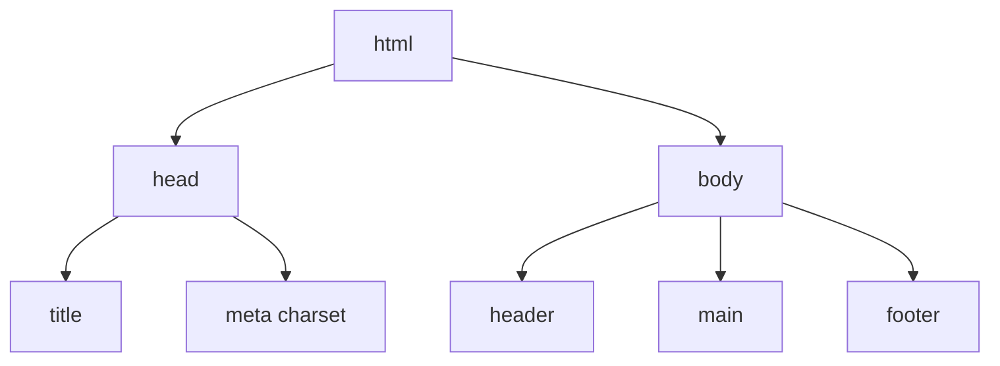

Tu ouvres le code d'une page web et tu y vois des dizaines de `<div>` imbriquées : impossible de savoir ce qui est le menu, le contenu ou le pied de page. **HTML** (*HyperText Markup Language*, « langage de balisage hypertexte ») sert justement à **décrire le sens** du contenu, avant de s'occuper de son apparence. Une **page web** n'est rien d'autre qu'un fichier texte écrit en HTML, que le **navigateur** (Firefox, Chrome, Edge…) lit pour dessiner la page à l'écran.

:::info Un vrai environnement, sans navigateur
Clique sur **Démarrer l'environnement** dans le panneau « Labo ». Le serveur te prête un petit ordinateur Linux rien que pour toi, avec Node.js (de quoi exécuter du JavaScript) et un outil, `verifier-page`, qui joue le rôle du navigateur : il lit ta page et te décrit ce qu'il en comprend. Il n'y a **pas d'accès à Internet** dans cet environnement, et ton dossier de travail est **effacé** quand il s'arrête : c'est un brouillon d'entraînement.
:::

## Avant de commencer : écrire un fichier et le « voir »

Pour écrire du HTML, il te faut seulement trois choses.

- **Un éditeur de texte** : un programme pour écrire un fichier. Dans le labo, tu as **nano**, un éditeur qui s'ouvre dans le terminal. Le **terminal** est la fenêtre dans laquelle tu tapes des **commandes** (des ordres écrits) et où l'ordinateur répond par du texte.
- **Un fichier** dont le nom finit par `.html` : c'est le **nom de fichier** qui dit au navigateur « ceci est une page web ».
- **Un navigateur** pour afficher la page.

Voici les quelques commandes dont tu auras besoin dans ce cours :

| Commande | Ce qu'elle fait |
| --- | --- |
| `ls` | Liste les fichiers du dossier de travail |
| `cat index.html` | Affiche le contenu du fichier `index.html` |
| `nano index.html` | Ouvre (ou crée) `index.html` dans l'éditeur nano |
| `verifier-page index.html` | Charge la page comme le ferait un navigateur et affiche un diagnostic |

:::tip nano, ton éditeur de terminal
Tape `nano index.html` : l'éditeur s'ouvre, tu écris ton texte. Enregistre avec `Ctrl+O` puis `Entrée` (nano te demande de confirmer le nom du fichier), quitte avec `Ctrl+X`. Si ton portail propose le mode « VS Code » dans le panneau, tu peux aussi utiliser cet éditeur plus confortable : la leçon s'affiche à côté du code. Tu peux enfin utiliser ton propre VS Code (section « Utiliser ton propre VS Code » du panneau).
:::

Sur ton ordinateur, tu ouvrirais une page en double-cliquant sur le fichier `.html` : ton navigateur la dessinerait. Dans le labo, il n'y a pas d'écran graphique. C'est donc `verifier-page` qui « ouvre » ta page : il en affiche le titre, la structure et, plus loin dans le cours, il peut même cliquer sur des boutons pour toi. Si tu travailles dans ton propre VS Code, la commande `servir` publie le dossier sur le port 8000, que VS Code te propose d'ouvrir dans ton navigateur.

## Le squelette d'une page

Une page HTML est un **arbre d'éléments**. Un **élément** est une pièce de la page (un paragraphe, un titre, une image…). On l'écrit avec une **balise ouvrante** (`<p>`), un contenu, puis une **balise fermante** (`</p>`) : `<p>Bonjour</p>`. Certains éléments n'ont pas de contenu, donc pas de balise fermante : `` (une image), `<input>` (un champ à remplir), `<br>` (un retour à la ligne).

Les éléments s'emboîtent comme des poupées russes : un élément placé à l'intérieur d'un autre en est l'**enfant**, ce qui dessine un arbre.



- `<head>` (« l'en-tête ») contient ce qui **ne s'affiche pas** dans la page : titre de l'onglet, encodage, feuilles de style.
- `<body>` (« le corps ») contient tout ce que la personne voit.

Une balise peut porter des **attributs**, des réglages écrits dans la balise ouvrante sous la forme `nom="valeur"`. Par exemple, dans `<a href="index.html">`, l'attribut `href` donne l'adresse du lien.

## Un exemple complet

Voici la page d'accueil d'une association fictive, « Club Photo ».

```html
<!DOCTYPE html>
<html lang="fr">
  <head>
    <meta charset="utf-8">
    <meta name="viewport" content="width=device-width, initial-scale=1">
    <title>Club Photo</title>
  </head>
  <body>
    <header>
      <h1>Club Photo</h1>
      <nav>
        <a href="index.html">Accueil</a>
        <a href="evenements.html">Événements</a>
      </nav>
    </header>
    <main>
      <h2>Prochaine sortie</h2>
      <p>Rendez-vous <strong>samedi à 14 h</strong> devant la bibliothèque.</p>
      
    </main>
    <footer>
      <p>Contact : photo@example.org</p>
    </footer>
  </body>
</html>
```

Ligne par ligne :

- `<!DOCTYPE html>` est la toute première ligne : elle dit au navigateur « cette page est écrite en HTML moderne » (le *mode standard*).
- `<html lang="fr">` ouvre la page. L'attribut `lang="fr"` indique la langue : les lecteurs d'écran (logiciels qui lisent la page à voix haute) en dépendent pour prononcer correctement.
- `<meta charset="utf-8">` choisit l'**encodage** du fichier, c'est-à-dire la table qui associe chaque caractère à un nombre. Avec `utf-8`, les accents s'affichent bien.
- `<meta name="viewport" …>` fait en sorte que la page s'adapte à un écran de téléphone (on y revient dans la leçon sur CSS).
- `<title>Club Photo</title>` est le texte de l'onglet du navigateur.
- `<header>` ouvre l'en-tête de la page. Il contient `<h1>`, le titre principal, et `<nav>`, le bloc des liens de navigation.
- Chaque `<a href="…">` est un **lien** : `href` est la destination, et le texte entre les balises est ce que la personne clique.
- `<main>` contient le contenu principal. `<h2>` est un titre de second niveau, `<p>` un paragraphe, `<strong>` met un mot en valeur (en gras par défaut).
- `` affiche une image : `src` est son fichier, et `alt` la décrit pour les personnes qui ne la voient pas.
- `<footer>` ferme la page avec un pied de page.

## Des balises qui ont un sens

On dit qu'une balise est **sémantique** quand son nom décrit son rôle. Elle aide les moteurs de recherche, les lecteurs d'écran et les collègues qui relisent ton code.

| Balise | Rôle |
| --- | --- |
| `<header>`, `<footer>` | En-tête et pied d'une page ou d'une section |
| `<nav>` | Un bloc de navigation |
| `<main>` | Le contenu principal (un seul par page) |
| `<section>`, `<article>` | Une partie thématique, un contenu autonome |
| `<h1>` à `<h6>` | Les titres, du plus important au moins important |
| `<ul>`, `<ol>`, `<li>` | Listes à puces, listes numérotées et leurs éléments |

`<div>` et `<span>` n'ont aucun sens : à réserver aux cas où aucune balise sémantique ne convient.

## Liens, images et formulaires

Un **formulaire** est la partie de la page où la personne remplit des champs puis envoie ses réponses.

```html
<a href="https://example.org/aide" target="_blank" rel="noopener">Page d'aide</a>

<form action="/inscription" method="post">
  <label for="email">Ton adresse e-mail</label>
  <input id="email" name="email" type="email" required>

  <label for="sortie">Sortie</label>
  <select id="sortie" name="sortie">
    <option value="campus">Campus</option>
    <option value="parc">Parc de la Tête d'Or</option>
  </select>

  <button type="submit">S'inscrire</button>
</form>
```

Ligne par ligne :

- `<a href="https://example.org/aide" …>` est un lien vers une adresse complète. `target="_blank"` l'ouvre dans un nouvel onglet, et `rel="noopener"` empêche ce nouvel onglet de piloter le tien (une précaution de sécurité).
- `<form action="/inscription" method="post">` ouvre le formulaire. `action` est l'adresse qui recevra les réponses, et `method="post"` dit qu'on les envoie (plutôt que de les demander).
- `<label for="email">` est le **libellé** d'un champ, c'est-à-dire la question posée. Son `for` reprend l'`id` du champ : cliquer sur le texte active le champ, et les lecteurs d'écran annoncent la bonne question.
- `<input id="email" name="email" type="email" required>` est le champ lui-même. `id` est son identifiant unique dans la page, `name` le nom sous lequel la valeur est envoyée, `type="email"` demande une adresse e-mail, et `required` interdit de laisser le champ vide. Le navigateur applique cette validation de base tout seul.
- `<select>` est une liste déroulante, et chaque `<option>` est un choix (`value` est la valeur envoyée, le texte est ce qui s'affiche).
- `<button type="submit">` est le bouton qui envoie le formulaire.

:::warning Un titre n'est pas une taille de police
Ne choisis pas `<h3>` parce que tu le trouves joli : les niveaux de titres forment le plan de la page. Garde un seul `<h1>` et ne saute pas de niveau (`h2` puis `h4`). L'apparence se règle en CSS.
:::

## Entraîne-toi

:::lab
engine: real
intro: |
  Démarre ton environnement. Tu vas construire la page du Club Photo dans un fichier `index.html`, que tu écris avec `nano`. Après chaque étape, `verifier-page index.html` te montre la structure que ton navigateur imaginaire a comprise. Une dernière étape te demande de réparer une page abîmée, `a-corriger.html`, déjà présente dans ton dossier.
commands:
  - cp -R /opt/exercices/01-structure-html/. .
steps:
  - text: >-
      Crée `index.html` avec `nano index.html` et écris le squelette : la ligne `<!DOCTYPE html>`, un élément `<html lang="fr">` qui contient un `<head>` (avec `<meta charset="utf-8">` et un `<title>`) puis un `<body>`. Enregistre (`Ctrl+O`, `Entrée`), quitte (`Ctrl+X`) et lance `verifier-page index.html`.
    hint: >-
      Recopie l'exemple de la leçon jusqu'à `<body>` et `</body>`, sans rien mettre dans le corps pour l'instant. N'oublie pas la balise fermante `</html>`.
    checks:
      - command-succeeds: 'verifier-page index.html --existe "html[lang=fr] > head > meta[charset]" --existe "html > head > title" --existe "html > body"'
    solution:
      - write:
          index.html: |
            <!DOCTYPE html>
            <html lang="fr">
              <head>
                <meta charset="utf-8">
                <title>Club Photo</title>
              </head>
              <body>
              </body>
            </html>
  - text: >-
      Dans le `<body>`, ajoute un `<header>` qui contient un titre `<h1>` et un `<nav>` avec deux liens `<a>` ; puis, à la suite, un `<main>` et un `<footer>`.
    hint: >-
      Un lien s'écrit `<a href="index.html">Accueil</a>`. Les trois blocs `<header>`, `<main>` et `<footer>` sont des enfants directs de `<body>`, l'un après l'autre.
    after: [1]
    checks:
      - command-succeeds: 'verifier-page index.html --existe "body > header > h1" --existe "body > header > nav > a:nth-of-type(2)" --existe "body > main" --existe "body > footer"'
    solution:
      - write:
          index.html: |
            <!DOCTYPE html>
            <html lang="fr">
              <head>
                <meta charset="utf-8">
                <title>Club Photo</title>
              </head>
              <body>
                <header>
                  <h1>Club Photo</h1>
                  <nav>
                    <a href="index.html">Accueil</a>
                    <a href="evenements.html">Événements</a>
                  </nav>
                </header>
                <main>
                </main>
                <footer>
                  <p>Contact : photo@example.org</p>
                </footer>
              </body>
            </html>
  - text: >-
      Dans `<main>`, ajoute un titre `<h2>`, un paragraphe `<p>` contenant un mot entouré de `<strong>`, et une image `` avec un texte alternatif `alt` qui n'est pas vide.
    hint: >-
      `` : le fichier `sortie.jpg` n'existe pas dans le labo, ce n'est pas grave, seule la balise compte.
    after: [2]
    checks:
      - command-succeeds: 'verifier-page index.html --existe "main > h2" --existe "main > p strong" --existe "main > img[alt]:not([alt=\"\"])"'
    solution:
      - write:
          index.html: |
            <!DOCTYPE html>
            <html lang="fr">
              <head>
                <meta charset="utf-8">
                <title>Club Photo</title>
              </head>
              <body>
                <header>
                  <h1>Club Photo</h1>
                  <nav>
                    <a href="index.html">Accueil</a>
                    <a href="evenements.html">Événements</a>
                  </nav>
                </header>
                <main>
                  <h2>Prochaine sortie</h2>
                  <p>Rendez-vous <strong>samedi à 14 h</strong> devant la bibliothèque.</p>
                  
                </main>
                <footer>
                  <p>Contact : photo@example.org</p>
                </footer>
              </body>
            </html>
  - text: >-
      Ajoute dans `<main>` un formulaire `<form>` avec un `<label for="email">`, un champ `<input id="email" name="email" type="email" required>` et un bouton `<button type="submit">`.
    hint: >-
      Le `for` du libellé et l'`id` du champ doivent avoir exactement la même valeur : `email`.
    after: [3]
    checks:
      - command-succeeds: 'verifier-page index.html --existe "main form label[for=email]" --existe "form input#email[type=email][required][name=email]" --existe "form button[type=submit]"'
    solution:
      - write:
          index.html: |
            <!DOCTYPE html>
            <html lang="fr">
              <head>
                <meta charset="utf-8">
                <title>Club Photo</title>
              </head>
              <body>
                <header>
                  <h1>Club Photo</h1>
                  <nav>
                    <a href="index.html">Accueil</a>
                    <a href="evenements.html">Événements</a>
                  </nav>
                </header>
                <main>
                  <h2>Prochaine sortie</h2>
                  <p>Rendez-vous <strong>samedi à 14 h</strong> devant la bibliothèque.</p>
                  
                  <form action="/inscription" method="post">
                    <label for="email">Ton adresse e-mail</label>
                    <input id="email" name="email" type="email" required>
                    <button type="submit">S'inscrire</button>
                  </form>
                </main>
                <footer>
                  <p>Contact : photo@example.org</p>
                </footer>
              </body>
            </html>
  - text: >-
      Répare `a-corriger.html` : `verifier-page a-corriger.html --accessible` y signale plusieurs défauts (langue, saut de niveau de titre, image sans `alt`, champ sans libellé relié). Corrige-les avec `nano a-corriger.html` jusqu'à ce que la commande ne signale plus aucun problème.
    hint: >-
      Chaque ligne « ÉCHEC » du diagnostic décrit un défaut. Ajoute `lang="fr"` sur `<html>`, passe le `<h4>` en `<h2>`, donne un `alt` à l'image et un `for="email"` au `<label>`.
    checks:
      - command-succeeds: 'verifier-web 01 reparer'
    solution:
      - write:
          a-corriger.html: |-
            <!DOCTYPE html>
            <html lang="fr">
              <head>
                <meta charset="utf-8">
                <title>Atelier retouche</title>
              </head>
              <body>
                <h1>Atelier retouche</h1>
                <h2>Programme</h2>
                
                <form>
                  <label for="email">Ton adresse e-mail</label>
                  <input id="email" name="email" type="email">
                  <button type="submit">S'inscrire</button>
                </form>
              </body>
            </html>
:::

## Vérifie tes acquis

:::quiz
Où place-t-on `<meta charset="utf-8">` ?

- [ ] Dans le `<body>`, avant le premier titre
- [ ] Juste après la balise `<html>`, en dehors de `<head>`
- [x] Dans le `<head>`

> Les métadonnées sont dans le `<head>`. Elles ne s'affichent pas, mais le navigateur en a besoin avant de lire le contenu.
:::

:::quiz
Quelle balise convient pour le bloc de liens de navigation d'un site ?

- [ ] `<section>`
- [ ] `<div class="menu">`, car `<nav>` n'est qu'un style
- [x] `<nav>`

> `<nav>` est sémantique : les lecteurs d'écran peuvent y accéder directement. Une `<div>` fonctionnerait visuellement, mais ne décrit rien.
:::

:::quiz
À quoi sert l'attribut `alt` d'une image ?

- [ ] À redimensionner l'image
- [x] À décrire l'image à celles et ceux qui ne la voient pas, ou si elle ne charge pas
- [ ] À donner le nom du fichier de l'image

> Le texte alternatif sert à l'accessibilité et s'affiche quand l'image est indisponible.
:::

:::quiz
Comment relier un `<label>` à son champ de formulaire ?

- [x] `for` du label = `id` du champ
- [ ] `name` du label = `id` du champ
- [ ] Il suffit de placer le label juste au-dessus du champ

> Seul le couple `for` / `id` crée le lien : un clic sur le label active alors le champ.
:::
