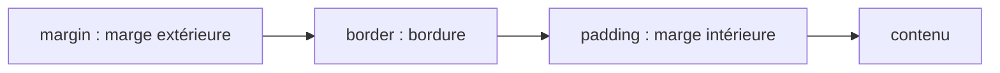

Ta page HTML est correcte, mais elle ressemble à un document des années 90. **CSS** (*Cascading Style Sheets*, « feuilles de style en cascade ») décrit **l'apparence** : couleurs, espacements, disposition. Il est écrit dans un fichier à part (une **feuille de style**, avec l'extension `.css`) pour que l'on puisse changer le design sans toucher au contenu.

## Une règle CSS

Une règle associe un **sélecteur** (qui est concerné ?) à des **déclarations** (quoi changer ?). Une déclaration est un couple `propriété: valeur;` : la **propriété** est le réglage (`color`, la couleur du texte) et la **valeur** est le choix (`#E32618`, un rouge).

```css
h1 {
  color: #E32618;
  font-size: 2rem;
}

.carte {
  background: #f1f5f9;
  padding: 1rem;
}

#titre-principal {
  text-align: center;
}
```

Ligne par ligne, pour la première règle :

- `h1 {` ouvre une règle dont le sélecteur est `h1` : elle concerne tous les éléments `<h1>`.
- `color: #E32618;` fixe la couleur du texte. `#E32618` est un code couleur hexadécimal (rouge, vert, bleu écrits en base 16).
- `font-size: 2rem;` fixe la taille du texte à 2 fois la taille de base de la page (on y revient plus bas avec l'unité `rem`).
- `}` ferme la règle. Chaque déclaration se termine par un point-virgule.

Les trois façons de cibler :

- `h1` cible toutes les balises `<h1>`.
- `.carte` cible les éléments ayant `class="carte"`. Une **classe** est une étiquette que l'on met dans le HTML et qui peut servir plusieurs fois.
- `#titre-principal` cible l'élément ayant `id="titre-principal"`. Un `id` est un identifiant **unique** dans la page.

Le CSS se relie au HTML dans le `<head>` :

```html
<link rel="stylesheet" href="style.css">
```

Cette balise dit au navigateur : « charge la feuille de style `style.css` pour habiller cette page ».

:::info La cascade
Quand deux règles se contredisent, la plus **spécifique** gagne (un `id` bat une classe, qui bat une balise) ; à spécificité égale, la **dernière** écrite l'emporte. Préfère des classes : elles sont faciles à réutiliser et à surcharger.
:::

## Le modèle de boîte

Chaque élément est une boîte à quatre couches, de l'intérieur vers l'extérieur : le contenu, la marge intérieure (`padding`), la bordure (`border`) et la marge extérieure (`margin`).



```css
.carte {
  width: 300px;
  padding: 16px;
  border: 2px solid #334155;
  margin: 24px;
  box-sizing: border-box;
}
```

Ligne par ligne :

- `width: 300px;` demande une largeur de 300 pixels. Le **pixel** (`px`) est le point de l'écran, une unité fixe.
- `padding: 16px;` ajoute 16 px de vide entre le contenu et la bordure, sur les quatre côtés.
- `border: 2px solid #334155;` trace une bordure de 2 px, pleine (`solid`), de couleur gris-bleu.
- `margin: 24px;` laisse 24 px de vide autour de la boîte, à l'extérieur.
- `box-sizing: border-box;` choisit comment la largeur est comptée (explication ci-dessous).

Par défaut, `width` ne mesure que le contenu : avec 16 px de `padding` et 2 px de bordure de chaque côté, la boîte occuperait 300 + 32 + 4 = 336 px. Avec `box-sizing: border-box`, `width` inclut `padding` et bordure : la boîte fait bien **300 px**. De nombreux projets l'appliquent à tous les éléments :

```css
*, *::before, *::after {
  box-sizing: border-box;
}
```

Ici, `*` est le sélecteur « tout », et `::before` et `::after` désignent deux éléments que CSS peut ajouter avant et après chaque élément : la règle s'applique donc vraiment partout.

## Flexbox : aligner sur une ligne

**Flexbox** est un mode de disposition qui répartit des éléments le long d'un axe. On l'active sur le **conteneur** (l'élément parent), pas sur les éléments eux-mêmes :

```html
<nav class="menu">
  <a href="index.html">Accueil</a>
  <a href="evenements.html">Événements</a>
  <a href="contact.html">Contact</a>
</nav>
```

```css
.menu {
  display: flex;
  justify-content: space-between;
  align-items: center;
  gap: 1rem;
}
```

- `display: flex;` transforme `.menu` en conteneur flexbox : ses trois liens se rangent côte à côte.
- `justify-content` répartit les éléments sur l'axe principal (horizontal par défaut) ; `space-between` colle le premier au bord gauche, le dernier au bord droit et espace le reste.
- `align-items` les aligne sur l'axe secondaire (vertical par défaut) ; `center` les centre.
- `gap` crée l'espace entre les éléments, sans marges à gérer.
- `flex-direction: column` fait passer l'axe principal à la verticale.

## Grille : organiser en deux dimensions

Pour une galerie ou une liste de cartes, utilise une **grille** avec `display: grid` :

```css
.galerie {
  display: grid;
  grid-template-columns: repeat(3, 1fr);
  gap: 1rem;
}
```

`grid-template-columns` décrit les colonnes. `repeat(3, 1fr)` crée trois colonnes de même largeur (`1fr` = une « fraction », une part de l'espace disponible). Règle pratique : **flexbox pour une ligne ou une colonne, grille pour un tableau de cases**.

## S'adapter à l'écran

Une *media query* (« requête de média ») applique des règles seulement si la condition est vraie, par exemple selon la largeur de la fenêtre. En partant du téléphone (« mobile first »), on enrichit pour les grands écrans :

```css
.galerie {
  display: grid;
  grid-template-columns: 1fr;
  gap: 1rem;
}

@media (min-width: 768px) {
  .galerie {
    grid-template-columns: repeat(3, 1fr);
  }
}
```

Ligne par ligne : la première règle donne une seule colonne (`1fr`) à tout le monde. Le bloc `@media (min-width: 768px) { … }` contient des règles qui ne s'appliquent que si la fenêtre fait **au moins** 768 px de large : là, la galerie passe à trois colonnes. Sur un écran de moins de 768 px, les images sont donc empilées ; à partir de 768 px, elles sont sur trois colonnes. Cela suppose la balise `<meta name="viewport" …>` vue dans la leçon précédente.

:::tip Des unités qui s'adaptent
Préfère `rem` (relatif à la taille de police de la page) ou `%` aux `px` pour les tailles de texte et les largeurs : la page respecte alors les réglages d'accessibilité de la personne.
:::

## Entraîne-toi

:::lab
engine: real
intro: |
  Ton dossier contient `page.html`, une page déjà écrite (un titre, un menu `.menu`, une carte `.carte` et une galerie `.galerie` de six vignettes), et `style.css`, une feuille de style vide déjà reliée à la page. Ouvre `style.css` avec `nano style.css` et écris-y les règles demandées. Après chaque étape, `verifier-page page.html` te montre ce que contient la page ; pour lire une valeur de style précise, ajoute `--style .carte width 300px`, par exemple : l'outil te dit si la valeur calculée correspond.
commands:
  - cp -R /opt/exercices/02-css/. .
steps:
  - text: >-
      Dans `style.css`, écris une règle `h1` qui colore le titre en rouge `#E32618` (propriété `color`).
    hint: >-
      `h1 { color: #E32618; }`. Pense au point-virgule après la valeur.
    checks:
      - command-succeeds: 'verifier-web 02 regle'
    solution:
      - write:
          style.css: |
            h1 {
              color: #E32618;
            }
  - text: >-
      Mets en forme la carte : une règle `.carte` avec `width: 300px`, `padding: 16px`, `border: 2px solid #334155` et `box-sizing: border-box`.
    hint: >-
      Une classe se cible avec un point : `.carte { … }`. Écris une déclaration par ligne.
    checks:
      - command-succeeds: 'verifier-web 02 carte'
    solution:
      - write:
          style.css: |
            h1 {
              color: #E32618;
            }

            .carte {
              width: 300px;
              padding: 16px;
              border: 2px solid #334155;
              box-sizing: border-box;
            }
  - text: >-
      Aligne le menu avec flexbox : une règle `.menu` avec `display: flex`, `justify-content: space-between` et `gap: 1rem`.
    hint: >-
      Les trois liens sont les enfants de `.menu` : c'est le conteneur `.menu` qui reçoit `display: flex`, pas les liens.
    checks:
      - command-succeeds: 'verifier-web 02 flex'
    solution:
      - write:
          style.css: |
            h1 {
              color: #E32618;
            }

            .carte {
              width: 300px;
              padding: 16px;
              border: 2px solid #334155;
              box-sizing: border-box;
            }

            .menu {
              display: flex;
              justify-content: space-between;
              gap: 1rem;
            }
  - text: >-
      Organise la galerie en grille : une règle `.galerie` avec `display: grid`, `grid-template-columns: repeat(3, 1fr)` et `gap: 1rem`.
    hint: >-
      `repeat(3, 1fr)` crée trois colonnes de même largeur. Ajoute les trois déclarations dans une règle `.galerie { … }`.
    checks:
      - command-succeeds: 'verifier-web 02 grille'
    solution:
      - write:
          style.css: |
            h1 {
              color: #E32618;
            }

            .carte {
              width: 300px;
              padding: 16px;
              border: 2px solid #334155;
              box-sizing: border-box;
            }

            .menu {
              display: flex;
              justify-content: space-between;
              gap: 1rem;
            }

            .galerie {
              display: grid;
              grid-template-columns: repeat(3, 1fr);
              gap: 1rem;
            }
  - text: >-
      Rends la galerie adaptative, en partant du téléphone : une seule colonne (`1fr`) par défaut, et trois colonnes (`repeat(3, 1fr)`) seulement à partir de `768px` de large, avec `@media (min-width: 768px)`. Pour tester, l'outil simule la largeur de la fenêtre : `verifier-page page.html --largeur 400 --style .galerie grid-template-columns 1fr`.
    hint: >-
      Remplace `repeat(3, 1fr)` dans la règle `.galerie` par `1fr`, puis ajoute en dessous un bloc `@media (min-width: 768px) { .galerie { grid-template-columns: repeat(3, 1fr); } }`.
    after: [4]
    checks:
      - command-succeeds: 'verifier-web 02 adaptatif'
    solution:
      - write:
          style.css: |-
            h1 {
              color: #E32618;
            }

            .carte {
              width: 300px;
              padding: 16px;
              border: 2px solid #334155;
              box-sizing: border-box;
            }

            .menu {
              display: flex;
              justify-content: space-between;
              gap: 1rem;
            }

            .galerie {
              display: grid;
              grid-template-columns: 1fr;
              gap: 1rem;
            }

            @media (min-width: 768px) {
              .galerie {
                grid-template-columns: repeat(3, 1fr);
              }
            }
:::

## Vérifie tes acquis

:::quiz
Quel sélecteur cible les éléments portant `class="alerte"` ?

- [ ] `#alerte`
- [x] `.alerte`
- [ ] `alerte`

> Le point cible une classe, le dièse un `id`. Sans préfixe, `alerte` serait une balise `<alerte>` qui n'existe pas.
:::

:::quiz
Une boîte a `width: 200px`, `padding: 10px`, pas de bordure et `box-sizing: content-box` (valeur par défaut). Quelle largeur occupe-t-elle ?

- [ ] 200 px
- [ ] 210 px
- [x] 220 px

> Le `padding` s'ajoute des deux côtés : 200 + 10 + 10 = 220 px. Avec `box-sizing: border-box`, la boîte ferait 200 px.
:::

:::quiz
Tu veux répartir trois liens sur une ligne avec un espace régulier entre eux. Quelle déclaration sur le conteneur est la plus adaptée ?

- [ ] `display: grid; grid-template-rows: 3`
- [x] `display: flex; gap: 1rem`
- [ ] `display: inline; margin: auto`

> Flexbox est fait pour aligner des éléments sur une ligne, et `gap` gère l'espace entre eux.
:::

:::quiz
Que fait `@media (min-width: 768px) { … }` ?

- [ ] Les règles s'appliquent uniquement sous 768 px de large
- [ ] Les règles s'appliquent à tous les écrans, sans condition
- [x] Les règles s'appliquent quand la fenêtre fait au moins 768 px de large

> `min-width` fixe une largeur minimale. Pour viser les petits écrans, on utiliserait `max-width`.
:::
