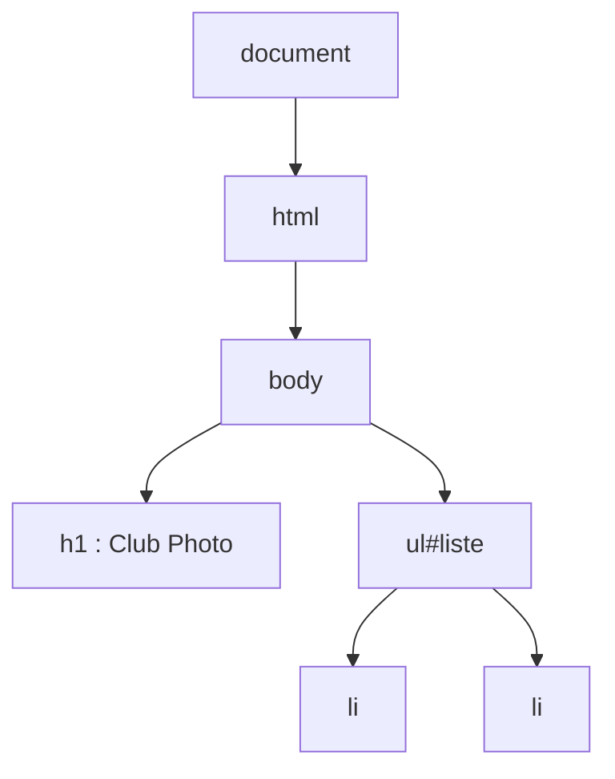

Tu as un bouton « S'inscrire » sur ta page, mais rien ne se passe quand on clique dessus. Pour que la page réagisse, JavaScript doit **retrouver des éléments** et **écouter ce que fait la personne**. Cette leçon suppose que tu sais écrire une page HTML (leçon 1) et un peu de JavaScript : variables, fonctions, tableaux (leçon 3).

## Le DOM

Quand le navigateur lit ton HTML, il construit en mémoire un arbre d'objets : le **DOM** (*Document Object Model*, « modèle objet du document »). Chaque balise devient un objet que JavaScript peut lire et modifier. JavaScript ne modifie pas le fichier HTML, mais cet arbre, et le navigateur redessine la page en conséquence.



Dans le labo, il n'y a pas de navigateur : l'outil `verifier-page` construit ce même arbre avec une bibliothèque (jsdom), exécute ton script dessus, puis te montre le résultat. Il sait aussi **cliquer** et **remplir des champs** à ta place.

## Sélectionner et modifier

Partons de cette page :

```html
<h1 id="titre">Club Photo</h1>
<p class="places">Places restantes : <span id="compteur">20</span></p>
<button id="inscription">S'inscrire</button>
<ul id="liste"></ul>

<script src="app.js"></script>
```

La balise `<script src="app.js">` charge le fichier JavaScript `app.js`. Elle est placée **en fin de `<body>`** : à ce moment, tous les éléments existent déjà. On peut aussi écrire `<script src="app.js" defer></script>` dans le `<head>` : `defer` signifie « attends que la page soit lue ».

```js
const titre = document.querySelector("#titre");
titre.textContent = "Club Photo du campus";

const compteur = document.querySelector("#compteur");
console.log(compteur.textContent); // "20"

document.querySelector(".places").classList.add("alerte");
```

Ligne par ligne :

- `document` est l'objet qui représente la page entière.
- `document.querySelector("#titre")` cherche dans la page le premier élément qui correspond au **sélecteur CSS** `#titre` (le même langage que dans la leçon précédente : `#` pour un `id`, `.` pour une classe). Le résultat est rangé dans la constante `titre`.
- `titre.textContent = "Club Photo du campus";` remplace le texte de l'élément : le titre change à l'écran.
- `const compteur = …` retrouve de la même façon le `<span id="compteur">`, et `compteur.textContent` **lit** son texte (ici `"20"`, un texte et non un nombre).
- `document.querySelector(".places").classList.add("alerte");` retrouve le paragraphe de classe `places` et lui ajoute la classe `alerte`.

Ce que tu dois retenir :

- `querySelector` prend un **sélecteur CSS** et renvoie le premier élément trouvé, ou `null` (« rien ») s'il n'y en a aucun.
- `querySelectorAll` renvoie tous les éléments correspondants.
- `textContent` lit ou remplace le texte d'un élément.
- `classList.add`, `remove` et `toggle` gèrent les classes : c'est la bonne façon de changer l'apparence (le style reste dans le CSS).

## Réagir aux événements

Un **événement** signale qu'il s'est passé quelque chose : clic, saisie, envoi d'un formulaire, touche pressée. On associe une fonction (un **écouteur**) à un événement : le navigateur l'appellera à chaque fois que l'événement se produit.

```js
const bouton = document.querySelector("#inscription");
let places = 20;

bouton.addEventListener("click", () => {
  if (places > 0) {
    places = places - 1;
    compteur.textContent = places;
  }
});
```

Ce morceau **continue** le précédent : la constante `compteur` a déjà été déclarée plus haut, dans le même fichier `app.js`. Ne la redéclare pas : une constante ne peut être déclarée qu'une seule fois dans un fichier, sinon JavaScript s'arrête avec une erreur.

Ligne par ligne :

- `const bouton = document.querySelector("#inscription");` retrouve le bouton.
- `let places = 20;` crée un compteur de places en mémoire (`let`, car il va changer).
- `bouton.addEventListener("click", () => { … });` dit : « à chaque `click` sur ce bouton, exécute cette fonction ». Le premier argument est le nom de l'événement, le second la fonction à appeler.
- `if (places > 0) { … }` ne fait ce qui suit que s'il reste des places : `if` (« si ») exécute son bloc quand la condition est vraie.
- `places = places - 1;` retire une place.
- `compteur.textContent = places;` affiche la nouvelle valeur dans la page.

À chaque clic, le compteur affiché diminue, sans jamais passer sous zéro.

Pour un formulaire, on écoute `submit` (l'envoi) et on empêche le rechargement de la page :

```js
const formulaire = document.querySelector("form");

formulaire.addEventListener("submit", (evenement) => {
  evenement.preventDefault();
  const email = formulaire.elements.email.value;
  console.log(`Inscription de ${email}`);
});
```

- `formulaire.addEventListener("submit", (evenement) => { … })` écoute l'envoi. La fonction reçoit en paramètre un objet `evenement` qui décrit ce qui s'est passé.
- `evenement.preventDefault();` annule le comportement par défaut (ici, l'envoi classique du formulaire, qui recharge la page).
- `formulaire.elements.email.value` lit le contenu du champ dont le `name` est `email`.
- `console.log(…)` affiche un message dans la console (dans le labo, `verifier-page` le montre sous la ligne `[console]`).

## Créer des éléments

```js
const liste = document.querySelector("#liste");
const participants = ["Camille", "Noé", "Inès"];

for (const prenom of participants) {
  const li = document.createElement("li");
  li.textContent = prenom;
  liste.append(li);
}
```

- `participants` est un tableau de trois prénoms.
- `for (const prenom of participants) { … }` répète le bloc pour chaque prénom.
- `document.createElement("li")` crée un nouvel élément `<li>`, pas encore visible dans la page.
- `li.textContent = prenom;` lui donne son texte.
- `liste.append(li);` l'ajoute à la fin de la liste : il apparaît alors dans la page.

Le HTML obtenu est :

```html
<ul id="liste">
  <li>Camille</li>
  <li>Noé</li>
  <li>Inès</li>
</ul>
```

:::warning Attention à innerHTML
`element.innerHTML = texte` interprète le texte comme du HTML. Si ce texte vient d'une personne (un commentaire, un nom de profil), elle peut y glisser une balise `<script>` ou `` : c'est une faille **XSS** (*cross-site scripting*, l'exécution de code étranger dans ta page). Pour afficher du texte, utilise **toujours** `textContent`. React et Angular font cet échappement pour toi, mais pas si tu contournes leurs protections.
:::

## Entraîne-toi

:::lab
engine: real
intro: |
  Ton dossier contient `index.html` (le titre `#titre`, le compteur `#compteur`, le bouton `#inscription`, la liste `#liste`, le formulaire `#formulaire` avec son champ `#email`, et un paragraphe `#message`) et un fichier `app.js` vide. Tu n'écris que du JavaScript, dans `app.js` (avec `nano app.js`). Après chaque étape, `verifier-page index.html` charge la page, exécute ton script et te montre le DOM obtenu ; les vérifications cliquent et remplissent le formulaire à ta place, puis lisent le résultat dans la page. `index.html` doit rester tel quel : le portail le contrôle et refuse l'étape s'il a été modifié.
commands:
  - cp -R /opt/exercices/04-dom-et-evenements/. .
steps:
  - text: >-
      Dans `app.js`, retrouve l'élément `#titre` avec `querySelector` et remplace son texte par `Club Photo du campus` avec `textContent`.
    hint: >-
      `const titre = document.querySelector("#titre");` puis `titre.textContent = "Club Photo du campus";`. Vérifie avec `verifier-page index.html` : la structure doit montrer le nouveau titre.
    checks:
      - command-succeeds: 'verifier-web 04 titre'
    solution:
      - |
        cat > app.js <<'EOF'
        const titre = document.querySelector("#titre");
        titre.textContent = "Club Photo du campus";
        EOF
  - text: >-
      Fais diminuer le compteur à chaque clic : retrouve `#compteur` et `#inscription`, garde le nombre de places dans une variable `places` (qui part de `20`) et, dans un écouteur `click`, retire une place et affiche-la dans `#compteur`. Deux clics doivent donner `18`.
    hint: >-
      Reprends l'exemple de la leçon. Déclare chaque constante (`titre`, `compteur`, `bouton`) une seule fois dans `app.js`, en haut du fichier.
    after: [1]
    checks:
      - command-succeeds: 'verifier-web 04 compteur'
    solution:
      - |
        cat > app.js <<'EOF'
        const titre = document.querySelector("#titre");
        titre.textContent = "Club Photo du campus";

        const compteur = document.querySelector("#compteur");
        const bouton = document.querySelector("#inscription");
        let places = 20;

        bouton.addEventListener("click", () => {
          places = places - 1;
          compteur.textContent = places;
        });
        EOF
  - text: >-
      Empêche le compteur de passer sous zéro : entoure le retrait de la place d'un `if (places > 0)`. Vingt-cinq clics de suite doivent laisser `0` dans `#compteur`.
    hint: >-
      Le `if` va à l'intérieur de la fonction de l'écouteur, autour des deux lignes qui modifient `places` et `compteur.textContent`.
    after: [2]
    checks:
      - command-succeeds: 'verifier-web 04 plancher'
    solution:
      - |
        cat > app.js <<'EOF'
        const titre = document.querySelector("#titre");
        titre.textContent = "Club Photo du campus";

        const compteur = document.querySelector("#compteur");
        const bouton = document.querySelector("#inscription");
        let places = 20;

        bouton.addEventListener("click", () => {
          if (places > 0) {
            places = places - 1;
            compteur.textContent = places;
          }
        });
        EOF
  - text: >-
      Remplis la liste `#liste` avec trois `<li>` créés par JavaScript (`createElement`, `textContent`, `append`) : `Camille`, `Noé` et `Inès`, avec une boucle `for…of` sur un tableau.
    hint: >-
      Ajoute à la fin de `app.js` : le tableau `participants`, la boucle, et dedans `document.createElement("li")`. N'utilise pas `innerHTML`.
    after: [3]
    checks:
      - command-succeeds: 'verifier-web 04 liste'
    solution:
      - |
        cat >> app.js <<'EOF'

        const liste = document.querySelector("#liste");
        const participants = ["Camille", "Noé", "Inès"];

        for (const prenom of participants) {
          const li = document.createElement("li");
          li.textContent = prenom;
          liste.append(li);
        }
        EOF
  - text: >-
      Gère le formulaire : écoute `submit` sur `#formulaire`, appelle `evenement.preventDefault()`, lis la valeur du champ `#email` et écris `Inscription de <adresse>` dans le paragraphe `#message`. L'outil saisit `camille@example.org` dans le champ et envoie le formulaire : il refuse si la page n'empêche pas son rechargement.
    hint: >-
      `const champ = document.querySelector("#email");` puis, dans l'écouteur, ``message.textContent = `Inscription de ${champ.value}`;``, avec le `preventDefault()` en première ligne de la fonction.
    after: [1]
    checks:
      - command-succeeds: 'verifier-web 04 formulaire'
    solution:
      - |-
        cat >> app.js <<'EOF'

        const formulaire = document.querySelector("#formulaire");
        const champ = document.querySelector("#email");
        const message = document.querySelector("#message");

        formulaire.addEventListener("submit", (evenement) => {
          evenement.preventDefault();
          message.textContent = `Inscription de ${champ.value}`;
        });
        EOF
:::

## Vérifie tes acquis

:::quiz
Que fait `document.querySelector(".carte")` si trois éléments ont la classe `carte` ?

- [ ] Il renvoie un tableau de trois éléments
- [ ] Il renvoie `null`, car la sélection est ambiguë
- [x] Il renvoie le premier élément qui correspond

> `querySelector` s'arrête au premier résultat. Pour récupérer tous les éléments, c'est `querySelectorAll`.
:::

:::quiz
Dans le gestionnaire d'un formulaire, pourquoi appelle-t-on `evenement.preventDefault()` ?

- [x] Pour empêcher l'envoi classique du formulaire, qui recharge la page
- [ ] Pour supprimer l'écouteur d'événement
- [ ] Pour empêcher la personne de saisir du texte

> Sans cet appel, le navigateur enverrait le formulaire et rechargerait la page : le JavaScript n'aurait pas le temps de faire son travail.
:::

:::quiz
Tu affiches le nom saisi par une personne dans la page. Que choisis-tu ?

- [ ] `element.innerHTML = nom`, qui est le plus rapide à écrire
- [ ] `element.outerHTML = nom`, qui remplace aussi la balise
- [x] `element.textContent = nom`

> `textContent` traite le nom comme du simple texte. Avec `innerHTML`, un nom contenant du HTML s'exécuterait : c'est une faille XSS.
:::

:::quiz
Pourquoi place-t-on souvent `<script src="app.js"></script>` juste avant `</body>` ?

- [ ] Parce que le navigateur refuse les scripts dans le `<head>`
- [ ] Pour que le script s'exécute avant que la page ne s'affiche
- [x] Pour que les éléments de la page existent déjà quand le script s'exécute

> Un script exécuté trop tôt ne trouve pas encore les éléments (`querySelector` renvoie `null`). L'attribut `defer` règle aussi le problème depuis le `<head>`.
:::
