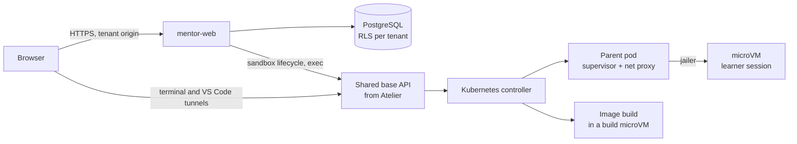

# Mentor v2: Rust, Firecracker, multi-tenant

> **Status: direction approved on 4 October 2026; phase 0 mostly done. The execution plane is no longer built
> here: it is shared with the Atelier project, see [execution-plane.md](execution-plane.md).** This document frames the decision:
> scope, target architecture, threat model, migration plan, risks, decisions taken and open points (§10).
> v1 is the Python/Django portal; its repository stays the reference implementation during the migration.

## 1. What is decided, and why

| Decision | Reason |
| --- | --- |
| **Whole platform in Rust** | One language for the web tier and the execution plane, one binary per role to deploy, memory safety in the code that drives microVMs |
| **Firecracker only** for real labs, **through a base shared with Atelier, on Kubernetes** | One kernel per session: a container escape no longer yields the host. The Docker broker goes away. The isolation layer is not rebuilt here ([execution-plane.md](execution-plane.md)) |
| **Multi-tenant** | One instance hosts several organisations, each with its own brand, catalogue, identity provider and quotas |

What changes compared with v1: the security boundary is no longer "a hardened container on a dedicated Docker
daemon" but "a KVM microVM started by the jailer". Three known weaknesses disappear: Docker-in-Docker depending on
Sysbox, a soft disk quota, and a kernel shared between learners.

## 2. Scope

**Rewritten in Rust**: web server, catalogue compiler, progress/XP/badges/exams, management area, OIDC
authentication, execution plane (scheduler, host agent, guest agent), terminal/VS Code/SSH proxy.

**Kept as is** (no reason to rewrite):

- the **catalogue format** (Markdown, front matter, `:::lab`, `:::quiz`, `_checks.yml`): the 19 existing
  courses compile after a mechanical conversion of the format to English names (see §10);
- the **browser JavaScript** of quizzes and exams (the simulated Git and Docker engines of v1 are not carried
  over: v2 only has real labs, see §10);
- the **style sheets** and the brand file (`branding.yml`);
- the **VS Code extension** and the accepted `devcontainer.json` subset.

**Out of scope for v2**: mobile app, catalogue marketplace, billing.

## 3. Threat model (what multi-tenancy adds)

v1 assumes **one** trusted operator and untrusted learners. Multi-tenancy brings two new actors:

| Actor | Trust | What they may attempt |
| --- | --- | --- |
| Learner | Low | microVM escape, resource abuse, network pivoting, cheating on XP |
| **Tenant catalogue author** | **Low** (was "trusted") | Malicious `Dockerfile` at build time, booby-trapped Markdown (XSS), checks that exfiltrate data |
| **Tenant administrator** | Medium, **bounded to their tenant** | Reading another tenant's data or sessions, exhausting shared capacity |
| Platform operator | Full | — |

Direct consequences for the design:

1. **Image builds no longer happen on the host.** A tenant's `Dockerfile` is untrusted code: it is built **inside a
   disposable build microVM**, with no access to the internal network.
2. **Catalogue HTML is sanitised server-side**, per tenant (v1 renders author Markdown unfiltered). Each tenant is
   served from **its own origin** (sub-domain or custom domain), so an XSS stays confined to its tenant.
3. **Every SQL query is bounded to the tenant** by the database itself (§5), not only by application code.
4. **Capacity is shared out per tenant**: quotas on microVMs, memory and builds, so one tenant cannot starve others.

## 4. Target architecture

One Cargo workspace, one binary per role:

| Crate | Role | Replaces (v1) |
| --- | --- | --- |
| `mentor-core` | Pure domain: XP, levels, badges, unlocking, exam. No I/O, fully tested | `training/services.py`, `gamification.py` |
| `mentor-content` | Catalogue compiler and linter, sanitised Markdown rendering | `content.py`, `lint.py`, `aide.py` |
| `mentor-db` | PostgreSQL access, migrations, tenant context | Django models and ORM |
| `mentor-web` | HTTP server: pages, API, OIDC, management, stream proxy | Django views, uWSGI, the ASGI service |
| *shared base (from Atelier)* | Sandbox lifecycle on Kubernetes: images, microVMs, network, terminal and exec | `environments/services.py`, `docker_broker.py`, `hardening.py`, `buildplan.py`, `mentor_bridge.py` |
| `mentor-labs` (to come) | Drives the base for a lab: session policy, steps, checks | the lab part of `environments/services.py`, `verifications.py` |
| `mentor-cli` | Administration: tenants, catalogue sync, migration | `manage.py` commands |

Chosen stack (§10): `axum` + `tokio` for the web tier, `sqlx` for PostgreSQL (queries checked at compile time),
`askama` for templates (a direct port of the Django templates, checked at compile time), `openidconnect` for OIDC,
`pulldown-cmark` + `ammonia` for sanitised Markdown.

### 4.1 Firecracker execution plane

| Topic | Design |
| --- | --- |
| **Isolation** | One microVM per session, started by the `jailer` (chroot, namespaces, cgroups, seccomp, a dedicated user per VM) |
| **Image** | The course `Dockerfile` is built in a build microVM, then flattened into a **read-only ext4 rootfs**, addressed by digest |
| **Session disk** | One writable disk per session (sparse file), mounted as an overlay: its size **is** the quota, and it is hard |
| **Start-up** | Restore from a **snapshot** of the already booted image (hundreds of ms); cold boot as a fallback |
| **Network** | One `tap` interface per VM in a per-tenant network namespace; egress closed by default (nftables) |
| **Control channel** | Commands, files and checks reach the guest through the base, never through a port the learner could open; which channel (vsock or SSH) is discussed in [execution-plane.md §2](execution-plane.md#2-where-the-line-could-be-drawn) |
| **Docker-in-Docker** | An ordinary Docker daemon **inside** the microVM: Sysbox is no longer needed |
| **VS Code web** | code-server inside the VM, relayed over `vsock` (replaces the `mentor_bridge.py` bridge) |
| **Memory** | Fixed size per VM, admission by the scheduler before start; ballooning to be evaluated later |

> **This section describes the target properties, not Mentor's own code.** Since 5 October 2026 the execution
> plane comes from a base shared with Atelier, which already implements most of this table on Kubernetes. A
> prototype built here beforehand was removed; its measurements are in
> [execution-plane.md §6](execution-plane.md#6-what-the-removed-prototype-measured).

The interface between `mentor-web` and the execution plane keeps the **allow-list** of the v1 broker
(`broker/base.py`: create, remove, status, exec, terminal, SSH, build, inventory). No raw Firecracker parameter
crosses that boundary; resource names remain derived from internal identifiers.

**Constraint accepted with "Firecracker only"**: **KVM** is required wherever a real lab runs, so a physical Linux
host or a VM with nested virtualisation. A macOS or Windows workstation, or a CI runner without KVM, cannot run a
real lab; tests there use an in-memory **fake** execution plane (the equivalent of v1's `broker/fake.py`), and a
dedicated CI job runs on a KVM-capable runner.

## 5. Multi-tenancy

| Topic | Design |
| --- | --- |
| **Resolution** | By host name: `acme.mentor.example` or a custom domain. No tenant in the URL path |
| **Data** | One database, a `tenant_id` column on every table, PostgreSQL **row-level security** (RLS); the connection sets the tenant, the database refuses the rest |
| **Brand** | The content of `branding.yml` becomes one row per tenant; logo and favicon in object storage under a per-tenant prefix |
| **Catalogue** | One Git repository (or archive) per tenant, compiled and validated on sync; an optional shared catalogue a tenant can inherit from |
| **Identity** | One OIDC provider per tenant (issuer, client, admin role); an account belongs to exactly one tenant |
| **Roles** | Platform administrator (all tenants) is distinct from tenant administrator |
| **Quotas** | Per tenant: concurrent sessions, total memory, builds per hour, storage |
| **Sessions and cookies** | Cookie scoped to the tenant origin; terminal tokens bound to the tenant and the session |

**Implemented in `mentor-db`** (first migration): every tenant-owned table has row-level security enabled *and
forced*, keyed on a transaction-local setting; with no tenant set, a query sees nothing. The application role
owns no table and cannot create tenants. Foreign keys include `tenant_id`, so a row cannot reference another
tenant's learner even if a policy were wrong. Resolving a tenant from a host name, which happens before any
tenant is known, goes through one `SECURITY DEFINER` function that returns only the identifier. Platform
administration has its own role, `mentor_platform`: because the policies are forced, even the owning role
needs it to act across tenants. Tests against a real PostgreSQL check all this, running migrations as an
ordinary owner and the application as an unprivileged role; they include a forged insert into another tenant
and four concurrent requests for the same XP.

RLS is preferred to "one schema per tenant": a single set of migrations, no practical limit on the number of
tenants, and isolation does not depend on a forgotten filter in the code. Its cost: every query goes through an
explicit tenant context, and platform tasks (global reports, the reaper) use a separate database role.

## 6. Migration plan

A full rewrite is the riskiest of the options considered: about 15,000 lines of Python and 730 tests to carry
over, during which v1 must remain usable. The plan therefore delivers **isolation first**, behind the current
application, then replaces the rest slice by slice.

| Phase | Deliverable | Exit criterion |
| --- | --- | --- |
| **0. Foundations** | Cargo workspace, CI, `mentor-core` and `mentor-content` | The Rust compiler matches v1's `export_catalogue` output for the 19 courses (see §6.1) |
| **1. Isolation** | The base extracted from Atelier, and Mentor driving it for real labs ([execution-plane.md](execution-plane.md)) | The real labs of the catalogue replay successfully in microVMs; v1's Docker broker is removed |
| **2. Tenants** | PostgreSQL schema with `tenant_id` and RLS, migration of existing data into a first tenant | Isolation tests: no query from one tenant reads another. *Done in `mentor-db` and `mentor-cli`: the full v1 data model with isolation tests, and `mentor import-v1`, checked against v1's demonstration data. Left for the web tier: adopting an imported account at its first login* |
| **3. Read-only web** | `mentor-web` serves home, catalogue, lessons, help, with per-tenant OIDC | Rendered pages are equivalent to Django's (automated HTML comparison). *Started: tenant resolution by host, per-tenant brand, home, catalogue, course and lesson pages, signed session cookie, quizzes and lesson progress recorded through `POST /api/progress` (development sign-in only), learner dashboard and badges, progress and locks on catalogue and course pages, validation exams (`/courses/<course>/exam/`, `POST /api/exam/<course>/start` and `/submit`), catalogue HTML sanitised at compile time (`ammonia`), with tests. Not yet: OIDC, simulated and real labs, help pages, per-tenant catalogues, the comparison with Django's pages* |
| **4. Read-write web** | Progress, XP, quiz, exam, badges, management, reports | The scenarios of the Python tests are replayed against the Rust API |
| **5. Switch-over** | Django retired, documentation and deployment updated | A full acceptance run on a KVM host with two tenants |

### 6.1 Phase 0 conformance (what "matches v1" means)

`crates/mentor-content/tests/conformance.rs` compiles `catalogue/` and compares it with
`conformance/v1-catalogue.json`, exported from v1 at the commit recorded in `conformance/V1_COMMIT`. Because v2
renamed the format to English, the v1 export is first rewritten with the name table `conformance/v1-names.json`
(the one `tools/migrate_v1_catalogue.py` uses to convert a v1 catalogue), then compared:

- **structure** (identifiers, order, durations, labs, checks, solutions, correct answers, exam settings) must be
  **strictly equal**;
- **HTML fragments** are compared by their **text** (tags and whitespace removed). Markup cannot be byte-identical:
  v1 uses Python-Markdown and Pygments, v2 uses `pulldown-cmark` and does no server-side highlighting.

Two consequences to handle before phase 4:

1. **Identifiers no longer depend on rendering or position.** v1 identified an exam question by the SHA-1 of
   its HTML and a lab step by its position. v2 digests the source text of a question, and names a step by its
   `id` or a digest of its text; `mentor import-v1` translates both when it is given the two catalogues.
2. **Simulated labs are gone** (decision of 5 October 2026, §10): the two courses that used them
   (`docker-hello`, `docker-advanced`) are rewritten as real labs and excluded from the lab comparison with v1.
3. **Not ported yet**: validation of the `devcontainer.json` specification (it belongs with the execution plane,
   phase 1), regular-expression validation of real-lab check arguments, syntax highlighting, the catalogue linter.

## 7. Target deployment

- `mentor-web`: an ordinary unprivileged deployment, without access to KVM.
- The shared base: its controller, API and image builder, and one parent pod per learner session on nodes
  exposing KVM. It is the only part that touches microVMs.
- PostgreSQL, object storage (rootfs images, snapshots, logos), the tenants' OIDC providers.
- Nodes running learner sessions are isolated from the database and from the operator's internal network
  (network policies, dedicated node pool).

## 8. What gets simpler, what gets harder

| Simpler | Harder |
| --- | --- |
| Docker-in-Docker without Sysbox | KVM is mandatory: fewer hosting choices, no real lab on macOS |
| A hard disk quota, by construction | An image build chain (Dockerfile → rootfs → snapshot) to write and secure |
| One binary per role, no uWSGI + nginx + ASGI service | Two implementations to maintain during the migration |
| Clean per-tenant network isolation | Snapshots: unique entropy and clock after restore must be guaranteed |

## 9. Risks

1. **Duration of the rewrite.** The main risk. Mitigation: phases 0 and 1 are valuable on their own; if the effort
   stops after phase 2, Firecracker and multi-tenancy already exist under Django.
2. **Functional regressions** on subtle rules (idempotent XP, unlocking, exam). Mitigation: port the tests before
   the code; keep `mentor-core` free of I/O.
3. **Firecracker snapshots**: restoring two VMs from the same snapshot duplicates the random generator state.
   Mitigation: reseeding by the guest agent on restore, or cold boot until this is proven.
4. **Untrusted builds**: a compromised build microVM must reach nothing. Mitigation: build network limited to
   allowed registries, artefact verified by digest, no secret in the VM.
5. **Licence**: AGPLv3 is kept; as a hosted multi-tenant service, each tenant's "Source code" link must point to
   the code actually running.

## 10. Decisions taken and open points

Decided on 4 October 2026:

| Topic | Decision |
| --- | --- |
| Phase order | **Firecracker first** (phase 1), plugged into Django through a temporary Python adapter; the web tier is rewritten afterwards |
| Web stack | `axum` + `sqlx` + `askama` |
| Data isolation | PostgreSQL **row-level security**, a `tenant_id` column everywhere |
| Repository | **A new repository**: `PhilippeVienne/mentor` holds only the Rust code; the v1 repository stays as the reference |
| Execution plane | **Shared with Atelier** through a common base extracted from it; **Kubernetes is required** for real labs. Mentor's own prototype was removed (5 October 2026) |
| Labs | **Real labs only** (5 October 2026). v1's labs simulated in the browser (fake `git` and `docker` terminals, their checks, effects, simulated server and sandbox) are removed from the format, the compiler, the rules and the scripts: every lab runs in an environment of its course and is verified by the server. The browser can no longer report a lab step. Docker courses use a Docker daemon inside the microVM and a local registry mirror filled when the image is built, since environments have no network at run time |
| Language | **Everything in English**: code, comments, tests, documentation, compiler diagnostics and the catalogue format (file names, keys, directive and check names). Course content keeps its authors' language |

Consequence of the new repository: the catalogue, static files (JavaScript, CSS) and conformance tools are no
longer shared by construction. v2 **copies** them at the start, and its CI compares its output with reference
files exported from v1; during phase 1, the Python adapter lives in the v1 repository and calls the Rust
execution plane through its API.

Still open:

1. **Hosting**: which Kubernetes cluster with KVM nodes (physical machines, nested virtualisation at a
   provider); this drives network design and CI.
2. **Shared catalogue**: are the 19 current courses offered to every tenant, or does each tenant bring its own?
   How a tenant brings its own is designed in [course-packages.md](course-packages.md): courses are distributed
   as Git repositories that are packages; the question that remains is its §11, point 1.
3. **Content locale**: default callout titles and generated button labels are French, like the shipped
   courses; a per-catalogue locale will be needed once a tenant writes courses in another language.
4. **Running labs on Atelier**: validated on 6 October 2026 by replaying real labs in Atelier microVMs
   ([atelier-lab-validation.md](atelier-lab-validation.md)). It works, Docker included, but no environment of
   the catalogue starts unmodified and several of Mentor's rules (account, empty working folder, disk size,
   one image per source, a web terminal that is never root) need changes in Atelier or in the environments.
5. **The cut between the shared base and Atelier**, and what a lab check costs through it: see
   [execution-plane.md](execution-plane.md) §2, §4 and §7.
