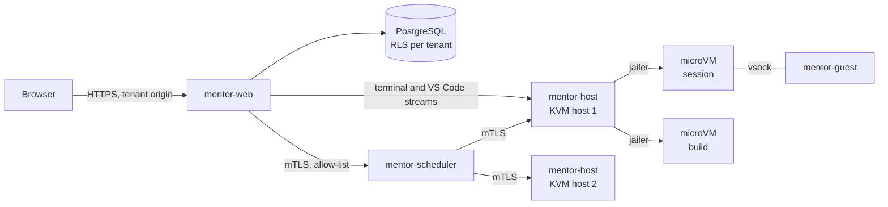

# Mentor v2: Rust, Firecracker, multi-tenant

> **Status: direction approved on 4 October 2026; phase 0 in progress.** This document frames the decision:
> scope, target architecture, threat model, migration plan, risks, decisions taken and open points (§10).
> v1 is the Python/Django portal; its repository stays the reference implementation during the migration.

## 1. What is decided, and why

| Decision | Reason |
| --- | --- |
| **Whole platform in Rust** | One language for the web tier and the execution plane, one binary per role to deploy, memory safety in the code that drives microVMs |
| **Firecracker only** for real labs | One kernel per session: a container escape no longer yields the host. The Docker broker goes away |
| **Multi-tenant** | One instance hosts several organisations, each with its own brand, catalogue, identity provider and quotas |

What changes compared with v1: the security boundary is no longer "a hardened container on a dedicated Docker
daemon" but "a KVM microVM started by the jailer". Three known weaknesses disappear: Docker-in-Docker depending on
Sysbox, a soft disk quota, and a kernel shared between learners.

## 2. Scope

**Rewritten in Rust**: web server, catalogue compiler, progress/XP/badges/exams, management area, OIDC
authentication, execution plane (scheduler, host agent, guest agent), terminal/VS Code/SSH proxy.

**Kept as is** (no reason to rewrite):

- the **catalogue format** (Markdown, front matter, `:::labo`, `:::quiz`, `_verifications.yml`): the 19 existing
  courses must compile unchanged. Its keys and directive names are French and stay so;
- the **browser JavaScript** (simulated Git/Docker engines, quiz, exam, editor) and its Jest tests;
- the **style sheets** and the brand file (`branding.yml`);
- the **VS Code extension** and the accepted `devcontainer.json` subset.

**Out of scope for v2**: mobile app, catalogue marketplace, billing.

## 3. Threat model (what multi-tenancy adds)

v1 assumes **one** trusted operator and untrusted learners. Multi-tenancy brings two new actors:

| Actor | Trust | What they may attempt |
| --- | --- | --- |
| Learner | Low | microVM escape, resource abuse, network pivoting, cheating on XP |
| **Tenant catalogue author** | **Low** (was "trusted") | Malicious `Dockerfile` at build time, booby-trapped Markdown (XSS), checks that exfiltrate data |
| **Tenant administrator** | Medium, **bounded to their tenant** | Reading another tenant's data or sessions, exhausting shared capacity |
| Platform operator | Full | — |

Direct consequences for the design:

1. **Image builds no longer happen on the host.** A tenant's `Dockerfile` is untrusted code: it is built **inside a
   disposable build microVM**, with no access to the internal network.
2. **Catalogue HTML is sanitised server-side**, per tenant (v1 renders author Markdown unfiltered). Each tenant is
   served from **its own origin** (sub-domain or custom domain), so an XSS stays confined to its tenant.
3. **Every SQL query is bounded to the tenant** by the database itself (§5), not only by application code.
4. **Capacity is shared out per tenant**: quotas on microVMs, memory and builds, so one tenant cannot starve others.

## 4. Target architecture

One Cargo workspace, one binary per role:

| Crate | Role | Replaces (v1) |
| --- | --- | --- |
| `mentor-core` | Pure domain: XP, levels, badges, unlocking, exam. No I/O, fully tested | `training/services.py`, `gamification.py` |
| `mentor-content` | Catalogue compiler and linter, sanitised Markdown rendering | `content.py`, `lint.py`, `aide.py` |
| `mentor-db` | PostgreSQL access, migrations, tenant context | Django models and ORM |
| `mentor-web` | HTTP server: pages, API, OIDC, management, stream proxy | Django views, uWSGI, the ASGI service |
| `mentor-scheduler` | Admission, placement, quotas, reaper | `environments/services.py` |
| `mentor-host` | Host agent: jailer, disks, network, builds | `docker_broker.py`, `hardening.py`, `buildplan.py` |
| `mentor-guest` | Agent **inside** the microVM: exec, terminal, files, checks | `docker exec`, `mentor_bridge.py` |
| `mentor-cli` | Administration: tenants, catalogue sync, migration | `manage.py` commands |

Chosen stack (§10): `axum` + `tokio` for the web tier, `sqlx` for PostgreSQL (queries checked at compile time),
`askama` for templates (a direct port of the Django templates, checked at compile time), `openidconnect` for OIDC,
`pulldown-cmark` + `ammonia` for sanitised Markdown.

### 4.1 Firecracker execution plane

| Topic | Design |
| --- | --- |
| **Isolation** | One microVM per session, started by the `jailer` (chroot, namespaces, cgroups, seccomp, a dedicated user per VM) |
| **Image** | The course `Dockerfile` is built in a build microVM, then flattened into a **read-only ext4 rootfs**, addressed by digest |
| **Session disk** | One writable disk per session (sparse file), mounted as an overlay: its size **is** the quota, and it is hard |
| **Start-up** | Restore from a **snapshot** of the already booted image (hundreds of ms); cold boot as a fallback |
| **Network** | One `tap` interface per VM in a per-tenant network namespace; egress closed by default (nftables) |
| **Control channel** | `vsock` host ↔ `mentor-guest`: exec, terminal, files, checks. No SSH and no open port for control |
| **Docker-in-Docker** | An ordinary Docker daemon **inside** the microVM: Sysbox is no longer needed |
| **VS Code web** | code-server inside the VM, relayed over `vsock` (replaces the `mentor_bridge.py` bridge) |
| **Memory** | Fixed size per VM, admission by the scheduler before start; ballooning to be evaluated later |

The interface between `mentor-web` and the execution plane keeps the **allow-list** of the v1 broker
(`broker/base.py`: create, remove, status, exec, terminal, SSH, build, inventory). No raw Firecracker parameter
crosses that boundary; resource names remain derived from internal identifiers.

**Constraint accepted with "Firecracker only"**: **KVM** is required wherever a real lab runs, so a physical Linux
host or a VM with nested virtualisation. A macOS or Windows workstation, or a CI runner without KVM, cannot run a
real lab; tests there use an in-memory **fake** execution plane (the equivalent of v1's `broker/fake.py`), and a
dedicated CI job runs on a KVM-capable runner.

## 5. Multi-tenancy

| Topic | Design |
| --- | --- |
| **Resolution** | By host name: `acme.mentor.example` or a custom domain. No tenant in the URL path |
| **Data** | One database, a `tenant_id` column on every table, PostgreSQL **row-level security** (RLS); the connection sets the tenant, the database refuses the rest |
| **Brand** | The content of `branding.yml` becomes one row per tenant; logo and favicon in object storage under a per-tenant prefix |
| **Catalogue** | One Git repository (or archive) per tenant, compiled and validated on sync; an optional shared catalogue a tenant can inherit from |
| **Identity** | One OIDC provider per tenant (issuer, client, admin role); an account belongs to exactly one tenant |
| **Roles** | Platform administrator (all tenants) is distinct from tenant administrator |
| **Quotas** | Per tenant: concurrent sessions, total memory, builds per hour, storage |
| **Sessions and cookies** | Cookie scoped to the tenant origin; terminal tokens bound to the tenant and the session |

RLS is preferred to "one schema per tenant": a single set of migrations, no practical limit on the number of
tenants, and isolation does not depend on a forgotten filter in the code. Its cost: every query goes through an
explicit tenant context, and platform tasks (global reports, the reaper) use a separate database role.

## 6. Migration plan

A full rewrite is the riskiest of the options considered: about 15,000 lines of Python and 730 tests to carry
over, during which v1 must remain usable. The plan therefore delivers **isolation first**, behind the current
application, then replaces the rest slice by slice.

| Phase | Deliverable | Exit criterion |
| --- | --- | --- |
| **0. Foundations** | Cargo workspace, CI, `mentor-core` and `mentor-content` | The Rust compiler matches v1's `export_catalogue` output for the 19 courses (see §6.1) |
| **1. Firecracker** | `mentor-host`, `mentor-guest`, `mentor-scheduler`; a Python adapter implementing v1's `Broker` by calling the Rust plane | v1's `tools/rejouer_labos.py` passes on the 14 real-lab courses, in microVMs; the Docker broker is removed |
| **2. Tenants** | PostgreSQL schema with `tenant_id` and RLS, migration of existing data into a first tenant | Isolation tests: no query from one tenant reads another |
| **3. Read-only web** | `mentor-web` serves home, catalogue, lessons, help, with per-tenant OIDC | Rendered pages are equivalent to Django's (automated HTML comparison) |
| **4. Read-write web** | Progress, XP, quiz, exam, badges, management, reports | The scenarios of the Python tests are replayed against the Rust API |
| **5. Switch-over** | Django retired, documentation and deployment updated | A full acceptance run on a KVM host with two tenants |

### 6.1 Phase 0 conformance (what "matches v1" means)

`crates/mentor-content/tests/conformance.rs` compiles `catalogue/` and compares it with
`conformance/v1-catalogue.json`, exported from v1 at the commit recorded in `conformance/V1_COMMIT`:

- **structure** (identifiers, order, durations, labs, checks, solutions, correct answers, exam settings) must be
  **strictly equal**;
- **HTML fragments** are compared by their **text** (tags and whitespace removed). Markup cannot be byte-identical:
  v1 uses Python-Markdown and Pygments, v2 uses `pulldown-cmark` and does no server-side highlighting.

Two consequences to handle before phase 4:

1. **Exam question identifiers change.** An identifier is the SHA-1 of the question's HTML, and v2 escapes quotes
   differently. Stored exam attempts must be remapped during data migration (or identifiers recomputed from text).
2. **Not ported yet**: validation of the `devcontainer.json` specification (it belongs with the execution plane,
   phase 1), regular-expression validation of real-lab check arguments, syntax highlighting, the catalogue linter.

## 7. Target deployment

- `mentor-web` and `mentor-scheduler`: ordinary containers or binaries, unprivileged, without access to KVM.
- `mentor-host`: one per KVM host, the only privileged component. It listens only to the scheduler (mTLS) and never
  talks to the browser directly for control.
- PostgreSQL, object storage (rootfs images, snapshots, logos), the tenants' OIDC providers.
- KVM hosts sit on a separate network, with no route to the database or to the operator's internal network.

## 8. What gets simpler, what gets harder

| Simpler | Harder |
| --- | --- |
| Docker-in-Docker without Sysbox | KVM is mandatory: fewer hosting choices, no real lab on macOS |
| A hard disk quota, by construction | An image build chain (Dockerfile → rootfs → snapshot) to write and secure |
| One binary per role, no uWSGI + nginx + ASGI service | Two implementations to maintain during the migration |
| Clean per-tenant network isolation | Snapshots: unique entropy and clock after restore must be guaranteed |

## 9. Risks

1. **Duration of the rewrite.** The main risk. Mitigation: phases 0 and 1 are valuable on their own; if the effort
   stops after phase 2, Firecracker and multi-tenancy already exist under Django.
2. **Functional regressions** on subtle rules (idempotent XP, unlocking, exam). Mitigation: port the tests before
   the code; keep `mentor-core` free of I/O.
3. **Firecracker snapshots**: restoring two VMs from the same snapshot duplicates the random generator state.
   Mitigation: reseeding by the guest agent on restore, or cold boot until this is proven.
4. **Untrusted builds**: a compromised build microVM must reach nothing. Mitigation: build network limited to
   allowed registries, artefact verified by digest, no secret in the VM.
5. **Licence**: AGPLv3 is kept; as a hosted multi-tenant service, each tenant's "Source code" link must point to
   the code actually running.

## 10. Decisions taken and open points

Decided on 4 October 2026:

| Topic | Decision |
| --- | --- |
| Phase order | **Firecracker first** (phase 1), plugged into Django through a temporary Python adapter; the web tier is rewritten afterwards |
| Web stack | `axum` + `sqlx` + `askama` |
| Data isolation | PostgreSQL **row-level security**, a `tenant_id` column everywhere |
| Repository | **A new repository**: `PhilippeVienne/mentor` holds only the Rust code; the v1 repository stays as the reference |
| Language | Code, comments, tests and documentation in **English** |

Consequence of the new repository: the catalogue, static files (JavaScript, CSS) and conformance tools are no
longer shared by construction. v2 **copies** them at the start, and its CI compares its output with reference
files exported from v1; during phase 1, the Python adapter lives in the v1 repository and calls the Rust
execution plane through its API.

Still open (they do not block phases 0 and 1):

1. **Hosting**: which KVM hosts (physical machines, nested virtualisation at a provider); this drives network
   design and CI.
2. **Shared catalogue**: are the 19 current courses offered to every tenant, or does each tenant bring its own?
3. **Language of product strings**: author-facing diagnostics of the catalogue compiler and the catalogue format
   itself are French today; whether to localise them is undecided.
