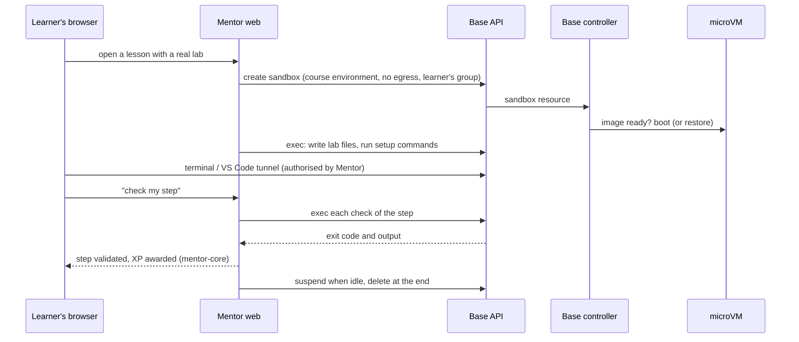

# Execution plane: sharing isolation with Atelier

> **Status: integration study with a first real trial (§7), 5 October 2026. Nothing is implemented, and
> Atelier's code was not changed.**
> It follows two decisions taken that day: Mentor does **not** build its own isolation layer, it shares one with
> the [Atelier](https://github.com/PhilippeVienne/atelier) project through a **common base extracted from
> Atelier**; and that base **requires Kubernetes**.
>
> Facts about Atelier below come from reading its repository at commit `be66aa8` (its `docs/PROGRESS.md`,
> `docs/ARCHITECTURE.md`, specs and source). Sections 1 to 6 were written before running it; §7 reports what
> a trial on its local development cluster then measured, and corrects §4 where they differ.

## 1. Why share

Atelier isolates autonomous coding agents; Mentor isolates learners. Both need the same thing: run untrusted
code from a `devcontainer.json` in a Firecracker microVM, reach it through a terminal, VS Code or a command,
and control what it can talk to. Atelier already has this, validated against real infrastructure according to
its progress report. The prototype Mentor started (a host agent and a guest agent) duplicated it and was
removed; what it taught is kept in §6.

| Mentor needs | Atelier has |
| --- | --- |
| microVM under the `jailer`, unprivileged | `crates/firecracker`, `crates/vm-supervisor`, `crates/kvm-device-plugin` |
| Images built from `devcontainer.json`, **inside** a build microVM, cached by digest | `crates/image-builder`, `crates/builder-vm-init` |
| An init process for images without systemd | `crates/guest-init` |
| Snapshots | Suspend and resume of an environment (`docs/architecture/snapshot-restore.md`) |
| Controlled egress | `crates/net-proxy`: allow-list, internal DNS, the VM's only network entry point |
| Terminal and VS Code in the browser | `ttyd` and `code-server` tunnels in `crates/api-server` |
| Run a command, read its output | `exec_in_workshop`: asynchronous, buffered in PostgreSQL, streamable |
| Identity and data isolation | OIDC JWT, owner groups from the identity provider, PostgreSQL row-level security |
| Deployment | Helm chart, single-node install script, image and snapshot cache with S3 offload |

Atelier's unit is the Kubernetes custom resource `Workshop`: a devcontainer source (Git repository, revision,
path), resources, an egress allow-list and an owner group. A controller reconciles it into an image build job
and a *parent pod* that hosts the microVM next to its proxies.

## 2. Where the line could be drawn

The base is what both products need to run a sandbox on Kubernetes. A first cut, from the crate list:

| Common base | Stays in Atelier | Stays in Mentor |
| --- | --- | --- |
| The sandbox custom resource and its controller core | `identity-proxy` and credential injection (OpenBao) | Catalogue and its compiler (`mentor-content`) |
| `firecracker`, `vm-supervisor`, `guest-init` | `mcp-gateway` and agent tools | Progress, XP, badges, exams (`mentor-core`) |
| `image-builder`, `builder-vm-init`, image and snapshot cache | LLM proxy, budgets, virtual keys | Lab orchestration: steps, checks, solutions |
| `kvm-device-plugin` | Squads, campaigns, exported services | Per-learner quotas and session lifetime policy |
| `net-proxy` | Human-in-the-loop approvals, Slack | The learner-facing web application |
| API for sandbox lifecycle, exec, terminal, VS Code, port forwarding | `pm-engine`, dashboard | |
| Shared plumbing: storage, telemetry, TLS client | | |

The cut is not free. In Atelier's controller, the reconciliation file refers to OpenBao 53 times, to the LLM
proxy 64 times and to Git identity 15 times: the agent-specific concerns are woven into the core loop. OpenBao
is already optional at start-up (the controller is silent when `OPENBAO_ADDR` is unset), which suggests the
others can become extension points, but that is the real work of the extraction.

**One coupling matters to Mentor directly.** `exec_in_workshop` connects over SSH with a per-workshop key that
the controller stores in OpenBao, and the API reports exec as unavailable when OpenBao is not configured. Lab
checks are nothing but exec: as things stand, Mentor would need OpenBao just to verify a lab step. Either the
base keeps a secret store as a requirement, or exec gets a channel that does not need one (Atelier already has
a vsock path between the pod and the VM for its MCP gateway).

## 3. How a real lab would run

Mentor never touches a microVM: it asks for a sandbox, runs commands in it and hands the learner a tunnel.
`mentor-core` already encodes that a real lab's steps can only be reported by the server.

## 4. What does not fit yet

Each row is a difference between what Atelier was built for (a few long-lived agent environments) and what
Mentor needs (many short learner sessions). None was measured.

| Topic | Atelier today | Mentor needs | Status |
| --- | --- | --- | --- |
| Start-up time | A pod per sandbox, then boot or restore; resume is described as "a few hundred milliseconds" once the pod exists | A lab that opens while the learner reads the first paragraph | *To measure*: pod scheduling, image pull and sidecars are the unknown, not Firecracker |
| Cost per session | A parent pod with supervisor and proxies | Dozens of concurrent learners on a small cluster | *To measure*: memory and CPU overhead of the pod around the VM |
| Starting from a template | Snapshots belong to one sandbox (suspend, resume) | Every session of a course starting from the same prepared state | *Gap*: restoring one image-level snapshot into many sandboxes (§6) |
| Checks | Exec is asynchronous and streamed, for long agent commands | Short commands, exit code, bounded output, a time limit | *To verify*: latency of one exec round trip through SSH |
| Environment source | A Git repository and a path to `devcontainer.json` | A folder of the tenant's catalogue repository | *Likely fits*; private repositories need credentials at build time |
| Session lifetime | No idle or maximum-duration policy found in the controller | Suspend when idle, delete after a maximum duration | *Gap*, in the base or driven by Mentor |
| Disk quota | `resources.disk` exists in the resource spec | A hard quota per session | *To verify* how it is enforced |
| Learner account | Built for an agent; the image builder injects its own `sshd` | Commands as the devcontainer's `remoteUser`, never root | *To verify* |
| No network | Egress is an allow-list | Most labs need none | *Likely fits* with an empty list; to verify what remains reachable |
| Tenancy | A sandbox belongs to an owner group; row-level security is keyed on it | Organisations isolated from each other, cohorts inside them | *To design*: group as cohort, and a stronger boundary (namespace) per tenant |

## 5. What it changes for Mentor

- **Kubernetes becomes a requirement for labs.** Reading, quizzes and exams still need nothing. (Since
  5 October 2026 every lab is real: without an execution plane a lesson is its text and its quiz.)
  Atelier documents a single-node install, so a small deployment remains possible.
- **Mentor's execution-plane crates are gone**: no scheduler, host agent or guest agent of its own.
- **Phase 1 of the migration plan changes**: instead of building a Firecracker plane behind v1's `Broker`, it is
  "extract the base from Atelier, then drive it from Mentor". v1's Docker broker stays until then.
- **Two projects now move together.** The base needs its own versioning and release rhythm, and Atelier's
  working rules apply when touching it (its documentation is in French, its commits carry no AI co-author
  trailer, tasks are locked in its action plan).

## 6. What the removed prototype measured

The prototype (commits `ae5ffac` and `aca203a`, removed afterwards) booted Firecracker 1.17 directly, without
the jailer, on one development machine. Its numbers are a reference for what the base could reach, not a claim
about Atelier:

| Measure | Result |
| --- | --- |
| Cold boot until the guest agent answers (1 vCPU, 256 MiB, 14 MiB Alpine rootfs) | about 550 ms |
| Restore from a full snapshot until the guest agent answers | about 6 ms |
| Formatting a 256 MiB session disk (sparse ext4) | about 13 ms |
| Command round trip from a snapshot, start and stop included | about 0.05 s |

Three ideas from it are worth proposing to the base:

1. **Template snapshots.** Boot an image once, prepare it, snapshot it, then restore that snapshot into every
   new session with its own copy of the disk. This is what turns 550 ms into 6 ms.
2. **Relocatable run directories.** Every file the VM refers to has a fixed relative name in the VM's own
   directory, so a snapshot can be restored anywhere; it is also the layout the jailer's chroot wants.
3. **What must differ after a restore.** The guest clock has to be set by the host; the kernel reseeds its
   random generator through VMGenID (checked: two restored copies returned different random bytes).

## 7. First real trial

Run on 5 October 2026 on Atelier's local development stack (a single-node `kind` cluster on the development
machine, controller and API server run from source at commit `be66aa8`), with the example repository its own
documentation uses, `microsoft/vscode-remote-try-python`, 1 CPU and 768 MiB. One run of each measure: these are
orders of magnitude, not benchmarks.

| Measure | Result |
| --- | --- |
| First sandbox: image build in the build microVM, no cache | about 105 s |
| First sandbox: pod created → microVM running, image ready | about 4.5 s (3.4 s of VM boot) |
| **Second sandbox of the same environment**, creation → `Running` | **106 s: 90 s rebuilding the image, 16 s to `Running`** |
| Command round trip through the API (start the exec, read its result) | 0.37 s, stable over four runs |
| Suspend (request → `Suspended`) | about 40 s |
| Resume (request → `Running`) | about 16 s; a file in `/tmp` and a background process were still there |
| Memory of the three proxy containers of the parent pod | about 30 MB together |
| Memory of the supervisor container, microVM included | about 290 MB |

What it settles in §4:

| Topic | Finding |
| --- | --- |
| Start-up time | **Confirmed as the main gap.** A session takes seconds once its image exists, and the image was rebuilt for a second sandbox of the same source. Mentor needs the image built once per environment and reused by every learner |
| Cost per session | **Fine.** The pod around the VM costs about 30 MB |
| Checks | **Works, with caveats.** Exit code and output come back in 0.37 s. Exec can only be started through the MCP tool `exec_in_workshop` (the REST API only replays the output stream); it took a shell command string and ran as the image's user |
| Learner account | **Depends on the image.** Commands ran as uid 1000, but in this image that user has passwordless `sudo` and became root. Mentor's rule that an environment has no `sudo` remains necessary |
| Disk | The root file system was writable and shared with the image content (2.5 GiB, 256 MiB free); no separate per-session disk was visible. Quota enforcement was not tested |
| No network | **A build needs egress through the sandbox's own allow-list.** With an empty list the build microVM could not reach `github.com` and the build failed; the trial used `*`. A lab that must run without network still needs network to build, so build-time and run-time egress have to be separable. Whether Atelier can already do it was not checked |
| Tenancy | **Group isolation works**: a sandbox owned by another group was invisible to the test user through the API |

Three more couplings met on the way, to add to §2:

1. The MCP tools refuse to run when the LLM proxy address is set but unreachable ("security dependencies
   unreachable"). Exec worked once the variable was left unset. A lab platform has no LLM proxy at all.
2. The API server's listening port (8080) is fixed in the code.
3. With the controller outside the cluster (the development setup), a sandbox stays in `Provisioning` until the
   host has a route to the pod network.

One defect worth reporting to Atelier: **after a resume, the guest clock was about 45 s behind the host**, roughly
the time spent suspended. The removed prototype set the clock on restore for this reason (§6).

Not tested: terminal and VS Code tunnels, a Mentor catalogue environment (it needs a Git repository the build
can reach), disk quota, behaviour under many concurrent sandboxes.

## 8. Next steps

1. **Image reuse across sandboxes** is the first thing to raise with Atelier. Why the image is rebuilt, and a
   proposal to key builds by source, are in [atelier-image-reuse.md](atelier-image-reuse.md).
2. **Agree on the cut** of §2 with Atelier's roadmap in hand: name of the base, repository, which concerns
   become extension points (secret store, LLM proxy, MCP), and a plain API to run a command.
3. **Second trial with a catalogue environment** (`catalogue/python/environnement`), with no egress at run
   time, plus the terminal tunnel.
4. **Then** rewrite phase 1 of Mentor's plan with dates and exit criteria.
