# A tour of Mentor

What a learner sees, page by page. The pictures come from a development server with a demonstration learner
who completed one course and started two others; they are regenerated by
[`tools/screenshots.py`](../tools/screenshots.py). The interface is in French, like the courses shipped with
the repository.

## Home

A visitor lands on the organisation's page: its name, its colours, and the catalogue in figures. Everything
on this page comes from the tenant resolved from the host name.

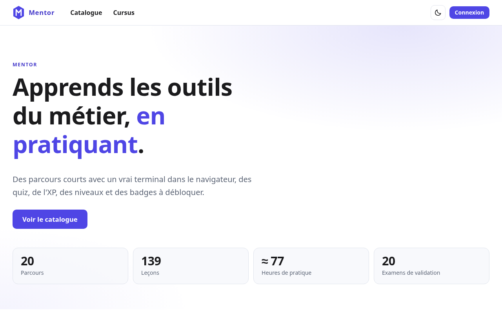

## Catalogue

Every course, with a search box and filters. Once signed in, each card shows the learner's advancement, and a
course whose prerequisites are not completed is shown locked, with what it takes to open it.

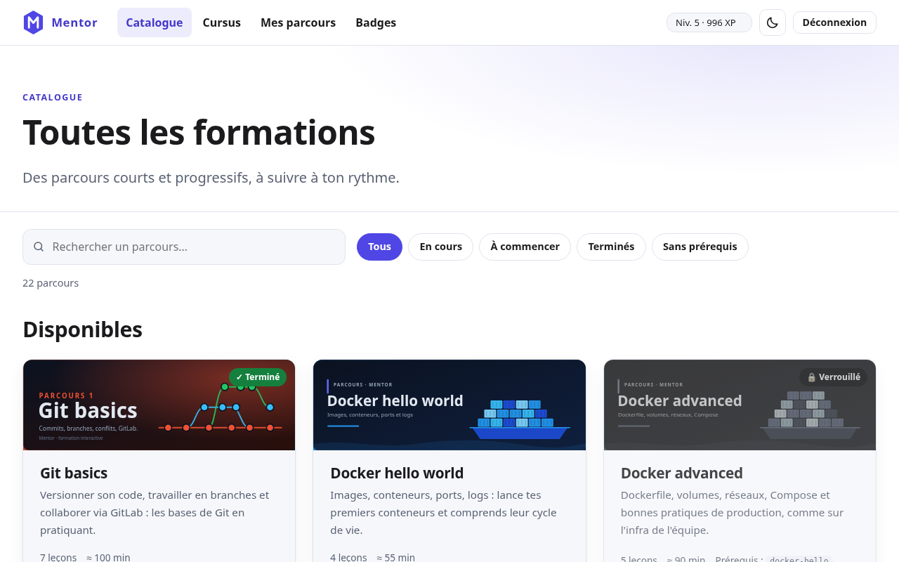

## A course

The programme of the course, lesson by lesson, with the state of each for the learner. A course can be
validated in one go through its exam; the page also says which training paths the course belongs to.

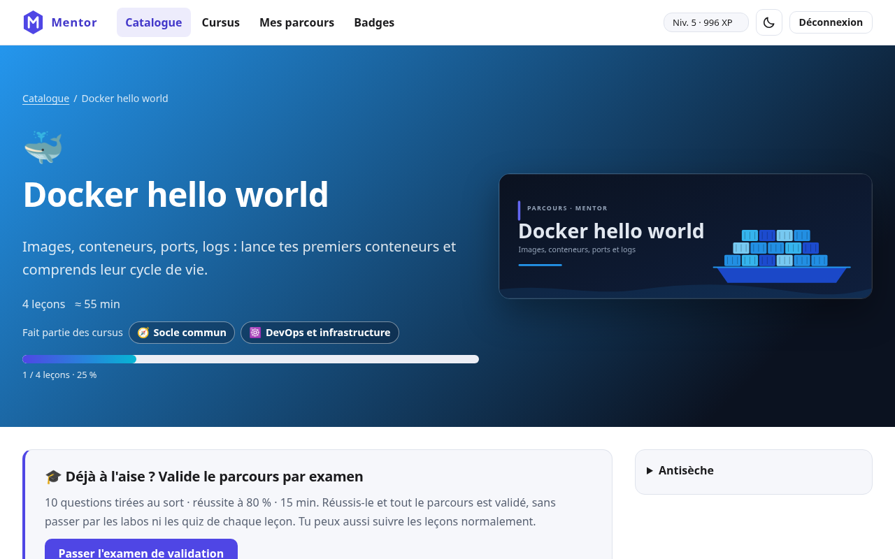

## A lesson

A lesson is a reading part, a lab and a quiz. Commands of the reading part can be copied in one click.

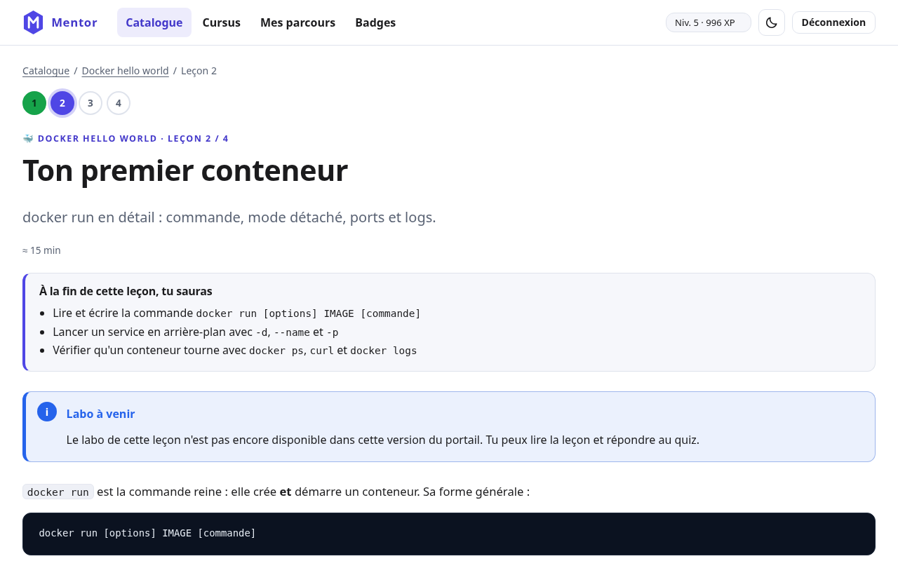

The lab runs in a real environment and is verified by the server; the web interface does not start
environments yet, so the page says the lab is to come and the quiz alone completes the lesson.

The quiz is answered one question at a time, with an explanation after each answer. Scores earn XP once; a
perfect score earns a badge.

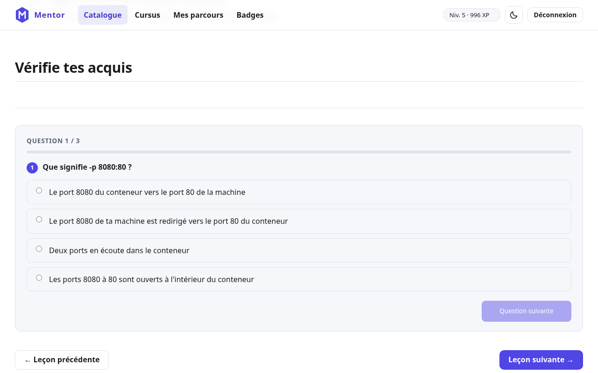

On a phone, in the dark theme:

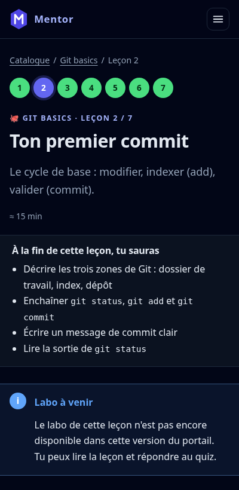

## Validation exam

Someone who already knows the subject can validate a whole course through its exam. Questions are drawn at
random from a pool and shuffled; the timer runs on the server; correct answers are sent only with the result.
A failed attempt imposes a delay before the next one.

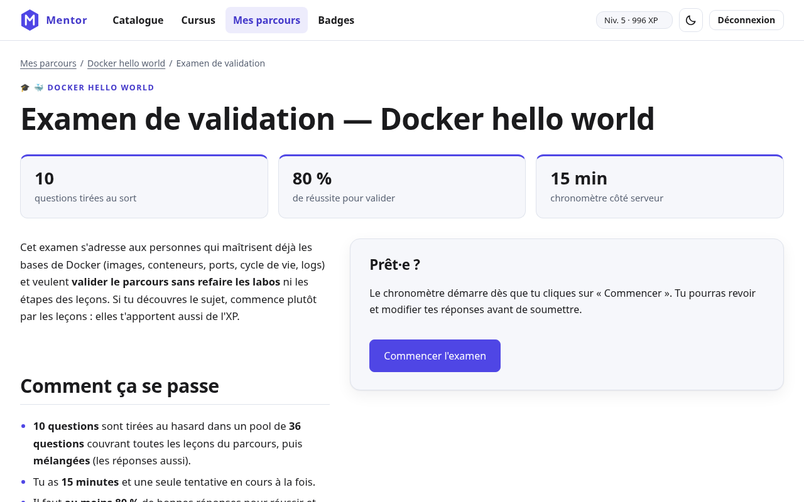

## Dashboard

Level and XP, the lesson to resume, the training paths in progress, the courses and the badges.

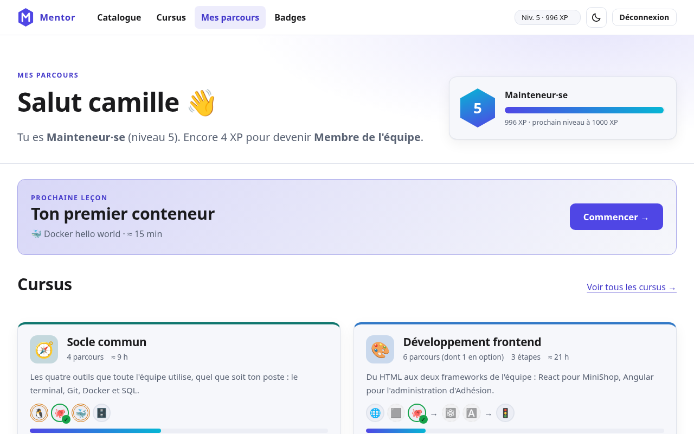

## Badges and levels

Seven levels, and badges for milestones: a first lab step, a perfect quiz, a streak of days, a completed
course.

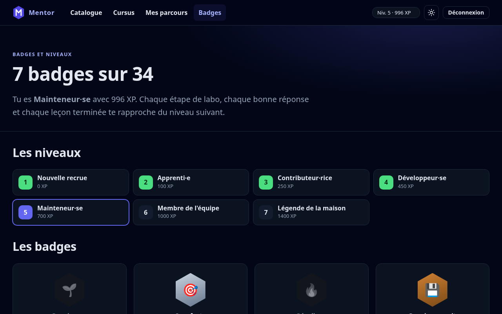

## Training paths

A training path (« cursus » in the interface) chains courses towards a goal, in stages.

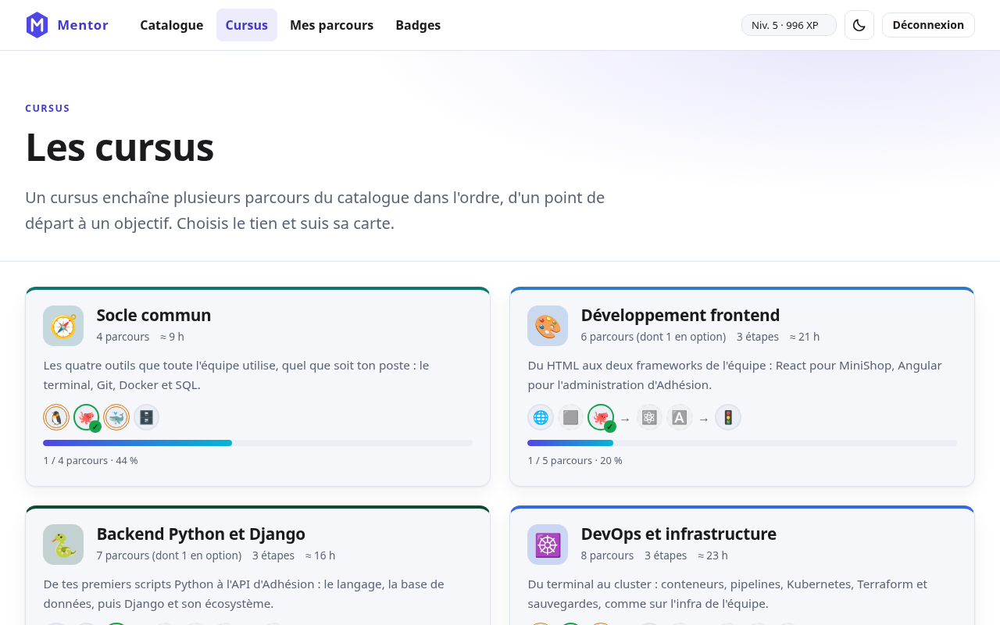

Its page draws it as a map: one card per course, an arrow from each prerequisite to the course it unlocks, and
for the learner the state of each course, the overall advancement and the next step. The map is computed on
the server and works without JavaScript.

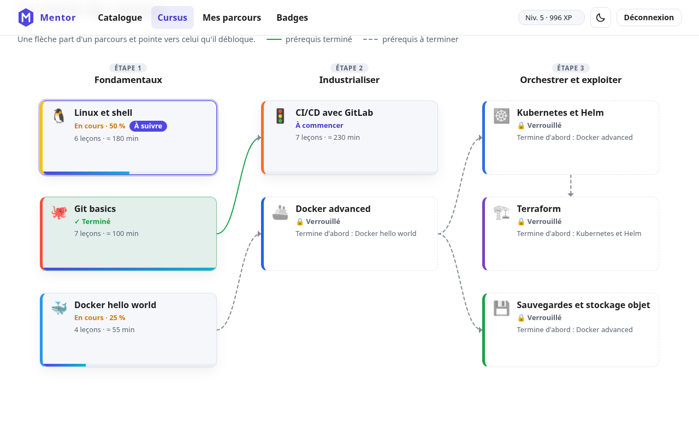

On a phone the same map becomes a single column with the links on a rail:

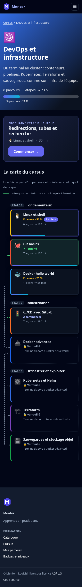
